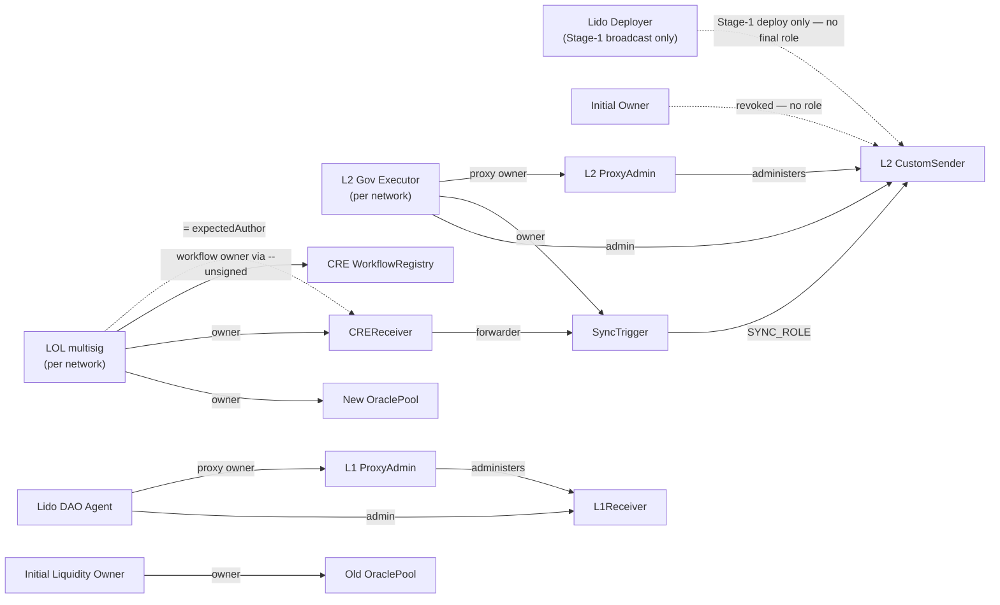

# Lido CCIP Direct Staking — Post-Migration Architecture

> **Scope.** This describes the **final on-chain setup after the migration** of
> Lido's CCIP Direct Staking deployment across Optimism, Arbitrum, Base, Linea,
> and Ethereum L1. It reflects the repo at branch `feat/more-ops-on-lido`
> (verified 2026-05-29).
>
> It is **not** a runbook (see `RUNBOOK.md`) and not proof the
> migration has run. It documents the *target state*: which contracts exist, who
> owns/admins what, how value and triggers flow, and how it's verified.

---

## 1. Networks

The deployment spans **five chains**. The four L2s are structurally identical
(same contracts, same role layout, same sync logic); they differ only in
addresses, the L1→L2 bridge fee encoding, the CCIP gas limit, and which
governance/liquidity accounts are wired in.

| Chain | ID | Role in the system |
|---|---|---|
| **Ethereum L1** | 1 | Shared settlement + staking layer; one `LidoCustomReceiver` serves all four L2s. |
| **Optimism** | 10 | L2 staking front-end + sync infrastructure. |
| **Arbitrum** | 42161 | idem (different addresses + bridge fee model). |
| **Base** | 8453 | idem. |
| **Linea** | 59144 | idem (also a legacy Gelato automation to revoke; leaner gas). |

> **Per-chain addresses are not interchangeable.** "The admin" or "the governance
> executor" only means something *per chain* — each L2 has its own governance
> executor and (for Linea) its own liquidity multisig. A chain-blind reading is
> exactly what produced the address mistake described in §6.1.
>
> The hazard runs deeper than per-chain roles: the *same* address string is often
> reused for **different** contracts across chains and roles (deterministic deploys) —
> e.g. `0x6F357d…4588` is both the L1 `LidoCustomReceiver` and the OP/Base/Linea old
> pool; `0x328de9…C997` is both the `CustomSender` proxy and the Optimism L1 adapter.
> Treat an address as meaningful only with its `(chain, role)`. The canonical per-chain
> values are stored in `script/<chain>/<Chain>MigrationConstants.sol` (plus
> `script/l1/L1MigrationConstants.sol`); the expected post-migration values that
> state-mate asserts live in `script/<chain>/state-mate/<chain>.yaml`.

Section 4 documents **one representative L2** and then lists the per-chain
accounts in a single table.

---

## 2. Components — purpose & origin

"**Origin**" = where the code comes from. This separates *what Lido authored and
owns* from *what it only configures or depends on*.

### 2.1 What's in the system vs. external dependencies

The **system** is the contracts Lido deploys/owns plus the off-chain workflow
Lido authors. The **external dependencies** are things the project relies on but
cannot change: Chainlink's CRE network and CCIP, the canonical L1↔L2 native
bridges, Lido core staking, and the WETH/wstETH tokens. This line matters
operationally: the project keeps on-chain control (the kill switches in §3.4)
over its own contracts even if an external actor (the CRE network) is degraded or
hostile.

### 2.2 Authored in this repo (`l2-direct-staking`)

| Component                                | Purpose                                                                                                                                                                                                                                 | Source                                                        |
| ---------------------------------------- | --------------------------------------------------------------------------------------------------------------------------------------------------------------------------------------------------------------------------------------- | ------------------------------------------------------------- |
| **`SyncTrigger`** (per L2)               | Holds `SYNC_ROLE` on `CustomSender`. Enforces per-sync gates (min 5 / max 100 WETH, 12 h delay) and calls `CustomSender.sync()`. Replaces the legacy automation as the sole `SYNC_ROLE` holder. Also the **fee treasury**: fronts `maxFee + feeDtoO` per sync from its own ETH balance (`maxFee` excess refunds back to it); must stay ≥ `getMaxFees()` or the lane stalls — funding permissionless, recovery `sweep()` = GovExec-only (docs/fees.md §Funding the float). | `src/SyncTrigger.sol`                                         |
| **`CREReceiver`** (per L2)               | Receives signed CRE reports and authorizes them three ways (forwarder + report author + `(target, selector)` allow-list), then calls `SyncTrigger.triggerSync()`. Defense-in-depth between the off-chain network and the on-chain sync. | `src/cre/CREReceiver.sol`, `src/cre/interfaces/IReceiver.sol` |
| **CRE sync workflow**                    | Off-chain TypeScript→WASM that runs on the Chainlink CRE network every 5 min, polls `SyncTrigger.shouldSync()`, and emits a signed report when a sync is due.                                                                           | `cre-workflows/sync-automation/*`                             |
| **Migration scripts + state-mate YAMLs** | The migration scripts (Forge) and the post-condition checks (`*.yaml`). Not runtime contracts; they define and verify the target state.                                                                                                 | `script/**`                                                   |

**Provenance — both are *derived*, not clean-room, and in two different senses.**
Neither contract is written from a blank file, and "derived from external code"
hides two distinct relationships — the distinction is also *why the upstream
versions could not simply be reused*. The lineage is currently implicit: there is
no provenance note in `src/`, so it is only recoverable by diffing against `lib/`
(this paragraph records it; a one-line `@dev` back-reference in each source file
would make it self-documenting).

- **`SyncTrigger` — a fork of `chainlink-csr`'s `SyncAutomation`**
  (`lib/chainlink-csr/contracts/automations/SyncAutomation.sol`, pinned `62108f7`;
  its Gelato-framework sibling, used on Linea, is `GelatoSyncAutomation`).
  Everything *outside the trigger interface* is carried over verbatim — the
  immutables, storage layout, constructor (including the `_delay = type(uint48).max`
  safety-default and the LINK `forceApprove`), `_getAmountToSync`, the two fee blobs,
  every setter/getter, `sweep`, and `receive()`; only the identifiers are re-prefixed
  `SyncTrigger*`. `triggerSync()` *is* the upstream `performUpkeep()` renamed (same
  body, same `onlyForwarder` gate); `shouldSync()` replaces the
  `checkUpkeep`/`_checkUpKeep` poll with a plain view. The one real change is the
  **trigger surface**: the Chainlink-Automation keeper ABI (`AutomationCompatible`
  base, `checkUpkeep`/`performUpkeep`) is dropped for a CRE-shaped pair — a view the
  off-chain workflow polls and a forwarder-only entry point. **Why not the original:**
  `SyncAutomation`/`GelatoSyncAutomation` are bound to the Chainlink-Automation and
  Gelato keeper networks this migration is *decommissioning* (§2.4) — they inherit
  `AutomationCompatible` and expose `performUpkeep`/`checkUpkeep`, the exact surface
  those keepers call. Reusing them would keep a dependency on the framework being
  removed and leave dead keeper surface on the `SYNC_ROLE` holder. Forking lets the
  upstream sync logic — the same economics the legacy keeper already runs in
  production — carry over unchanged while only the trigger boundary moves to CRE;
  that reuse is why this is a *derivation*, not a rewrite.

- **`CREReceiver` — derived from an external interface *standard*, not from any
  upstream contract.** It implements Chainlink's CRE / Keystone forwarder-receiver
  standard — `onReport(bytes metadata, bytes report)` plus `getForwarder()` /
  `supportsInterface` — and reads the CRE-mandated packed metadata layout
  (`metadata[42:62]` = `workflowOwner`). That interface is **re-declared locally** in
  `src/cre/interfaces/IReceiver.sol`; no upstream CRE receiver is vendored in `lib/`.
  **Why not the original:** here there *is* no full original contract to adopt — only
  the interface shape the CRE Forwarder will call, which `CREReceiver` must conform
  to. The bare standard carries no authorization beyond the forwarder check, so the
  three-gate model (forwarder + pinned `expectedAuthor` + `(target, selector)`
  allow-list — §2.6.B) is original Lido code layered on top; re-declaring just the
  three-function interface instead of importing the full keystone package keeps the
  trusted on-chain surface minimal (§2.6's least-privilege framing).

### 2.3 Configured but not authored — the `chainlink-csr` library

Vendored from [`Aphyla/chainlink-csr`](https://github.com/Aphyla/chainlink-csr)
in `lib/`. These pre-exist the migration; the migration **re-wires and re-owns**
them — it does not redeploy them (except the new pool).

| Component | Where | Purpose | Migration touch |
|---|---|---|---|
| **`CustomSenderReferral`** (`CustomSender`) | each L2 | Staking front-end: `fastStake`/`slowStake`/referral; starts the CCIP `sync()` round-trip; holds the oracle-pool pointer and the `SYNC_ROLE`/admin roles. | pool pointer swapped; `SYNC_ROLE` re-granted; admin → L2 governance executor |
| **`PausableImmutableOraclePool`** (new) | each L2 | Holds wstETH liquidity; swaps WETH→wstETH at the oracle rate on `fastStake`. `setOracle`/`setFee` permanently disabled. | **deployed fresh**; owner → LOL multisig |
| **`PausableImmutableOraclePool`** (old) | each L2 | The pre-migration pool. | left orphaned on purpose (§5.1); owner unchanged (Initial Liquidity Owner) |
| **`LidoCustomReceiver`** (`L1Receiver`) | L1 (shared) | Receives CCIP messages from all four L2s; stakes WETH→wstETH via Lido; delegates to the per-network L1 adapter to bridge wstETH back. | admin → Lido DAO Agent |
| **L1 bridge adapters** ×4 | L1 | Per-network adapter that decodes `FeeDtoO` and pushes wstETH onto the canonical L1→L2 bridge. | immutable; not re-owned |
| `FeeCodec`, `CCIPSenderUpgradeable`, `TokenHelper` | L1+L2 | Fee encoding, CCIP send, native-refund helpers. | unchanged |

### 2.4 Other origins

| Component | Origin | Purpose |
|---|---|---|
| **`ProxyAdmin`** (L1 + per-L2) | **OpenZeppelin** | Admin of the transparent proxies; holds `upgradeAndCall`. Owner → Lido DAO Agent (L1) / L2 governance executor (L2). |
| `TransparentUpgradeableProxy`, `AccessControl`, `Ownable` | **OpenZeppelin** | Proxy + role/ownership primitives underlying every contract above. |
| **CRE network + CRE Forwarder** | **Chainlink** (external) | The decentralized network runs the WASM and signs reports; the Forwarder verifies signatures and calls `CREReceiver.onReport`. **Not controllable by Lido** — only gated by the §3.4 kill switches. |
| **CCIP Router** (per chain) | **Chainlink** (external) | Routes the L2→L1 sync message. |
| **`WorkflowRegistry 2.0.0`** (`0x4Ac5…E7e5`, L1) | **Chainlink** | Records the CRE workflow owner; `verify-cre-workflow` checks owner = LOL multisig (Safe), status ACTIVE. |
| **WETH / wstETH / stETH / LINK** | token issuers / Lido core (external) | Value tokens. wstETH is the bridged output; Lido core staking mints it on L1. |
| **Native bridges** (OP Standard Bridge, Arbitrum Gateway, Linea Message Service) | L2 ecosystems (external) | The L1→L2 return leg for wstETH. |
| **Legacy Chainlink Automation** (per L2) + **Gelato bot** (Linea only) | Chainlink / Gelato | Pre-migration `SYNC_ROLE` holders; **revoked** during migration — present here only as removed holders. |

### 2.5 Upgradeability — proxy / admin / implementation

Exactly **two** contracts are upgradeable; both use OpenZeppelin's **EIP-1967
transparent-proxy** pattern, where a `ProxyAdmin` is the proxy's admin and the
proxy `delegatecall`s a separate implementation. This is the chain the
"proxy-owner" role (§3) actually controls:

```
owner ──owns──▶ ProxyAdmin ──administers (EIP-1967 admin slot)──▶ Proxy ──delegatecall (EIP-1967 impl slot)──▶ Implementation
```

| Proxy | Implementation | Admin (`ProxyAdmin`) | ProxyAdmin owner (final) |
|---|---|---|---|
| **`LidoCustomReceiver`** `0x6F35…4588` (L1, shared) | `0x301c…E367` | L1 ProxyAdmin `0x88a4…37BD` | Lido DAO Agent |
| **`CustomSender`** (per L2) — OP/Base/Linea `0x328d…C997`, Arb `0x7222…4AD1` | OP/Base `0x6549…8703`, Arb `0x220F…c664`, Linea `0xBf96…16f9` | L2 ProxyAdmin — OP/Base/Linea `0x4c8c…2192`, Arb `0x5B42…0217` | L2 governance executor (per net) |

**Not upgradeable** (no proxy, no admin — bytecode fixed at deploy): `SyncTrigger`
and `CREReceiver` (plain `Ownable` contracts), `PausableImmutableOraclePool`
(immutable by design — `setOracle`/`setFee` permanently revert), and the L1 bridge
adapters. So the **entire upgrade surface is the two proxies above**.

Owning the `ProxyAdmin` is the **strongest power in the system** — strictly above
the admin role, because swapping the implementation can rewrite every other rule
(role checks, pool pointer, sync logic) at once. That is why it goes to the
slowest, highest-authority owners (Lido DAO Agent via Aragon vote on L1; the L2
governance executor, driven by the L1→L2 governance bridge, on each L2) and never
to an operational key. The proxy↔impl↔admin wiring is checked on-chain by
state-mate, which reads the EIP-1967 implementation slot (`0x3608…2bbc`) and admin
slot (`0xb531…6103`) and asserts they equal the expected implementation and
`ProxyAdmin`. Because the impl address is pinned, any future `upgradeAndCall` shows
up as a state-mate diff. See **Diagram C (§4.3)**.

### 2.6 Credibility & security of the application-layer contracts

Covers the contracts trusted at the application layer — i.e. **not** external
infrastructure (Chainlink CRE/CCIP, bridges, tokens, Lido core) and **not**
OpenZeppelin primitives. This is evidence found in the repo, not an audit
endorsement.

**A. `chainlink-csr` library — Chainlink's CCIP "Custom Sender-Receiver" reference design.**
(`CustomSenderReferral`, `PausableImmutableOraclePool`, `LidoCustomReceiver`, the
four L1 adapters, `FeeCodec`, `CCIPSenderUpgradeable`, `TokenHelper`.)

- **Provenance.** Vendored as a *pinned* git submodule — `Aphyla/chainlink-csr` @
  `62108f7` (2025-10-23, "Add Linea support") — so the source is reproducible, not
  a floating dependency. It is the published implementation behind Chainlink's
  "Scaling Staking Protocols Cross-Chain with CCIP" design.
- **Production track record (the strongest signal).** The `CustomSenderReferral`
  and `LidoCustomReceiver` instances this migration re-owns are **already live on
  mainnet and hold real WETH/wstETH today** (the old pools carry non-zero balances
  — reported by the `just balances-l1` / `balances-<net>` recipes). The migration **re-wires and re-owns
  existing contracts; it does not redeploy them.** The one fresh deployment, the
  new `PausableImmutableOraclePool`, is the **same contract code** as the live old pools (same source and creation bytecode; only the constructor-baked immutables differ).
- **Caveat.** No audit artifact is vendored in this repo. Confirm the upstream
  audit / formal-verification status of the pinned commit before relying on it for
  *new* value; note the migration changes ownership, not code.

**B. Repo-authored contracts — `SyncTrigger` (214 lines), `CREReceiver` (141 lines), CRE workflow.**

- **Small, single-purpose, least-privilege.** Both are `Ownable` with every setter
  `onlyOwner`; neither uses `delegatecall` or is upgradeable.
  - `CREReceiver` enforces **three independent gates** before acting:
    `msg.sender == CRE Forwarder`, report author `== expectedAuthor`, and
    `(target, selector)` on an owner-managed allow-list seeded only with
    `(SyncTrigger, triggerSync)` — **and the call must be argument-less** (calldata
    exactly the 4-byte selector), so the report author controls nothing beyond
    *which* allow-listed selector fires (the seed, `triggerSync()`, is nullary). Its
    single external call is `target.call(data)`, constrained by both. Authentication
    is deliberately **`(forwarder, workflowOwner)`** — the report's
    `workflowName`/`workflowId` are *not* gated, since an owner-scoped label adds no
    defence against owner-key compromise and the nullary lock already bounds the
    blast radius to "trigger the intended, rate-limited sync."
  - **ERC-165 delivery precondition.** The CRE Forwarder calls `onReport` only if
    `CREReceiver.supportsInterface` returns true for **both** `0x805f2132`
    (`onReport`-only `IReceiver`) and `0x01ffc9a7` (ERC-165 base) — it
    `ERC165Checker`-gates first. A wrong id silently bricks the whole sync path (no
    revert, just non-delivery); state-mate pins both ids at deploy. *Residual:*
    confirm each L2's production Forwarder is this same ERC-165-gating
    `KeystoneForwarder`.
  - `SyncTrigger.triggerSync()` is forwarder-only and **re-checks amount/delay
    on-chain** (defense-in-depth); `_delay` ships as `type(uint48).max`
    (deactivated), so a fresh deploy can't fire until configured; value flows only
    to the immutable `SENDER` via `sync()`. The only fund-extraction path is the
    `onlyOwner` `sweep` (fee-token recovery by governance).
- **Tests.** Dedicated unit suites — `SyncTriggerTest.t.sol` (324 lines) and
  `CREReceiverTest.t.sol` (383 lines), i.e. **test code exceeds contract code** —
  plus 4-network fork-integration tests against forked mainnet state using the
  Chainlink Local CCIP simulator (`CREIntegrationTest`, `*PoolUpgrade`).
- **Bounded blast radius.** After Stage 1 both are owned by governance / the LOL
  multisig, and the §3.4 kill switches disable them *without* an upgrade.
- **Open items.** (1) No third-party audit artifact is in-repo — recommended
  before/with mainnet rollout if not covered externally. (2) Independently confirm the
  deployed bytecode is source-verified on each block explorer (state-mate pins the
  impl address, not source verification).

### 2.7 Why `SyncTrigger` and `CREReceiver` are two contracts, not one

The call chain `CRE Forwarder → CREReceiver.onReport() → SyncTrigger.triggerSync()
→ CustomSender.sync()` is split into two repo-authored contracts at exactly the
trust boundary between the **external CRE network** and the **privileged on-chain
sync**. They *could* be written as one; keeping them separate preserves four
properties a merged contract would lose.

| Axis | `CREReceiver` | `SyncTrigger` |
|---|---|---|
| Role | CRE-facing **authorization gate** (3 checks) | **privilege holder + sync domain logic** |
| On-chain power | none beyond calling its allow-listed target | holds `SYNC_ROLE` on `CustomSender` |
| Owner | **LOL multisig** — operational, fast | **L2 governance executor** — slow, high-authority |
| Knows about | CRE ABI: `onReport`, metadata layout, author, allow-list | sync economics: amount/delay gates, fee blobs |
| Link to the other | allow-list entry `(SyncTrigger, triggerSync)` | `forwarder` = `CREReceiver` |

**1. Two owners, two trust domains.** An `Ownable` contract has exactly one
`owner()`. The CRE-side levers (rotate the author key, point the forwarder at
`0x…dead`) are routine operational moves owned by the **LOL multisig**; the
`SYNC_ROLE` holder's parameters (delay, amounts, fees) are higher-stakes and owned
by the **L2 governance executor** (§3.2). One contract would force both under one
key — either dragging governance into routine CRE key rotation, or handing the LOL
multisig the privileged sync parameters. (Even an `AccessControl` split *inside*
one contract still puts both domains behind a single `DEFAULT_ADMIN_ROLE` and a
single codebase.)

**2. The §3.4 redundancy needs two contracts.** §3.4 lists *separate* kill
switches held by *separate* owners on the *same* path: LOL disarms the CRE side
(`setForwarder(0x…dead)` / `setExpectedAuthor`), governance independently disarms
the sync side (`setForwarder(0x…dead)` / `setDelay(max)`). Defense-in-depth only holds
if the layers fail — and are disarmed — independently; one merged contract is one
owner and one switch.

**3. The privilege keeps a minimal, CRE-agnostic surface.** `SYNC_ROLE` lives in
`SyncTrigger`, whose only entry point is `triggerSync()` behind `onlyForwarder`,
and which re-checks amount/delay on-chain. All CRE coupling — the
Chainlink-mandated `IReceiver.onReport` shape, the `metadata[42:62]`
workflow-owner extraction, the author pin, the `(target, selector)` allow-list —
is quarantined in `CREReceiver`, which holds **no** on-chain privilege. Merging
would bolt the CRE report-parsing attack surface directly onto the `SYNC_ROLE`
holder.

**4. Generic adapter vs. domain logic — they change for different reasons.**
`CREReceiver` is a *generic* CRE→on-chain dispatcher (it forwards any
owner-allow-listed `(target, selector)`, not only `triggerSync` — though only
**argument-less** calls, so the allow-list stays a routing table, not an
arbitrary-calldata bridge; §2.6), and `SyncTrigger.onlyForwarder` accepts *any*
configured caller, not necessarily a CRE receiver. Touching only through the two configurable addresses above, either can
be replaced or rewired without redeploying the other: swap the CRE adapter without
re-granting `SYNC_ROLE`, or retune the sync gates without re-exposing the CRE
boundary. A CRE report-format change touches only `CREReceiver`; a sync-economics
change touches only `SyncTrigger`.

---

## 3. Access control & ownership — the final state

### 3.1 Roles

On-chain roles are AccessControl roles and `Ownable` ownership slots; one role is
off-chain. Each is **per chain / per contract**.

| Role | On-chain identity | On (contract) | What it can do |
|---|---|---|---|
| **Admin** | `DEFAULT_ADMIN_ROLE` = `0x00` | `CustomSender` (each L2); `L1Receiver` (L1) | grant/revoke all roles; on **`CustomSender`**: `setOraclePool`, `setReceiver`; on **`L1Receiver`**: `setSender`, `setAdapter`, `recoverTokens` |
| **Sync caller** | `SYNC_ROLE` = `keccak256("SYNC_ROLE")` | `CustomSender` (each L2) | call `sync()` to start the CCIP round-trip |
| **Proxy owner** | `owner()` | `ProxyAdmin` (L1 + each L2) | `upgradeAndCall` to swap the implementation of the `LidoCustomReceiver` proxy (L1) / `CustomSender` proxy (L2) — **strongest power**; see §2.5 |
| **SyncTrigger owner** | `owner()` | `SyncTrigger` (each L2) | `setForwarder`, `setDelay`, `setAmounts`, `setFeeOtoD/DtoO`, `sweep` |
| **Pool owner** | `owner()` | new `OraclePool` (each L2) | `pause`/`unpause`/`sweep`; seed/withdraw liquidity |
| **CREReceiver owner** | `owner()` | `CREReceiver` (each L2) | `setForwarder`, `setExpectedAuthor`, `setAllowedCall`, `withdrawETH` |
| **Workflow owner** | owner on `WorkflowRegistry` (L1) **= pinned `expectedAuthor`** | Chainlink registry + `CREReceiver` | deploy / pause / activate / delete the CRE workflow; its signature authorizes reports |
| **Forwarder** | configured `forwarder` on `CREReceiver` | `CREReceiver` (each L2) | the only `msg.sender` accepted by `onReport` |

### 3.2 Owners / actors and what they hold

End state (after the migration + the LOL liquidity seed). Human/multisig owners
first, then the contract actors, then the external (Chainlink) actor.

| Owner / actor | Kind | What it holds in the final state | Notes |
|---|---|---|---|
| **Lido DAO Agent** `0x3e40…9C8c` | L1 contract/multisig | Admin of `L1Receiver`; owner of L1 `ProxyAdmin` | every action = Aragon DAO vote (days–weeks) |
| **L2 Governance Executor** (per net) | L2 bridge-executor contract | Admin of `CustomSender`; owner of `SyncTrigger`; owner of L2 `ProxyAdmin` | driven by Lido DAO via the L1→L2 governance bridge; holds the on-chain kill switches |
| **LOL multisig** (per net) | L2 multisig | Owner of the new `OraclePool`; owner of `CREReceiver`; **CRE workflow owner** (= `expectedAuthor` on every L2 `CREReceiver`) | provides the wstETH seed; holds the CRE pause switch; the workflow is registered under this Safe via `cre workflow deploy --unsigned` (ADR-0001) |
| **Lido Deployer** (EOA, addr TBD) | off-chain key | **nothing in the final state** — Stage-1 broadcast + SyncTrigger float funding only | **no on-chain admin** and **not the CRE workflow owner**; post-migration holds zero on-chain power over Lido contracts |
| **Initial Owner** `0xb5c3…91a8` | EOA — **external (not Lido-controlled)** | **nothing** — revoked from every migrated contract | external migration-handoff key (upstream `chainlink-csr` admin); executes Stage 2 and is renounced once it completes — **but completion across all chains depends on this external party** (§6.4) |
| **Initial Liquidity Owner** `0x2897…b18c` | EOA | Owner of the **old** pools only | retains `sweep()` on the old pools; no control over any new infrastructure |
| **`SyncTrigger`** (contract) | L2 contract | Holds `SYNC_ROLE` on `CustomSender` | acts only on calls from its forwarder (`CREReceiver`); config owned by L2 governance executor |
| **`CREReceiver`** (contract) | L2 contract | Is the configured `forwarder` on `SyncTrigger` | accepts reports only from the CRE Forwarder; owned by LOL, which is also its pinned `expectedAuthor` / CRE workflow owner |
| **CRE Forwarder / CRE network** | Chainlink (external) | The accepted forwarder address; **no on-chain role on Lido contracts** otherwise | **not controllable by Lido**; the §3.4 kill switches override it |

Per-chain accounts (the only thing that varies between L2s):

| Chain | Governance executor (admin / SyncTrigger owner / proxy owner) | LOL multisig (pool / CREReceiver owner) |
|---|---|---|
| **Optimism** | `0xEfa0dB536d2c8089685630fafe88CF7805966FC3` | `0x5A9d695c518e95CD6Ea101f2f25fC2AE18486A61` |
| **Arbitrum** | `0x1dcA41859Cd23b526CBe74dA8F48aC96e14B1A29` | `0x5A9d695c518e95CD6Ea101f2f25fC2AE18486A61` |
| **Base** | `0x0E37599436974a25dDeEdF795C848d30Af46eaCF` | `0x5A9d695c518e95CD6Ea101f2f25fC2AE18486A61` |
| **Linea** | `0x74Be82F00CC867614803ffd7f36A2a4aF0405670` | `0xA8ef4Db842D95DE72433a8b5b8FF40CB7C74C1b6` |
| **Ethereum L1** (shared) | Lido DAO Agent `0x3e40D73EB977Dc6a537aF587D48316feE66E9C8c` | — |

> **Why the CRE workflow owner is the LOL multisig (Safe), not an EOA.** Unlike every
> other role, this one is *fixed at registration*: a CRE workflow's owner is whatever
> account `cre workflow deploy` registers, baked into every signed report as
> `metadata.workflowOwner`, and `WorkflowRegistry 2.0.0` (`0x4Ac5…E7e5`) exposes **no
> per-workflow ownership-transfer function** — so the owner can't be *moved* afterwards
> (changing it means deploying a *new* workflow and re-pinning `setExpectedAuthor` on all
> four L2s). To avoid that single-key cliff, the workflow is registered under the **LOL
> multisig (Safe)** — the same Safe that owns each `CREReceiver` — via
> `cre workflow deploy … --unsigned` (`workflow-owner-address` = the Safe; the emitted
> `WorkflowRegistry` calldata is executed *from the Safe*). The Safe address becomes both
> the on-chain owner and the pinned `expectedAuthor`. A lost or compromised *signer* is
> then handled by **rotating that signer inside the Safe** — the workflow-owner address
> never changes, so there is **no redeploy and no `setExpectedAuthor` re-pin**. The
> single-EOA loss/compromise vector folds into the LOL-multisig risk already accepted
> everywhere else. The Lido Deployer EOA only **broadcasts Stage 1** and funds the
> SyncTrigger float; it holds **zero on-chain power** afterwards and is **not** the
> workflow owner. Full rationale, the EOA alternative, and the recovery primitive:
> [ADR-0001](docs/adr/0001-cre-workflow-owner-multisig.md). The Safe owner relies on
> three CRE Early-Access residuals (see ADR-0001 "Residuals"); confirm them on a throwaway
> testnet workflow before GA.

### 3.3 Granting and revoking — both matter

The migration's grant/revoke steps are permission changes, distinct from the sync
work they later allow. Two points baked into the scripts:

- **Revoke is as important as grant.** `SYNC_ROLE` is revoked from the legacy
  automation *and* `DEFAULT_ADMIN_ROLE` from the Initial Owner. Leaving either in
  place would let a stale holder call `sync()` with hostile fees or re-admin the
  contract.
- **Atomic, read-back-or-revert.** Each permission change is followed by an
  in-transaction assertion; a partial migration reverts the whole transaction
  instead of leaving a half-migrated contract.

### 3.4 What the project still controls if Chainlink misbehaves

The CRE network is external and can't be controlled. The project keeps full
on-chain control of the sync path through **kill switches**:

| Concern | Owner | Lever |
|---|---|---|
| Pool issue | LOL multisig | `OraclePool.pause()` |
| CRE author-key compromise | LOL multisig | `CREReceiver.setExpectedAuthor(new)` |
| CRE infra hostile/degraded | LOL multisig | `CREReceiver.setForwarder(0x…dead)` |
| SyncTrigger misconfigured | L2 governance executor | `SyncTrigger.setForwarder(0x…dead)` / `setDelay(max)` |

> **CRE workflow owner = LOL multisig (Safe).** A lost or compromised Safe **signer** is handled by
> rotating that signer inside the Safe (`addOwner` / `swapOwner` / `removeOwner`) — the workflow-owner
> address never changes, so **no redeploy and no `setExpectedAuthor` re-pin** (§3.2, ADR-0001). The levers
> above (`setExpectedAuthor` / `setForwarder`) are the recovery hinge only for the catastrophic case where
> the **whole Safe** is compromised (≥ threshold signers) — the same event that already loses every other
> LOL-held lever — via the one-time "redeploy + re-pin" primitive
> ([ADR-0001](docs/adr/0001-cre-workflow-owner-multisig.md)). The GovExec backstop
> (`SyncTrigger.setForwarder(0x…dead)` / `setDelay(max)`) stays in an independent trust domain regardless.

---

## 4. Diagrams

One representative L2 + the shared Ethereum L1; the other three L2s are identical
in structure.

### 4.1 Diagram A — components + operational flow (value & control)

```mermaid
flowchart TB
    staker([Staker])

    subgraph L2["L2 (Optimism / Arbitrum / Base / Linea)"]
        CS["CustomSender<br/>(CustomSenderReferral)"]
        NEW["New OraclePool<br/>(PausableImmutableOraclePool)"]
        OLD["Old OraclePool<br/>(orphaned on purpose)"]
        ST["SyncTrigger<br/>SYNC_ROLE holder"]
        CRER["CREReceiver"]
        ROUTER2["CCIP Router (L2)"]
    end

    subgraph DON["Chainlink CRE (external — uncontrolled)"]
        WF["CRE workflow<br/>(WASM, every 5 min)"]
        FWD["CRE Forwarder"]
    end

    subgraph L1["Ethereum L1 (shared by all 4 L2s)"]
        L1R["LidoCustomReceiver"]
        LIDO["Lido core staking<br/>WETH→wstETH"]
        ADP["L1 bridge adapter<br/>(per network)"]
    end

    BR["Canonical L1→L2 native bridge"]

    %% value flow
    staker -->|fastStake WETH| CS
    CS -->|swap, deliver wstETH| NEW
    NEW -.->|wstETH liquidity| CS

    %% control / trigger flow
    WF -->|poll shouldSync| ST
    WF -->|signed report| FWD
    FWD -->|onReport| CRER
    CRER -->|allow-listed triggerSync| ST
    ST -->|trigger sync (SYNC_ROLE)| CS

    %% cross-chain round-trip
    CS -->|CCIP message + WETH| ROUTER2
    ROUTER2 ==>|CCIP| L1R
    L1R -->|stake| LIDO
    LIDO -->|wstETH| L1R
    L1R -->|delegatecall| ADP
    ADP -->|bridge wstETH| BR
    BR ==>|wstETH back to recipient pool| NEW
    BR -.->|in-flight at cutover| OLD
```

### 4.2 Diagram B — ownership & access control



### 4.3 Diagram C — upgradeability (proxy / admin / implementation)

`==administers==>` is the EIP-1967 admin slot; `--delegatecall-->` the impl slot;
addresses in §2.5.

```text
   owner (proxy owner)           ProxyAdmin    ==administers==>  proxy (EIP-1967)  --delegatecall-->  implementation
   ───────────────────────────────────────────────────────────────────────────────────────────────────────────────
   Lido DAO Agent           ==>  L1 ProxyAdmin   ==============>  LidoCustomReceiver  -------------->  receiver impl
   L2 Gov Executor (per net) =>  L2 ProxyAdmin   ==============>  CustomSender        -------------->  sender impl

   Not upgradeable (no proxy / no admin — bytecode fixed at deploy):
       SyncTrigger · CREReceiver · PausableImmutableOraclePool · L1 bridge adapters
```

---

## 5. The sync operation

The whole assembly exists to do one repeatable thing: **rebalance an L2 pool by
converting accumulated WETH into bridged wstETH.**

1. **Trigger.** The CRE network polls `SyncTrigger.shouldSync()`; when the amount
   and delay gates pass, it signs a report. The report is admitted only through
   `CREReceiver` (forwarder + author + allow-list) → `SyncTrigger.triggerSync()`
   → `CustomSender.sync()`. On-chain, `SyncTrigger` (holding `SYNC_ROLE`) is the
   accountable caller; the CRE network is just the trigger.
2. **Out (L2→L1).** `CustomSender` sends a CCIP message (WETH + encoded fees +
   **recipient pool address**) to `LidoCustomReceiver` on L1.
3. **Stake.** `LidoCustomReceiver` stakes WETH→wstETH via Lido core.
4. **Back (L1→L2).** It delegatecalls the per-network adapter, which pushes wstETH
   onto the canonical native bridge back to the recipient pool on L2.

Two `SyncTrigger` gates bound *when* a sync fires and *how much* it moves: the pool's
WETH must be ≥ `minAmount` (**5 WETH**) and ≥ **12 h** must have passed since the last
sync (`delay`), and each sync is capped at `maxAmount` (**100 WETH**) — identical on all
four L2s (`L2_SYNC_MIN_AMOUNT` / `MAX_AMOUNT` / `DELAY`). So per-sync value-at-risk is
bounded (≤ ~100 WETH, ≤ 2 syncs per lane per day), and the `12 h` delay doubles as the
migration's cutover quiet-window — Stage 2's preflight treats a chain as having no sync
in flight when no `CustomSender.Sync` event has fired within it (§6.4).

### 5.1 In-flight round-trips are correct-by-design

The recipient pool address is **encoded into the CCIP message at `sync()` time**
and is fixed for the rest of the round-trip. A round-trip started *before* Stage 2
that lands *after* Stage 2 therefore delivers wstETH to the **old** pool — which
is correct: the Initial Liquidity Owner owns the old pool and recovers it via
`sweep()`. No funds are lost or stuck; the new pool is seeded separately. This is
why the old pool is **left orphaned on purpose**, not deleted.

### 5.2 Fee parameters (per chain) — and why they are set this way

The round-trip pays two bridges, so `SyncTrigger` stores two encoded fee blobs:
`FeeOtoD` for the L2→L1 CCIP leg and `FeeDtoO` for the L1→L2 native-bridge return
(the constants call these `L2_SYNC_DESTINATION_*` and `L2_SYNC_ORIGIN_*`). The
values look lopsided until the word "fee" is split into the **three economically
distinct things** it hides:

- a **cap** — `maxFee` (OtoD): a *bound* on the CCIP fee; the unused remainder is
  refunded;
- a **commitment** — `gasLimit` (OtoD): an L1-gas budget the CCIP executor charges
  for **in full**, used or not;
- a **payment** — `FeeDtoO`'s `feeAmount`: ETH actually handed to a bridge (nonzero
  only on Arbitrum).

(A fourth quantity — the **actual CCIP fee** the Router charges — is the only one of
these that *is* a CCIP fee. What it is denominated in — native ETH of the originating
L2, fixed by `getFee()` at send time — when each amount moves, and the fate of each
"excess" — refunded / sunk / burned — is in `docs/fees.md` §Fee denomination, the four
quantities, and when money moves.)

| Parameter | Value | Kind | Why this value |
|---|---|---|---|
| `maxFee` (OtoD) | 0.125 ETH — all 4 | **cap** (refunded) | `0.1 + 25%`. Free headroom against L1 gas-price spikes — raising a refunded cap has **zero per-sync cost**. |
| `gasLimit` (OtoD) | 1,000,000 (OP/Arb/Base); **500,000 (Linea)** | **commitment** (charged in full) | prior `800k` / `400k`, `+ 25%`. A **real** recurring cost, paid deliberately as insurance (see asymmetry below). Linea is half because its L1 return adapter is leaner (no `depositERC20To`), so `ccipReceive` needs less L1 gas. |
| `payInLink` (OtoD) | false — all 4 | payment rail | CCIP leg paid in native ETH, not LINK. |
| `FeeDtoO` (return leg) | OP/Base: `l2Gas = 100k`, pay 0 · Arbitrum: retryable, ≈ 0.001 ETH · Linea: zero blob | **payment** (+ L2-gas cap) | dictated by each L2's native bridge — **the main per-chain difference**: OP/Base sequencer-subsidized; Arbitrum retryable (the excess is "refunded" on L2 to an unreachable alias — effectively **burned**, proven on-chain: docs/fees.md §Consequences); Linea postman (free). |

**Arbitrum return-leg caveat.** Arbitrum's `FeeDtoO` carries a `gasPriceBid` of `0.05
gwei` (`L2_SYNC_ORIGIN_GAS_PRICE_BID`); if the L1→L2 retryable does not auto-redeem, it
must be **manually redeemed within Arbitrum's ~7-day window or the ticket — and its
wstETH — is lost**. This is the one return path that can lose funds rather than
self-heal (mechanics in `docs/fees.md`).

**Two mechanism properties — true in the code, independent of any policy — drive
every choice:**

- **Refund asymmetry.** `maxFee` excess is refunded to `SyncTrigger`, but the
  `gasLimit` commitment is sunk (the CCIP executor keeps the margin). So `maxFee`
  headroom is free; `gasLimit` headroom is a recurring cost.
- **Failure asymmetry.** A too-low `gasLimit` makes `ccipReceive` run out of gas on
  L1 and the WETH **strands at the receiver** — high severity, because every
  subsequent sync fails the same way until governance bumps it. A too-low `maxFee`
  merely reverts the L2 send with no funds moved (self-healing once gas drops).
  Too-high, in both cases, only costs money.

At send time a sync is **admissible only if** the router's quoted fee ≤ `maxFee`
(else it reverts) — so `maxFee` is a safety gate, not a price.

Given those two properties the values follow: `maxFee` is bumped freely (no cost);
`gasLimit` is bumped deliberately — the small recurring cost buys insurance against
the **Glamsterdam** (EIP-7904 / EIP-8038) L1-opcode repricing, which inflates
exactly the state-heavy `processMessage` work that `gasLimit` budgets. `FeeDtoO` is
left unchanged by that bump, because its budgets target **L2** execution, untouched
by L1 EIPs.

The quantitative basis — the Glamsterdam gas-impact estimate, the per-sync cost of
the `gasLimit` headroom, the exact byte layouts, and each bridge's refund/failure
behavior — is sourced in `docs/fees.md` (the governing reference,
with the byte-for-byte pins in `script/<net>/state-mate/<net>.yaml`) and not
re-derived here. Changing any value is a governance action: the **L2 Governance
Executor** re-encodes via `setFeeOtoD` / `setFeeDtoO`. The encoded blobs are pinned
**byte-for-byte at Stage 1** — `verify-stage1` (§6.3) keccak-compares `SyncTrigger`'s
stored blobs against the migration constants (`script/shared/L2UpgradeActions.s.sol`).
(state-mate currently leaves `getFeeOtoD` / `getFeeDtoO` as `null` — "set during
migration" — so it does *not* re-check the fee bytes; they would have to be
regenerated there in lockstep if ever pinned.) `SyncTrigger` itself treats both
blobs as **opaque bytes**: their meaning lives only at the consuming CCIP router
(OtoD) and L1 bridge adapter (DtoO).

### 5.3 Liquidity

`fastStake` consumes new-pool wstETH and accrues WETH; anyone can top up wstETH by
transferring it in, but only the pool owner (LOL multisig) can `sweep`. Until the
LOL seed lands, `fastStake` reverts for lack of output liquidity.

---

## 6. Migration safety notes

### 6.1 Two different "initial" accounts — don't confuse them

- **Initial Owner** `0xb5c3…91a8` — **external (not a Lido in-house actor)**; the
  upstream `chainlink-csr` administrator. Pre-migration *admin* of the
  senders/receiver and owner of the proxy admins; executes Stage 2; **ends with no
  role** — but only if it completes the handoff on every chain (§6.4).
- **Initial Liquidity Owner** `0x2897…b18c` — owner of the **old** pools; retains
  `sweep()`. **Never an admin.**

### 6.2 Recipe vs. run vs. resulting state

Keep three things separate, or "we documented it" gets mistaken for "we did it":

| Thing | Where |
|---|---|
| The migration recipe | `script/**` Forge scripts, `RUNBOOK.md` |
| The actual run | the broadcast Stage-1/2 transactions on each chain |
| The resulting state | the ownership/roles in §3 (what this document describes) |

This document describes the third. It is not evidence the run happened and not
authorization to run it.

### 6.3 How the final state is verified

- **`verify-stage1`** — 19 read-only post-conditions per L2 (pool / SyncTrigger /
  CREReceiver immutables, the trigger's funded fee float, + guardrails that Stage 2
  hasn't run yet).
- **`verify-cre-workflow`** — `WorkflowRegistry` shows owner = LOL multisig (Safe),
  status ACTIVE.
- **state-mate** — ≥45 live-RPC assertions per chain: admin held only by the L2
  governance executor and `SYNC_ROLE` only by the new `SyncTrigger` — asserted as the
  **complete** role-member set (`roleMembers`), not mere presence, with explicit
  `hasRole = false` checks on every party that must not retain it (the Initial Owner,
  the legacy automation(s), and the Lido Deployer hot key) — new pool wired, allow-list
  `(SyncTrigger, triggerSync) = true`, EIP-1967 impl/admin slots, etc. — the
  on-chain check of every binding in §3.
- **Broadcast-time guard (`L2_GOVERNANCE_EXECUTOR`)** — both Stage 1 and Stage 2
  reject the run (`L2UpgradeWrongGovernanceExecutor`) unless the env-supplied executor
  equals the per-network `LIDO_L2_GOVERNANCE_EXECUTOR` constant, so a wrong-but-nonzero
  executor can't be baked into `SyncTrigger` ownership (Stage 1) or the admin /
  `ProxyAdmin` handover (Stage 2). This is the **independent** check the caveat below
  asks for — the executor is verified against a pinned constant, not against a value
  derived from itself. (Sepolia opts out: its executor is operator-supplied.)

Subject to the §6.1 caveat: state-mate is a strong check **except** where its
expected values were derived from the same constants being verified.

### 6.4 The Stage-2 handoff depends on an external owner completing it on every chain

**Stage 1 vs Stage 2 — different actors.** Stage 1 (the deploy) is broadcast by the
**Lido Deployer** (an in-house key): it deploys the three new contracts *already owned*
by their final operators — the new pool and `CREReceiver` by the LOL multisig,
`SyncTrigger` by the L2 governance executor — but it does **not** grant `SYNC_ROLE` or
touch any admin / `ProxyAdmin` (a post-condition asserts Stage 2 hasn't run yet). The
`SYNC_ROLE` grant and the admin + `ProxyAdmin` handoff of the *pre-existing*
`chainlink-csr` contracts are Stage 2 — and *that* is the part the external Initial
Owner executes.

The **Initial Owner** that executes Stage 2 is **not a Lido in-house actor** — it
is the external party that deployed and currently administers the pre-migration
`chainlink-csr` contracts (§2.3). The whole point of Stage 2 is to take that power
away from it and hand it to Lido governance. But Stage 2 is **not one atomic act**:
it is **≥5 independent broadcasts** by that external party — one `runMigrate()` per
L2 (×4) plus a single L1 `L1UpgradeScript.run()` — on five chains, with **no
atomicity and no on-chain forcing function across chain or layer boundaries**. Per
chain the migration is all-or-nothing (each write is read-back-asserted
in-transaction; §3.3), so it can't be caught *mid-chain* — but it can be left
stalled at any **boundary between chains, or between L2 and L1**, with the external
owner still holding what it was meant to give up.

Because the L1 `LidoCustomReceiver` is **shared by all four L2s** and the L1 seal
is a single, once-only op the plan runs **last**, the interleavings differ sharply
in severity:

| Stage 2 stalls after… | External owner still holds | Severity |
|---|---|---|
| nothing started | everything (= pre-migration state) | **low** — no new value has cut over; chains run the old path unchanged |
| some L2s but not others | admin + L2 `ProxyAdmin` (upgrade power) on each **un-migrated** L2 sender | **medium** — those L2s stay on the old path under full external control |
| **all L2s but not L1** | admin + L1 `ProxyAdmin` on the **shared** `LidoCustomReceiver` | **high** — external upgrade power over the one contract that stakes/bridges value for *every* chain, including syncs from already-migrated L2s |
| L1 but not all L2s | admin + L2 `ProxyAdmin` on each un-migrated L2 sender | **medium** — L1 sealed, but those L2s remain externally controlled |

Owning a `ProxyAdmin` is the **strongest power in the system (§2.5)**, so any
un-migrated chain leaves the external party able to rewrite that chain's logic at
will. The §3.4 kill switches **do not cover this**: they are held by LOL /
governance over the *new* contracts, but a retained external `ProxyAdmin`
out-ranks them — it can upgrade around a pause.

**What bounds the damage (by design):**

- **No mid-chain partial state.** The per-chain read-back-or-revert (§3.3) means a
  chain is either fully migrated or untouched; an untouched L2 simply keeps running
  its pre-migration old path (old pool, legacy `SYNC_ROLE`) — nothing breaks, it
  just isn't migrated.
- **Detectable, not silent.** state-mate (§6.3) runs **per chain** and asserts
  admin = the governance executor / DAO Agent and the expected `ProxyAdmin` owner,
  so any chain or layer left with the external owner **fails state-mate**.
- **Value gated behind verification.** Stage 3 liquidity seeding by LOL is **last**
  and runs only after validation, so a chain whose handoff didn't complete is never
  seeded (`fastStake` reverts for lack of liquidity, §5.3) — new value-at-risk on a
  stalled chain stays ≈ 0.

**Residual risk (not mitigated on-chain):**

- **Liveness.** If the external party stops — lost key, dispute, incapacity, or bad
  faith — Lido **cannot self-complete** the handoff (only the current admin can
  transfer), and the affected chains sit under external ownership indefinitely.
- **The L1 "safety net" cuts both ways.** L2-first / L1-last sequencing
  deliberately leaves L1 control with the Initial Owner during the L2 rollout,
  framed as a rollback safety net. That framing assumes a *cooperative* owner; with
  an **external** owner the same retained L1 `ProxyAdmin` is also an attack surface
  over the shared receiver and a completion dependency. The window between "L2s
  migrated" and "L1 sealed" is **security-critical and should be kept short**.

**Operational implications:**

1. Treat a chain's handoff as done **only when state-mate is green for that chain**;
   do not seed liquidity or shift traffic to it before then.
2. The shared L1 receiver stays externally upgradeable until the L1 seal lands, and
   value flows through it on **both** the old and new paths — so the **L1 seal, not
   any L2 step, is the action that ends external control of the value-bearing
   contract**. Pre-coordinate and tightly time it (e.g. pre-sign / pre-queue) to
   minimize that window. Reordering L1 earlier would shrink the exposure but trades
   away the L2 rollback net — a trade-off to decide **explicitly**, not by default.
3. Independently **confirm the Initial Owner address and the party that controls
   it** before Stage 2 (ties to the §6.1 caveat).
```
