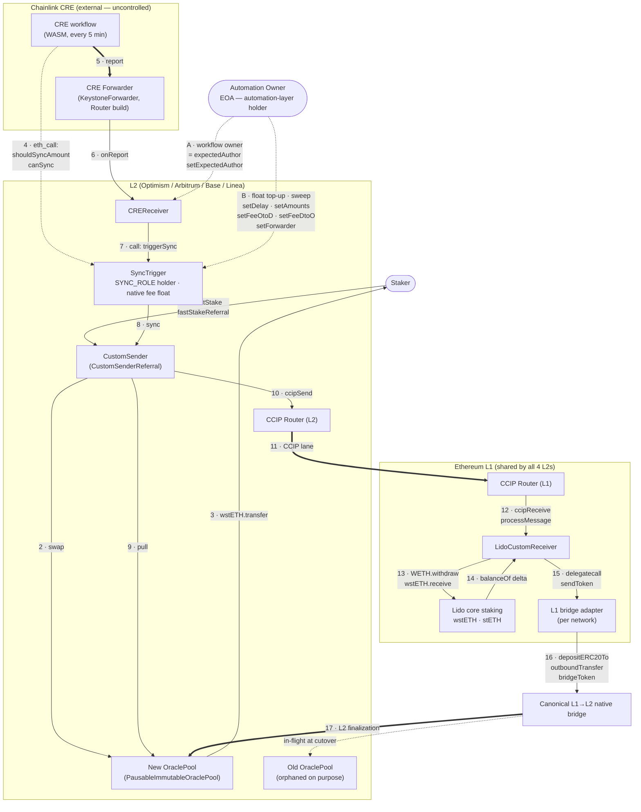
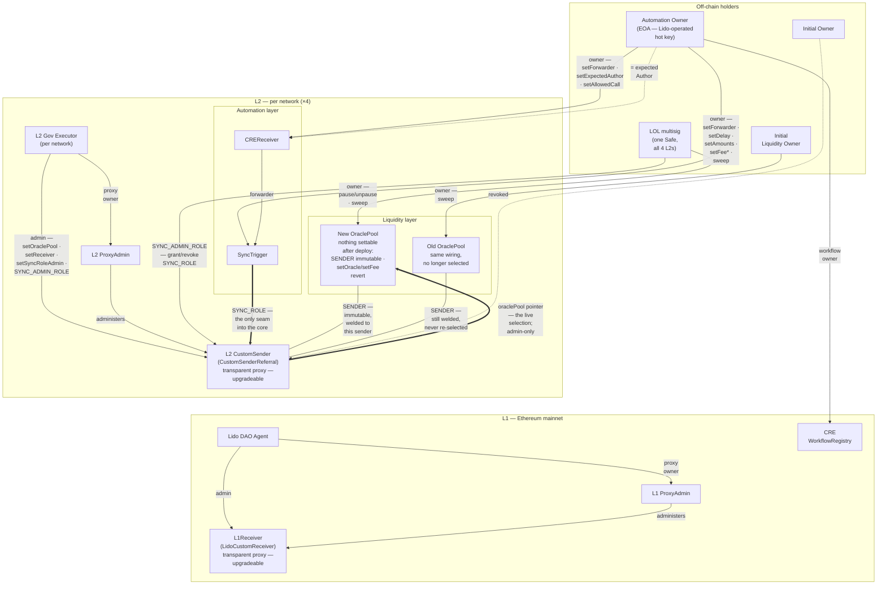

# Lido CCIP Direct Staking — Post-Migration Architecture

> **Scope.** This describes the **final on-chain setup after the migration** of
> Lido's CCIP Direct Staking deployment across Optimism, Arbitrum, Base, Linea,
> and Ethereum L1. It reflects the repo at commit `220fa10`
> (verified 2026-06-13).
>
> It is **not** a runbook (see `RUNBOOK.md`) and not proof the
> migration has run. It documents the *target state*: which contracts exist, who
> owns/admins what, how value and triggers flow, and how it's verified.
>
> **Ownership-arrangement change, 2026-07-29.** The automation layer's target
> holder is now a dedicated **Automation Owner** EOA, not the LOL multisig (§4.2).
> That arrangement is **not yet on-chain** — the route is
> [docs/automation-owner-redeploy.md](docs/automation-owner-redeploy.md) and the
> replaced arrangement is
> [archived](docs/archive/ownership-lol-owned-automation.md), not deleted. Only
> §2.2, §2.6, §2.7, §3.2, §3.4, §4.1 and §4.2 changed with it; `script/**`,
> `config/state/**`, `RUNBOOK.md` and the remaining `docs/*` still encode the
> replaced shape until that plan's S1 lands.

---

## 1. Networks

The deployment spans **five chains**. The four L2s are structurally identical
(same contracts, same role layout, same sync logic); they differ only in
addresses, the L1→L2 bridge fee encoding, the CCIP gas limit, and which
governance/liquidity accounts are wired in.

| Chain | ID | Role in the system |
|---|---|---|
| **Ethereum L1** | 1 | Shared settlement + staking layer; one `LidoCustomReceiver` serves all four L2s. |
| **Optimism** | 10 | L2 staking front-end + sync infrastructure. |
| **Arbitrum** | 42161 | idem (different addresses + bridge fee model). |
| **Base** | 8453 | idem. |
| **Linea** | 59144 | idem (also a legacy Gelato automation to revoke; leaner gas). |

> NB: the *same* address string is often
> reused for **different** contracts across chains and roles (deterministic deploys) —
> e.g. `0x6F357d…4588` is both the L1 `LidoCustomReceiver` and the OP/Base/Linea old
> pool; `0x328de9…C997` is both the `CustomSender` proxy and the Optimism L1 adapter.
> Treat an address as meaningful only with its `(chain, role)`.

> The canonical per-chain
> values are stored in `script/<chain>/<Chain>MigrationConstants.sol` (plus
> `script/l1/L1MigrationConstants.sol`); the expected post-migration values that
> state-mate asserts live in the single shared wiring/checks file `config/state/l2.yaml`
> (one file for all four L2 lanes — the lanes are structurally identical), which resolves its anchor
> values from two per-chain siblings passed explicitly per lane: `<chain>.deployed.yaml` (our deployed
> addresses, written from the deploy broadcast) and `<chain>.inputs.yaml` (the single review surface
> for deploy parameters: `config:` knobs + `externals:` third-party facts).

---

## 2. Components — purpose & origin

"**Origin**" = where the code comes from. This separates *what Lido authored and
owns* from *what it only configures or depends on*.

### 2.1 What's in the system vs. external dependencies

The **system** is the contracts Lido deploys/owns plus the off-chain workflow
Lido authors. The **external dependencies** are things the project relies on but
cannot change: Chainlink's CRE network and CCIP, the canonical L1↔L2 native
bridges, Lido core staking, and the WETH/wstETH tokens. This line matters
operationally: the project keeps on-chain control (the kill switches in §3.4)
over its own contracts even if an external actor (the CRE network) is degraded or
hostile.

### 2.2 Authored in this repo (`l2-direct-staking`)

| Component                                | Purpose                                                                                                                                                                                                                                 | Source                                                        |
| ---------------------------------------- | --------------------------------------------------------------------------------------------------------------------------------------------------------------------------------------------------------------------------------------- | ------------------------------------------------------------- |
| **`SyncTrigger`** (per L2)               | Holds `SYNC_ROLE` on `CustomSender`. Enforces per-sync gates (min 5 / max 100 WETH, 12 h delay) and calls `CustomSender.sync()`. Replaces the legacy automation as the sole `SYNC_ROLE` holder. Also the **fee treasury**: fronts `maxFee + feeDtoO` per sync from its own ETH balance (`maxFee` excess refunds back to it); must stay ≥ `getMaxFees()` or the lane stalls — funding permissionless, recovery `sweep()` = owner-only = the Automation Owner (docs/fees.md §Funding the float). | `src/SyncTrigger.sol`                                         |
| **`CREReceiver`** (per L2)               | Receives signed CRE reports and authorizes them three ways (forwarder + report author + `(target, selector)` allow-list), then calls `SyncTrigger.triggerSync()`. Defense-in-depth between the off-chain network and the on-chain sync. | `src/cre/CREReceiver.sol`, `src/cre/interfaces/IReceiver.sol` |
| **CRE sync workflow**                    | Off-chain TypeScript→WASM that runs on the Chainlink CRE network every 5 min, polls `SyncTrigger.shouldSyncAmount()` (due-ness + amount) and `canSync()` (executability), and emits a signed report only when a sync is both due and executable.                                                                           | `cre-workflows/sync-automation/*`                             |
| **Migration scripts + state-mate YAMLs** | The migration scripts (Forge) and the post-condition checks (the shared wiring `config/state/l2.yaml` + each lane's `.deployed.yaml`/`.inputs.yaml` siblings). Not runtime contracts; they define and verify the target state.                                                                                                 | `script/**`                                                   |

**Provenance — both are *derived*, not clean-room, and in two different senses.**
Neither contract is written from a blank file, and "derived from external code"
hides two distinct relationships — the distinction is also *why the upstream
versions could not simply be reused*. The lineage is currently implicit: there is
no provenance note in `src/`, so it is only recoverable by diffing against `lib/`
(this paragraph records it; a one-line `@dev` back-reference in each source file
would make it self-documenting).

- **`SyncTrigger` — a fork of `chainlink-csr`'s `SyncAutomation`**
  (`lib/chainlink-csr/contracts/automations/SyncAutomation.sol`, pinned `62108f7`;
  its Gelato-framework sibling, used on Linea, is `GelatoSyncAutomation`).
  Everything *outside the trigger interface* is carried over verbatim — the
  immutables, storage layout, constructor shape, `_getAmountToSync`, the two fee blobs,
  every setter/getter, `sweep`, and `receive()`; only the identifiers are re-prefixed
  `SyncTrigger*`. One deliberate divergence beyond the interface: **LINK fee payment is
  removed** — the upstream constructor's LINK `forceApprove` is dropped, the fee setters
  reject `payInLink == true`, and `getMaxFees()` returns only the native total.
  `triggerSync()` *is* the upstream
  `performUpkeep()` renamed (same body, same `onlyForwarder` gate); `shouldSyncAmount()`
  replaces the `checkUpkeep`/`_checkUpKeep` poll with a plain due-ness + amount view
  (delay + pool ≥ min; the cap-clamped amount when due, else 0),
  and a sibling `canSync()` adds the **executability predicate** the workflow polls
  alongside it: the float / `SYNC_ROLE` / pool-not-paused preconditions that would
  otherwise revert `triggerSync` with no on-chain signal (LOW-2). The DON submits a
  report only when both are true. The one real change is the
  **trigger surface**: the Chainlink-Automation keeper ABI (`AutomationCompatible`
  base, `checkUpkeep`/`performUpkeep`) is dropped for a CRE-shaped pair — a view the
  off-chain workflow polls and a forwarder-only entry point. **Why not the original:**
  `SyncAutomation`/`GelatoSyncAutomation` are bound to the Chainlink-Automation and
  Gelato keeper networks this migration is *decommissioning* (§2.4) — they inherit
  `AutomationCompatible` and expose `performUpkeep`/`checkUpkeep`, the exact surface
  those keepers call. Reusing them would keep a dependency on the framework being
  removed and leave dead keeper surface on the `SYNC_ROLE` holder. Forking lets the
  upstream sync logic — the same economics the legacy keeper already runs in
  production — carry over unchanged while only the trigger boundary moves to CRE;
  that reuse is why this is a *derivation*, not a rewrite.

- **`CREReceiver` — derived from an external interface *standard*, not from any
  upstream contract.** It implements Chainlink's CRE / Keystone forwarder-receiver
  standard — `onReport(bytes metadata, bytes report)` plus `getForwarder()` /
  `supportsInterface` — and reads the CRE-mandated packed metadata layout
  (`metadata[42:62]` = `workflowOwner`). That interface is **re-declared locally** in
  `src/cre/interfaces/IReceiver.sol`; no upstream CRE receiver is vendored in `lib/`.
  **Why not the original:** here there *is* no full original contract to adopt — only
  the interface shape the CRE Forwarder will call, which `CREReceiver` must conform
  to. The bare standard carries no authorization beyond the forwarder check, so the
  three-gate model (forwarder + pinned `expectedAuthor` + `(target, selector)`
  allow-list — §2.6.B) is original Lido code layered on top; re-declaring just the
  three-function interface instead of importing the full keystone package keeps the
  trusted on-chain surface minimal (§2.6's least-privilege framing).

### 2.3 Configured but not authored — the `chainlink-csr` library

Vendored from [`Aphyla/chainlink-csr`](https://github.com/Aphyla/chainlink-csr)
in `lib/`. These pre-exist the migration; the migration **re-wires and re-owns**
them — it does not redeploy them (except the new pool).

| Component | Where | Purpose | Migration touch |
|---|---|---|---|
| **`CustomSenderReferral`** (`CustomSender`) | each L2 | Staking front-end: `fastStake`/`slowStake`/referral; starts the CCIP `sync()` round-trip; holds the oracle-pool pointer and the `SYNC_ROLE`/admin roles. **Upgradeable** (transparent proxy — §2.5). | pool pointer swapped; `SYNC_ROLE` re-granted; admin → L2 governance executor; implementation → `CustomSenderSyncAdmin`, moving `SYNC_ROLE`'s admin to `SYNC_ADMIN_ROLE` (§3.1) |
| **`PausableImmutableOraclePool`** (new) | each L2 | Holds wstETH liquidity; swaps WETH→wstETH at the oracle rate on `fastStake`. `setOracle`/`setFee` permanently disabled. | **deployed fresh**; owner → LOL multisig |
| **`PausableImmutableOraclePool`** (old) | each L2 | The pre-migration pool. | left orphaned on purpose (§5.1); owner unchanged (Initial Liquidity Owner) |
| **`LidoCustomReceiver`** (`L1Receiver`) | L1 (shared) | Receives CCIP messages from all four L2s; stakes WETH→wstETH via Lido; delegates to the per-network L1 adapter to bridge wstETH back. **Upgradeable** (transparent proxy — §2.5). | admin → Lido DAO Agent |
| **L1 bridge adapters** ×4 | L1 | Per-network adapter that decodes `FeeDtoO` and pushes wstETH onto the canonical L1→L2 bridge. | immutable; not re-owned |
| `FeeCodec`, `CCIPSenderUpgradeable`, `TokenHelper` | L1+L2 | Fee encoding, CCIP send, native-refund helpers. | unchanged |

### 2.4 Other origins

| Component | Origin | Purpose |
|---|---|---|
| **`ProxyAdmin`** (L1 + per-L2) | **OpenZeppelin** | Admin of the transparent proxies; holds `upgradeAndCall`. Owner → Lido DAO Agent (L1) / L2 governance executor (L2). |
| `TransparentUpgradeableProxy`, `AccessControl`, `Ownable` | **OpenZeppelin** | Proxy + role/ownership primitives underlying every contract above. |
| **CRE network + CRE Forwarder** | **Chainlink** (external) | The decentralized network runs the WASM and signs reports; the Forwarder verifies signatures and calls `CREReceiver.onReport`. **Not controllable by Lido** — only gated by the §3.4 kill switches. |
| **CCIP Router** (per chain) | **Chainlink** (external) | Routes the L2→L1 sync message. |
| **`WorkflowRegistry 2.0.0`** (`0x4Ac5…E7e5`, L1) | **Chainlink** | Records the CRE workflow owner — fixed at registration, **no transfer function**; `verify-cre-workflow` checks that owner (target: the Automation Owner — §4.2; the recipe still pins the LOL Safe) and status ACTIVE. |
| **WETH / wstETH / stETH** | token issuers / Lido core (external) | Value tokens. wstETH is the bridged output; Lido core staking mints it on L1. |
| **Native bridges** (OP Standard Bridge, Arbitrum Gateway, Linea Message Service) | L2 ecosystems (external) | The L1→L2 return leg for wstETH. |
| **Legacy Chainlink Automation** (per L2) + **Gelato bot** (Linea only) | Chainlink / Gelato | Pre-migration `SYNC_ROLE` holders; **revoked** during migration — present here only as removed holders. |

### 2.5 Upgradeability — proxy / admin / implementation

Exactly **two** contracts are upgradeable; both use OpenZeppelin's **EIP-1967
transparent-proxy** pattern, where a `ProxyAdmin` is the proxy's admin and the
proxy `delegatecall`s a separate implementation. This is the chain the
"proxy-owner" role (§3) actually controls:

```
owner ──owns──▶ ProxyAdmin ──administers (EIP-1967 admin slot)──▶ Proxy ──delegatecall (EIP-1967 impl slot)──▶ Implementation
```

| Proxy | Implementation | Admin (`ProxyAdmin`) | ProxyAdmin owner (final) |
|---|---|---|---|
| **`LidoCustomReceiver`** `0x6F35…4588` (L1, shared) | `0x301c…E367` | L1 ProxyAdmin `0x88a4…37BD` | Lido DAO Agent |
| **`CustomSender`** (per L2) — OP/Base/Linea `0x328d…C997`, Arb `0x7222…4AD1` | OP/Base `0x6549…8703`, Arb `0x220F…c664`, Linea `0xBf96…16f9` | L2 ProxyAdmin — OP/Base/Linea `0x4c8c…2192`, Arb `0x5B42…0217` | L2 governance executor (per net) |

> **One planned upgrade — `CustomSenderSyncAdmin` (§3.1).** Giving the LOL multisig
> `SYNC_ADMIN_ROLE` needs `_setRoleAdmin`, which is `internal` in OpenZeppelin's
> `AccessControl` and is never called by the deployed implementation — so it is reachable
> only through new implementation bytecode. The change is a **subclass** of
> `CustomSenderReferral` adding one constant and one `DEFAULT_ADMIN_ROLE`-gated
> `setSyncRoleAdmin(bytes32)`, so every inherited path stays byte-identical (the additive
> discipline of §2.6) and **no storage is added** — `_setRoleAdmin` writes
> `RoleData.adminRole` inside the already-namespaced
> `erc7201:openzeppelin.storage.AccessControl` slot, so there is no layout risk. Three
> deployment constraints: it must land **per lane before `finalize`**, while
> `L2ProxyAdmin.owner()` is still the Initial Owner (afterwards it is a DAO vote per
> lane); the new implementation's constructor must reproduce the current immutables
> (`TOKEN`, `WNATIVE`, `LINK_TOKEN`, `CCIP_ROUTER`) **exactly**, since a mismatch is
> silent; and the four `l2CustomSenderImpl` anchors re-pin in state-mate, which is what
> makes the swap visible as a diff rather than a surprise.

**Not upgradeable** (no proxy, no admin — bytecode fixed at deploy): `SyncTrigger`
and `CREReceiver` (plain `Ownable` contracts), `PausableImmutableOraclePool`
(immutable by design — `setOracle`/`setFee` permanently revert), and the L1 bridge
adapters. So the **entire upgrade surface is the two proxies above**.

Owning the `ProxyAdmin` is the **strongest power in the system** — strictly above
the admin role, because swapping the implementation can rewrite every other rule
(role checks, pool pointer, sync logic) at once. That is why it goes to the
slowest, highest-authority owners (Lido DAO Agent via Aragon vote on L1; the L2
governance executor, driven by the L1→L2 governance bridge, on each L2) and never
to an operational key. The proxy↔impl↔admin wiring is checked on-chain by
state-mate, which reads the EIP-1967 implementation slot (`0x3608…2bbc`) and admin
slot (`0xb531…6103`) and asserts they equal the expected implementation and
`ProxyAdmin`. Because the impl address is pinned, any future `upgradeAndCall` shows
up as a state-mate diff. See **Diagram C (§4.3)**.

### 2.6 Credibility & security of the application-layer contracts

Covers the contracts trusted at the application layer — i.e. **not** external
infrastructure (Chainlink CRE/CCIP, bridges, tokens, Lido core) and **not**
OpenZeppelin primitives. This is evidence found in the repo, not an audit
endorsement.

**A. `chainlink-csr` library — Chainlink's CCIP "Custom Sender-Receiver" reference design.**
(`CustomSenderReferral`, `PausableImmutableOraclePool`, `LidoCustomReceiver`, the
four L1 adapters, `FeeCodec`, `CCIPSenderUpgradeable`, `TokenHelper`.)

- **Provenance.** Vendored as a *pinned* git submodule — `Aphyla/chainlink-csr` @
  `62108f7` (2025-10-23, "Add Linea support") — so the source is reproducible, not
  a floating dependency. It is the published implementation behind Chainlink's
  "Scaling Staking Protocols Cross-Chain with CCIP" design.
- **Production track record (the strongest signal).** The `CustomSenderReferral`
  and `LidoCustomReceiver` instances this migration re-owns are **already live on
  mainnet and hold real WETH/wstETH today** (the old pools carry non-zero balances
  — reported by the `just balances-l1` / `balances-<net>` recipes). The migration **re-wires and re-owns
  existing contracts; it does not redeploy them.** The one fresh deployment, the
  new `PausableImmutableOraclePool`, is the **same contract code** as the live old pools (same source and creation bytecode; only the constructor-baked immutables differ).
- **Caveat.** No audit artifact is vendored in this repo. Confirm the upstream
  audit / formal-verification status of the pinned commit before relying on it for
  *new* value; note the migration changes ownership, not code.

**B. Repo-authored contracts — `SyncTrigger` (240 lines), `CREReceiver` (229 lines), CRE workflow.**

- **Small, single-purpose, least-privilege.** Both are `Ownable` with every setter
  `onlyOwner`; neither uses `delegatecall` or is upgradeable.
  - `CREReceiver` enforces **three independent gates** before acting:
    `msg.sender == CRE Forwarder`, report author `== expectedAuthor`, and
    `(target, selector)` on an owner-managed allow-list seeded only with
    `(SyncTrigger, triggerSync)` — **and the call must be argument-less** (calldata
    exactly the 4-byte selector), so the report author controls nothing beyond
    *which* allow-listed selector fires (the seed, `triggerSync()`, is nullary). Its
    single external call is `target.call(data)`, constrained by both. Authentication
    is deliberately **`(forwarder, workflowOwner)`** — the report's
    `workflowName`/`workflowId` are *not* gated, since an owner-scoped label adds no
    defence against owner-key compromise and the nullary lock already bounds the
    blast radius to "trigger the intended, rate-limited sync."
  - **ERC-165 delivery precondition.** The CRE Forwarder calls `onReport` only if
    `CREReceiver.supportsInterface` returns true for **both** `0x805f2132`
    (`onReport`-only `IReceiver`) and `0x01ffc9a7` (ERC-165 base) — it
    `ERC165Checker`-gates first. A wrong id silently bricks the whole sync path (no
    revert, just non-delivery); state-mate pins both ids at deploy. Each L2's production
    Forwarder is this same ERC-165-gating, 2-arg-`onReport` "Router" build — **verified
    on-chain (all 4 lanes, 2026-06-19)** and re-checkable read-only via
    `just verify-cre-forwarder`. NB it reports the *stale* `typeAndVersion` label
    `"KeystoneForwarder 1.0.0"` (not the legacy contract); discriminate on the
    ABI/EXTCODEHASH, never the version string.
  - `SyncTrigger.triggerSync()` is forwarder-only and **re-checks amount/delay
    on-chain** (defense-in-depth); the trigger is born fully configured but **inert
    until `activate` grants `SYNC_ROLE`** to it on `CustomSender` — until then
    `triggerSync → sync()` reverts (no role), so a fresh deploy can't fire; value
    flows only to the immutable `SENDER` via `sync()`. The only fund-extraction path
    is the `onlyOwner` `sweep` (fee-token recovery by governance).
- **Tests.** Dedicated unit suites — `SyncTriggerTest.t.sol` (970 lines) and
  `CREReceiverTest.t.sol` (468 lines), i.e. **test code exceeds contract code** —
  plus 4-network fork-integration tests against forked mainnet state using the
  Chainlink Local CCIP simulator (`CREIntegrationTest`, `*PoolUpgrade`).
- **Bounded blast radius.** Both are owned by the **Automation Owner** in the target
  state (§4.2) — deployer-owned during the canary test, LOL-owned on-chain today — and
  the §3.4 kill switches disable them *without* an upgrade.
- **Open items.** (1) No third-party audit artifact is in-repo — recommended
  before/with mainnet rollout if not covered externally. (2) Source-verify the deployed
  bytecode on each block explorer with `just verify-sources` (Etherscan v2), then
  independently confirm it shows verified — state-mate pins the impl address, not
  source verification.

### 2.7 Why `SyncTrigger` and `CREReceiver` are two contracts, not one

The call chain `CRE Forwarder → CREReceiver.onReport() → SyncTrigger.triggerSync()
→ CustomSender.sync()` is split into two repo-authored contracts at exactly the
trust boundary between the **external CRE network** and the **privileged on-chain
sync**. They *could* be written as one; keeping the privilege on its own
`SyncTrigger` preserves the properties below.

| Axis | `CREReceiver` | `SyncTrigger` |
|---|---|---|
| Role | CRE-facing **authorization gate** (3 checks) | **privilege holder + sync domain logic** |
| On-chain power | none beyond calling its allow-listed target | holds `SYNC_ROLE` on `CustomSender` — grant/revoke by either `SYNC_ADMIN_ROLE` holder: the **LOL multisig** or the **L2 governance executor** |
| Owner (config) | **Automation Owner** — one key, one signature | **Automation Owner** — one key, one signature |
| Knows about | CRE ABI: `onReport`, metadata layout, author, allow-list | sync economics: amount/delay gates, fee blobs |
| Link to the other | allow-list entry `(SyncTrigger, triggerSync)` | `forwarder` = `CREReceiver` |

**1. Two trust domains — at the role layer, not the owner.** The **Automation
Owner** holds the day-to-day config of *both* contracts (one signature), but
`SyncTrigger`'s **privilege** — its `SYNC_ROLE` on `CustomSender` — is granted and
revoked only by a holder of `SYNC_ADMIN_ROLE`: the **LOL multisig** or the **L2
governance executor** (§3.1). So arming or disarming the privileged sync path stays in
trust domains the automation holder does not control, even though it tunes
delay/amounts/fees. The separation that matters for §2.7 is therefore intact —
what the `SYNC_ADMIN_ROLE` split changes is *which* other domain can re-plug the
layer, and at what latency (§3.1, §4.2.2 (b)/(c)), not whether the automation holder
can arm itself. It cannot.
(Earlier this independence also lived in `SyncTrigger`'s *owner* being the
governance executor; that owner-level split was dropped to cut operational
friction — the funds the sync path can reach are the LOL-owned pool's anyway — so
the cross-domain backstop rides on the `SYNC_ROLE` admin instead. The §4.2 holder
split is a *different* separation and does not restore that one: it separates
automation from **liquidity**, not automation from governance, and the backstop
stays exactly where it was.)

**2. Defense-in-depth keeps the privilege on its own contract.** §3.4 lists kill
switches on the *same* path held in *different* trust domains: the Automation Owner
disarms the CRE side (`CREReceiver.setForwarder(0x…dead)` / `setExpectedAuthor`) and
the sync parameters (`SyncTrigger.setForwarder(0x…dead)`), while the
L2 governance executor independently revokes the privilege itself
(`CustomSender.revokeRole(SYNC_ROLE, syncTrigger)`) from a domain that holder does
not control. Keeping `SYNC_ROLE` on a dedicated `SyncTrigger` — not bolted onto the CRE
receiver — keeps that governance revoke a clean, single, CRE-agnostic target.

**3. The privilege keeps a minimal, CRE-agnostic surface.** `SYNC_ROLE` lives in
`SyncTrigger`, whose only entry point is `triggerSync()` behind `onlyForwarder`,
and which re-checks amount/delay on-chain. All CRE coupling — the
Chainlink-mandated `IReceiver.onReport` shape, the `metadata[42:62]`
workflow-owner extraction, the author pin, the `(target, selector)` allow-list —
is quarantined in `CREReceiver`, which holds **no** on-chain privilege. Merging
would bolt the CRE report-parsing attack surface directly onto the `SYNC_ROLE`
holder.

**4. Generic adapter vs. domain logic — they change for different reasons.**
`CREReceiver` is a *generic* CRE→on-chain dispatcher (it forwards any
owner-allow-listed `(target, selector)`, not only `triggerSync` — though only
**argument-less** calls, so the allow-list stays a routing table, not an
arbitrary-calldata bridge; §2.6), and `SyncTrigger.onlyForwarder` accepts *any*
configured caller, not necessarily a CRE receiver. Touching only through the two configurable addresses above, either can
be replaced or rewired without redeploying the other: swap the CRE adapter without
re-granting `SYNC_ROLE`, or retune the sync gates without re-exposing the CRE
boundary. A CRE report-format change touches only `CREReceiver`; a sync-economics
change touches only `SyncTrigger`.

---

## 3. Access control & ownership — the final state

### 3.1 Roles

On-chain roles are AccessControl roles and `Ownable` ownership slots; one role is
off-chain. Each is **per chain / per contract**.

| Role                  | On-chain identity                                              | On (contract)                               | What it can do                                                                                                                                 |
| --------------------- | -------------------------------------------------------------- | ------------------------------------------- | ---------------------------------------------------------------------------------------------------------------------------------------------- |
| **Admin**             | `DEFAULT_ADMIN_ROLE` = `0x00`                                  | `CustomSender` (each L2); `L1Receiver` (L1) | grant/revoke all roles **except `SYNC_ROLE`**, whose admin is the row below — reachable in one extra call by self-granting `SYNC_ADMIN_ROLE`, of which it *is* the admin; on **`CustomSender`**: `setOraclePool`, `setReceiver`, `setSyncRoleAdmin`; on **`L1Receiver`**: `setSender`, `setAdapter`, `recoverTokens` |
| **Sync caller**       | `SYNC_ROLE` = `keccak256("SYNC_ROLE")`                         | `CustomSender` (each L2)                    | call `sync()` to start the CCIP round-trip                                                                                                     |
| **Sync-role admin**   | `SYNC_ADMIN_ROLE` = `keccak256("SYNC_ADMIN_ROLE")` — set as `getRoleAdmin(SYNC_ROLE)` | `CustomSender` (each L2)  | grant/revoke `SYNC_ROLE`, i.e. **re-plug the automation layer**. Held by **both** the LOL multisig and the L2 governance executor, so the §3.4 backstop stays one call for governance while LOL can replace a `SyncTrigger` at Safe latency instead of DAO latency |
| **Proxy owner**       | `owner()`                                                      | `ProxyAdmin` (L1 + each L2)                 | `upgradeAndCall` to swap the implementation of the `LidoCustomReceiver` proxy (L1) / `CustomSender` proxy (L2) — **strongest power**; see §2.5 |
| **SyncTrigger owner** | `owner()`                                                      | `SyncTrigger` (each L2)                     | `setForwarder`, `setDelay`, `setAmounts`, `setFeeOtoD/DtoO`, `setMaxGasLimit`, `sweep`                                                                           |
| **Pool owner**        | `owner()`                                                      | new `OraclePool` (each L2)                  | `pause`/`unpause`/`sweep`; seed/withdraw liquidity                                                                                             |
| **CREReceiver owner** | `owner()`                                                      | `CREReceiver` (each L2)                     | `setForwarder`, `setExpectedAuthor`, `setAllowedCall`, `withdrawETH`                                                                           |
| **Workflow owner**    | owner on `WorkflowRegistry` (L1) **= pinned `expectedAuthor`** | Chainlink registry + `CREReceiver`          | deploy / pause / activate / delete the CRE workflow; its signature authorizes reports                                                          |
| **Forwarder**         | configured `forwarder` on `CREReceiver`                        | `CREReceiver` (each L2)                     | the only `msg.sender` accepted by `onReport`                                                                                                   |

**Why `SYNC_ROLE` has its own admin role.** By default OpenZeppelin leaves every
role's admin unset, which reads as `DEFAULT_ADMIN_ROLE` — so out of the box only the
gov executor could re-point `SYNC_ROLE`, and after `finalize` that is a **DAO vote per
lane**. The one failure that most needs a fast re-plug is **(c) Automation EOA keys
lost** (§4.2.2): the pair keeps running at last-good values but can never be retuned,
so recovery means a fresh `SyncTrigger` — and the role, not the contract identity, is
the seam (§2.7). Routing that through governance makes an *inert* failure expensive to
clear. `_setRoleAdmin(SYNC_ROLE, SYNC_ADMIN_ROLE)` moves it to a role the **LOL
multisig** holds, turning weeks into a Safe quorum, while granting the same role to the
gov executor keeps governance's own `revokeRole` a single call.

Three properties of the OZ mechanism decide how this must be read (they are not
tunable):

- **Admin means grant *and* revoke.** `getRoleAdmin` returns one role that gates both
  `grantRole` and `revokeRole`. A revoke-only guardian is not expressible this way; it
  would need custom code.
- **Grant targets are unrestricted.** A `SYNC_ADMIN_ROLE` holder can grant `SYNC_ROLE`
  to **itself** and call `CustomSender.sync()` directly, bypassing every `SyncTrigger`
  gate. This is why the role is a genuine widening of the LOL domain and not a
  book-keeping change — priced in full at §4.2.2 (b).
- **Holders can always self-renounce, and no holder here can.** `renounceRole` is
  admin-independent, but every current `SYNC_ROLE` holder is a contract with no code
  path that emits the call, so dropping the role is always the admin's job.

`setSyncRoleAdmin(bytes32)` stays `DEFAULT_ADMIN_ROLE`-gated and permanent rather than a
one-shot initializer, so governance can re-point or retract the arrangement later
without another implementation upgrade — it grants no power the proxy owner did not
already have (§2.5).

### 3.2 Owners / actors and what they hold

End state (after the migration + the LOL liquidity seed). Human/multisig owners
first, then the contract actors, then the external (Chainlink) actor.

| Owner / actor | Kind | What it holds in the final state | Notes |
|---|---|---|---|
| **Lido DAO Agent** `0x3e40…9C8c` | L1 contract/multisig | Admin of `L1Receiver`; owner of L1 `ProxyAdmin` | every action = Aragon DAO vote (days–weeks) |
| **L2 Governance Executor** (per net) | L2 bridge-executor contract | Admin of `CustomSender`; **`SYNC_ADMIN_ROLE`**; owner of L2 `ProxyAdmin` | driven by Lido DAO via the L1→L2 governance bridge; holds the proxy-upgrade and `SYNC_ROLE` kill switches. `queue(address[] targets, …, bytes[] calldatas, …)` takes an **array**, so a multi-call response is one action set, not one vote each |
| **LOL multisig** (one Safe, same address on all 4 L2s) | L2 multisig | Owner of the new `OraclePool`; **`SYNC_ADMIN_ROLE` on `CustomSender`** | provides the wstETH seed; holds `pause`/`unpause` and `sweep` on the live pool. `SYNC_ADMIN_ROLE` exists so a lost Automation Owner key can be routed around at Safe latency (§3.1) — it also means a Safe compromise reaches the sync path, which is the whole of §4.2.2 (b). Held the three automation assignments too under the retired arrangement ([archive](docs/archive/ownership-lol-owned-automation.md)), and still does on-chain today |
| **Automation Owner** (EOA, addr TBD — one key, all 4 L2s) | off-chain key | Owner of `SyncTrigger`; owner of `CREReceiver`; **CRE workflow owner** (= `expectedAuthor` on every L2 `CREReceiver`) | the §4.2 holder split: one signature for every automation lever and both CRE kill switches, and the workflow is signed natively (no `--unsigned`). Reaches fees and timing, never principal (§4.2.2 (d)); key custody terms are still open ([transition plan §8 Q1](docs/automation-owner-redeploy.md)) |
| **Lido Deployer** (EOA, addr TBD) | off-chain key | **nothing in the final state** — but **transiently owned** the new pool / `SyncTrigger` / `CREReceiver` during the canary test (and was the `CREReceiver` forwarder **and** author then, to drive the simulated sync), all restored to production config and transferred to LOL at `handoff` | **no on-chain admin** and **not the CRE workflow owner**; post-migration holds zero on-chain power over Lido contracts. The §4.2 automation pair is deployed **Automation-Owner-owned from its constructor**, so no handoff transfer repeats for it. Canary flow: [docs/mainnet-simulated-cre-test.md](docs/mainnet-simulated-cre-test.md) |
| **Initial Owner** `0xb5c3…91a8` | EOA — **external (not Lido-controlled)** | **nothing** — revoked from every migrated contract | external migration-handoff key (upstream `chainlink-csr` admin); executes Stage 2 and is renounced once it completes — **but completion across all chains depends on this external party** (§6.4) |
| **Initial Liquidity Owner** `0x2897…b18c` | EOA | Owner of the **old** pools only | retains `sweep()` on the old pools; no control over any new infrastructure |
| **`SyncTrigger`** (contract) | L2 contract | Holds `SYNC_ROLE` on `CustomSender` | acts only on calls from its forwarder (`CREReceiver`); config owned by the Automation Owner, but its `SYNC_ROLE` is grant/revocable by either `SYNC_ADMIN_ROLE` holder — LOL or the L2 governance executor. It cannot drop the role itself: `renounceRole` is available to any holder, but this contract has no code path that emits an arbitrary call |
| **`CREReceiver`** (contract) | L2 contract | Is the configured `forwarder` on `SyncTrigger` | accepts reports only from the CRE Forwarder; owned by the Automation Owner, which is also its pinned `expectedAuthor` / CRE workflow owner |
| **CRE Forwarder / CRE network** | Chainlink (external) | The accepted forwarder address; **no on-chain role on Lido contracts** otherwise | **not controllable by Lido**; the §3.4 kill switches override it |

Per-chain accounts (the governance executor is the only account that varies between L2s;
the LOL multisig is the same Safe address on all four, and the Automation Owner is one
EOA across all four — open question Q8 in the transition plan):

| Chain | Governance executor (`CustomSender` admin / proxy owner) | LOL multisig (new-pool owner) |
|---|---|---|
| **Optimism** | `0xEfa0dB536d2c8089685630fafe88CF7805966FC3` | `0xFc832dA3D688352C0aB1A32136c7fABbB16d66E6` |
| **Arbitrum** | `0x1dcA41859Cd23b526CBe74dA8F48aC96e14B1A29` | `0xFc832dA3D688352C0aB1A32136c7fABbB16d66E6` |
| **Base** | `0x0E37599436974a25dDeEdF795C848d30Af46eaCF` | `0xFc832dA3D688352C0aB1A32136c7fABbB16d66E6` |
| **Linea** | `0x74Be82F00CC867614803ffd7f36A2a4aF0405670` | `0xFc832dA3D688352C0aB1A32136c7fABbB16d66E6` |
| **Ethereum L1** (shared) | Lido DAO Agent `0x3e40D73EB977Dc6a537aF587D48316feE66E9C8c` | — |

> **The CRE workflow owner is the Automation Owner (EOA), and that is a cliff accepted
> with eyes open.** Unlike every other role, this one is *fixed at registration*: a CRE
> workflow's owner is whatever account `cre workflow deploy` registers, baked into every
> signed report as `metadata.workflowOwner`, and `WorkflowRegistry 2.0.0`
> (`0x4Ac5…E7e5`) exposes **no per-workflow ownership-transfer function** — so the owner
> can't be *moved* afterwards. Changing it means deploying a *new* workflow and re-pinning
> `setExpectedAuthor` on all four L2s. Under an EOA owner, a lost or compromised key
> triggers exactly that (§4.2.2 (c)); [ADR-0001](docs/adr/0001-cre-workflow-owner-multisig.md)
> chose a **Safe** owner precisely to avoid it, because a Safe absorbs the loss of a
> single *signer* by rotating that signer while the workflow-owner address never moves.
> The §4.2 decision overrides that trade: it takes the single-key cliff in exchange for
> native signing (no `cre workflow deploy … --unsigned` detour), one-signature CRE kill
> switches, and a Safe compromise that no longer reaches the automation layer. ADR-0001
> is therefore **superseded** — by ADR-0002, still to be written (transition plan S1.12) —
> and its three CRE Early-Access residuals carry over unchanged to the EOA owner. Two
> further consequences of the EOA owner: it must first be a **linked owner**
> (`cre account link-key`), which has never been done for any account; and **CRE credits
> are administered against the workflow owner's CRE account**, so billing and
> `pause`/`activate`/`delete` move with it. The Lido Deployer EOA only **broadcasts
> deploys** and funds the SyncTrigger float; it holds **zero on-chain power** afterwards
> and is **not** the workflow owner. Since the deploy uses no testnet rehearsal and the
> canary's `simulate-sync` stands in for the real forwarder, the author-gate residual is
> first proven by the **first production** `CREReceiver.CallExecuted` (RUNBOOK gate
> **G2-author**).

**End-of-life recovery.** Each treasury is reclaimed by the owner that holds it here — the **Automation Owner** `sweep`s the `SyncTrigger` float, `withdrawETH`s the `CREReceiver` and reclaims the CRE credit; the **LOL multisig** reclaims the new pool's liquidity. Ordered, gated decommission procedure: [`RUNBOOK.md` §4](RUNBOOK.md#4--decommission--sunset-end-of-life).

### 3.3 Granting and revoking — both matter

The migration's grant/revoke steps are permission changes, distinct from the sync
work they later allow. Two points baked into the scripts:

- **Revoke is as important as grant.** `SYNC_ROLE` is revoked from the legacy
  automation *and* `DEFAULT_ADMIN_ROLE` from the Initial Owner. Leaving either in
  place would let a stale holder call `sync()` with hostile fees or re-admin the
  contract.
- **Atomic, read-back-or-revert.** Each permission change is followed by an
  in-transaction assertion; a partial migration reverts the whole transaction
  instead of leaving a half-migrated contract. This matters more than it looks:
  OZ's `revokeRole` is a **silent no-op** on an account that never held the role, so
  a mistyped address revokes nothing while the transaction still succeeds. Only the
  `hasRole` read-back distinguishes the two.
- **The admin relation is itself state.** `getRoleAdmin(SYNC_ROLE)` must read
  `SYNC_ADMIN_ROLE`, not `0x00`, and both intended holders must read `true` — checked
  live by `just audit-ownership` and pinned by state-mate. An implementation rollback
  would silently return the admin to `DEFAULT_ADMIN_ROLE` and strip LOL's ability to
  re-plug, without touching any `hasRole` the old config asserted.

### 3.4 What the project still controls if Chainlink misbehaves

The CRE network is external and can't be controlled. The project keeps full
on-chain control of the sync path through **kill switches**:

| Concern | Owner | Lever |
|---|---|---|
| Pool issue | LOL multisig | `OraclePool.pause()` |
| CRE author-key compromise | Automation Owner | `CREReceiver.setExpectedAuthor(new)` |
| CRE infra hostile/degraded | Automation Owner | `CREReceiver.setForwarder(0x…dead)` |
| SyncTrigger misconfigured | Automation Owner | `SyncTrigger.setForwarder(0x…dead)` |
| Automation Owner key lost — re-plug the layer | LOL multisig | `CustomSender.grantRole(SYNC_ROLE, newTrigger)` + `revokeRole(SYNC_ROLE, oldTrigger)` |
| Rogue / compromised sync path (independent backstop) | L2 governance executor | `CustomSender.revokeRole(SYNC_ROLE, syncTrigger)` |

Three of the six now cost **one signature instead of a Safe quorum** — the §4.2
holder split's main operational gain. Its price is in the same table: rows 2–4 are
also re-armable by whoever holds that key, so against a compromised Automation Owner
the last row is the *only* switch that stays shut (§4.2.2 (d)). Rows 1, 5 and 6 sit
outside that key's reach entirely — it holds neither the pool nor `SYNC_ADMIN_ROLE`.

**Row 5 is the `SYNC_ADMIN_ROLE` gain; row 6 is what it costs.** Both are the same
capability seen from two sides — whoever can grant `SYNC_ROLE` can also re-grant it
after governance revokes. Against a **compromised LOL Safe** (not the Automation
Owner), row 6 alone therefore no longer terminates the incident: the containing action
set must revoke `SYNC_ADMIN_ROLE` from LOL **and** `SYNC_ROLE` from whatever it granted,
in that order, in one queued set (§4.2.2 (b)). Against every other failure in this
table the backstop is unchanged, because no other holder has the role.

> **CRE workflow owner = Automation Owner (EOA).** There is no signer to rotate: the workflow-owner
> address *is* the key, so a lost or compromised Automation Owner means the one-time **"redeploy +
> re-pin"** primitive — a new workflow plus `setExpectedAuthor` on all four L2s (§3.2, §4.2.2 (c),
> and the primitive itself in [ADR-0001](docs/adr/0001-cre-workflow-owner-multisig.md), whose
> *choice* §4.2 supersedes but whose *mechanics* still apply). The levers above
> (`setExpectedAuthor` / `setForwarder`) are the fast hinge while the key is still trusted, and are
> re-armable by an attacker who holds it. The GovExec backstop
> (`CustomSender.revokeRole(SYNC_ROLE, syncTrigger)`) stays in an independent trust domain
> regardless, and is the containment of record for that case.

---

## 4. Diagrams

One representative L2 + the shared Ethereum L1; the other three L2s are identical
in structure.

### 4.1 Diagram A — components + operational flow (value & control)

**Holder arrangement drawn here: the target one** (§4.2 — a dedicated Automation
Owner; the retired LOL-owned arrangement is
[archived](docs/archive/ownership-lol-owned-automation.md) and is still what the
chain runs). That choice touches this diagram in exactly two dashed edges (**A**,
**B**) and nowhere else: under the retired arrangement they start at the **LOL
multisig** instead, and every numbered edge below is identical either way. That is
§4.2.1's own claim — *"it moved a holder, not a power"* — read off the operational
face rather than restated: if a holder swap changed any call in the value or
control path, the claim would be false. It does not.

Every arrow now carries the **method actually invoked**, named as the callee
declares it — and where no single method exists, the arrow says so instead of
inventing one. The old diagram drew a user call, an internal call, an off-chain
poll and a token movement with the same solid arrow, so the glyph is now
load-bearing across three classes (legend below the diagram): a **direct on-chain
call**, an **asynchronous cross-domain delivery** (two transactions, no
caller→callee frame), and a **non-transaction** (an off-chain `eth_call`, an
identity pin, or an owner lever outside the steady state). The gate and the
effect of each call sit in the table after the diagram, one column each, rather
than crowding the arrow.



**Reading the edges.** `-->` a **direct on-chain call** — the label is the method
*as the callee declares it*, so arrow and label share a subject · `==>` an
**asynchronous cross-domain delivery**: two transactions on two chains, no
caller→callee frame, so the label names the mechanism and the table names both
ends · `-.->` **not a transaction**: an off-chain `eth_call` probe (4), an
identity pin, or an owner-only lever outside the steady state (A, B).

**The calls, with their gates and effects.** *Gate* is what decides admission;
*effect* is what the call leaves behind. Rows 6–7 carry the four checks that
§2.7 and [audit-scope §B](docs/audit-scope.md) split into **authentication**
(`onlyForwarder`, `workflowOwner == expectedAuthor`) and **authorization**
(allow-listed `(target, selector)`, nullary calldata).

| # | Call — as declared on the callee | Caller → callee | Gate | Effect |
|---|---|---|---|---|
| 1 | `fastStake(token, amount, minAmountOut)` · `fastStakeReferral(token, amount, minAmountOut, referral)`, both `payable` | Staker → `CustomSender` | none — permissionless | pulls WETH from the staker (or wraps native), then row 2 |
| 2 | `IOraclePool.swap(recipient = staker, amountIn, minAmountOut)`, after `WETH.forceApprove(pool, amount)` | `CustomSender` → new `OraclePool` | `onlySender` + `whenNotPaused` | WETH moves **into** the pool; price from `getOracle()`, `getFee() == 0` |
| 3 | `IERC20(wstETH).safeTransfer(staker, amountOut)` | new `OraclePool` → Staker | — (inside `swap`) | pool wstETH **leaves to the staker directly** — it never transits `CustomSender` |
| 4 | `shouldSyncAmount()` · `canSync()` | CRE workflow → `SyncTrigger` | none — `view`, off-chain `eth_call` | no state change; a due-but-`!canSync` tick is suppressed, no report |
| 5 | `KeystoneForwarder.report(receiver, rawReport, reportContext, signatures)` | DON transmitter → CRE Forwarder | DON quorum signatures | the on-chain landing of an off-chain consensus |
| 6 | `onReport(metadata, report)` | CRE Forwarder → `CREReceiver` | `onlyForwarder`, and the forwarder's own ERC-165 gate `supportsInterface(0x805f2132)` **and** `(0x01ffc9a7)` | decodes `(target, data)` from the report |
| 7 | `target.call(data)` where `data` is exactly the 4-byte `triggerSync()` selector | `CREReceiver` → `SyncTrigger` | on the caller: `workflowOwner == getExpectedAuthor()`, `(target, selector)` allow-listed, `data.length == 4` (nullary); on the callee: `onlyForwarder`, where `SyncTrigger`'s forwarder **is** `CREReceiver` | the single dispatchable call; the report author controls no argument |
| 8 | `sync(DEST_CHAIN_SELECTOR, amount, feeOtoD, feeDtoO)` with `value = getMaxFees()` | `SyncTrigger` → `CustomSender` | `onlyRole(SYNC_ROLE)`; `SyncTrigger` first re-checks `shouldSyncAmount()` and its own float | CCIP fee fronted from the trigger's ETH float; `_lastExecution` stamped |
| 9 | `IOraclePool.pull(WETH, amount)` | `CustomSender` → new `OraclePool` | `onlySender` + `whenNotPaused` | the accumulated WETH leaves the pool for the sender |
| 10 | `IRouterClient.ccipSend(destChainSelector, message)` with `value = nativeFee` | `CustomSender` → CCIP Router (L2) | router-side lane checks (allow-list, RMN) | the encoded return recipient is **the pool**, not the sender |
| 11 | — (no method: CCIP DON attestation, then a separate L1 OffRamp tx) | CCIP Router (L2) ⇒ CCIP Router (L1) | CCIP consensus | delivers message + WETH on L1 |
| 12 | `ccipReceive(message)`, then the self-call `processMessage(message)` | CCIP Router (L1) → `LidoCustomReceiver` | `onlyCCIPRouter`, then `onlySelf`; source pinned via `getSender` | on failure the message parks for `retryFailedMessage` instead of reverting the lane |
| 13 | `IWNative.withdraw(amount)`, then a bare value transfer to wstETH, whose `receive()` calls `stETH.submit` and wraps | `LidoCustomReceiver` → Lido core | none — wstETH accepts ETH from anyone | ETH staked, wstETH minted to the receiver |
| 14 | — (no callback: `balanceOf` before/after inside `_stakeToken`) | Lido core → `LidoCustomReceiver` | — | `staked` = the measured delta, so a rebase cannot inflate the forwarded amount |
| 15 | `delegatecall BridgeAdapter.sendToken(sourceChainSelector, recipient = pool, amount, feeData)` | `LidoCustomReceiver` → L1 adapter | `onlyDelegator` | runs **in the receiver's own storage and balance** — the adapter holds no funds and no state |
| 16 | `depositERC20To(...)` (Optimism, Base) · `outboundTransfer(...)` (Arbitrum) · `bridgeToken(...)` (Linea), each after `forceApprove` | L1 adapter → canonical bridge | bridge-side | the one edge whose method genuinely differs per lane |
| 17 | — (no method: L2-side finalization of the canonical bridge) | canonical bridge ⇒ new `OraclePool` | permissionless | wstETH lands **in the pool**, refilling what row 3 drained; minutes to ~7 days by lane |
| A | `cre workflow deploy` (EOA-signed registration on `WorkflowRegistry`); `CREReceiver.setExpectedAuthor(...)` | Automation Owner ⇢ `CREReceiver` | `onlyOwner` for the setter | makes `metadata.workflowOwner` in row 7 equal `getExpectedAuthor()` — **not traversed during a sync** |
| B | plain value transfer to `receive()`; `sweep(...)`; `setDelay` · `setAmounts` · `setFeeOtoD` · `setFeeDtoO`; `setForwarder(0x…dead)` | Automation Owner ⇢ `SyncTrigger` | `onlyOwner` (`receive()` is open) | funds/empties the float row 8 spends and retunes the gates row 4 reads — **not traversed during a sync** |

**Reading the numbers.** 1–3 is one independent user action (`fastStake`) that
needs no CRE and no L1 leg — it only *drains* pool wstETH and *accumulates* pool
WETH. 4–8 is the trigger chain; every hop on it that *writes* is gated, and its
one ungated step (4) writes nothing. 9–17 is the refill round-trip that 8 starts and
that ends back at the same pool. The two loops meet only at the pool's balances,
which is why `shouldSyncAmount` (4) reads a *balance* and not an event.

**What is deliberately not on an arrow.** The `~5 min` cadence is a property of
the workflow, not of edge 4 — the DON polls on its own clock and suppresses a
due-but-`!canSync` tick with no report at all (§5.1), so no arrow is traversed.
Edge 8's `value` is `getMaxFees()`, the reserve `triggerSync` pre-flights, **not**
the fee actually spent; the `maxFeeOtoD` overage refunds to `SyncTrigger` inside
`sync`. And edges 11 and 17 have no return arrow because neither leg reports
back: a failed CCIP message parks in `CCIPDefensiveReceiverUpgradeable` for
`retryFailedMessage`, and a bridge finalization simply appears in the pool.

**Three fixes this pass made to Diagram A, independent of who holds what.** They
were mislabels, not new behaviour: (a) `swap` sends wstETH to the **staker**
(`recipient = msg.sender` of `fastStake`), not back to `CustomSender` — the old
`OraclePool -.-> CustomSender` "wstETH liquidity" edge drew a hop that does not
exist; (b) `sync` calls `OraclePool.pull` to fetch the WETH before building the
CCIP message — edge 9 was missing entirely, which made the sync leg look like it
spent the sender's own balance; (c) `ccipReceive` is `onlyCCIPRouter`, so the
**L1** router is the caller — the old single `ROUTER2 ==> L1R` edge had the L2
router calling an L1 contract, which is not a thing that can happen.

<details>
<summary><b>FPF note</b> — why the labels are typed this way</summary>

The request "put the method called on each arrow" is under-specified in the
`A.6.P` sense: it presumes every arrow states one relation kind (*X calls
`m()` on Y*), and in Diagram A four different relations were sharing one glyph —
a direct call, a token movement that is the *effect* of a call on a third
contract, an off-chain read, and an asynchronous two-transaction delivery.
Recovering the actual participants first (`A.6.P:4.1`) is what forced the three
fixes above: the "wstETH liquidity" edge had the wrong participant, and the
CCIP edge had a *caller* that cannot call. Naming a method on either would have
published a false claim in a more precise-looking notation.

That is also why the gate and the effect are **columns, not label text**
(`A.6.B:4.2`, no mixed sentences): the method name is the **action**, `onlySender`
/ `onlyRole(SYNC_ROLE)` / `onlyForwarder` are **A — admissibility** claims, and
"WETH moves into the pool" is an **E — work-effect** claim. Three quadrants in one
arrow label would be one sentence a reader cannot decide as a unit — they are
decided by different evidence (a gate is read off a modifier, an effect off a
token transfer), so they get their own cells.

`A.15` keeps row 8 honest: `SYNC_ROLE` is a **role**, `sync(...)` is the
**method**, and the arrow is a **work occurrence**. The arrow now reads `sync`
with `onlyRole(SYNC_ROLE)` in the Gate column, rather than the old
*"trigger sync (SYNC_ROLE)"*, which read as if the role were the thing invoked.

`A.7` governs the holder overlay. A holder is not a power and not a call, so
adopting the Automation Owner may not redraw the flow — it may only re-point the
two dashed holder edges. If updating Diagram A for it had required touching a
numbered edge, that would have been evidence *against* §4.2.1's central bound
("nothing the Automation Owner can reach was unreachable by `SyncTrigger.owner` /
`CREReceiver.owner` before"). Edges A and B are dashed for the same reason: neither
is traversed during a sync. A is an identity **pin** compared inside edge 7, and
B is an owner lever whose only steady-state trace is the float that edge 8
spends — which is exactly why a compromise of that key can *force* syncs at times
and sizes of its choosing and burn the float, yet cannot alter what edges 9–17 do
with the WETH, cannot touch edges 1–3, and cannot take a wei of pool liquidity
(§4.2.1 "Blast radius").

Diagram A stays the *operational* face and does not become the ownership face
(`C.30`, `E.17`): `AO` appears with two edges and no `owner()` inventory —
that inventory is Diagram B's subject (§4.2), where the pool, both `ProxyAdmin`s
and the gov executor live.
</details>

### 4.2 Diagram B — ownership & access control

**The holder arrangement: a dedicated Automation Owner.** The automation layer's
three `owner()` roles and the CRE workflow owner sit on a Lido-operated EOA, held
apart from the **LOL multisig**, which keeps the pool. This was **chosen on
2026-07-29** over the arrangement in which the LOL Safe holds all four — the
decision record is at the end of this section. That losing option is **retired,
not deleted**: its diagram, the axis on which it still wins, and the superseded
`probe again` record are kept in
[docs/archive/ownership-lol-owned-automation.md](docs/archive/ownership-lol-owned-automation.md)
(`A.16.2` — a retirement withdraws authority, it does not erase the branch).

> **This is the target, and the chain has not moved yet (§6.2).** Today all four
> assignments still read **LOL Safe** on all four lanes — i.e. the retired
> arrangement is the live one. What is true per lane at which block, and the
> ordered route from there to here, is
> [docs/automation-owner-redeploy.md](docs/automation-owner-redeploy.md); the
> scripts and state-mate configs listed in its S1 still encode the retired shape.
> `SYNC_ADMIN_ROLE` is likewise **not on chain yet**: `getRoleAdmin(SYNC_ROLE)` reads
> `0x0000000000000000000000000000000000000000000000000000000000000000` on all four lanes
> today, so until the §2.5 implementation upgrade lands, every `SYNC_ROLE` grant/revoke
> below is `DEFAULT_ADMIN_ROLE`-gated and LOL holds none of it.



**Reading the edges.** `-->` a live power the source can exercise · `==>` a live
power that is the **single load-bearing seam** between layers · `---` (no
arrowhead) a bond **nobody** can exercise or change — frozen in bytecode ·
`-.->` no live call path: revoked, or an identity pin rather than a call ·
`~~~` invisible, **layout only** — it pins L1 below L2 and arranges the holders
as a 2×2 block, and carries no meaning in either place.

**Reading the groups.** Three groups answer three different questions and must
not be read as one hierarchy: `HOLDERS` is *who signs* (off-chain keys, no
chain of their own — the LOL Safe is deployed per L2 but is one holder across
all four, and the Automation Owner is one EOA across all four; the **Lido
Deployer is deliberately absent** — it broadcasts deploys and holds nothing in
this state, §3.2); `L2G` / `L1G` is
*where the code lives* — `L2G` is drawn once but exists ×4 (one independent
instance per network), while everything in `L1G` is a **single shared instance**
all four lanes route through, which is why an L1 compromise is the
higher-blast-radius one (§6.2); `AUTO` / `POOLS` inside `L2G` is *what can be
swapped* (see the two notes below). No edge crosses `L2G`↔`L1G` in this diagram —
the cross-chain value path is §4.1's Diagram A, not this one; here the two chains
are joined only by shared *holders*.

**On the `AUTO` group.** The box answers one question: *which contracts can be
swapped out without upgrading a proxy or moving value?* `CREReceiver` and
`SyncTrigger` are grouped because all three of these hold of both and of nothing
else in the diagram — they are **not upgradeable** (no proxy, no admin slot;
§4.3), their config owner is the **Automation Owner** (one signature — not a
quorum, not a DAO vote), and they attach to the audited core through
**configurable addresses only**: `SyncTrigger.forwarder` inside the group, and the
single thick `SYNC_ROLE` edge outward. Replacing either is a redeploy plus a
`set…`/role call — no state migration, no `CustomSender`/pool/`L1Receiver`
change (§2.7 ¶4). That detachability is not theoretical here: it is exactly the
route by which this arrangement is reached (below), and the retired,
LOL-owned pair it replaces stays deployed and de-roled, pinned by a state-mate
`hasRole(SYNC_ROLE, retired) == false` assertion rather than remembered.

What the box does **not** claim: (a) that the two are interchangeable or should
be one contract — they sit on opposite sides of a deliberate trust boundary and
carry different powers (§2.7); (b) that either can be replaced by the Automation
Owner alone — swapping `CREReceiver` is Automation-Owner-only
(`SyncTrigger.setForwarder`), but a new `SyncTrigger` is inert until a
**`SYNC_ADMIN_ROLE` holder** grants it `SYNC_ROLE` — the LOL multisig at Safe
latency or the L2 governance executor at DAO latency (§3.1) — which is exactly why
that edge is drawn thick and separate, and why the group is *detachable* without
being *self-replacing*; (c) that detaching is free — with the group unplugged
the lane simply stops syncing (§5.1: in-flight round-trips still land safely).

**On the `POOLS` group — what binds the new `OraclePool`, and what can move.**
The pool is *not* pluggable the way the `AUTO` group is, and it is the part of
this diagram the ownership change deliberately did **not** touch. Its binding is
a **two-way pair, mutable on one side and welded on the other**:

| Binding | Direction | Who can change it |
|---|---|---|
| `CustomSender.getOraclePool()` — the live pointer | sender → pool | **L2 governance executor** only (`setOraclePool`, `DEFAULT_ADMIN_ROLE`) — a DAO vote |
| `OraclePool.SENDER` — the only account allowed to call `swap`/`pull` | pool → sender | **nobody, ever.** Solidity `immutable`, baked into the constructor at deploy |
| `getOracle()` (price oracle), `getFee()` (= 0) | inside the pool | **nobody, ever.** `setOracle`/`setFee` are overridden to `revert PausableImmutableOraclePoolImmutable()` |
| `TOKEN_IN` / `TOKEN_OUT` (WETH / wstETH) | inside the pool | **nobody, ever** — `immutable` |
| `paused` — halts `swap` **and** `pull` | inside the pool | **LOL multisig** (`pause`/`unpause`) — the fast §3.4 kill switch |
| wstETH liquidity | inside the pool | **LOL multisig** (`sweep`), plus `swap`/`pull` by `SENDER` |

Two consequences worth reading off the diagram:

1. **You cannot rewire a pool — you can only re-point at a different one.**
   Because `SENDER`, `oracle`, `fee`, and both tokens are frozen, "changing the
   pool" always means *deploying a new one* and having governance move the
   pointer. There is no owner-level knob that changes what the pool does; the LOL
   multisig can only **stop** it (`pause`) or **empty** it (`sweep`), never
   re-aim it. That is why §2.5 lists it under *not upgradeable* and why its
   parameters are verified once, as constructor output.
2. **That asymmetry is exactly what orphans the old pool.** `OLD` is still welded
   to the *same* `CustomSender` and still carries identical wiring — state-mate
   pins both pools' `SENDER`/`TOKEN_IN`/`TOKEN_OUT`/`getOracle`/`getFee` to the
   same values (`config/state/l2.yaml`). The **only** difference is which one the
   one-directional pointer selects. Nothing revokes the old pool; it is simply
   never chosen again, keeps its own owner (Initial Liquidity Owner, who retains
   `sweep`), and safely absorbs in-flight arrivals (§5.1, §6.1).

What the `POOLS` box does **not** claim: that the two pools are
interchangeable *now* — they differ in owner (LOL vs. Initial Liquidity Owner)
and in liquidity, and only `NEW` is selected. The group asserts one thing, that
both sit in the same binding shape, so a pool swap is always a
deploy-and-re-point, never an edit.

#### 4.2.1 — what the ownership change moved, and what it did not

**It moved a holder, not a power.** Both `owner()` slots in the `AUTO` box and the
`expectedAuthor` pin existed before the change, and their on-chain capabilities are
byte-identical — no contract changes, no new function, no new privilege (the fourth
assignment, the CRE workflow owner, is registered fresh either way: no workflow has
ever existed under any holder). What changed is *who is assigned to them*, and
therefore which trust domain they sit in. Keeping that
distinct (`A.7`: a holder is not a power) bounds the whole comparison: **nothing
the Automation Owner can reach was unreachable by `SyncTrigger.owner` /
`CREReceiver.owner` before.** The pool, both `ProxyAdmin`s, the `CustomSender`
admin, and every `SYNC_ROLE` power are untouched.

| | Retired — LOL Safe holds all four | **Target — dedicated Automation Owner** |
|---|---|---|
| `SyncTrigger.owner` · `CREReceiver.owner` | LOL multisig | **Automation Owner** |
| CRE workflow owner (`WorkflowRegistry`) | LOL Safe, registered via `cre workflow deploy --unsigned` ([ADR-0001](docs/adr/0001-cre-workflow-owner-multisig.md)) | **Automation Owner** — an EOA signs workflows natively, so the `--unsigned` workaround is **no longer needed**; ADR-0001 is superseded by the pending ADR-0002 |
| `CREReceiver.getExpectedAuthor()` | LOL (= workflow owner) | **Automation Owner** (= workflow owner) — the pin still tracks the workflow owner |
| §3.4 kill switches `setForwarder(0x…dead)` / `setExpectedAuthor` | Safe quorum — minutes to hours | **one signature — seconds** |
| Sync-parameter tuning (delay / amounts / fee blobs) | Safe quorum | one signature |
| CRE credit + workflow lifecycle (`pause`/`activate`/`delete`) | LOL Safe's CRE account | **Automation Owner's CRE account** — a real operational hand-over, not just an address change |
| Pool `pause` / `sweep`, `SYNC_ROLE` grant/revoke, proxy upgrades | LOL / gov executor | **unchanged** |
| state-mate anchor | one `*l2LiquidityOwner` covers 4 role assignments | splits into `*l2LiquidityOwner` (pool) + **`*l2AutomationOwner`** (3 automation assignments) |

That last row is worth its own note: the retired arrangement had one anchor named
`l2LiquidityOwner` standing for four different role assignments (pool owner,
`SyncTrigger` owner, `CREReceiver` owner, `expectedAuthor`) purely because one
holder happened to fill all four. The split forces that name apart, which removes
an existing overload — the anchor is not about liquidity in three of its four uses.

**Blast radius if the hot key is compromised.** Bounded, and bounded by design
rather than by the key's custody:

- **Reachable:** point `CREReceiver` at an attacker forwarder/author and route
  allow-listed calls, retune `SyncTrigger`'s delay/amount/fee gates, and
  `sweep()` the trigger's ETH fee float (~0.5 ETH). Net effect: the attacker can
  force syncs at times and sizes of their choosing and burn the float.
- **Not reachable:** pool liquidity (`pause`/`sweep` stay with LOL), `SYNC_ROLE`
  itself (granted and revoked only by the gov executor), proxy upgrades, and
  arbitrary calldata — `CREReceiver` forwards **argument-less** calls only
  (audit-scope F-2) and holds no privilege of its own.
- The independence §2.7 ¶1 relies on **survives**: that argument already places
  the cross-domain backstop on `SYNC_ROLE`'s admin, not on the owner axis. Moving
  the owner axis onto a single key weakens that axis and leaves the backstop intact.

**The double-edge.** The same key both arms and disarms the CRE path. This
arrangement makes the §3.4 kill switches an order of magnitude faster to *pull*
and also compromisable by a single key — and an attacker holding it can re-arm
whatever a defender just disarmed. So the gov executor's `revokeRole(SYNC_ROLE)`
stops being a backstop of last resort and becomes the *only* switch an attacker
with the key cannot re-open, which raises the value of having that revoke
rehearsed and ready (open question Q3 below).

**Evidence that this shape is operable.** The canary flow already ran it on-chain:
the deployer EOA transiently owned `SyncTrigger` and `CREReceiver` and was the
pinned `expectedAuthor` while a simulated sync was driven end to end
([docs/mainnet-simulated-cre-test.md](docs/mainnet-simulated-cre-test.md)) — which
is this arrangement made permanent, minus the canary's extra step of also pointing
`getForwarder` at the deployer. **What that does not evidence:** the canary stood
the deployer *in for* the CRE Forwarder, and no CRE workflow has ever been
registered under any owner, so the real Forwarder → DON → workflow leg is
**untested under either arrangement**. The first live DON-driven sync is a new
milestone, not a re-run (transition plan S8).

**How the change is made — redeploy, not transfer.** Both contracts could reach
this end state through their own setters (`transferOwnership` ×2 per lane plus
`setExpectedAuthor`), and nothing about the owner is immutable. The chosen route
is instead a **redeploy** of the pair under the new owner, because it needs no LOL
Safe signature, gives one-owner-from-birth provenance, and cannot brick a contract
on a mistyped address — at the cost of new per-lane addresses and the config,
explorer and diffyscan churn that follows. Ordered stages, actors and gates:
[docs/automation-owner-redeploy.md](docs/automation-owner-redeploy.md) §4. Two
constraints out of that plan belong here, because the architecture claims above
depend on them:

- **The confinement claim is conditional on one revoke.** "A compromised LOL Safe
  is confined to the pool" (§4.2.2 (b)) is **false while the retired
  `SyncTrigger` still holds `SYNC_ROLE`** — the Safe owns it, can `setForwarder`
  to itself, and can call `triggerSync()` directly, float funding being
  permissionless. `revokeRole(SYNC_ROLE, retiredTrigger)` is therefore
  load-bearing, not tidy-up.
- **It must land before `finalize`.** `SYNC_ROLE`'s admin is
  `DEFAULT_ADMIN_ROLE`, held by the Initial Owner until the governance seal — one
  external-party broadcast per lane today, a **DAO vote per lane** afterwards.
- **`SYNC_ADMIN_ROLE` shares that window, and changes what comes after it.** The
  §2.5 upgrade that installs it needs the same external party in the same pre-seal
  window (§6.4), so it does not widen the constraint — but once both land, later
  re-points cost a LOL Safe transaction, not the DAO vote assumed by point 2 of the
  record below. The `choose now` stands either way: the window closes on the role
  install exactly as it closes on the holder swap.

**Decision record** (`C.11`, minimal record shape per `CC-C11.14`).

| Field | Value |
|---|---|
| **DecisionSubject / granularity** | Lido DAO contributors owning this migration — organization-level. |
| **OptionSet** | {LOL Safe holds all four assignments · a dedicated Automation Owner EOA holds all four} — a closed set; the pool owner was never in question in either. A third, unevaluated variant is recorded in the archive. |
| **Comparison basis** | incident-response latency · single-key compromise exposure · **what any one compromised holder reaches** · CRE registration ergonomics · routine-tuning friction — all five judged against the *same* blast-radius bound established above. |
| **ChoiceRule** | the chooser's judgment on that basis, closed under the cost of delay rather than under probe exhaustion. |
| **ChoiceResult** | **`choose now` = the dedicated Automation Owner.** Recorded 2026-07-29; supersedes the `probe again` this section previously carried. |

Why `choose now` is lawful here even though the two options **still do not order**
on the stated basis — the retired option dominates on compromise exposure, this one
on latency, CRE ergonomics and correlated-holder exposure, and no exchange rate
between those was ever agreed. Two things changed, neither of them a probe result
(`C.11:4.2.2`):

1. **The switching cost collapsed.** Block-pinned reads on 2026-07-28 showed
   nothing is running — no workflow has ever been registered on any owner, both
   floats are 0, the live pool is empty. Changing holders now costs re-doing
   config and evidence; it costs no downtime, because there is no service to
   interrupt.
2. **The window is closing.** Until `finalize`, re-pointing `SYNC_ROLE` is one
   external-party broadcast per lane. After it, the same change is a DAO vote per
   lane. Delay itself now costs more than the outstanding probes can return
   (`C.11:4.3.4` — choose now because delay closes the window in which the
   preferred option stays cheaply feasible).

**What this closure does *not* claim.** The four probes named as able to settle the
tie were **never run**, and three of them remain feasible and cheap. They are not
discharged; they are carried as residual risks (transition plan §8 Q1–Q4) — key
custody terms (Q1), measured LOL quorum latency (Q2), and whether
`revokeRole(SYNC_ROLE)` is pre-authorized and rehearsed (Q3), which this
arrangement promotes from last-resort backstop to primary containment. The fourth
is answered, and against this option: the `--unsigned` path never caused friction
because it was never exercised, so that ergonomic advantage is **theoretical**.
Q1 is the one that could still justify reopening — and reopening means a new
`C.11` pass over a new option set (the archive's §4 variant), not a re-reading of
this record.

#### 4.2.2 — risk analysis of the adopted arrangement

Three facts frame every case. **Three independent domains** — *liquidity* (pool
`owner` = LOL Safe), *automation* (`SyncTrigger.owner`, `CREReceiver.owner`,
workflow owner / `expectedAuthor` = the EOA), *governance* (gov executor) — and
the split's whole point is that the first two stop failing together. That
independence is **one-directional, by design**: the automation holder can reach
neither of the others, but the liquidity holder now reaches the sync path through
`SYNC_ADMIN_ROLE` (§3.1), which is the deliberate price of clearing case (c) without
a DAO vote. Read the domains as *automation is contained*, not as *all three are
mutually sealed*. **No override, no
upgrade:** `Ownable` transfer is owner-only and all three contracts are
non-upgradeable (§2.5), so a dead key is replaced or routed around, never recovered.
**The automation domain is bounded by one pot:** `triggerSync` fronts every CCIP fee
from `SyncTrigger`'s own ETH balance and reverts `SyncTriggerInsufficientFloat` once
that balance is below `getMaxFees()` (0.125 ETH; 0.126005 on Arbitrum — the reserve it
must hold, not the fee it spends), so *every* automation-side ETH loss, swept or burned,
draws on the same ~0.5 ETH float and is capped by it.

The cases run **lost, then hostile, per holder** — (a)/(b) the Safe, (c)/(d) the EOA,
(e)/(f) the CRE path — then (g)/(h) for the two external dependencies that fail with no
holder failing at all. The three domains partition the *holders*, not the risk: the price
feed, Lido core, CCIP and the native bridges sit outside all three, which is why the last
four cases are the ones the ownership split mostly does not touch.

> **Read (b), (c) and (d) as the target, not as today.** They assume the automation
> layer is already Automation-Owner-held and the retired `SyncTrigger` has been
> de-roled. Until the transition's `revokeRole(SYNC_ROLE, retiredTrigger)` lands
> (§4.2.1), case (b) still carries the whole of case (d) with it, exactly as it did
> under the retired arrangement.

**(a) LOL Safe keys lost** — *unaffected by the ownership split; the pool never moves.*

- **Event** — surviving signers fall **below the Safe threshold**, so the Safe can
  never sign again and control over it is not recoverable.
- **Scope** — liquidity domain only; users keep being served.
  - `fastStake` and the sync round-trip are owner-independent — nothing on the value
    path consults the pool's `owner`.
- **Degradation until recovered** — no `pause` and no owner-side liquidity
  management (`sweep`, withdrawal).
  - Pool depth then drifts with usage alone, un-steerable; a plain wstETH transfer
    still tops it up, but that only adds to the stranded balance.
- **Unrecoverable** — the pool's `owner` slot, and with it the **pool balance as of the
  moment the Safe dies**.
  - `Ownable` transfer is owner-only and the pool is not upgradeable, so **no** party
    — governance included — can ever `pause` or `sweep` it again.
  - No permissionless exit substitutes: `swap` is one-directional (WETH **in**,
    wstETH **out**, `TOKEN_IN` retained), so `fastStake` only converts the stranded
    balance from wstETH into WETH in the same locked pool — and that WETH's only other
    move is `sync()`, whose recipient pool is **pinned into the CCIP message at send
    time** (§5.1), so it returns as wstETH to that same pool. Value is conserved, never
    extracted.
  - **The stranded amount does not grow with usage.** `getFee()` is `0` and the price
    comes from a heartbeat-guarded, monotonic-checked feed, so both rotations above are
    value-neutral *for the pool*: `fastStake` exchanges the pool's wstETH for the user's
    WETH at oracle rate rather than depositing anything new, and the round-trip returns
    equal value. Only unsolicited additions grow it — a plain wstETH transfer, and any
    round-trip already in flight.
- **Recovery** — for the *service*, not the balance: deploy a fresh pool under a live
  holder and re-point `setOraclePool` (§4.2 ¶1). Delay costs the service and the float,
  not the principal: the dead pool's wstETH drains through `fastStake` until it reverts
  `OraclePoolInsufficientTokenOut` for want of output liquidity (§5.3) — users are served
  at oracle rate throughout and lose nothing — while every further sync burns live
  `SyncTrigger` ETH to cycle stranded value pointlessly. Revoking `SYNC_ROLE` stops that
  burn at once; the re-point ends it structurally, since `sync` pulls only from the live
  pointer. Both are gov-executor calls in the same trust domain, so pulling the revoke
  first buys time only because it needs no new pool deployed and can be pre-authorized
  (probe 3). The real mitigation is upstream — the quorum, and sizing the seed to what is
  acceptable to lose.

**(b) LOL Safe compromised** — *the case the ownership split shrinks, and the one
`SYNC_ADMIN_ROLE` gives part of that gain back.*

- **Event** — an attacker reaches the Safe **threshold**. The mirror of (a): the keys
  still work, they just work for someone else.
- **Scope** — liquidity domain, and the **largest single-event exposure in the system**.
  - `sweep(token, recipient, amount)` is `onlyOwner`, uncapped, un-timelocked and —
    unlike `swap`/`pull` — carries **no `whenNotPaused` guard**, so the whole pool
    balance, wstETH and WETH alike, leaves in one transaction. `pause` is a kill switch
    against the *sync path*, never against the pool's own owner.
  - Under the **retired arrangement this compromise also delivers the whole of (d)** —
    the automation setters, the fee float, `expectedAuthor` and the workflow — because
    one Safe holds all four assignments (§4.2.1, anchor-split row). Under the **target
    the automation *layer* is out of reach** — its setters, float, `expectedAuthor` and
    workflow sit behind a key the attacker does not hold — **but the sync *path* is
    not**, because the Safe holds `SYNC_ADMIN_ROLE`.
  - **What `SYNC_ADMIN_ROLE` hands the attacker.** `grantRole(SYNC_ROLE, self)`, then
    `CustomSender.sync()` called **directly**, with no `SyncTrigger` in the path at all:
    no 12 h delay, no 5/100 WETH bounds, no float floor, no pause probe — those gates
    live in the trigger, and the trigger is bypassed, not reconfigured. Worse than (d)
    in one specific respect: `feeOtoD` / `feeDtoO` become **caller-supplied per call**,
    where the trigger path can only use owner-pinned, set-time-validated blobs.
  - **What it does not hand them.** `sync()` pins the return recipient to
    `getOraclePool()` in the same call frame, so synced value cannot be redirected — it
    still lands as wstETH in the pool (§5.1), and the attacker pays each CCIP fee from
    their own `msg.value`. The residual is *stranding*, not theft: a deliberately
    underfunded `feeDtoO` can leave a round-trip stuck on L1, recoverable only by
    `LidoCustomReceiver.recoverTokens` — Lido DAO Agent, an L1 Aragon vote. And since
    the same attacker owns the pool's `sweep`, this path is the *lesser* of their two
    options on value.
  - **Conditional on the revoke:** while the retired, Safe-owned
    `SyncTrigger` still holds `SYNC_ROLE`, the Safe can re-point its forwarder to itself
    and drive `triggerSync()` directly (§4.2.1). Under `SYNC_ADMIN_ROLE` that transition
    revoke stops being the thing that seals this case — it removes one path while the
    role keeps another open.
- **Degradation until contained** — there is no containment window for the balance.
  Governance can cut *inflow* by re-pointing `setOraclePool`, which is worth doing on
  detection, but nothing on-chain stands between a threshold-holding attacker and
  `sweep`.
- **Unrecoverable** — the pool balance, in full.
  - `revokeRole(SYNC_ROLE)` does not reach the *balance*: `sweep` never touches the sync
    path, so the §3.4 backstop that contains (d) cannot save the pool here — that was
    already true before `SYNC_ADMIN_ROLE` and is unchanged by it.
  - What **is** changed: the backstop no longer terminates the sync-path half of this
    case on its own, because the attacker can re-grant what governance revokes. The
    containing action set must strip `SYNC_ADMIN_ROLE` from LOL **and** `SYNC_ROLE` from
    whatever it granted — one queued set (the executor's `queue` takes arrays), but at
    DAO latency, during which forced churn continues at the attacker's own fee expense.
    `setOraclePool` re-pointing cuts it faster and is the first move on detection, since
    `sync()` reverts once the pool pointer no longer holds the WETH.
  - Same bound and same upstream mitigation as (a) — quorum quality, and sizing the seed
    to what is acceptable to lose. The two Safe cases differ in *cause*, not in ceiling.
- **Recovery** — deploy and seed a fresh pool under an uncompromised holder, re-point
  `setOraclePool` (gov executor), strip `SYNC_ADMIN_ROLE` from the Safe, and re-key or
  replace it wherever else it appears — until then §3.4's kill-switch table collapses to
  its gov-executor row. Under the retired arrangement, add the whole of (d)'s recovery on
  top; under the target the automation layer's own contracts need no action, but the
  `SYNC_ROLE` set does: audit what the compromised Safe granted before restoring service,
  since `hasRole` is a point query and the role is **not enumerable** — the candidate
  list has to come from `RoleGranted` logs, not from a read.

**(c) Automation EOA keys lost**

- **Event** — the key is lost.
- **Scope** — automation domain, and *inert*.
  - Both contracts keep running at last-good values on the 5/100 WETH + 12 h gates,
    and no fund-extraction path opens (§2.6.B).
- **Degradation until recovered** — config is frozen: no CRE-side kill switch
  (`setForwarder` / `setExpectedAuthor`) and no retuning of gates or fee blobs.
  - So if lane fees drift past the pinned `FeeOtoD` bound, syncs begin reverting and
    cannot be fixed in place — degenerating into (e) until the pair is replaced.
- **Unrecoverable** — the trigger float (~0.5 ETH), any ETH sent to the receiver (the
  deploy seeds none), and the CRE credit under the lost workflow, which **Lido** can no
  longer pause or delete.
  - Each is withdrawable only by the dead owner (`sweep` / `withdrawETH`), and the
    replacement pair cannot inherit them.
  - `pauseWorkflow` / `deleteWorkflow` are workflow-owner-gated; Chainlink's registry
    admin retains `adminPauseWorkflow`, so an out exists but is not Lido's to pull.
  - Small by construction: this domain holds no liquidity.
- **Recovery** — redeploy the pair under a fresh key, register a new workflow (needed
  anyway — the deployed `WorkflowRegistry 2.0.0` at
  `0x4Ac54353FA4Fa961AfcC5ec4B118596d3305E7e5` exposes no per-workflow ownership
  transfer), then **`grantRole(SYNC_ROLE, newTrigger)` + `revokeRole(…, oldTrigger)`
  from the LOL multisig** under `SYNC_ADMIN_ROLE`: the **role, not the contract
  identity, is the seam** (§2.7). The revoke is the authoritative stop — an abandoned
  workflow may keep reporting, but `triggerSync` reverts.
  - **This is the case `SYNC_ADMIN_ROLE` was added for** (§3.1). Without it the two role
    calls are a DAO vote per lane, so an *inert* failure — no funds at risk, the lane
    merely frozen at last-good config — would cost weeks and four governance actions to
    clear, and would stay frozen the whole time. With it the same repair is one Safe
    transaction per lane, and the gov executor keeps an identical, independent path.
  - Both calls belong in **one** transaction so no window exists in which two triggers
    hold the role; assert `hasRole` before and after, since a mistyped old-trigger
    address makes `revokeRole` a silent no-op that looks like success.
  - Unchanged by the role: nothing recovers the float, the receiver's ETH or the CRE
    credit under the dead key — those are gone whoever signs the re-plug.

**(d) Automation EOA fully malicious**

- **Event** — the key holder acts hostilely.
- **Scope** — automation domain: exposure is **fees and timing, not principal**.
  - Synced value can only reach the immutable `SENDER` → L1 → Lido core → recipient
    pool, and `CREReceiver` forwards **argument-less** allow-listed calls only
    (§2.6.B).
  - Out of reach entirely: pool liquidity, `SYNC_ROLE`, proxy upgrades, arbitrary
    calldata, and where synced value lands.
- **Degradation until contained** — forced syncs at times and sizes of the holder's
  choosing, or rebalancing stopped outright (= (e) by hostile means).
  - **The live gates are not the bound here** — `setDelay` and `setAmounts` are the
    holder's own setters. `MIN_DELAY = 1 minute` is the only hard floor (`setDelay`
    reverts below it) and `setAmounts` caps nothing from above (it rejects only
    `minAmount == 0` and `minAmount > maxAmount`), so the configured 12 h / 100 WETH
    gates collapse to *once a minute, up to the pool's whole WETH balance*.
  - Fee blobs can likewise be retuned — mis-set to revert, or over-provisioned so
    the excess burns ([docs/fees.md](docs/fees.md)) — and `CREReceiver` re-pointed at
    an attacker forwarder/author.
- **Unrecoverable** — the ETH the automation domain holds, and nothing else.
  - **One pot, not two.** Sweeping the float and burning it through forced syncs draw on
    the *same* balance (third framing fact above), so the ceiling is ~0.5 ETH per lane
    however the holder mixes them, plus whatever the receiver holds (nothing, by default).
  - That ceiling also bounds the churn the collapsed gates would otherwise allow: each
    forced round-trip pays a real CCIP fee out of the float and `triggerSync` reverts
    once the balance is under `getMaxFees()`, so the hostile sync count is
    ≈ `(balance − getMaxFees()) / live fee` — order-of-magnitude a handful on the
    amount-sensitive lanes (OP/Linea, fee scales with amount synced) and a few hundred on
    the flat ones (Arbitrum/Base), per
    [docs/otod-fee-amount-sensitivity.md](docs/otod-fee-amount-sensitivity.md). A float
    top-up during an incident simply extends the attack.
  - The pool's value survives the churn: every forced round-trip returns equal value as
    wstETH to the send-time-pinned recipient pool (§5.1). Beyond the ETH, what is lost is
    the *timing* — the ill-timed rebalances themselves.
  - `renounceOwnership()` is not overridden on either contract, so the holder can freeze
    a mis-set configuration permanently and force the (c) redeploy instead of a re-tune.
- **Recovery** — every automation lever is re-armable by the holder, so pulling
  `setForwarder` / `setExpectedAuthor` loses the race; only the gov executor's
  `revokeRole(SYNC_ROLE, syncTrigger)` cannot be re-opened, with `OraclePool.pause()`
  as an independent stop. Then replace the pair as in (c). Hence an operational
  precondition of this arrangement, not just a custody one: **that revoke pre-authorized
  and rehearsed with a known latency** (open question Q3, §4.2.1), since the ownership
  split promotes it from last-resort backstop to primary containment.

**(e) CRE dies unrecoverably (e.g. Chainlink retires it)**

- **Event** — the trigger source disappears. Liveness failure, not loss: no key,
  contract or balance is touched.
- **Scope** — rebalancing only; slow staking unaffected.
  - Only the *caller* of `sync()` is gone; every on-chain binding stays intact.
- **Degradation until recovered** — wstETH depletes and WETH accumulates until
  `fastStake` reverts for want of liquidity (§5.3).
  - A service-level loss, not a principal one: users fall back to the normal staking
    route and the pool's balances stay where they are.
- **Unrecoverable** — nothing on-chain.
  - At most residual CRE credit, and only if the platform itself is wound down.
- **Recovery** — `sync()` is gated on `SYNC_ROLE` alone, agnostic to who holds it, so
  either **swap the trigger's driver** — `setForwarder(newCaller)` (bot, Gelato,
  Chainlink Automation): one tx per L2, gates and float retained, and one signature
  under this arrangement — or **bypass the
  trigger**: `grantRole(SYNC_ROLE, X)` for any caller fronting its own fees, dropping
  the on-chain gates. The second path is a `SYNC_ADMIN_ROLE` call, so it too is now
  a LOL Safe transaction rather than a DAO vote (§3.1) — the same widening that
  prices case (b) buys the faster restoration here. Both are proven
  (pre-migration ran this way, §2.4; the canary
  drives `triggerSync` from an EOA forwarder). **Not covered:** the L2→L1 leg is CCIP,
  which no forwarder swap replaces (§5.1). The latency saved here buys *service*
  restoration only — for the case where it buys containment, see (f).

**(f) CRE signing path compromised** — *the case where the one-signature latency
advantage is decisive; the mirror of (e) as (d) is of (c).*

- **Event** — the DON quorum or the Forwarder is subverted and emits reports that are
  **well-formed**. The trigger source does not disappear; it turns.
- **Scope** — automation domain, and strictly **narrower than (d)**: the attacker holds
  no owner key.
  - All three `CREReceiver` gates pass — the caller *is* the configured Forwarder, and
    `metadata.workflowOwner` is whatever a subverted Forwarder writes or whatever the
    registry legitimately holds behind a subverted DON. The **allow-list is the gate that
    still binds**: the only reachable call is the seeded, argument-less
    `(SyncTrigger, triggerSync())`, so the attacker chooses *when*, and nothing else.
  - **The live gates hold here** — `setDelay` / `setAmounts` are owner-only and out of
    reach, so the configured bounds are real bounds, not defaults: `≥ 5 WETH` due,
    `≤ 100 WETH` per sync, `≥ 12 h` apart, i.e. **≤ 2 syncs × ≤ 100 WETH per lane
    per day**. This is the bound (d) is commonly mistaken for.
- **Degradation until contained** — ill-timed rebalances at that rate, plus float burn at
  the live fee per sync.
  - Where value lands is untouched: the recipient pool is pinned at send time (§5.1) and
    `SENDER` is immutable, so every forced sync still returns wstETH to the right pool.
- **Unrecoverable** — the float spent before containment, bounded as in the frame.
  Nothing else — no configuration is mutated, so there is no mis-set state to redeploy
  out of.
- **Recovery** — `CREReceiver.setForwarder(0x…dead)` or `setExpectedAuthor(other)`
  (§3.4), and **the disarm wins the race**: the attacker holds no owner key and cannot
  re-arm, which is precisely the property (d) lacks. That is one signature in seconds
  here, against a Safe quorum under the retired arrangement — **on a case with value at
  stake, not merely liveness**, which is where the latency axis actually earns its weight
  in the §4.2.1 comparison. `revokeRole(SYNC_ROLE)` remains the backstop; restoring service afterwards
  is (e)'s recovery.

**(g) Price feed stale, latched, or deprecated** — *holder-neutral: a liquidity-domain
outage whose only fix is in the governance domain.*

- **Event** — the aggregator behind `PriceOracle` stops updating past its `HEARTBEAT`, is
  retired, or prints a value the pool then refuses to move off. No key is lost, no party
  is hostile, and nothing in this repo changed.
- **Scope** — `fastStake` only, and **fail-closed**.
  - `getLatestAnswer` reverts `PriceOracleStalePrice` past the heartbeat, so `swap`
    reverts and users fall back to the normal staking route with nothing at risk.
  - `pull` never reads the oracle, so `sync` keeps working — and then quiesces on its
    own, since with `fastStake` dead the pool's WETH stops climbing back to `minAmount`.
- **Degradation until recovered** — the fast-stake service is down on that lane; balances
  are untouched.
  - **The latch is the sharp edge.** `OraclePool` keeps `_lastPrice` and reverts
    `OraclePoolInvalidPrice` on any *decrease*; it only ever ratchets up and has no
    setter, so **one accepted swap at a spuriously high print permanently raises the
    floor** — every honest price below it reverts until the real rate catches up.
- **Unrecoverable** — nothing; but equally, nothing is fixable **in place**.
  - `setOracle` reverts `PausableImmutableOraclePoolImmutable` and `_lastPrice` has no
    reset, so neither failure has an owner-level knob — by the very design (§4.2, POOLS
    table) that makes the pool safe to hand to an operational multisig. Immutability
    trades this recovery away to buy the no-rewire guarantee — the deal, stated.
- **Recovery** — (a)'s recovery minus the loss: deploy a fresh pool against a live feed,
  `sweep` the old one into it (the Safe is alive in this case), and re-point
  `setOraclePool`. Latency is a DAO vote. **No automation-layer action is involved at any
  step, which is why this case does not discriminate between the two ownership
  arrangements at all.**

**(h) Lido core staking unavailable on L1** — *the only case that stalls all four lanes
at once; fail-safe, not fail-lossy.*

- **Event** — Lido staking is paused, or the stake limit is exhausted, when a sync's WETH
  lands on L1. `_stakeToken` forwards native ETH to `WSTETH`, whose `receive()` submits
  to stETH; a paused or capped submit reverts inside it.
- **Scope** — the L1 leg, and `LidoCustomReceiver` is the **single shared instance**
  all four lanes route through (§4.2 grouping note), so one L1 condition stalls every
  lane simultaneously. This is the higher-blast-radius direction that note warns about,
  in its benign form.
  - The message is **not** lost: `ccipReceive` runs `_processMessage` inside a
    `try`/`catch`, so the revert is caught, the message hash is parked, and the delivered
    WETH stays at the receiver.
- **Degradation until recovered** — every stalled round-trip is a hole in pool depth: the
  WETH was `pull`ed at send time and the wstETH never arrives, so L2 output liquidity
  thins while the value sits on L1.
  - **It compounds if left alone** — `fastStake` refills the pool's WETH, the 12 h window
    elapses, and the next sync parks too: one stalled message per lane per cycle. Cutting
    the feed is the containment, and every domain has a lever: raise `minAmount`/`delay`
    on `SyncTrigger` (**one Automation-Owner signature**), `OraclePool.pause()` (Safe), or
    `revokeRole(SYNC_ROLE)` (gov executor).
- **Unrecoverable** — nothing.
  - `retryFailedMessage(message)` is **permissionless**: anyone can re-drive a parked
    message once staking resumes, and a retry that still fails simply reverts, leaving
    the entry parked for the next attempt.
  - `recoverTokens(message, to)` is the fallback if the stall outlives the appetite to
    wait — `DEFAULT_ADMIN_ROLE` on L1, i.e. the **Lido DAO Agent**, pulls the WETH back
    out for manual return.
- **Recovery** — wait out the pause and retry; the round-trip then completes to the
  send-time-pinned pool exactly as designed (§5.1). Nothing in the automation or
  liquidity domains has to change, and the only holder-sensitive lever is the *speed of
  stopping the feed*, not the fix itself.


### 4.3 Diagram C — upgradeability (proxy / admin / implementation)

`==administers==>` is the EIP-1967 admin slot; `--delegatecall-->` the impl slot;
addresses in §2.5.

```text
   owner (proxy owner)           ProxyAdmin    ==administers==>  proxy (EIP-1967)  --delegatecall-->  implementation
   ───────────────────────────────────────────────────────────────────────────────────────────────────────────────
   Lido DAO Agent           ==>  L1 ProxyAdmin   ==============>  LidoCustomReceiver  -------------->  receiver impl
   L2 Gov Executor (per net) =>  L2 ProxyAdmin   ==============>  CustomSender        -------------->  sender impl

   Not upgradeable (no proxy / no admin — bytecode fixed at deploy):
       SyncTrigger · CREReceiver · PausableImmutableOraclePool · L1 bridge adapters
```

---

## 5. The sync operation

The whole assembly exists to do one repeatable thing: **rebalance an L2 pool by
converting accumulated WETH into bridged wstETH.**

1. **Trigger.** The CRE network polls `SyncTrigger.shouldSyncAmount()` (amount/delay) and
   `canSync()` (the executability preconditions — fee float, `SYNC_ROLE`, pool not
   paused); when both pass, it signs a report. The report is admitted only through
   `CREReceiver` (forwarder + author + allow-list) → `SyncTrigger.triggerSync()`
   → `CustomSender.sync()`. On-chain, `SyncTrigger` (holding `SYNC_ROLE`) is the
   accountable caller; the CRE network is just the trigger.
2. **Out (L2→L1).** `CustomSender` sends a CCIP message (WETH + encoded fees +
   **recipient pool address**) to `LidoCustomReceiver` on L1.
3. **Stake.** `LidoCustomReceiver` stakes WETH→wstETH via Lido core.
4. **Back (L1→L2).** It delegatecalls the per-network adapter, which pushes wstETH
   onto the canonical native bridge back to the recipient pool on L2.

Two `SyncTrigger` gates bound *when* a sync fires and *how much* it moves: the pool's
WETH must be ≥ `minAmount` (**5 WETH**) and ≥ **12 h** must have passed since the last
sync (`delay`), and each sync is capped at `maxAmount` (**100 WETH**) — identical on all
four L2s (`L2_SYNC_MIN_AMOUNT` / `MAX_AMOUNT` / `DELAY`). So per-sync value-at-risk is
bounded (≤ ~100 WETH, ≤ 2 syncs per lane per day), and the `12 h` delay doubles as the
migration's cutover quiet-window — Stage 2's preflight treats a chain as having no sync
in flight when no `CustomSender.Sync` event has fired within it (§6.4).

### 5.1 In-flight round-trips are correct-by-design

The recipient pool address is **encoded into the CCIP message at `sync()` time**
and is fixed for the rest of the round-trip. A round-trip started *before* Stage 2
that lands *after* Stage 2 therefore delivers wstETH to the **old** pool — which
is correct: the Initial Liquidity Owner owns the old pool and recovers it via
`sweep()`. No funds are lost or stuck; the new pool is seeded separately. This is
why the old pool is **left orphaned on purpose**, not deleted.

### 5.2 Fee parameters (per chain) — and why they are set this way

The round-trip pays two bridges, so `SyncTrigger` stores two encoded fee blobs:
`FeeOtoD` for the L2→L1 CCIP leg and `FeeDtoO` for the L1→L2 native-bridge return
(the constants call these `L2_SYNC_DESTINATION_*` and `L2_SYNC_ORIGIN_*`). The
values look lopsided until the word "fee" is split into the **three economically
distinct things** it hides:

- a **cap** — `maxFee` (OtoD): a *bound* on the CCIP fee; the unused remainder is
  refunded;
- a **commitment** — `gasLimit` (OtoD): an L1-gas budget the CCIP executor charges
  for **in full**, used or not;
- a **payment** — `FeeDtoO`'s `feeAmount`: ETH actually handed to a bridge (nonzero
  only on Arbitrum).

(A fourth quantity — the **actual CCIP fee** the Router charges — is the only one of
these that *is* a CCIP fee. What it is denominated in — native ETH of the originating
L2, fixed by `getFee()` at send time — when each amount moves, and the fate of each
"excess" — refunded / sunk / burned — is in `docs/fees.md` §Fee denomination, the four
quantities, and when money moves.)

| Parameter | Value | Kind | Why this value |
|---|---|---|---|
| `maxFee` (OtoD) | 0.125 ETH — all 4 | **cap** (refunded) | `0.1 + 25%`. Headroom against the two drivers of the quote: L1 gas-price spikes and — on **Optimism/Linea** (CCIP charges 5 bps, uncapped) — the bridged **amount**; the **100 WETH** per-sync cap (above) holds the OP/Linea quote to ~40% of this. Lowering it toward ~0.05 ETH would *revert* those max-size syncs (the OP/Linea quote already exceeds 0.05 at 100 WETH) — the cap is not slack ([`docs/fees.md`](docs/fees.md#why-0125-and-not-lower-eg-005)). Raising a refunded cap has **zero per-sync cost**. |
| `gasLimit` (OtoD) | 1,000,000 (OP/Arb/Base); **500,000 (Linea)** | **commitment** (charged in full) | prior `800k` / `400k`, `+ 25%`. A **real** recurring cost, paid deliberately as insurance (see asymmetry below). Linea is half because its L1 return adapter is leaner (no `depositERC20To`), so `ccipReceive` needs less L1 gas. |
| `payInLink` (OtoD) | false — all 4 | payment rail | CCIP leg paid in native ETH; LINK payment is not supported (the setters reject `payInLink == true`). |
| `FeeDtoO` (return leg) | OP/Base: `l2Gas = 100k`, pay 0 · Arbitrum: retryable, ≈ 0.001 ETH · Linea: zero blob | **payment** (+ L2-gas cap) | dictated by each L2's native bridge — **the main per-chain difference**: OP/Base sequencer-subsidized; Arbitrum retryable (the excess is "refunded" on L2 to an unreachable alias — effectively **burned**, proven on-chain: docs/fees.md §Consequences); Linea postman (free). |

**Arbitrum return-leg caveat.** Arbitrum's `FeeDtoO` carries a `gasPriceBid` of `0.05
gwei` (`L2_SYNC_ORIGIN_GAS_PRICE_BID`); if the L1→L2 retryable does not auto-redeem, it
must be **manually redeemed within Arbitrum's ~7-day window or the ticket — and its
wstETH — is lost**. This is the one return path that can lose funds rather than
self-heal (mechanics in `docs/fees.md`).

**Two mechanism properties — true in the code, independent of any policy — drive
every choice:**

- **Refund asymmetry.** `maxFee` excess is refunded to `SyncTrigger`, but the
  `gasLimit` commitment is sunk (the CCIP executor keeps the margin). So `maxFee`
  headroom is free; `gasLimit` headroom is a recurring cost.
- **Failure asymmetry.** A too-low `gasLimit` makes `ccipReceive` run out of gas on
  L1 and the WETH **strands at the receiver** — high severity, because every
  subsequent sync fails the same way until governance bumps it. A too-low `maxFee`
  merely reverts the L2 send with no funds moved (self-healing once gas drops).
  Too-high, in both cases, only costs money.

At send time a sync is **admissible only if** the router's quoted fee ≤ `maxFee`
(else it reverts) — so `maxFee` is a safety gate, not a price.

**`maxFee`↔`maxAmount` coupling (OP/Linea only).** The quoted fee also scales with the
bridged amount on Optimism/Linea (CCIP charges 5 bps with an uncapped ceiling; Arbitrum/Base
are flat ≈0 bps), so on those two lanes `maxFee` and the **100 WETH** `maxAmount` cap are
coupled: the cap holds the worst-case quote to ~40% of `maxFee` (~2.5× margin to the
~250 WETH breakeven), and raising `maxAmount` toward 250 WETH or lowering `maxFee` there
would erode it. Measured and reproducible in
[`docs/otod-fee-amount-sensitivity.md`](docs/otod-fee-amount-sensitivity.md)
(`just quote-ccip-fee-by-amount`).

Given those two properties the values follow: `maxFee` is bumped freely (no cost);
`gasLimit` is bumped deliberately — the small recurring cost buys insurance against
the **Glamsterdam** (EIP-7904 / EIP-8038) L1-opcode repricing, which inflates
exactly the state-heavy `processMessage` work that `gasLimit` budgets. `FeeDtoO` is
left unchanged by that bump, because its budgets target **L2** execution, untouched
by L1 EIPs.

The quantitative basis — the Glamsterdam gas-impact estimate, the per-sync cost of
the `gasLimit` headroom, the exact byte layouts, and each bridge's refund/failure
behavior — is sourced in `docs/fees.md` (the governing reference,
with the byte-for-byte pins — the encoded `feeOtoD`/`feeDtoO` blobs — in
`config/state/l2-<net>.inputs.yaml`, cross-checked against `FeeCodec(constants)`
by `just verify-constants-sync`) and not
re-derived here. Changing any value is a governance action: the **L2 Governance
Executor** re-encodes via `setFeeOtoD` / `setFeeDtoO`. The encoded blobs are pinned
**byte-for-byte at deploy** — the in-broadcast assertion (and `verify-test`, §6.3) keccak-compares
`SyncTrigger`'s stored blobs against the migration constants (`script/shared/L2UpgradeActions.s.sol`).
The live state-mate run also pins `getFeeOtoD` / `getFeeDtoO` against the per-lane
`config/state/l2-<net>.inputs.yaml` anchors. `SyncTrigger` itself treats both
blobs as **opaque bytes**: their meaning lives only at the consuming CCIP router
(OtoD) and L1 bridge adapter (DtoO) — so its only on-chain validation is generic.
`setFeeOtoD` pins the exact 21-byte CCIP shape (plus a gasLimit floor/ceiling), but
`setFeeDtoO` checks only `len>=17`, leaving the lane-specific DtoO shape to the
off-chain pins above and the L1 adapter (the rationale, failure mode, and recovery
are in [docs/audit-scope.md §D](docs/audit-scope.md#d-fee-configuration--liveness) F-4).

### 5.3 Liquidity

`fastStake` consumes new-pool wstETH and accrues WETH; anyone can top up wstETH by
transferring it in, but only the pool owner (LOL multisig) can `sweep`. Until the
LOL seed lands, `fastStake` reverts for lack of output liquidity.

---

## 6. Migration safety notes

### 6.1 Two different "initial" accounts — don't confuse them

- **Initial Owner** `0xb5c3…91a8` — **external (not a Lido in-house actor)**; the
  upstream `chainlink-csr` administrator. Pre-migration *admin* of the
  senders/receiver and owner of the proxy admins; executes Stage 2; **ends with no
  role** — but only if it completes the handoff on every chain (§6.4).
- **Initial Liquidity Owner** `0x2897…b18c` — owner of the **old** pools; retains
  `sweep()`. **Never an admin.**

### 6.2 Recipe vs. run vs. resulting state

Keep three things separate, or "we documented it" gets mistaken for "we did it":

| Thing | Where |
|---|---|
| The migration recipe | `script/**` Forge scripts, `RUNBOOK.md` |
| The actual run | the broadcast Stage-1/2 transactions on each chain |
| The resulting state | the ownership/roles in §3 (what this document describes) |

This document describes the third. It is not evidence the run happened and not
authorization to run it.

### 6.3 How the final state is verified

- **`verify-test` / `verify-stage2`** — read-only post-conditions per L2: `verify-test` after the
  canary deploy + activate (pool / SyncTrigger / CREReceiver immutables, the trigger's funded fee
  float, infra deployer-owned, pool repointed, `SYNC_ROLE` granted, seal not run); `verify-stage2`
  after the LOL handoff (infra LOL-owned + production-configured, Initial Owner still admin).
- **`verify-cre-workflow`** — `WorkflowRegistry` shows the expected workflow owner,
  status ACTIVE.

> Both bullets above describe the checks **as they exist today**, i.e. against the
> replaced ownership arrangement (they assert LOL-owned automation and a LOL workflow
> owner). Splitting them onto the Automation Owner — additive `automationOwner`
> overloads for `_assertSyncInfrastructure` / `verifyCanaryStage2` /
> `finalizeGovernanceSeal`, plus the state-mate anchor split — is S1.5/S1.7 of the
> transition plan. `finalizeGovernanceSeal` in particular still **asserts** the
> automation owner is the liquidity owner, so it fails closed against the §4.2 target
> until updated.
- **state-mate** — ≥45 live-RPC assertions per chain: admin held only by the L2
  governance executor and `SYNC_ROLE` only by the new `SyncTrigger` — asserted as the
  **complete** role-member set (`roleMembers`), not mere presence, with explicit
  `hasRole = false` checks on every party that must not retain it (the Initial Owner,
  the legacy automation(s), and the Lido Deployer hot key) — plus, once §2.5 lands,
  `getRoleAdmin(SYNC_ROLE) == SYNC_ADMIN_ROLE`, that role's complete member set
  (`[LOL multisig, governance executor]`), and the re-pinned `l2CustomSenderImpl`:
  the admin *relation* has to be pinned as tightly as the memberships, since a
  rollback to the stock implementation silently restores `0x00` as the admin while
  leaving every `hasRole` assertion above still passing — new pool wired, allow-list
  `(SyncTrigger, triggerSync) = true`, EIP-1967 impl/admin slots, etc. — the
  on-chain check of every binding in §3.
- **Pinned-constant source (governance executor)** — the `runDeployTest` / `runActivate` /
  `runHandoff` / `runFinalize` entrypoints source the executor ONLY from the per-network
  `LIDO_L2_GOVERNANCE_EXECUTOR` constant (`_governanceExecutor()`, cross-checked to the
  `l2GovernanceExecutor` `.inputs.yaml` anchor by `verify-constants-sync`) — never from env — so a wrong
  executor can't be baked into the `CustomSender` admin / `ProxyAdmin` handover (at `finalize`; the canary
  deploys `SyncTrigger` deployer-owned, then hands it to the LOL multisig at `handoff`, never the
  executor). A network that has not pinned the executor reverts (`L2UpgradeGovernanceExecutorNotPinned`).
  This is the **independent** check the caveat below asks for — the executor is a pinned constant, not a
  value derived from itself.

Subject to the §6.1 caveat: state-mate is a strong check **except** where its
expected values were derived from the same constants being verified.

### 6.4 The Stage-2 handoff depends on an external owner completing it on every chain

**Deploy/test vs seal — different actors.** The canary deploy (`runDeployTest`, broadcast by the
in-house **Lido Deployer**) deploys the three new contracts **owned by the deployer** — so it can
stand in for the CRE forwarder + author and drive a simulated sync — and does **not** touch any admin
/ `ProxyAdmin`. The reversible activation (`runActivate`, Initial Owner) grants `SYNC_ROLE` and
repoints the pool; the deployer then restores production config and **transfers the three contracts to
the LOL multisig** at `runHandoff`. The irreversible admin + `ProxyAdmin` handoff of the
*pre-existing* `chainlink-csr` contracts is `runFinalize` — and *that* is the part the external
Initial Owner executes (along with `runActivate`).

**`SYNC_ADMIN_ROLE` adds one more broadcast to that external party's list, and it is
order-critical.** The §2.5 implementation upgrade goes through the L2 `ProxyAdmin`,
whose `owner()` is the Initial Owner until `finalize` — so installing the role is
**one `upgrade` + one `setSyncRoleAdmin` + two `grantRole` calls per lane, all before
the seal**. Miss the window on a lane and that lane keeps the default
`DEFAULT_ADMIN_ROLE` admin: not broken, but its case-(c) repair reverts to a DAO vote
while its three siblings clear at Safe latency — a per-lane asymmetry worth catching
in the §6.3 verification rather than discovering during an incident.

The **Initial Owner** that executes Stage 2 is **not a Lido in-house actor** — it
is the external party that deployed and currently administers the pre-migration
`chainlink-csr` contracts (§2.3). The whole point of Stage 2 is to take that power
away from it and hand it to Lido governance. But Stage 2 is **not one atomic act**:
it is **≥5 independent broadcasts** by that external party — one `runFinalize()` per
L2 (×4) plus a single L1 `L1UpgradeScript.run()` — on five chains, with **no
atomicity and no on-chain forcing function across chain or layer boundaries**. Per
chain the migration is all-or-nothing (each write is read-back-asserted
in-transaction; §3.3), so it can't be caught *mid-chain* — but it can be left
stalled at any **boundary between chains, or between L2 and L1**, with the external
owner still holding what it was meant to give up.

Because the L1 `LidoCustomReceiver` is **shared by all four L2s** and the L1 seal
is a single, once-only op the plan runs **last**, the interleavings differ sharply
in severity:

| The seal (`finalize`) stalls after… | External owner still holds | Severity |
|---|---|---|
| nothing started | everything (= pre-migration state) | **low** — no new value has cut over; chains run the old path unchanged |
| some L2s but not others | admin + L2 `ProxyAdmin` (upgrade power) on each **un-migrated** L2 sender | **medium** — those L2s stay on the old path under full external control |
| **all L2s but not L1** | admin + L1 `ProxyAdmin` on the **shared** `LidoCustomReceiver` | **high** — external upgrade power over the one contract that stakes/bridges value for *every* chain, including syncs from already-migrated L2s |
| L1 but not all L2s | admin + L2 `ProxyAdmin` on each un-migrated L2 sender | **medium** — L1 sealed, but those L2s remain externally controlled |

Owning a `ProxyAdmin` is the **strongest power in the system (§2.5)**, so any
un-migrated chain leaves the external party able to rewrite that chain's logic at
will. The §3.4 kill switches **do not cover this**: they are held by LOL / the
Automation Owner / governance over the *new* contracts, but a retained external
`ProxyAdmin` out-ranks them — it can upgrade around a pause.

**What bounds the damage (by design):**

- **No mid-chain partial state.** The per-chain read-back-or-revert (§3.3) means a
  chain is either fully migrated or untouched; an untouched L2 simply keeps running
  its pre-migration old path (old pool, legacy `SYNC_ROLE`) — nothing breaks, it
  just isn't migrated.
- **Detectable, not silent.** state-mate (§6.3) runs **per chain** and asserts
  admin = the governance executor / DAO Agent and the expected `ProxyAdmin` owner,
  so any chain or layer left with the external owner **fails state-mate**.
- **Value gated behind verification.** Stage 3 liquidity seeding by LOL is **last**
  and runs only after validation, so a chain whose handoff didn't complete is never
  seeded (`fastStake` reverts for lack of liquidity, §5.3) — new value-at-risk on a
  stalled chain stays ≈ 0.

**Residual risk (not mitigated on-chain):**

- **Liveness.** If the external party stops — lost key, dispute, incapacity, or bad
  faith — Lido **cannot self-complete** the handoff (only the current admin can
  transfer), and the affected chains sit under external ownership indefinitely.
- **The L1 "safety net" cuts both ways.** L2-first / L1-last sequencing
  deliberately leaves L1 control with the Initial Owner during the L2 rollout,
  framed as a rollback safety net. That framing assumes a *cooperative* owner; with
  an **external** owner the same retained L1 `ProxyAdmin` is also an attack surface
  over the shared receiver and a completion dependency. The window between "L2s
  migrated" and "L1 sealed" is **security-critical and should be kept short**.

**Operational implications:**

1. Treat a chain's handoff as done **only when state-mate is green for that chain**;
   do not seed liquidity or shift traffic to it before then.
2. The shared L1 receiver stays externally upgradeable until the L1 seal lands, and
   value flows through it on **both** the old and new paths — so the **L1 seal, not
   any L2 step, is the action that ends external control of the value-bearing
   contract**. Pre-coordinate and tightly time it (e.g. pre-sign / pre-queue) to
   minimize that window. Reordering L1 earlier would shrink the exposure but trades
   away the L2 rollback net — a trade-off to decide **explicitly**, not by default.
3. Independently **confirm the Initial Owner address and the party that controls
   it** before Stage 2 (ties to the §6.1 caveat).
