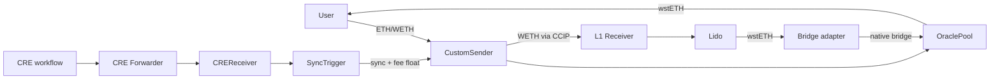

# Lido CCIP Direct Staking — Architecture

This document describes the state expected by the checked-in implementation and
configuration. Use [operations](RUNBOOK.md) to validate a deployment; a configured
address or diagram alone does not establish live ownership or successful delivery.

## Networks and configuration

Optimism, Arbitrum, Base, and Linea share the Ethereum `LidoCustomReceiver` at
`0x6F357d53d6bE3238180316BA5F8f11467e164588`.

| Source | Defines |
| --- | --- |
| `config/state/common.inputs.yaml` | Shared identities and sync policy |
| `config/state/<network>.inputs.yaml` | Lane addresses and fee parameters |
| `config/state/<network>.deployed.yaml` | Pool, SyncTrigger, and CREReceiver addresses |
| `config/state/common.deployed.yaml` | Shared CRE workflow ID |
| `config/state/l2.yaml` | L2 wiring and access-control assertions |
| `config/state/ethereum.inputs.yaml`, `ethereum.yaml` | L1 addresses and assertions |
| `cre-workflows/sync-automation/config.deploy.json` | Workflow lanes, schedules, target, and write budget |

Solidity constants under `script/<network>/` supply fee validation and fork-test
parameters. `just verify-constants-sync` checks their configured mirrors.
Retired addresses in state checks identify accounts that must have no active
privileges; they remain part of the security assertions.

## Components

| Component | Responsibility | Source |
| --- | --- | --- |
| `CustomSenderReferral` | User staking entrypoint; pool and CCIP wiring; access control | `lib/chainlink-csr` |
| `PausableImmutableOraclePool` | Exchanges WETH for wstETH; pause and liquidity recovery | `lib/chainlink-csr` |
| `SyncTrigger` | Timing, amount, fee configuration, and ETH fee float | `src/SyncTrigger.sol` |
| `CREReceiver` | Authenticates reports and dispatches allowed argument-less calls | `src/cre/CREReceiver.sol` |
| CRE workflow | Polls lanes and requests eligible syncs | `cre-workflows/sync-automation/main.ts` |
| CRE Forwarder | Validates DON reports and delivers them to the receiver | Chainlink infrastructure |
| L1 `LidoCustomReceiver` | Receives WETH, stakes through Lido, and invokes the bridge adapter | `lib/chainlink-csr` |
| Lane bridge adapter | Sends wstETH to the originating L2 pool | `lib/chainlink-csr` |

`SyncTrigger`, `CREReceiver`, and the pool are non-upgradeable. The sender and
L1 receiver use proxies controlled through their respective `ProxyAdmin`.
A source dependency is not evidence of an audit; review scope is in
[audit scope](docs/audit-scope.md).

## Ownership and access control

| Holder | Authority |
| --- | --- |
| Lido DAO Agent | L1 receiver admin and L1 ProxyAdmin owner |
| L2 Governance Executor | CustomSender admin, SYNC_ROLE administration, and L2 ProxyAdmin ownership |
| LOL Safe (`l2LiquidityOwner`) | OraclePool ownership: pause, unpause, and sweep |
| Automation Multisig (`l2AutomationOwner`, `creWorkflowOwner`) | SyncTrigger and CREReceiver ownership; CRE workflow ownership |
| SyncTrigger | CustomSender `SYNC_ROLE` |
| CREReceiver | Sole configured caller of `SyncTrigger.triggerSync()` |
| Chainlink CRE Forwarder | Sole configured caller of `CREReceiver.onReport()` |

The Automation Multisig is `0x23AC4BF8ca7345eE533B12705aF40F69060D9b5b`.
The LOL Safe is `0xFc832dA3D688352C0aB1A32136c7fABbB16d66E6`.
These are separate authorities. `SYNC_ROLE` is administered by
`DEFAULT_ADMIN_ROLE`; the implementation does not delegate it to the LOL Safe.

The Automation Multisig controls fees, amounts, delay, trigger forwarder, receiver
forwarder, report author, and allowed calls. It can recover trigger ETH/token
balances and receiver ETH. It does not own the liquidity pool or the sender's
admin role. Governance can revoke `SYNC_ROLE`, change pool/receiver wiring, or
upgrade the sender. The LOL Safe can stop pool activity with `pause()`.

For CRE delivery, all of these must agree:

```text
WorkflowRegistry workflow owner
    = CREReceiver.getExpectedAuthor()
    = configured creWorkflowOwner
```

The registry owner must also be linked to the CRE account. An ACTIVE registry
record is not proof that reports pass the receiver or that a sync completes.

## Value and control flow


```mermaid
flowchart LR
    User -->|ETH/WETH| Sender[CustomSender]
    Sender --> Pool[OraclePool]
    Pool -->|wstETH| User
    Workflow[CRE workflow] --> Forwarder[CRE Forwarder]
    Forwarder --> Receiver[CREReceiver]
    Receiver --> Trigger[SyncTrigger]
    Trigger -->|sync + fee float| Sender
    Sender -->|WETH via CCIP| L1[L1 Receiver]
    L1 --> Lido
    Lido -->|wstETH| Adapter[Bridge adapter]
    Adapter -->|native bridge| Pool
```

The workflow polls each lane hourly, staggered at :00/:15/:30/:45. It submits a
report only when `shouldSyncAmount() > 0` and `canSync()` is true.

- `shouldSyncAmount()` checks elapsed delay and pool WETH, then caps the amount.
- `canSync()` checks SYNC_ROLE, pool availability/pause, and native fee float.
- `triggerSync()` rechecks due-ness, updates the execution timestamp, and calls
  the sender. A revert rolls back that timestamp.

`canSync()` does not quote the live CCIP fee or establish CCIP lane availability,
RMN status, or end-to-end bridge success. Those need [monitoring](docs/monitoring.md).

The receiver authenticates the forwarder and metadata workflow owner. It then
requires an allowed `(target, selector)` and exactly four bytes of calldata.
The production call is `SyncTrigger.triggerSync()`. Workflow name and ID are
not authentication gates. ERC-165 support must include both `IERC165` and the
onReport-only `IReceiver` interface (`0x805f2132`).

## Funds and failure boundaries

The pool holds liquidity; SyncTrigger holds native ETH for fees. The workflow's
CRE account has a separate off-chain credit balance. These balances are not
interchangeable. See [fees](docs/fees.md) and the [LP runbook](docs/runbook-liquidity-provider.md).

A sync fixes its return recipient when the sender creates the message. Changing
the sender's pool does not redirect an already-sent round trip. Track the actual
message recipient when reconciling funds.

An L1 `MessageFailed` event means the receiver's application call failed even
if CCIP delivery succeeded. A successful L1 message still needs return-bridge
completion. See [sync tracking](docs/sync-round-trip-and-finality.md) for the
separate observations and [operations](RUNBOOK.md) for recovery.
