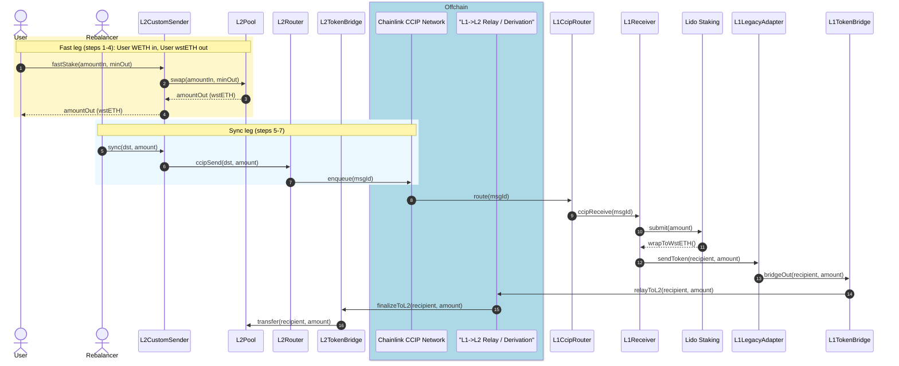
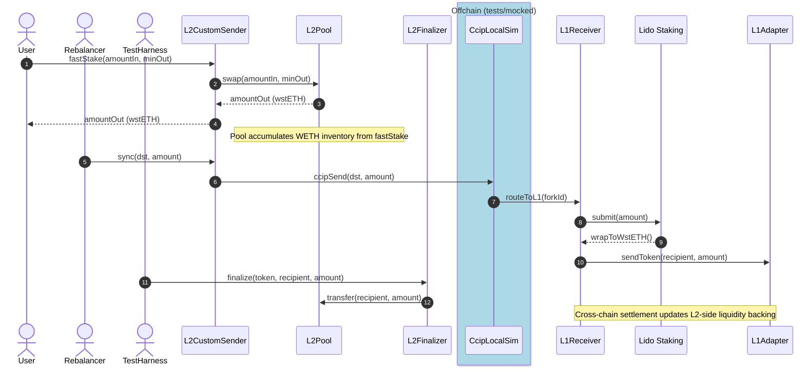

# Diagram Naming Shortcuts

- `L2 CustomSenderReferral` -> `L2CustomSender`
- `L2 PausableImmutableOraclePool` -> `L2Pool`
- `L2 CCIP Router` -> `L2Router`
- Use these labels in future Mermaid diagrams in this repo for consistency.

# Fast Stake Flow

Explorer links:
- L2CustomSender: [0x328de900860816d29D1367F6903a24D8ed40C997](https://optimistic.etherscan.io/address/0x328de900860816d29D1367F6903a24D8ed40C997)
- L2Router: [0x3206695CaE29952f4b0c22a169725a865bc8Ce0f](https://optimistic.etherscan.io/address/0x3206695CaE29952f4b0c22a169725a865bc8Ce0f)
- L1 CCIP Router: [0x80226fc0Ee2b096224EeAc085Bb9a8cba1146f7D](https://etherscan.io/address/0x80226fc0Ee2b096224EeAc085Bb9a8cba1146f7D)
- L1 LidoCustomReceiver: [0x6F357d53d6bE3238180316BA5F8f11467e164588](https://etherscan.io/address/0x6F357d53d6bE3238180316BA5F8f11467e164588)
- L1 OptimismLegacyAdapterL1toL2: [0x328de900860816d29D1367F6903a24D8ed40C997](https://etherscan.io/address/0x328de900860816d29D1367F6903a24D8ed40C997)
- L1 wstETH Token Bridge: [0x76943C0D61395d8F2edF9060e1533529cAe05dE6](https://etherscan.io/address/0x76943C0D61395d8F2edF9060e1533529cAe05dE6)
- L2ERC20ExtendedTokensBridge: [0x8E01013243a96601a86eb3153F0d9Fa4fbFb6957](https://optimistic.etherscan.io/address/0x8E01013243a96601a86eb3153F0d9Fa4fbFb6957)
- OP Stack L1->L2 Relay / Derivation: offchain process (no single contract address)

## Why `OptimismLegacyAdapterL1toL2` Is Used

- This deployment uses Lido's dedicated L1 token bridge (`0x76943C0D61395d8F2edF9060e1533529cAe05dE6`) and therefore uses `OptimismLegacyAdapterL1toL2`, which is wired to `IOptimismL1ERC20TokenBridge`.
- The deployment script explicitly instantiates the legacy adapter for the Optimism lane:
  - `lib/chainlink-csr/script/lido/LidoDeploy.s.sol`
  - `lib/chainlink-csr/script/lido/LidoParameters.sol`
- "Legacy" here means the adapter targets the older/custom token-bridge interface, not that it is inactive.

### Modern Equivalent

- The modern OP-stack approach is an adapter against `L1StandardBridge` (`depositERC20To` on standard bridge ABI).
- In this repo, `OptimismAdapterL1toL2` (non-legacy) is not implemented yet.
- `lib/chainlink-csr/contracts/adapters/BaseAdapterL1toL2.sol` is the closest in-repo example of the standard-bridge adapter style.

# Fast Staking Test Flow

## Summary

- `fastStake` gives the user immediate output on L2 via local pool liquidity.
- WETH collected in the L2 pool is later sent by `sync` through CCIP.
- On L1, the receiver stakes into Lido, dispatches through the adapter, and the bridged `wstETH` replenishes `L2Pool`.
