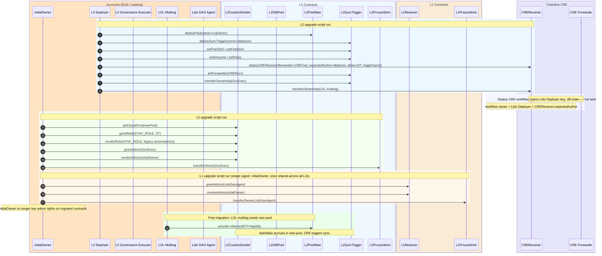

# Goal

Migrate Direct Staking ownership, admin roles, and liquidity management to Lido governance across four L2 networks (Optimism, Arbitrum, Base, Linea), deploying new pool and sync infrastructure and replacing Chainlink Automation with CRE workflows.

**Networks:** Optimism, Arbitrum, Base, Linea — all sharing a single L1 Receiver on Ethereum (`0x6F357d53d6bE3238180316BA5F8f11467e164588`).

**Contracts mutated** (per network):
- **L1** (shared): `LidoCustomReceiver` — admin → Lido DAO Agent; `ProxyAdmin` — owner → Lido DAO Agent
- **L2**: `CustomSenderReferral` — admin → L2 Governance Executor, oracle pool swapped, legacy automation(s) revoked from `SYNC_ROLE`; `ProxyAdmin` — owner → L2 Governance Executor; old `OraclePool` — no longer wired into the sender, ownership unchanged: Initial Liquidity Owner `0x2897A1…b18c` retains full control via `sweep()` to settle pre-migration liquidity and any wstETH that lands from a sync round-trip in flight at the migration boundary (the round-trip's recipient pool is fixed at `sync()`-time and immutable thereafter, so in-flight wstETH lands in the **old** pool and is recovered by its owner via `sweep()` — see [`DOC.md` §5.1](DOC.md#51-in-flight-round-trips-are-correct-by-design)). LOL multisig owns only the **new** pool.

**Contracts deployed** (per network): new `OraclePool`, `SyncTrigger`, `CREReceiver`

# Migration runbook

The step-by-step operator procedure — pre-live checks, the live run, and post-migration validation — lives in **[`RUNBOOK.md`](RUNBOOK.md)** (a concise 3-phase checklist with explicit gates `G1–G4` and the exact `just -E .env.<network> …` recipes). This README is the **reference** behind that recipe: fee parameters, the CRE workflow, tests, monitoring, and per-call levers.

> **Recipe ≠ run ≠ state.** [`RUNBOOK.md`](RUNBOOK.md) is the *recipe* (what an operator runs); the broadcast transactions are the *run*; [`DOC.md`](DOC.md) describes the *resulting state* (final ownership and roles). This README explains *why* the recipe's values and checks are what they are — it is not itself the procedure.

# Migration Sequence (Production)




# Sync fee parameters (FeeOtoD / FeeDtoO)

The sync operation moves accumulated WETH from an L2 OraclePool to Ethereum (via CCIP), stakes it through Lido, and bridges the resulting wstETH back to the L2 pool. Two encoded fee blobs govern the costs of each leg:

| Fee blob | Direction | What it pays for | Set by |
|----------|-----------|------------------|--------|
| **FeeOtoD** | L2 → Ethereum (CCIP) | CCIP message delivery + `ccipReceive` execution on Ethereum | `SyncTrigger.setFeeOtoD()` |
| **FeeDtoO** | Ethereum → L2 (native bridge) | L1 adapter bridge call that sends wstETH back to L2 | `SyncTrigger.setFeeDtoO()` |

## How fees flow through the system

```
SyncTrigger.triggerSync()
  │  reads _feeOtoD, _feeDtoO from storage
  │  calculates native ETH needed: sum of non-LINK fee amounts
  │
  ├─► CustomSender.sync{value: nativeETH}(destSelector, amount, feeOtoD, feeDtoO)
  │     │  decodes feeDtoO → pulls fee tokens (ETH or LINK) from caller
  │     │  decodes feeOtoD → extracts maxFee, payInLink, gasLimit
  │     │  packs feeDtoO into CCIP message data alongside recipient + amount
  │     │
  │     └─► CCIP Router.ccipSend()  ← pays feeOtoD here
  │           │  routes message to Ethereum
  │           │
  │           └─► LidoCustomReceiver.ccipReceive()  ← gasLimit governs this execution
  │                 │  unpacks feeDtoO from message data
  │                 │  stakes ETH in Lido → receives wstETH
  │                 │
  │                 └─► L1 Adapter.sendToken(wstETH, feeDtoO)  ← pays feeDtoO here
  │                       │  decodes feeDtoO per network format
  │                       └─► native bridge (Arbitrum Gateway / OP Bridge / Linea Bridge)
  │                             └─► wstETH arrives on L2 pool
```

## FeeOtoD encoding (CCIP, all networks)

Encoded with `FeeCodec.encodeCCIP(maxFee, payInLink, gasLimit)` — 21 bytes.

| Field | Type | Description |
|-------|------|-------------|
| `maxFee` | `uint128` | Slippage guard — reverts if actual CCIP fee exceeds this. Only the actual fee is charged; excess is not spent. |
| `payInLink` | `bool` | `true` = pay in LINK (~10% discount), `false` = pay in native ETH. |
| `gasLimit` | `uint32` | Gas budget for `ccipReceive()` on Ethereum. Must be >= 75,000 (enforced by `CustomSender`). Covers: unpack message → Lido stake → adapter bridge call. |

**Sizing `gasLimit`:** The receiver must unpack the message, stake ETH through Lido, approve wstETH, and delegate-call the bridge adapter. Current configured value is **1,000,000** for Optimism/Arbitrum/Base and **500,000** for Linea (each network bumped +25% from its prior baseline as a Glamsterdam pre-hardening — see [§Glamsterdam fee headroom bump](#glamsterdam-fee-headroom-bump-may-2026)). If too low, the CCIP message enters a failed state and requires [manual re-execution](https://docs.chain.link/ccip/concepts/manual-execution) with a higher gas limit.

**Sizing `maxFee`:** Query `IRouterClient.getFee()` off-chain and add a 10–20% buffer for gas price fluctuation. Current configured value is **0.125 ETH** across all networks. Excess (`maxFee − actualFee`) is fully refunded on L2 by `TokenHelper.refundExcessNative`, so the cap only costs gas at the moment of the send, not over the sync's lifetime.

## FeeDtoO encoding (network-specific)

Each L2 network uses a different L1→L2 bridge with its own fee model. The L1 adapter decodes FeeDtoO and calls the native bridge accordingly.

### Arbitrum — `FeeCodec.encodeArbitrumL1toL2(maxSubmissionCost, maxGas, gasPriceBid)` — 29 bytes

| Field | Type | Description |
|-------|------|-------------|
| `maxSubmissionCost` | `uint128` | Base cost for creating a retryable ticket on L2. If too low, the L1 transaction reverts. |
| `maxGas` | `uint32` | Gas limit for L2 auto-redemption of the retryable ticket. |
| `gasPriceBid` | `uint64` | L2 gas price bid. If below L2 base fee, auto-redemption fails (ticket can be manually redeemed within ~7 days). |

Total ETH required: `feeAmount = maxSubmissionCost + (gasPriceBid × maxGas)`. Excess is refunded on L2.

Current values: `maxSubmissionCost=0.001 ETH`, `maxGas=100,000`, `gasPriceBid=0.05 gwei`.

### Optimism / Base — `FeeCodec.encodeOptimismL1toL2(l2Gas)` / `encodeBaseL1toL2(l2Gas)` — 21 bytes

| Field | Type | Description |
|-------|------|-------------|
| `feeAmount` | `uint128` | Always **0**. The adapter reverts if non-zero. Bridge cost is paid implicitly via L1 gas burn. |
| `l2Gas` | `uint32` | Minimum gas guaranteed for L2 deposit execution. L2 gas is not refundable — if too low, the deposit fails with **no recovery mechanism**. |

Current value: `l2Gas=100,000`.

### Linea — `FeeCodec.encodeLineaL1toL2()` — 17 bytes

| Field | Type | Description |
|-------|------|-------------|
| `feeAmount` | `uint128` | Always **0**. Linea sponsors the postman fee for L1→L2 messages under 250,000 gas. |

No additional parameters. The adapter reverts if `feeAmount != 0` or `payInLink == true`.

## Current mainnet values

| Parameter | Optimism | Arbitrum | Base | Linea |
|-----------|----------|----------|------|-------|
| **FeeOtoD maxFee** | 0.125 ETH | 0.125 ETH | 0.125 ETH | 0.125 ETH |
| **FeeOtoD payInLink** | false | false | false | false |
| **FeeOtoD gasLimit** | 1,000,000 | 1,000,000 | 1,000,000 | 500,000 |
| **FeeDtoO format** | Optimism L1→L2 | Arbitrum L1→L2 | Base L1→L2 | Linea L1→L2 |
| **FeeDtoO feeAmount** | 0 | ~0.001 ETH* | 0 | 0 |
| **FeeDtoO l2Gas / maxGas** | 100,000 | 100,000 | 100,000 | — |

\* Arbitrum `feeAmount = maxSubmissionCost + gasPriceBid × maxGas = 0.001e18 + 0.05 gwei × 100,000 ≈ 1.005e15 wei ≈ 0.001005 ETH`.

## Glamsterdam fee headroom bump (May 2026)

The `FeeOtoD` values above include a **+25% pre-emptive bump** from the prior production baseline (`maxFee = 0.1 ETH`; `gasLimit = 800k` for Optimism/Arbitrum/Base, `400k` for Linea). The bump is a one-shot hardening ahead of the Ethereum **Glamsterdam** upgrade, which ships [EIP-7904](https://eips.ethereum.org/EIPS/eip-7904) (compute opcode repricing) and [EIP-8038](https://eips.ethereum.org/EIPS/eip-8038) (state-access repricing) on L1.

### Why `gasLimit` needs more headroom

The L1 work bounded by `_feeOtoD.gasLimit` (`LidoCustomReceiver.ccipReceive` → `processMessage`) is dominated by exactly the opcodes Glamsterdam reprices:

- **EIP-8038** raises `GAS_COLD_SLOAD`, `GAS_COLD_ACCOUNT_ACCESS`, and the storage-update base. The receiver path performs many cold accesses: CSR storage namespaces, AccessControl role mappings, WETH → Lido `stETH.submit` (cold reads against `BUFFERED_ETHER`, total shares, recipient shares), wstETH wrap, the bridge adapter `delegatecall`, and the per-network L1 bridge endpoint (Optimism `L1ERC20TokenBridge`, Arbitrum `L1GatewayRouter`, Base `L1StandardBridge`, Linea `L1MessageService`).
- **EIP-7904** raises `KECCAK256` (+50%) and a few precompiles. Mild on this path (no pairings, no KZG), but every storage-slot derivation, role hash, and message envelope hash gets the +50% bump.
- Conservative estimate of impact on `processMessage`: **+15–25%** of current actual gas usage. The 25% bump preserves the 80% utilization headroom targeted by the alert in [Monitoring & alerts §5](#5-capacity--headroom--medium).

`_feeDtoO` is **not** affected by these EIPs because it budgets L2 execution (Optimism/Base `l2Gas`, Linea postman, Arbitrum `maxGas × gasPriceBid`) — each L2 follows its own gas schedule, not L1's. Arbitrum's `maxSubmissionCost` is paid as L1 `msg.value` to the Inbox; excess is refunded on L2.

### Why `maxFee` is bumped too (and why it doesn't increase per-sync cost)

- CCIP's actual fee scales **linearly with `gasLimit`**: `fee ≈ baseFee + premium + gasLimit × destChainGasPrice × tokenConversion`. A 25% `gasLimit` bump raises the actual fee by the same 25% at any given L1 gas price.
- `maxFee` is a safety cap on the L2 send (`CCIPSenderUpgradeable.sol:82`). Bumping it 0.1 → 0.125 ETH preserves the spike-protection multiplier that the prior `maxFee` provided against the prior `gasLimit` (i.e., keeps the same "headroom over typical fee" ratio).
- Excess (`maxFee − actualFee`) is **fully refunded** to the SyncTrigger by `TokenHelper.refundExcessNative` after every send (`CustomSender.sol:208`). So `maxFee` bloat costs **zero per-sync ETH** — only larger transient float locked up for the duration of one transaction.

### Cost framing

| Dimension | Real per-sync cost? | Why |
|---|---|---|
| `gasLimit` bloat (+25%) | **Yes** | CCIP OffRamp is paid for the L1 gas commitment whether or not the receiver uses it all; unused gas is the executor's margin |
| `maxFee` bloat (+25%) | No (zero) | Refunded by `refundExcessNative`; only locks ETH transiently inside one tx |

Order-of-magnitude on the `gasLimit` bump: ~$5–10 per sync × 8 syncs/day across 4 chains ≈ **$50–100/day**. Trade is favorable against the alternative — a post-hard-fork cliff where every sync OOGs in `processMessage`, the defensive catch stores `failedHashes[messageId]`, funds (WETH and Arbitrum's `feeAmountDtoO`) sit at `LidoCustomReceiver` until manual `retryFailedMessage`, and user-facing wstETH liquidity erodes on each L2.

### Operational handoff

- Constants live in `script/<net>/<Net>MigrationConstants.sol` (`L2_SYNC_DESTINATION_MAX_FEE`, `L2_SYNC_DESTINATION_GAS_LIMIT`).
- New SyncTrigger deploys pick up the values via `L2UpgradeActions.configureSyncTrigger` → `setFeeOtoD`.
- For SyncTriggers already deployed before the bump, the lever is GovExec-only `setFeeOtoD` (per [Per-call levers (DOC.md §3)](DOC.md#3-access-control--ownership--the-final-state)); the encoded bytes are pinned in `script/<net>/state-mate/<net>.yaml` so any future bump must update the yaml in lockstep with the on-chain change.
- The byte-for-byte fee encodings live in `script/<net>/state-mate/<net>.yaml` (derivation comments inline) and are produced by `FeeCodec` in `lib/chainlink-csr`; refund mechanics, failure modes, and per-network differences are in the [Failure modes and recovery](#failure-modes-and-recovery) and [L1→L2 vs L2→L1](#l1l2-vs-l2l1--why-the-two-legs-differ) sections above.

## Sync thresholds & cadence — why these values

`SyncTrigger` gates *when* and *how much* each sync moves (identical on all four lanes). Changing the amounts/delay is a GovExec action (`setAmounts` / `setDelay`); the cron lives in the CRE workflow config.

| Param | Value | Why this value / turn-the-dial |
| --- | --- | --- |
| `L2_SYNC_MIN_AMOUNT` | 5 WETH | Floor below which `shouldSync()` is false. Keeps round-trip fees a sub-percent fraction of the synced amount; too low → fees become a yield drag; too high → deposits sit idle missing Lido yield. |
| `L2_SYNC_MAX_AMOUNT` | 100 WETH | Per-sync cap (residual stays for the next sync). Bounds CCIP fee exposure, Lido `submit` impact, and in-flight L1→L2 bridge exposure to ≤100 wstETH. Too low → many small syncs, more overhead. |
| `L2_SYNC_DELAY` | 12 h | Min wall-clock between syncs — ≤2 paid syncs/day/lane, roughly aligned with Lido's daily oracle cadence. Shorter → ~12× more fees; longer → larger idle balances / tail risk. Doubles as the migration cutover quiet-window. |
| CRE cron | `*/5 * * * *` | DON *evaluation* cadence (most ticks return false — a cheap staticcall), not action cadence. 5 min = 1/144 of the 12 h delay → ≤5 min latency once a sync is due. Tighter → ~5× DON cost; looser → added post-delay latency. |

## L1→L2 vs L2→L1 — why the two legs differ

The forward leg (L2→L1, `FeeOtoD`) uses **Chainlink CCIP**; the return leg (L1→L2, `FeeDtoO`) uses each L2's **native bridge**. They are not symmetric:

| Aspect | L2→L1 (CCIP, `FeeOtoD`) | L1→L2 (native, `FeeDtoO`) |
|---|---|---|
| Fee paid by | L2 caller at send time | OP/Base: sequencer (free); Arbitrum: L1 receiver via `msg.value`; Linea: postman (free) |
| Excess refund | `maxFee` excess refunded; the gas commitment is **not** | OP/Base: n/a; Arbitrum: excess refunded on L2; Linea: n/a |
| Failure / recovery | Defensive catch at L1 receiver → `retryFailedMessage` (anyone) | OP/Base: L2 deposit revert; Arbitrum: stuck retryable (≤7-day manual-redeem, then lost); Linea: re-claim |
| Time to deliver | ~20 min (CCIP SLA) | OP/Base ~1–3 min; Arbitrum ~1–15 min; Linea ~5–30 min |
| Affected by L1 EIPs (7904/8038)? | **Yes** — `gasLimit` budgets L1 work | No — budgets L2 work |

**Why not CCIP both ways?** Native L1→L2 bridges are cheaper (sequencer-subsidized or postman-free), faster (minutes vs ~20 min), and run on the L2's own trust — no extra committee dependency. CCIP earns its place on the *harder* L2→L1 direction, where it provides a programmable receiver that orchestrates the stake + bridge-back and carries the encoded `FeeDtoO`.

## Failure modes and recovery

| Leg | Failure | Cause | Recovery |
|-----|---------|-------|----------|
| CCIP (OtoD) | `CCIPSenderExceedsMaxFee` revert | `maxFee` too low vs actual CCIP fee | Increase `maxFee`, retry |
| CCIP (OtoD) | `ccipReceive` out of gas | `gasLimit` too low for stake + bridge | [Manual re-execution](https://docs.chain.link/ccip/concepts/manual-execution) with higher gas |
| Arbitrum (DtoO) | L1 tx reverts | `maxSubmissionCost` too low | Increase and retry |
| Arbitrum (DtoO) | Auto-redeem fails | `maxGas` or `gasPriceBid` too low | Manual redeem within ~7 days via [Arbitrum retryable dashboard](https://retryable-dashboard.arbitrum.io/) |
| Optimism/Base (DtoO) | L2 deposit execution fails | `l2Gas` too low | **No recovery** — funds can be lost. Size conservatively with 20%+ buffer. |
| Linea (DtoO) | Postman won't deliver | Message uses >250k gas without fee | Manual claim or provide fee |

## References

- [CCIP gasLimit optimization](https://docs.chain.link/ccip/tutorials/evm/ccipreceive-gaslimit)
- [CCIP billing](https://docs.chain.link/ccip/billing)
- [CCIP manual execution](https://docs.chain.link/ccip/concepts/manual-execution)
- [Arbitrum L1→L2 messaging](https://docs.arbitrum.io/how-arbitrum-works/arbos/l1-l2-messaging)
- [Optimism deposit flow](https://docs.optimism.io/stack/transactions/deposit-flow)
- [Linea message service](https://docs.linea.build/get-started/concepts/message-service)

# CRE Workflow (replaces Chainlink Automation)

Pool rebalancing is triggered by a CRE (Chainlink Runtime Environment) TypeScript workflow instead of Chainlink Automation (CLA). The workflow runs on Chainlink's Decentralized Oracle Network (DON) as compiled WASM.

## Architecture

```
CRE DON (TypeScript/WASM, off-chain)
  ├── CronCapability trigger (every 5 minutes)
  ├── EVMClient.callContract() → SyncTrigger.shouldSync()
  ├── If syncNeeded:
  │   ├── Encode triggerSync() calldata
  │   ├── Wrap in abi.encode(target, data) for CREReceiver
  │   ├── runtime.report() → sign with ECDSA/Keccak256
  │   └── EVMClient.writeReport() → CRE Forwarder
  │
CRE Forwarder (on-chain, verifies signatures)
  └── CREReceiver.onReport(metadata, report)
      └── SyncTrigger.triggerSync()
          └── CustomSender.sync() → CCIP → L1
```

## Files

| Path                                                         | Purpose                                                              |
| ------------------------------------------------------------ | -------------------------------------------------------------------- |
| `src/cre/CREReceiver.sol`                                    | On-chain receiver — decodes reports and calls target contracts       |
| `src/cre/interfaces/IReceiver.sol`                           | CRE receiver interface                                               |
| `cre-workflows/sync-automation/main.ts`                      | CRE workflow entry point                                             |
| `cre-workflows/sync-automation/encoding.ts`                  | Pure encoding/decoding helpers (testable outside WASM)               |
| `cre-workflows/sync-automation/abi.ts`                       | SyncTrigger ABI definitions                                          |
| `cre-workflows/sync-automation/config.deploy.<network>.json` | Per-network production config (Optimism, Arbitrum, Base, Linea)      |
| `cre-workflows/sync-automation/config.deploy.json`           | Base production config (Optimism defaults)                           |
| `cre-workflows/sync-automation/config.simulate.json`         | Local simulation config                                              |
| `cre-workflows/sync-automation/config.test.json`             | Testnet config (Optimism Sepolia)                                    |

## Setup

```sh
# Install CRE workflow dependencies (requires Bun on PATH)
just setup-cre

# Run TypeScript tests
just test-cre-workflow
```

## Deployment

CREReceiver is deployed per L2 network as part of Stage 1 `runDeploy` (which also configures `SyncTrigger.setForwarder(CREReceiver)` and pins `expectedAuthor` to the Lido Deployer). Workflow deployment happens immediately after `runDeploy`, before Stage 2:

1. Rewrite `config.deploy.<network>.json` with the deployed addresses — `just -E .env.<network> update-cre-config <network> "$L2_SYNC_TRIGGER" "$L2_CRE_RECEIVER"`.
2. Deploy the workflow: `just -E .env.<network> deploy-cre-workflow <network>`.
3. Repeat for each network (Optimism, Arbitrum, Base, Linea).
4. Monitor at `cre.chain.link/workflows`.

See [Per-call levers (DOC.md §3)](DOC.md#3-access-control--ownership--the-final-state) for CREReceiver admin functions.

## Funding and billing

Two distinct concerns; the migration scripts touch neither, by design.

- **Lido Deployer wallet (one-time, negligible).** ETH on Ethereum Mainnet for `WorkflowRegistry` transactions (`cre workflow deploy` / `pause` / `activate` / `delete`) — sub-cent gas per call. No L2 balance required.
- **Workflow execution credits (ongoing).** CRE bills DON execution as opaque "CRE credits" tracked on the [CRE dashboard](https://cre.chain.link/workflows), not as a LINK-funded on-chain balance. The CRE CLI exposes **no** `fund` / `deposit` / `withdraw` / `balance` commands. During Early Access (verified April 2026), credit allocation is administrative — coordinate with Chainlink when the dashboard balance approaches the agreed threshold. Re-verify before GA.

Alert on the credit balance per [Monitoring & alerts §4](#4-cre-workflow-health--high).

## CRE platform levers (workflow lifecycle)

The sync workflow is off-chain WASM on Chainlink's CRE platform; its only on-chain footprint is `WorkflowRegistry 2.0.0` (Ethereum mainnet, `0x4Ac5…E7e5`), which holds no funds. Lifecycle is controlled by the Lido Deployer's CRE account:

| Action | Caller | Effect |
|---|---|---|
| `cre workflow deploy` | Lido Deployer | Compile + register (or `upsertWorkflow` on re-deploy with same name) |
| `cre workflow pause` / `activate` | Lido Deployer | Stop / start DON execution |
| `cre workflow delete` | Lido Deployer | Retire the workflow |
| `cre account link-key` / `unlink-key` | Lido Deployer | Associate / disassociate a wallet (owner-gated) |
| cron tick (every 5 min) | CRE DON | Runs the WASM; signs a report if `shouldSync()` is true |

- The owner's EVM address is propagated into every report as `metadata.workflowOwner` (bytes `[42:62]`); `CREReceiver._extractWorkflowOwner` reads it and, if `expectedAuthor != 0`, the two must match.
- Updating the WASM under the same owner key does **not** change `metadata.workflowOwner`, so `expectedAuthor` keeps accepting reports after a routine code update.
- Rotating the workflow-owner key requires the LOL multisig to call `CREReceiver.setExpectedAuthor(newOwner)` on every L2 (4 txs).
- CRE-side pause is instant but depends on Chainlink infra; the authoritative kill switches are on-chain — `LOL → CREReceiver.setForwarder(0)` and `GovExec → SyncTrigger.setForwarder(0)` / `setDelay(max)`. Neither the CRE DON nor the Forwarder is controllable by this project.

# Script reference (direct `forge script` / debugging)

The operator procedure is in **[`RUNBOOK.md`](RUNBOOK.md)**. This table is only the network → script-path mapping for direct `forge script` invocations or debugging. The L1 `LidoCustomReceiver` is one contract shared by all four lanes, so its admin migration is shared — `script/l1/L1UpgradeScript.s.sol:L1UpgradeScript`, run once via `just migrate-l1`.

| Network  | L2 Script                                                          | Env file        |
|----------|--------------------------------------------------------------------|-----------------|
| Optimism | `script/optimism/OptimismL2Upgrade.s.sol:OptimismL2UpgradeScript`  | `.env.optimism` |
| Arbitrum | `script/arbitrum/ArbitrumL2Upgrade.s.sol:ArbitrumL2UpgradeScript`  | `.env.arbitrum` |
| Base     | `script/base/BaseL2Upgrade.s.sol:BaseL2UpgradeScript`              | `.env.base`     |
| Linea    | `script/linea/LineaL2Upgrade.s.sol:LineaL2UpgradeScript`           | `.env.linea`    |

# Tests

## Pool upgrade tests (fork-based)

- Shared harness:
  - `test/helpers/UpgradeTestBase.sol`
  - `test/helpers/PoolUpgradeTests.sol`
- Network-specific suites (17 tests each):
  - `test/OptimismPoolUpgrade.t.sol`
  - `test/ArbitrumPoolUpgrade.t.sol`
  - `test/BasePoolUpgrade.t.sol`
  - `test/LineaPoolUpgrade.t.sol`
- Network-specific bases:
  - `test/helpers/OptimismUpgradeTestBase.sol`
  - `test/helpers/ArbitrumUpgradeTestBase.sol`
  - `test/helpers/BaseUpgradeTestBase.sol`
  - `test/helpers/LineaUpgradeTestBase.sol`
- Coverage includes: L1/L2 role and ownership migration, fast/slow stake behavior after pool swap, old pool isolation, liquidity provision/sweep, and sync path across CCIP routing.

```sh
# All networks (requires L1_RPC_URL + respective L2 RPC)
forge test

# Individual networks
just test-optimism-upgrade
just test-arbitrum-upgrade
```

Notes:
- Each fork suite requires a working `L1_RPC_URL` and the corresponding `L2_*_RPC_URL`.
- `just test-arbitrum-upgrade` prefers `LOCAL_L2_ARBITRUM_RPC_URL` when present and otherwise falls back to `L2_ARBITRUM_RPC_URL`.

## CRE tests

- `test/CREReceiverTest.t.sol` — 25 unit tests for the CREReceiver contract (no fork required)
- `test/CREIntegrationTest.t.sol` — 8 fork-based integration tests per network (Optimism, Arbitrum, Base, Linea = 32 total), covering the full CRE Forwarder → CREReceiver → SyncTrigger → sync path
- `test/helpers/CREIntegrationTests.sol` — shared CRE test logic (same pattern as `PoolUpgradeTests.sol`)
- `cre-workflows/sync-automation/main.test.ts` — 11 TypeScript tests for workflow encoding/decoding logic

```sh
# Unit tests only (no RPC required)
just test-cre-receiver

# Integration tests (requires L1_RPC_URL + L2_OPTIMISM_RPC_URL)
just test-cre-integration

# All Solidity CRE tests
just test-cre

# TypeScript workflow tests
just test-cre-workflow

# Everything (Solidity + TypeScript)
just test-cre-all
```

Note: the workflow tests shell out to `bun test`, so Bun must be installed and available on `PATH`.

## Optimism state-mate command split

The upgrade-state flow is split into dedicated commands:
- `just test-optimism-upgrade-state-migrate [rpc_url]`
- `just test-optimism-upgrade-state-update-config [rpc_url]`
- `just test-optimism-upgrade-state-verify` — reads `L2_RPC_URL` (or legacy `L2_STATE_MATE_RPC_URL` / `LOCAL_L2_OPTIMISM_RPC_URL` / `L2_OPTIMISM_RPC_URL`) from env; no positional

And one glue command that runs all phases on a dedicated nested fork:
- `just test-optimism-upgrade-state`

Purpose of each phase:
- `migrate`: executes `OptimismL2UpgradeScript` against the target RPC and persists migration outputs.
- `update-config`: regenerates `script/optimism/state-mate/optimism.yaml` from template.
- `verify`: runs `state-mate` checks against an arbitrary RPC.

Required env:
- `L2_LIDO_DEPLOYER_PRIVATE_KEY`
- `L2_GOVERNANCE_EXECUTOR`

RPC env:
- For `test-optimism-upgrade-state`: one upstream source: `L2_STATE_MATE_UPSTREAM_RPC_URL` or `LOCAL_L2_OPTIMISM_RPC_URL` or `L2_OPTIMISM_RPC_URL`.
- For split commands: pass `[rpc_url]`, or set `L2_STATE_MATE_RPC_URL` (fallback: migration output file, then `LOCAL_L2_OPTIMISM_RPC_URL`, `L2_OPTIMISM_RPC_URL`).

Optional env:
- `L2_LIQUIDITY_OWNER` (defaults to `L2_GOVERNANCE_EXECUTOR`)
- `INITIAL_OWNER_PRIVATE_KEY` (if omitted, migration uses unlocked/impersonated `INITIAL_OWNER` on anvil-compatible RPCs)
- `INITIAL_OWNER` (defaults to `OptimismMigrationConstants.INITIAL_OWNER`)
- `L2_STATE_MATE_FORK_PORT` (default: `8651`)
- `L2_STATE_MATE_OUTPUT_FILE` (default: `/tmp/optimism-l2-state-mate.env`)
- `L2_STATE_MATE_SYNC_TRIGGER` (needed for `update-config` if not available in output file)

Run all phases on dedicated fork:

```sh
just test-optimism-upgrade-state
```

Operational notes:
- The glue command prefers `L2_STATE_MATE_UPSTREAM_RPC_URL`, then `LOCAL_L2_OPTIMISM_RPC_URL`, then `L2_OPTIMISM_RPC_URL`.
- If `LOCAL_L2_OPTIMISM_RPC_URL` is set but no local fork is listening there, the nested Anvil fork will fail to start; either run `just rpc-start-l2-optimism` first or override `L2_STATE_MATE_UPSTREAM_RPC_URL`.
- `test-optimism-upgrade-state-update-config` rewrites the tracked file `script/optimism/state-mate/optimism.yaml`, so expect a worktree diff after running it.

## Test layers (overview)

Four independent layers of pre-prod validation, increasing in realism:

| Layer | Exercises | Recipe |
| --- | --- | --- |
| Forge fork tests + Chainlink Local CCIP simulator | Per-network L2/L1 migration logic + CCIP routing + CRE allow-list against mainnet forks | `just test-acceptance`, `just test-<net>-upgrade`, `just test-cre-integration` |
| state-mate post-condition diff | ≥45 live-RPC assertions per network vs canonical `*.yaml` | `just test-<net>-upgrade-state-verify` |
| Per-network anvil-fork dress rehearsal (below) | The exact `deploy-stage1 → verify-stage1 → migrate-stage2 → state-verify` recipe sequence on an anvil fork of one L2 + L1 | manual (below) |
| Sepolia rehearsal | Real Sepolia + Optimism Sepolia, same script shape | the `sepolia-*` recipes in the `justfile` |

## CCIP fork simulation (Chainlink Local)

The pool-upgrade end-to-end test (`test_upgradeSyncRoutesAcrossL2AndL1CCIPLayer`) drives a real CCIP round-trip across L1/L2 forks via the Chainlink Local simulator: create both forks, `makePersistent` the `CCIPLocalSimulatorFork`, register chain details, `fastStake` to accrue WETH, `sync()` with `recordLogs`, route the message to L1, then assert the receiver stakes + the adapter dispatch event fires.

**Why the test carries its own v1.6 router (`test/helpers/CCIPv16ForkRouter.sol`).** `lib/chainlink-local` is pinned at v0.2.3, whose `switchChainAndRouteMessage` matches **only** the legacy v1.5 OnRamp event (`CCIPSendRequested`). The Arbitrum/Base/Optimism mainnet L2→L1 lanes have migrated to CCIP **v1.6** (`CCIPMessageSent` — a different topic), so the simulator silently fails to decode, the receiver never runs, and `_assertAndGetAdapterDispatch` fails. Linea still works (still v1.5). Bumping to v0.2.5+ isn't viable: those versions expect `@chainlink/contracts-ccip` import paths that conflict with `chainlink-csr`'s remapping. The helper papers over this for v1.6 lanes by `deal`-ing the destination tokens and calling `ccipReceive` directly via `vm.prank(L1_CCIP_ROUTER)` — same `msg.sender` + message struct the receiver would see from a real off-ramp. If `chainlink-local` is ever bumped to ≥v0.2.5 (and import paths reconciled), delete the helper and restore the direct simulator call.

## Per-network anvil-fork dress rehearsal

Distinct from `just test-acceptance` (which runs the combined Stage 1+2 across all four networks at once), this exercises the **exact recipe sequence** an operator runs on mainnet — `deploy-stage1 → verify-stage1 → migrate-stage2 → test-<net>-upgrade-state-verify` — against an anvil fork of one L2 + Ethereum mainnet. It confirms the recipes wire env/args correctly end-to-end, that Stage-1 broadcast-JSON parsing emits the right `export` addresses, and that the canonical state-mate template renders + passes against the post-migration fork. The walkthrough uses **Linea** (substitute the network + its `script/<net>/<Net>MigrationConstants.sol` to rehearse the others).

**Prereqs:** `.env` with `L1_RPC_URL` + `L2_LINEA_RPC_URL`; `L2_LIDO_DEPLOYER_PRIVATE_KEY` (any funded EOA works on a fork — anvil dev key `0xf39F…2266` is the convention); `forge`/`cast`/`anvil`/`jq`/`yq`/`node`/`yarn`; `lib/state-mate/node_modules` populated (`corepack yarn install --immutable` inside `lib/state-mate`).

**0. Read-only sanity (no fork yet)** — all green before there is any value in rehearsing:

```sh
forge test --match-contract 'LineaPoolUpgradeTest|LineaCREIntegrationTest' --fork-url "$L2_LINEA_RPC_URL" -vv
just verify-constants-sync
just -E .env.linea preflight-check
just -E .env.linea preflight-check-l1
```

**1. Spawn forks** (L1 on :8650, Linea on :8651) and fund the three actors:

```sh
anvil --silent --auto-impersonate -p 8650 -f "$L1_RPC_URL"       >/tmp/rehearsal-l1.log 2>&1 &
anvil --silent --auto-impersonate -p 8651 -f "$L2_LINEA_RPC_URL" >/tmp/rehearsal-l2.log 2>&1 &
until cast chain-id --rpc-url http://127.0.0.1:8650 >/dev/null 2>&1 \
   && cast chain-id --rpc-url http://127.0.0.1:8651 >/dev/null 2>&1; do sleep 1; done
DEPLOYER=0xf39Fd6e51aad88F6F4ce6aB8827279cffFb92266       # Lido Deployer (L2_LIDO_DEPLOYER_PRIVATE_KEY)
INITIAL_OWNER=0xb5c336a5c60D3482b29d83C742C65AE8351b91a8  # cold key holder, impersonated on the fork
LIDO_DAO_AGENT=0x3e40D73EB977Dc6a537aF587D48316feE66E9C8c # L1 admin recipient
for url in http://127.0.0.1:8650 http://127.0.0.1:8651; do
  for a in "$DEPLOYER" "$INITIAL_OWNER" "$LIDO_DAO_AGENT"; do
    cast rpc --rpc-url "$url" anvil_setBalance "$a" 0x3635C9ADC5DEA00000 >/dev/null; done; done
```

Expected: chain-id on :8650 → `1`, on :8651 → `59144`.

**2. Stage 1 — `deploy-stage1`** on the Linea fork (paste the three printed `export` lines into the shell):

```sh
export L2_NETWORK=linea
export L2_GOVERNANCE_EXECUTOR=0x74Be82F00CC867614803ffd7f36A2a4aF0405670   # LineaMigrationConstants
export L2_CRE_FORWARDER=0x000000000000000000000000000000000000dEaD          # placeholder — CRE Forwarder not exercised on a fork
L2_RPC_URL=http://127.0.0.1:8651 just deploy-stage1
# → export L2_ORACLE_POOL=…  L2_SYNC_TRIGGER=…  L2_CRE_RECEIVER=…
```

**3. Verify Stage 1** (read-only): `L2_RPC_URL=http://127.0.0.1:8651 just verify-stage1` — a clean exit means all 18 Stage-1 post-condition reads passed (immutables, allow-list, expectedAuthor, plus guardrails that Stage 2 has *not* yet run).

**4. Stage 2 — `migrate-stage2`** (impersonated Initial Owner). The fork lacks the cold key, so call `runMigrateUnlocked()` directly:

```sh
export INITIAL_OWNER=0xb5c336a5c60D3482b29d83C742C65AE8351b91a8
cast rpc --rpc-url http://127.0.0.1:8651 anvil_impersonateAccount "$INITIAL_OWNER" >/dev/null
ALLOW_UNSAFE_COMBINED_RUN=1 forge script script/linea/LineaL2Upgrade.s.sol:LineaL2UpgradeScript \
  --sig 'runMigrateUnlocked()' --rpc-url http://127.0.0.1:8651 \
  --broadcast --non-interactive --unlocked --sender "$INITIAL_OWNER"
```

`ALLOW_UNSAFE_COMBINED_RUN=1` is required because the production guard trips on Linea's mainnet chain-id (59144) inherited by the fork; `runMigrateUnlocked()` runs only Stage 2 (Stage 1 already happened in step 2). Successful broadcast lands the seven in-transaction post-conditions (new pool wired, `SYNC_ROLE` rotated, `DEFAULT_ADMIN` rotated, ProxyAdmin owner transferred).

**5. State-mate against the fork.** The tracked `linea.yaml` pins production-target addresses, so render the template into a temp dir with the freshly-deployed addresses and run state-mate directly:

```sh
mkdir -p /tmp/linea-rehearsal && cp -R script/linea/state-mate/abi /tmp/linea-rehearsal/
sed -e "s|__L2_CUSTOM_SENDER__|0x328de900860816d29D1367F6903a24D8ed40C997|g" \
    -e "s|__L2_PROXY_ADMIN__|0x4c8c4A15c1e810e481c412A9B06Be5f79dC02192|g" \
    -e "s|__INITIAL_OWNER__|$INITIAL_OWNER|g" -e "s|__L2_GOVERNANCE_EXECUTOR__|$L2_GOVERNANCE_EXECUTOR|g" \
    -e "s|__L2_LIQUIDITY_OWNER__|0xA8EF4Db842d95DE72433a8B5b8fF40cB9C74c1B6|g" -e "s|__L2_LIDO_DEPLOYER__|$DEPLOYER|g" \
    -e "s|__L2_ORACLE_POOL__|$L2_ORACLE_POOL|g" -e "s|__L2_SYNC_TRIGGER__|$L2_SYNC_TRIGGER|g" -e "s|__L2_CRE_RECEIVER__|$L2_CRE_RECEIVER|g" \
    script/linea/state-mate/linea-l2-upgrade.template.yaml > /tmp/linea-rehearsal/linea.yaml
(cd lib/state-mate && L2_STATE_MATE_RPC_URL=http://127.0.0.1:8651 corepack yarn start /tmp/linea-rehearsal/linea.yaml --only l2)
```

Expected tail: `✔ Total: 46 checks passed` (5 `getForwarder` / fee-blob / timestamp checks emit `⚠ skipped` because they're set after CRE workflow deploy, which the fork rehearsal does not cover).

**6. L1 admin migration** on the L1 fork (no impersonated variant in `L1UpgradeScript`, so issue the three calls via `cast send --unlocked`):

```sh
L1_RECEIVER=0x6F357d53d6bE3238180316BA5F8f11467e164588
L1_PROXY_ADMIN_ADDR=0x88a45d2760b63c1500E3D2E3552b28e5Cdaa37BD
ZERO_ROLE=0x0000000000000000000000000000000000000000000000000000000000000000
cast rpc --rpc-url http://127.0.0.1:8650 anvil_impersonateAccount "$INITIAL_OWNER" >/dev/null
cast send --unlocked --from "$INITIAL_OWNER" --rpc-url http://127.0.0.1:8650 "$L1_RECEIVER" "grantRole(bytes32,address)" "$ZERO_ROLE" "$LIDO_DAO_AGENT"
cast send --unlocked --from "$INITIAL_OWNER" --rpc-url http://127.0.0.1:8650 "$L1_RECEIVER" "revokeRole(bytes32,address)" "$ZERO_ROLE" "$INITIAL_OWNER"
cast send --unlocked --from "$INITIAL_OWNER" --rpc-url http://127.0.0.1:8650 "$L1_PROXY_ADMIN_ADDR" "transferOwnership(address)" "$LIDO_DAO_AGENT"
```

**7. Cleanup:** `pkill -f 'anvil .*-p 8650'; pkill -f 'anvil .*-p 8651'; rm -rf /tmp/linea-rehearsal /tmp/rehearsal-l*.log`

**The rehearsal does NOT cover** (same gaps as `test-acceptance` and the Sepolia rehearsal): the CRE workflow deploy + registration (real `WorkflowRegistry` + live DON — the fork uses the `0x…dEaD` forwarder placeholder, so `getForwarder` checks show as state-mate `⚠ skipped`); a real CCIP send → L1 receive (the step-0 forge fork tests cover that via the Chainlink Local simulator); the LOL multisig wstETH seed; the Aragon DAO vote (the fork just impersonates `LIDO_DAO_AGENT`).

# Monitoring & alerts (post-migration)

Post-migration monitoring for the shared L1 Receiver + the 4 L2 deployments. Signals marked **(×4)** apply per network; all four must be watched. The state-polling rows map directly to the state-mate YAMLs in `script/<network>/state-mate/`; the event-subscription rows should be wired into an indexer (Tenderly, Dune, or similar). Thresholds in parentheses are starting points — tune after the first week of observation.

| Severity | Meaning | Response |
| --- | --- | --- |
| **CRITICAL** | Fund loss or access-control breach | Page on-call immediately |
| **HIGH** | Sync stalled, funds stuck, or ops-visible incident | Business-hours response |
| **MEDIUM** | Capacity headroom eroding (will fail later) | Investigate before exhaustion |

## 1. Access-control invariants — CRITICAL

Any deviation = key compromise or unintended governance action.

| Contract | Getter | Expected |
|---|---|---|
| L1 Receiver | `hasRole(DEFAULT_ADMIN_ROLE, LidoDaoAgent)` / `getRoleMemberCount(DEFAULT_ADMIN_ROLE)` | `true` / `1` |
| L1 ProxyAdmin | `owner()` | Lido DAO Agent |
| L2 CustomSender (×4) | `hasRole(DEFAULT_ADMIN_ROLE, L2GovExecutor)` / `getRoleMemberCount` | `true` / `1` |
| L2 CustomSender (×4) | `hasRole(SYNC_ROLE, newSyncTrigger)` / `getRoleMemberCount(SYNC_ROLE)` | `true` / `1` |
| L2 CustomSender (×4) | `getOraclePool()` | new OraclePool |
| L2 ProxyAdmin (×4) / SyncTrigger (×4) | `owner()` | L2 Gov Executor |
| SyncTrigger (×4) | `getForwarder()` | CREReceiver |
| CREReceiver (×4) | `owner()` / `getForwarder()` / `getExpectedAuthor()` | LOL multisig / CRE Forwarder / Lido Deployer |
| CREReceiver (×4) | `isCallAllowed(SyncTrigger, 0x340b2b0b)` | `true` |
| OraclePool (×4) | `owner()` | LOL multisig |

**Events — alert on any emit:** `RoleGranted` / `RoleRevoked` (L1 Receiver, L2 CustomSender ×4); `OwnershipTransferred` (every ProxyAdmin, SyncTrigger, CREReceiver, OraclePool); `ForwarderUpdated` / `ExpectedAuthorUpdated` / `AllowedCallUpdated` (CREReceiver ×4).

## 2. Trapped / unexpected funds — CRITICAL

| Signal | Expected | Recovery |
|---|---|---|
| L1 Receiver ETH / stETH / wstETH balance | ~0 (transient during stake; alert if > 1 ETH for > 1 h) | Lido DAO governance |
| L1 Receiver any unexpected ERC20 | 0 | `recoverTokens` via governance |
| `LidoCustomReceiver.MessageFailed` (L1) | **none — page on-call** | `retryFailedMessage` (anyone) or `recoverTokens` (DAO) |
| CCIP OffRamp manual-execution queue (×4) | empty | [ccip.chain.link](https://ccip.chain.link/) → manual exec, higher gas |
| Arbitrum retryable auto-redeem failures | 0 | [retryable-dashboard.arbitrum.io](https://retryable-dashboard.arbitrum.io/) (≤ 7-day manual redeem, then lost) |

## 3. Sync liveness — HIGH

Fund-safety does not degrade if sync stalls, but UX does: `fastStake` WETH accumulates and wstETH liquidity depletes.

| Signal | Expected |
|---|---|
| Time since `SyncTrigger.getLastExecution()` advance (×4) | < 24 h while pool WETH ≥ `minSyncAmount` |
| OraclePool WETH balance (×4) | drains each sync; alert if growing > 24 h despite accrual |
| `CustomSender.Sync(messageId)` (L2) ↔ `LidoCustomReceiver.MessageSucceeded(messageId)` (L1) | 1:1 within CCIP SLA (~20 min); a missing pair = stuck/failed message. Anchor on `MessageSucceeded` (not `ccipReceive`) so a defensive-catch failure breaks the invariant cleanly — the catch path emits `MessageFailed`, not `MessageSucceeded`. |
| L1 Adapter bridge call ↔ new OraclePool wstETH increase (L2) | 1:1 within bridge SLA (per network) |
| `CREReceiver.CallExecuted` rate (×4) | ≥ 1 per `syncDelay` (12 h) when pool WETH ≥ `minSyncAmount` |
| CREReceiver revert rate via CRE Forwarder (×4) | 0 |
| OraclePool `Paused` event (×4) | subscribe; any emit = ops incident (blocks fastStake) |

## 4. CRE workflow health — HIGH

| Signal | Expected |
|---|---|
| `WorkflowRegistry.getWorkflowById(id).owner` (×4) | Lido Deployer |
| `WorkflowRegistry` workflow status (×4) | `ACTIVE` (enum 0) |
| CRE credit balance (workflow owner) | > top-up threshold (administrative — no `cre fund` command during Early Access; see [CRE platform levers](#cre-platform-levers-workflow-lifecycle)) |

## 5. Capacity / headroom — MEDIUM

Alert on ≥ 2 consecutive crossings to filter transient spikes.

| Signal | Expected | Action |
|---|---|---|
| actual CCIP fee / `SyncTrigger.getFeeOtoD().maxFee` (×4) | < 80% | raise `maxFee` before exhaustion |
| `ccipReceive` gas used / `FeeOtoD.gasLimit` (×4) | < 80% | raise `gasLimit` before OOG reverts |
| Arbitrum auto-redeem success rate | 100% | raise `maxGas` / `gasPriceBid` |

## Intentionally excluded (not alerts)

- **Old OraclePool residual balance** — expected > 0 until the Initial Liquidity Owner (`0x2897A1…b18c`) sweeps once; not an ongoing signal.
- **Legacy `SyncAutomation` / Gelato upkeep status** — one-shot cleanup; revocation asserted by state-mate at migration time.
- **Lido DAO votes touching L1 Receiver / ProxyAdmin** — expected governance activity, visible on-chain.
- **Fork-test / CI results** — development concern, not production monitoring.

# Documentation

The migration is documented across **three** files, deliberately kept distinct (recipe ≠ run ≠ state):

- **[`RUNBOOK.md`](RUNBOOK.md)** — the operator **recipe**: a 3-phase checklist (pre-live checks → live run → post-migration validation) with explicit gates and `just` commands.
- **[`DOC.md`](DOC.md)** — the post-migration **architecture / resulting state**: networks, components & provenance, access control, diagrams, the sync operation, and migration safety notes.
- **this README** — the **reference** behind both: fee parameters (incl. Glamsterdam), the CRE workflow, tests, monitoring & alerts, and per-call levers — the *why* behind the recipe's values and checks.

**FPF note.** The doc set applies A.7 (*recipe ≠ run ≠ state*) and E.17 / E.11 (*one claim, one home* — the runbook lives only in `RUNBOOK.md`, not duplicated here). Monitoring rows read as A.6.B boundary statements: **Signal + Expected** is the evidence to observe (A.10); **Severity → Response** is the duty on the on-call role.

External references: [Chainlink CCIP Direct Staking quickstart](https://docs.chain.link/quickstarts/ccip-direct-staking) · [Chainlink Runtime Environment (CRE)](https://docs.chain.link/cre) ([deploying](https://docs.chain.link/cre/guides/operations/deploying-workflows) · [monitoring](https://docs.chain.link/cre/guides/operations/monitoring-workflows)) · [CRE `WorkflowRegistry`](https://etherscan.io/address/0x4Ac54353FA4Fa961AfcC5ec4B118596d3305E7e5) · [Direct Staking on Linea — Lido blog](https://blog.lido.fi/direct-staking-on-linea-powered-by-chainlink/)
