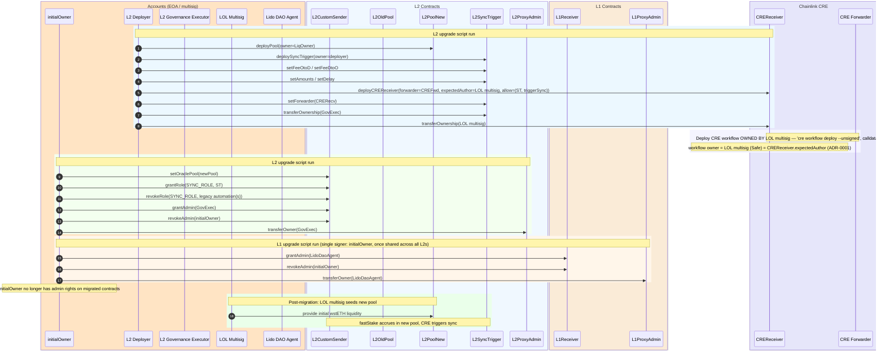

# Goal

Migrate Direct Staking ownership, admin roles, and liquidity management to Lido governance across four L2 networks (Optimism, Arbitrum, Base, Linea), deploying new pool and sync infrastructure and replacing Chainlink Automation with CRE workflows.

**Networks:** Optimism, Arbitrum, Base, Linea — all sharing a single L1 Receiver on Ethereum (`0x6F357d53d6bE3238180316BA5F8f11467e164588`).

**Contracts mutated** (per network):
- **L1** (shared): `LidoCustomReceiver` — admin → Lido DAO Agent; `ProxyAdmin` — owner → Lido DAO Agent
- **L2**: `CustomSenderReferral` — admin → L2 Governance Executor, oracle pool swapped, legacy automation(s) revoked from `SYNC_ROLE`; `ProxyAdmin` — owner → L2 Governance Executor; old `OraclePool` — no longer wired into the sender, ownership unchanged: Initial Liquidity Owner `0x2897A1…b18c` retains full control via `sweep()` to settle pre-migration liquidity and any wstETH that lands from a sync round-trip in flight at the migration boundary (the round-trip's recipient pool is fixed at `sync()`-time and immutable thereafter, so in-flight wstETH lands in the **old** pool and is recovered by its owner via `sweep()` — see [`DOC.md` §5.1](DOC.md#51-in-flight-round-trips-are-correct-by-design)). LOL multisig owns only the **new** pool.

**Contracts deployed** (per network): new `OraclePool`, `SyncTrigger`, `CREReceiver`

# Migration runbook

The step-by-step operator procedure — pre-live checks, the live run, and post-migration validation — lives in **[`RUNBOOK.md`](RUNBOOK.md)** (a concise 3-phase checklist with explicit gates `G1–G4` and the exact `just -E .env.<network> …` recipes). This README is the **reference** behind that recipe: fee parameters, the CRE workflow, tests, monitoring, and per-call levers.

> **Recipe ≠ run ≠ state.** [`RUNBOOK.md`](RUNBOOK.md) is the *recipe* (what an operator runs); the broadcast transactions are the *run*; [`DOC.md`](DOC.md) describes the *resulting state* (final ownership and roles). This README explains *why* the recipe's values and checks are what they are — it is not itself the procedure.

# Migration Sequence (Production)




# Sync fee parameters (FeeOtoD / FeeDtoO)

The sync operation moves accumulated WETH from an L2 OraclePool to Ethereum (via CCIP), stakes it through Lido, and bridges the resulting wstETH back to the L2 pool. Two encoded fee blobs govern the costs of each leg:

| Fee blob | Direction | What it pays for | Set by |
|----------|-----------|------------------|--------|
| **FeeOtoD** | L2 → Ethereum (CCIP) | CCIP message delivery + `ccipReceive` execution on Ethereum | `SyncTrigger.setFeeOtoD()` |
| **FeeDtoO** | Ethereum → L2 (native bridge) | L1 adapter bridge call that sends wstETH back to L2 | `SyncTrigger.setFeeDtoO()` |

## Fee denomination, the four quantities, and when money moves

**What the CCIP fee is nominated in.** One CCIP fee exists per sync — the OtoD leg. It is quoted and
charged in the message's `feeToken`: `payInLink ? LINK_TOKEN : address(0)`
(`lib/chainlink-csr/contracts/ccip/CCIPSenderUpgradeable.sol:77`), where `address(0)` means the sending
chain's native token. All four lanes set `payInLink = false` ([Current mainnet values](#current-mainnet-values)),
so the fee is **native ETH of the originating L2, in wei**, fixed by `IRouterClient.getFee()` at send time
(`CCIPSenderUpgradeable.sol:81`) and transferred to the Router at `ccipSend{value: fee}` (`:94`). The LINK
rail (~10% discount) exists in the codec but is unused. Internally CCIP composes the quote as
≈ `baseFee + premium + gasLimit × destChainGasPrice × tokenConversion`
([billing model](#glamsterdam-fee-headroom-bump-may-2026)), but on-chain it is a single native-wei number.

**Four quantities hide under the word "fee" — only one is a CCIP fee.**
([DOC.md §5.2](DOC.md#52-fee-parameters-per-chain--and-why-they-are-set-this-way) splits the *parameters*
by economic kind — cap / commitment / payment; this table splits the *quantities* a sync actually touches.)

| Quantity | CCIP fee? | What it actually is |
|---|---|---|
| FeeOtoD **actual fee** | **yes — the only one** | the `getFee()` quote charged for the L2→L1 leg: flat premium + the L1 `gasLimit` execution commitment |
| FeeOtoD **`maxFee`** | no — a revert bound | slippage guard: quote > `maxFee` ⇒ `CCIPSenderExceedsMaxFee` (`CCIPSenderUpgradeable.sol:82`), nothing charged. Never charged as such |
| **FeeDtoO** | no — a native-bridge budget | the return leg rides each L2's native bridge, not CCIP ([why the legs differ](#l1l2-vs-l2l1--why-the-two-legs-differ)): Arbitrum retryable `maxSubmissionCost + gasPriceBid × maxGas` ≈ 0.001 ETH; OP/Base/Linea 0 |
| FeeOtoD **`gasLimit`** | a component *inside* the actual fee | priced on the *committed* limit, not actual usage — unspent gas is never refunded ([Consequences](#consequences-of-unnecessarily-high-feeotod--feedtoo-limits)) |

**When the money moves** — all of it from the SyncTrigger's own float (it is the fee
[treasury](#feeotodmaxfee-free-per-sync-but-it-is-the-per-sync-blast-radius-bound); stakers' deposits and
the synced WETH are never touched — the user-initiated `slowStake` path fronts its own fees separately):

1. **t₀ — L2, one transaction.** `triggerSync` forwards `maxFeeOtoD + feeAmountDtoO` native ETH from the
   trigger's balance (`src/SyncTrigger.sol:142-143`). The Router quotes `getFee`; above `maxFee` the whole
   tx reverts with nothing charged; otherwise **exactly the quote** is paid at `ccipSend`
   (`CCIPSenderUpgradeable.sol:81-94`). The DtoO budget is wrapped and **added to the CCIP token transfer**
   (`amount + feeAmountDtoO`, `lib/chainlink-csr/contracts/senders/CustomSender.sol:294`) — it leaves at t₀
   too. Everything unspent refunds to the trigger before the tx ends (`CustomSender.sol:208`).
2. **t₀ + ~20 min — L1, inside `ccipReceive`.** The DtoO budget is *consumed*: Arbitrum pays the Inbox as
   `msg.value`; OP/Base burn L1 gas ~1.016:1 for the `l2Gas` commitment; Linea pays nothing.

CRE ticks themselves move no money — most are free staticcalls; fees are paid only when `shouldSync()`
flips (≤2 paid syncs/day/lane — [cadence](#sync-thresholds--cadence--why-these-values)).

**Three different "excesses".** The `maxFee` row below says "excess is not spent" — that is true for
exactly one of the three quantities that answer to "excess":

| Excess | Fate |
|---|---|
| `maxFee − actualFee` | **refunded intra-tx** (`CustomSender.sol:208`) — genuinely never spent |
| `gasLimit` committed − gas actually used | **spent at t₀, never refunded** — recurring linear overpayment ([Consequences](#consequences-of-unnecessarily-high-feeotod--feedtoo-limits)) |
| Arbitrum FeeDtoO budget − actual bridge cost | **burned** — "refunded" on L2 to the unreachable alias `0x80467D…5699`, ~0.001 ETH/sync ([proven on-chain](#consequences-of-unnecessarily-high-feeotod--feedtoo-limits)) |

## How fees flow through the system

```
SyncTrigger.triggerSync()
  │  reads _feeOtoD, _feeDtoO from storage
  │  calculates native ETH needed: sum of non-LINK fee amounts
  │
  ├─► CustomSender.sync{value: nativeETH}(destSelector, amount, feeOtoD, feeDtoO)
  │     │  decodes feeDtoO → pulls fee tokens (ETH or LINK) from caller
  │     │  decodes feeOtoD → extracts maxFee, payInLink, gasLimit
  │     │  packs feeDtoO into CCIP message data alongside recipient + amount
  │     │
  │     ├─► CCIP Router.ccipSend()  ← pays feeOtoD here (only the *actual* fee)
  │     │     │  routes message to Ethereum
  │     │     │
  │     │     └─► LidoCustomReceiver.ccipReceive()  ← gasLimit governs this execution
  │     │           │  unpacks feeDtoO from message data
  │     │           │  stakes ETH in Lido → receives wstETH
  │     │           │
  │     │           └─► L1 Adapter.sendToken(wstETH, feeDtoO)  ← pays feeDtoO here
  │     │                 │  decodes feeDtoO per network format
  │     │                 └─► native bridge (Arbitrum Gateway / OP Bridge / Linea Bridge)
  │     │                       └─► wstETH arrives on L2 pool
  │     │
  │     └─► TokenHelper.refundExcessNative(msg.sender)  ← automatic, last line of sync()
  │           refunds maxFee − actualFee back to the SyncTrigger, same tx (never called manually)
```

## Excess CCIP-fee refund (`refundExcessNative`) — automatic, never manual

`TokenHelper.refundExcessNative` is **not an operator action** — there is no manual call to make and no scheduled job to run, and it is impossible to invoke directly because it is an `internal` library function, not an external entrypoint (`lib/chainlink-csr/contracts/libraries/TokenHelper.sol:34`).

**When it runs:** unconditionally, as the **last statement** of every send — `CustomSender.sync()`, `slowStake()`, and `fastStake()` (`CustomSender.sol:208`, `:137`, `:174`). It sweeps the sender's *entire* native balance to `msg.sender` **in the same transaction** as the send, after the CCIP fee has already been paid. For a sync, `msg.sender` is the SyncTrigger, so the `maxFee − actualFee` excess lands back in the trigger's float via its bare `receive()` (`src/SyncTrigger.sol:42`) **before `triggerSync()` even returns**. The float therefore depletes by the *actual* cost, never the fronted maximum (see [Funding the float](#feeotodmaxfee-free-per-sync-but-it-is-the-per-sync-blast-radius-bound) and [Cost framing](#cost-framing)).

**Don't confuse it with the two refunds/recoveries that *are* manual:**

| Mechanism | Manual? | What it does |
|---|---|---|
| `TokenHelper.refundExcessNative` | **No** — internal, automatic, intra-tx | Returns `maxFee − actualFee` to the SyncTrigger after each send |
| `SyncTrigger.sweep()` | **Yes** — owner-only (L2 GovExec), `src/SyncTrigger.sol:168` | Withdraws the trigger's accumulated float |
| `LidoCustomReceiver.retryFailedMessage` | **Yes** — re-drives a stuck L1 message | Recovers an OOG'd `processMessage` (not a fee refund) |

This refund covers only the CCIP-fee excess (`FeeOtoD.maxFee`). The *other* two "excesses" are spent or burned, not refunded — see [Fee denomination](#fee-denomination-the-four-quantities-and-when-money-moves) and the Arbitrum [burned-refund](#feedtoo-arbitrum-overpayment-is-refunded-to-an-address-nobody-controls) case.

## FeeOtoD encoding (CCIP, all networks)

Encoded with `FeeCodec.encodeCCIP(maxFee, payInLink, gasLimit)` — 21 bytes.

| Field       | Type      | Description                                                                                                                                            |
| ----------- | --------- | ------------------------------------------------------------------------------------------------------------------------------------------------------ |
| `maxFee`    | `uint128` | Slippage guard — reverts if actual CCIP fee exceeds this. Only the actual fee is charged; the `maxFee − actualFee` excess is refunded intra-tx — [the other two "excesses" are spent or burned](#fee-denomination-the-four-quantities-and-when-money-moves). |
| `payInLink` | `bool`    | `true` = pay in LINK (~10% discount), `false` = pay in native ETH.                                                                                     |
| `gasLimit`  | `uint32`  | Gas budget for `ccipReceive()` on Ethereum. Must be >= 75,000 (enforced by `CustomSender`). Covers: unpack message → Lido stake → adapter bridge call. |

**Sizing `gasLimit`:** The receiver must unpack the message, stake ETH through Lido, approve wstETH, and delegate-call the bridge adapter. Current configured value is **1,000,000** for Optimism/Arbitrum/Base and **500,000** for Linea (each network bumped +25% from its prior baseline as a Glamsterdam pre-hardening — see [§Glamsterdam fee headroom bump](#glamsterdam-fee-headroom-bump-may-2026)). If too low, the CCIP message enters a failed state and requires [manual re-execution](https://docs.chain.link/ccip/concepts/manual-execution) with a higher gas limit.

**Sizing `maxFee`:** Query `IRouterClient.getFee()` off-chain and add a 10–20% buffer for gas price fluctuation. Current configured value is **0.125 ETH** across all networks. Excess (`maxFee − actualFee`) is fully refunded on L2 by `TokenHelper.refundExcessNative`, so the cap only costs gas at the moment of the send, not over the sync's lifetime.

## FeeDtoO encoding (network-specific)

Each L2 network uses a different L1→L2 bridge with its own fee model. The L1 adapter decodes FeeDtoO and calls the native bridge accordingly.

### Arbitrum — `FeeCodec.encodeArbitrumL1toL2(maxSubmissionCost, maxGas, gasPriceBid)` — 29 bytes

| Field | Type | Description |
|-------|------|-------------|
| `maxSubmissionCost` | `uint128` | Base cost for creating a retryable ticket on L2. If too low, the L1 transaction reverts. |
| `maxGas` | `uint32` | Gas limit for L2 auto-redemption of the retryable ticket. |
| `gasPriceBid` | `uint64` | L2 gas price bid. If below L2 base fee, auto-redemption fails (ticket can be manually redeemed within ~7 days). |

Total ETH required: `feeAmount = maxSubmissionCost + (gasPriceBid × maxGas)`. Excess is "refunded" on L2
— but to the *alias* of the L1 receiver, an address nobody controls, so it is effectively burned (verified
on-chain — see [Consequences of unnecessarily high limits](#consequences-of-unnecessarily-high-feeotod--feedtoo-limits)).

Current values: `maxSubmissionCost=0.001 ETH`, `maxGas=100,000`, `gasPriceBid=0.05 gwei`.

### Optimism / Base — `FeeCodec.encodeOptimismL1toL2(l2Gas)` / `encodeBaseL1toL2(l2Gas)` — 21 bytes

| Field | Type | Description |
|-------|------|-------------|
| `feeAmount` | `uint128` | Always **0**. The adapter reverts if non-zero. Bridge cost is paid implicitly via L1 gas burn. |
| `l2Gas` | `uint32` | Minimum gas guaranteed for L2 deposit execution. L2 gas is not refundable — if too low, the deposit fails with **no recovery mechanism**. Not free either: each unit burns ~1 unit of L1 gas *inside `ccipReceive`* via the portal's resource metering ([measured 1.016:1](#consequences-of-unnecessarily-high-feeotod--feedtoo-limits)). |

Current value: `l2Gas=100,000`.

### Linea — `FeeCodec.encodeLineaL1toL2()` — 17 bytes

| Field | Type | Description |
|-------|------|-------------|
| `feeAmount` | `uint128` | Always **0**. Linea sponsors the postman fee for L1→L2 messages under 250,000 gas ([docs](https://docs.linea.build/network/build/send-receive-messages)). |

No additional parameters. The adapter reverts if `feeAmount != 0` or `payInLink == true`.

## Current mainnet values

| Parameter | Optimism | Arbitrum | Base | Linea |
|-----------|----------|----------|------|-------|
| **FeeOtoD maxFee** | 0.125 ETH | 0.125 ETH | 0.125 ETH | 0.125 ETH |
| **FeeOtoD payInLink** | false | false | false | false |
| **FeeOtoD gasLimit** | 1,000,000 | 1,000,000 | 1,000,000 | 500,000 |
| **FeeDtoO format** | Optimism L1→L2 | Arbitrum L1→L2 | Base L1→L2 | Linea L1→L2 |
| **FeeDtoO feeAmount** | 0 | ~0.001 ETH* | 0 | 0 |
| **FeeDtoO l2Gas / maxGas** | 100,000 | 100,000 | 100,000 | — |

\* Arbitrum `feeAmount = maxSubmissionCost + gasPriceBid × maxGas = 0.001e18 + 0.05 gwei × 100,000 ≈ 1.005e15 wei ≈ 0.001005 ETH`.

## Glamsterdam fee headroom bump (May 2026)

The `FeeOtoD` values above include a **+25% pre-emptive bump** from the prior production baseline (`maxFee = 0.1 ETH`; `gasLimit = 800k` for Optimism/Arbitrum/Base, `400k` for Linea). The bump is a one-shot hardening ahead of the Ethereum **Glamsterdam** upgrade, which ships [EIP-7904](https://eips.ethereum.org/EIPS/eip-7904) (compute opcode repricing) and [EIP-8038](https://eips.ethereum.org/EIPS/eip-8038) (state-access repricing) on L1.

### Why `gasLimit` needs more headroom

The L1 work bounded by `_feeOtoD.gasLimit` (`LidoCustomReceiver.ccipReceive` → `processMessage`) is dominated by exactly the opcodes Glamsterdam reprices:

- **EIP-8038** raises `GAS_COLD_SLOAD`, `GAS_COLD_ACCOUNT_ACCESS`, and the storage-update base. The receiver path performs many cold accesses: CSR storage namespaces, AccessControl role mappings, WETH → Lido `stETH.submit` (cold reads against `BUFFERED_ETHER`, total shares, recipient shares), wstETH wrap, the bridge adapter `delegatecall`, and the per-network L1 bridge endpoint (Optimism `L1ERC20TokenBridge`, Arbitrum `L1GatewayRouter`, Base `L1StandardBridge`, Linea `L1MessageService`).
- **EIP-7904** raises `KECCAK256` (+50%) and a few precompiles. Mild on this path (no pairings, no KZG), but every storage-slot derivation, role hash, and message envelope hash gets the +50% bump.
- Conservative estimate of impact on `processMessage`: **+15–25%** of current actual gas usage. Per the [measured carrier below](#measured-ccipreceive-gas-independent-gaslimit-carrier), the 25% bump keeps every lane within budget (no OOG), but **Base/Optimism land *at* the 80% headroom the [§5 alert](#5-capacity--headroom--medium) tracks, not comfortably under it** — 1M is adequate-but-tight for those lanes.

`_feeDtoO` is **not** affected by these EIPs because it budgets L2 execution (Optimism/Base `l2Gas`, Linea postman, Arbitrum `maxGas × gasPriceBid`) — each L2 follows its own gas schedule, not L1's. (Caveat: Optimism/Base `l2Gas` *does* burn L1 gas inside `ccipReceive` via the portal's resource metering, so it indirectly consumes `_feeOtoD.gasLimit` budget — see [Consequences](#consequences-of-unnecessarily-high-feeotod--feedtoo-limits).) Arbitrum's `maxSubmissionCost` is paid as L1 `msg.value` to the Inbox; the unspent part is refunded on L2 to an unreachable aliased address (effectively burned — same section).

### Why `maxFee` is bumped too (and why it doesn't increase per-sync cost)

- CCIP's actual fee scales **linearly with `gasLimit`**: `fee ≈ baseFee + premium + gasLimit × destChainGasPrice × tokenConversion`. A 25% `gasLimit` bump raises the actual fee by the same 25% at any given L1 gas price.
- `maxFee` is a safety cap on the L2 send (`CCIPSenderUpgradeable.sol:82`). Bumping it 0.1 → 0.125 ETH preserves the spike-protection multiplier that the prior `maxFee` provided against the prior `gasLimit` (i.e., keeps the same "headroom over typical fee" ratio).
- Excess (`maxFee − actualFee`) is **fully refunded** to the SyncTrigger by `TokenHelper.refundExcessNative` after every send (`CustomSender.sol:208`). So `maxFee` bloat costs **zero per-sync ETH** — only larger transient float locked up for the duration of one transaction.

### Cost framing

| Dimension | Real per-sync cost? | Why |
|---|---|---|
| `gasLimit` bloat (+25%) | **Yes** | CCIP OffRamp is paid for the L1 gas commitment whether or not the receiver uses it all; unused gas is the executor's margin |
| `maxFee` bloat (+25%) | No (zero) | Refunded by `refundExcessNative`; only locks ETH transiently inside one tx |

Order-of-magnitude on the `gasLimit` bump: at the [measured fee slopes](#consequences-of-unnecessarily-high-feeotod--feedtoo-limits) (~0.0002–0.0003 ETH per +100k `gasLimit`), the +200k/+100k bumps cost ~0.0005 ETH (~$1.5–2.5) per sync × up to 8 syncs/day across 4 chains ≈ **$10–20/day** (scales with L1 gas price). Trade is favorable against the alternative — a post-hard-fork cliff where every sync OOGs in `processMessage`, the defensive catch stores `failedHashes[messageId]`, funds (WETH and Arbitrum's `feeAmountDtoO`) sit at `LidoCustomReceiver` until manual `retryFailedMessage`, and user-facing wstETH liquidity erodes on each L2.

### Operational handoff

- Constants live in `script/<net>/<Net>MigrationConstants.sol` (`L2_SYNC_DESTINATION_MAX_FEE`, `L2_SYNC_DESTINATION_GAS_LIMIT`).
- New SyncTrigger deploys pick up the values via `L2UpgradeActions.configureSyncTrigger` → `setFeeOtoD`.
- For SyncTriggers already deployed before the bump, the lever is GovExec-only `setFeeOtoD` (per [Per-call levers (DOC.md §3)](DOC.md#3-access-control--ownership--the-final-state)); the source-of-truth bytes are the constants in `script/<net>/<Net>MigrationConstants.sol`, which `verify-stage1` keccak-compares against `SyncTrigger`'s stored blobs (`script/shared/L2UpgradeActions.s.sol`), so any future bump must update those constants in lockstep with the on-chain change.
- The byte-for-byte fee encodings are derived from those constants by `FeeCodec` in `lib/chainlink-csr` (`encodeCCIP` for FeeOtoD, the per-network `encode*L1toL2` for FeeDtoO) and pinned by the `verify-stage1` keccak check above. Note state-mate does **not** re-check them: `script/<net>/state-mate/<net>.yaml` leaves `getFeeOtoD` / `getFeeDtoO` as `null` ("set during migration"), so the fee bytes would have to be regenerated there in lockstep if ever pinned (see [DOC.md §5.2](DOC.md#52-fee-parameters-per-chain--and-why-they-are-set-this-way)). Refund mechanics, failure modes, and per-network differences are in the [Failure modes and recovery](#failure-modes-and-recovery) and [L1→L2 vs L2→L1](#l1l2-vs-l2l1--why-the-two-legs-differ) sections above.

## Measured `ccipReceive` gas (independent `gasLimit` carrier)

`FeeOtoD.gasLimit` is justified by **measurement**, not by its prior config value. The fork test
`PoolUpgradeTests.test_ccipReceiveGasRealAdapter` executes the real L1 `LidoCustomReceiver.ccipReceive`
(Lido stake → wstETH wrap → the **real** per-network bridge adapter) and records the gas it consumes —
the exact work `gasLimit` budgets. Regenerate with **`just measure-fee-gas`** (needs the forked-mainnet
RPCs: `RPC_ETHEREUM` + each `RPC_<NET>`; legacy `L1_RPC_URL` / `L2_<NET>_RPC_URL` work as fallbacks).
The test hard-asserts the post-Glamsterdam projection
(`measured × 1.25 ≤ gasLimit`, i.e. no OOG) and logs utilization.

Measured 2026-06-01 vs latest forked mainnet (≈6 WETH synced; figures move ±~10% with fork block / Lido
buffer state — read as ranges, not constants):

| Lane | CCIP ramp | Measured `ccipReceive` | Utilization | Post-Glamsterdam ×1.25 | Projected utilization |
|---|---|---|---|---|---|
| **Base** | v1.6 | ~599k–664k | ~60–66% | ~749k–830k | **~75–83%** |
| **Arbitrum** | v1.6 | ~329k | ~33% | ~411k | ~41% |
| **Optimism** | v1.5 | not isolated¹ | — | — | — |
| **Linea** | v1.5 | not isolated¹ | — | — | — |

¹ The pinned `chainlink-local` v0.2.3 simulator routes v1.5 lanes through its OffRamp machinery, so the
harness can't isolate `ccipReceive` for Optimism/Linea (`just measure-fee-gas` prints "not isolated").
Optimism uses the **same OP-stack `L1StandardBridge`** path as Base → expect ~Base (~60–66%); Linea's
`L1MessageService` path is lighter.

**Finding.** No lane out-of-gases (every projection < 100% of `gasLimit` — the test's hard assert). But
**Base — and by adapter-equivalence Optimism — is the tightest lane**: post-Glamsterdam it lands ~75–83%,
i.e. *at* the §5 80% headroom target rather than under it. Arbitrum is comfortable (~41%). To preserve the
80% headroom for Base/Optimism under the worst-case +25% repricing, raise their `gasLimit` to ~1.05M
(`664k × 1.25 ÷ 0.80 ≈ 1.04M`); otherwise 1M is adequate-but-tight. **Linea's 500k is unverified here**
(v1.5 route) — measure it out-of-band before relying on it.

## Consequences of unnecessarily high `FeeOtoD` / `FeeDtoO` limits

The measured-carrier logic cuts both ways. Too low → OOG cliff (documented above). But "just set it huge"
is not a free hedge either: every lever has a distinct over-provisioning failure mode, and two of them are
**hard cliffs**, not gradual overpayment. All numbers below were measured against the live mainnet lanes /
forked mainnet on 2026-06-02.

| Lever | Cost of slack | Cliff above a threshold |
|---|---|---|
| `FeeOtoD.gasLimit` | linear fee overpayment on **every** sync (unused gas is never refunded) | > lane `maxPerMsgGasLimit` ⇒ `getFee` **reverts** ⇒ sync bricked until GovExec fixes it |
| `FeeOtoD.maxFee` | none per sync (excess refunded) — but raises the SyncTrigger float requirement and the worst-case per-sync spend it authorizes | — |
| `FeeDtoO.l2Gas` (OP/Base) | **burns L1 gas ~1:1 inside `ccipReceive`** — eats `FeeOtoD.gasLimit` headroom | enough slack alone pushes the lane over the OOG cliff (demonstrated below) |
| `FeeDtoO` (Arbitrum) | ~1:1 **unrecoverable** — "refunds" land at an aliased address nobody controls (proven on-chain below) | — |
| `FeeDtoO` (Linea) | n/a — nullary encoding, no lever to bloat (adapter enforces `feeAmount == 0`) | — |

### `FeeOtoD.gasLimit`: you pay for the commitment, and above the lane cap you halt

**Linear recurring cost.** CCIP prices the message on the *committed* `gasLimit`, not the gas the receiver
ends up using — the official billing model is `gas usage = gas limit + destination gas overhead + …` and
states verbatim that *"any unspent gas from this user-set limit is not refunded"*
([CCIP billing](https://docs.chain.link/ccip/billing); also [CCIP `gasLimit` best practices](https://docs.chain.link/ccip/tutorials/evm/ccipreceive-gaslimit)).
Measured via `Router.getFee` on the production lanes (native-fee quote for the real sync message shape,
2026-06-02; quotes float with L1 gas price — read as a snapshot; [reproduction below](#evidence--reproduction)):

| Lane | fee @ `gasLimit` = 1M | marginal cost per +100k `gasLimit` | lane cap `maxPerMsgGasLimit` |
|---|---|---|---|
| Optimism | ~0.0039 ETH | ~0.00024 ETH | 7,000,000 |
| Arbitrum | ~0.0051 ETH | ~0.00030 ETH | 7,000,000 |
| Base | ~0.0035 ETH | ~0.00023 ETH | 7,000,000 |
| Linea | ~0.0042 ETH | ~0.00020 ETH | **3,000,000** |

Doubling 1M → 2M raises every sync's fee by ~60% forever, buying headroom the [carrier above](#measured-ccipreceive-gas-independent-gaslimit-carrier)
proves is never used. At the ≤2 syncs/day/lane cadence this is small in absolute ETH — the real argument is
that the overpayment buys *nothing*: OOG protection comes from measured utilization staying under the §5
threshold, not from slack.

**The cap is a revert, not a ceiling.** Each lane's FeeQuoter enforces `maxPerMsgGasLimit`
([FeeQuoter.sol#L848](https://github.com/smartcontractkit/ccip/blob/5e7b2096586bc32c6e975fc13f4c411eb687f833/contracts/src/v0.8/ccip/FeeQuoter.sol#L848):
`if (evmExtraArgs.gasLimit > destChainConfig.maxPerMsgGasLimit) revert MessageGasLimitTooHigh()`) — and
measured empirically: `getFee` at cap+1 reverts with `MessageGasLimitTooHigh` (`0x4c4fc93a` =
`cast sig "MessageGasLimitTooHigh()"`; [probes below](#evidence--reproduction)). That revert fires
inside `CustomSender._ccipSendTo` (`CCIPSenderUpgradeable.sol:81`) → **every `triggerSync` reverts → the
lane's sync halts entirely.** Un-bricking requires a GovExec `setFeeOtoD` round-trip (days of cross-chain
governance latency, [DOC.md §3](DOC.md#3-access-control--ownership--the-final-state)), during which wstETH
liquidity on that L2 erodes. Note the chain-blind footgun: "set all four lanes to 5M for safety" *passes*
on Optimism/Arbitrum/Base and bricks **only Linea** (cap 3M vs 7M) — per-lane caps differ, so any uniform
bump must be checked against each lane's FeeQuoter.

**Monitoring blindness.** The [§5 alert](#5-capacity--headroom--medium) is utilization-relative
(`ccipReceive` gas / `gasLimit` < 80%). Bloating the denominator silences it: at `gasLimit` = 3M, Base's
~664k measures 22% — a +25% Glamsterdam regression moves it to 28%, nowhere near the threshold, and the
alert never fires before a *real* config problem accumulates elsewhere. A measured-tight limit is what
makes utilization a signal at all.

### `FeeOtoD.maxFee`: free per sync, but it is the per-sync blast-radius bound

Excess over the actual fee is refunded intra-transaction (see [Cost framing](#cost-framing)), so bloat
costs nothing per sync. The consequences are structural instead: `triggerSync` forwards
`maxFeeOtoD + feeAmountDtoO` of native ETH from the SyncTrigger's own balance (`src/SyncTrigger.sol:142-143`),
so `maxFee` sets (a) the **float** the trigger must hold to sync at all, and (b) the **worst-case spend a
single sync can authorize**. The current 0.125 ETH is already ~25× the measured ~0.005 ETH actual fee —
protective against spikes. Raising it "for safety" (say to 12.5 ETH) means a CCIP fee-token mispricing or
gas-price spike gets *paid silently* instead of reverting with `CCIPSenderExceedsMaxFee`
(`CCIPSenderUpgradeable.sol:82`) — and given the CREReceiver's nullary-call lock
(`src/cre/CREReceiver.sol:108` — a compromised forwarder can only fire argument-less, rate-limited
`triggerSync()` calls), the fee caps are exactly what bounds the damage of each
spurious-but-authorized sync. `maxFee` is the only lever where
"too high" weakens a *guard* rather than wasting ETH.

**Funding the float.** The SyncTrigger is the fee **treasury**, not a pass-through: the CRE forwarder
call carries no value, so every sync is paid from the trigger's own balance and nothing refills it
automatically. The mechanics:

- **Required balance**: ≥ `getMaxFees().maxNativeFee` (`src/SyncTrigger.sol:97-107` — currently
  `maxFee` 0.125 ETH everywhere, + `feeAmountDtoO` ≈ 0.0016 ETH on Arbitrum). Below that, the next
  `triggerSync` reverts at the value transfer with **no named error** — see [Failure modes](#failure-modes-and-recovery).
- **Net drain per sync**: `actualFee + feeAmountDtoO` ≈ 0.005–0.007 ETH at measured fees — the
  `maxFee − actualFee` excess is refunded to the trigger intra-transaction (bare `receive()`,
  `src/SyncTrigger.sol:42`), so the float depletes by the *actual* cost, not the fronted maximum.
  At ≤2 syncs/day that is ≤ ~0.013 ETH/day/lane.
- **Funding is permissionless** (anyone can send ETH to the trigger); **recovering excess is not**
  (`sweep()` is owner-only = L2 GovExec, `src/SyncTrigger.sol:168` — a governance round-trip). So
  size deposits as floor + bounded runway (e.g. `maxNativeFee` + ~30 days ≈ 0.5 ETH/lane), not
  "fill it up", and refill from the [§5 alert](#5-capacity--headroom--medium).
- **Initial funding is part of `deploy-stage1` itself** (`fundSyncTrigger`, `script/shared/L2UpgradeActions.s.sol`):
  the amount is pinned as `L2_SYNC_TRIGGER_INITIAL_FLOAT` in each network's `MigrationConstants` (0.5 ETH;
  Sepolia 0.15), sent from the Lido Deployer wallet during the Stage-1 broadcast. The script reverts with
  `L2UpgradeFloatBelowFloor` if the constant doesn't cover one worst-case sync (`maxFee + feeDtoO`), and
  both the in-broadcast assert and `verify-stage1` read the balance back. Fork-test coverage:
  `test_productionDeployFundsSyncTriggerFloatForFirstSync` runs the first sync on the script-funded float
  alone — no test-side `vm.deal`.
- If `payInLink` were ever enabled, the same holds for a **LINK** balance (the constructor
  pre-approves LINK to the sender, `src/SyncTrigger.sol:64`); `getMaxFees().maxLinkFee` is the floor.

### `FeeDtoO.l2Gas` (Optimism/Base): burns L1 gas inside `ccipReceive` — coupled to `FeeOtoD.gasLimit`

`feeAmount` is 0 on OP-stack lanes, but `l2Gas` is **not free**: the deposit path
(Lido `L1ERC20TokenBridge` → `CrossDomainMessenger.sendMessage` → `OptimismPortal.depositTransaction`)
buys guaranteed L2 gas by **burning L1 gas** in the portal's resource market. This is specified behavior,
not an implementation accident — the [OP guaranteed gas market spec](https://specs.optimism.io/protocol/guaranteed-gas-market.html)
says the portal *"burns an amount of L1 gas that corresponds to the L2 cost (`L2 cost / L1 base fee`)"*
with `MINIMUM_BASE_FEE = 1 gwei`, implemented in
[`ResourceMetering.sol`](https://github.com/ethereum-optimism/optimism/blob/develop/packages/contracts-bedrock/src/L1/ResourceMetering.sol)
(`gasCost = _amount × params.prevBaseFee / max(block.basefee, 1 gwei)`; shortfall vs gas already spent is
`Burn.gas`-ed) — and that burn happens *inside the L1 `ccipReceive` that `FeeOtoD.gasLimit` budgets*.

Measured on the Base fork (carrier test, 2026-06-02), changing only `l2Gas`:

| `FeeDtoO.l2Gas` | measured `ccipReceive` gas | carrier verdict (vs 1M `gasLimit`) |
|---|---|---|
| 100,000 (current) | 664,234 | PASS (66%) |
| 600,000 | 1,172,150 | **FAIL — would OOG in production** |

Slope: Δ507,916 / Δ500,000 = **1.016 : 1** — exactly the messenger's 64/63 dynamic overhead
([`CrossDomainMessenger.baseGas`](https://github.com/ethereum-optimism/optimism/blob/develop/packages/contracts-bedrock/src/universal/CrossDomainMessenger.sol):
`MIN_GAS_DYNAMIC_OVERHEAD_NUMERATOR = 64` / `…DENOMINATOR = 63`) at the deposit
base fee's 1-gwei floor (the worst case, which is also the *current* case at sub-gwei L1 basefees; the
ratio shrinks as L1 basefee rises — see the spec formula above). Reproduce: change `l2Gas` in
`_defaultFeeDtoO` (`test/helpers/BaseUpgradeTestBase.sol:75`) and re-run the carrier
(`just measure-fee-gas`). Consequences of slack: every extra unit of `l2Gas` (a) eats
`FeeOtoD.gasLimit` headroom ~1:1 — at current configs, `l2Gas` slack of ~300k alone crosses the OOG cliff;
(b) forces `FeeOtoD.gasLimit` up to compensate, which raises every sync's CCIP fee (the levers are
coupled on OP-stack lanes — bloat one, pay on both). Size `l2Gas` to the actual L2 `finalizeDeposit` cost
plus a measured buffer, nothing more. (Too *low* is still worse: under-gassed deposits fail with no
recovery — see [Failure modes](#failure-modes-and-recovery).)

### `FeeDtoO` (Arbitrum): overpayment is "refunded" to an address nobody controls

The chain of evidence, step by step:

1. **Refund addresses = the L1 receiver.** Lido's deployed wstETH gateway
   (`0x0F25c1DC2a9922304f2eac71DCa9B07E310e8E5a`, resolved on-chain via
   `L1GatewayRouter.l1TokenToGateway(wstETH)`) builds the retryable in
   [`L1CrossDomainEnabled.sendCrossDomainMessage`](https://github.com/lidofinance/lido-l2/blob/main/contracts/arbitrum/L1CrossDomainEnabled.sol),
   which passes `sender_` — the router's caller, i.e. the **LidoCustomReceiver contract** — as both
   `excessFeeRefundAddress` and `callValueRefundAddress` of `Inbox.createRetryableTicket`.
2. **Contract refund addresses get aliased.** Per the
   [official Arbitrum docs](https://docs.arbitrum.io/how-arbitrum-works/arbos/l1-l2-messaging):
   `createRetryableTicket` *"will check if either the provided `excessFeeRefundAddress` or the
   `callValueRefundAddress` are contracts on L1; if they are … it will convert them to their address
   alias"* (`L2_Alias = L1_address + 0x1111000000000000000000000000000000001111`); implementation in
   [`AbsInbox._createRetryableTicket`](https://github.com/OffchainLabs/nitro-contracts/blob/main/src/bridge/AbsInbox.sol)
   (`AddressUpgradeable.isContract(…) → AddressAliasHelper.applyL1ToL2Alias(…)`).
3. **The refund is most of the budget.** The *actual* submission fee is
   `(1400 + 6 × dataLength) × L1 basefee`
   ([`Inbox.calculateRetryableSubmissionFee`](https://github.com/OffchainLabs/nitro-contracts/blob/main/src/bridge/Inbox.sol);
   the [Arbitrum docs](https://docs.arbitrum.io/how-arbitrum-works/arbos/l1-l2-messaging) describe it as a
   *"fixed cost, dependent only on its calldata size"*) — a few thousand gas-equivalents ≈ 10⁻⁵ ETH at
   ~1 gwei — so ~99.5% of the 0.001 ETH `maxSubmissionCost`, plus unused `maxGas × gasPriceBid`, is
   "refunded" each sync.
4. **Where it lands.** `alias(L1 receiver 0x6F35…4588)` = `0x80467D53d6be3238180316Ba5F8f11467E165699`
   on Arbitrum: an address with no code and no key. **Verified on-chain (2026-06-02): it holds
   0.01753 ETH at nonce 0** — accumulated refunds from past syncs that have never moved and cannot move
   ([commands below](#evidence--reproduction)).

Recovery would require upgrading the L1 receiver implementation to issue its own L1→L2 calls — the alias
is precisely the recovery path the Inbox aliasing is designed to leave open (per the docs, aliasing exists
*"to prevent the situation where refunds are guaranteed to be irrecoverable"*), but for a proxied,
DAO-governed receiver that is governance surgery, not operations.

Consequence: Arbitrum `FeeDtoO` over-provisioning is a **per-sync 1:1 burn**, unlike `maxFee` (refunded)
and unlike OP/Base `l2Gas` (burned as gas). The current ~0.001005 ETH/sync is the deliberate, known price
of auto-redeem reliability; 10×ing `maxSubmissionCost` "for safety" 10×es a recurring loss with zero
reliability gained (a too-low value fails *loudly* on L1 and is retryable — see
[Failure modes](#failure-modes-and-recovery)).

### `FeeDtoO` (Linea): no lever

`FeeCodec.encodeLineaL1toL2()` is nullary (`lib/chainlink-csr/contracts/libraries/FeeCodec.sol:382`) and
`LineaAdapterL1toL2._sendToken` reverts on `feeAmount != 0`
(`lib/chainlink-csr/contracts/adapters/LineaAdapterL1toL2.sol:50`) — there is nothing to over-provision.
Delivery rides Linea's sponsored postman: *"the postman fee for automatic claiming is only sponsored for
transactions using less than 250,000 gas"*
([Linea message-service docs](https://docs.linea.build/network/build/send-receive-messages)).

### Plan: when reality outgrows a limit — what breaks, how to fix it

The converse scenario: the limits are sized to measurement, so a regime change (Glamsterdam repricing, an
L1 gas-price era shift, a bridge/Lido code change, deposit-market congestion) can push *actual* usage past
a limit that used to be adequate. Detection first, then per-limit playbook, then the standing update
procedure.

**Detection.** The [§5 monitoring alerts](#5-capacity--headroom--medium) are the early warning — both fire
at **80% utilization, before anything breaks**: `ccipReceive gas / gasLimit` and `actual CCIP fee / maxFee`.
The carrier test (`just measure-fee-gas`) re-derives the gas number on demand and hard-fails acceptance
once the ×1.25 projection no longer fits. If an alert fires, fix proactively (procedure below) — every row
in the table after it describes the *reactive* case where the limit was already breached.

| Limit breached | What breaks (symptom) | Funds at risk | Interim recovery | Permanent fix |
|---|---|---|---|---|
| `FeeOtoD.gasLimit` < actual `ccipReceive` gas | `processMessage` OOGs on L1; defensive catch stores `failedHashes[messageId]` ([`CCIPDefensiveReceiverUpgradeable.sol#L200`](https://github.com/Aphyla/chainlink-csr/blob/62108f7b6cc664e36dbc8100c4b48974d59f572e/contracts/ccip/CCIPDefensiveReceiverUpgradeable.sol#L200), pinned at the vendored submodule commit); synced WETH (+ Arbitrum `feeAmountDtoO`) parks at the L1 receiver; every subsequent sync joins it | Parked, not lost | **Permissionless** `retryFailedMessage` (`:131`, no role gate) — the retry runs on the caller's own tx gas, so it succeeds with a bigger gas limit; if the *whole* `ccipReceive` reverted at CCIP level instead, use [CCIP manual execution](https://docs.chain.link/ccip/concepts/manual-execution) with a gas-limit override | Raise `gasLimit` via GovExec `setFeeOtoD` (procedure below) |
| `FeeOtoD.maxFee` < actual CCIP fee | `triggerSync` reverts `CCIPSenderExceedsMaxFee` (`CCIPSenderUpgradeable.sol:82`); syncs stall, pool WETH accumulates on L2 | No — pure liveness; **self-heals if the fee spike is transient** (CRE re-attempts each tick) | Wait out a transient spike; nothing is stuck | If the fee regime shifted: raise `maxFee` via `setFeeOtoD` **and top up the SyncTrigger float** to ≥ new `maxFee + feeAmountDtoO` (it fronts that much per sync) |
| SyncTrigger ETH balance < `maxFee + feeAmountDtoO` | `triggerSync` reverts at the value transfer (`src/SyncTrigger.sol:143`) with **no named error** — plain EVM balance failure; syncs stall, pool WETH accumulates. Symptom-identical to the row above, so **check `cast balance <trigger>` against `getMaxFees()` first** when diagnosing a stall | No — pure liveness | **Anyone** sends ETH to the trigger (bare `receive()`, permissionless — no governance needed); self-heals on the next CRE tick | Top up to ≥ `getMaxFees().maxNativeFee` + runway ([Funding the float](#feeotodmaxfee-free-per-sync-but-it-is-the-per-sync-blast-radius-bound)); keep deposits modest — recovering excess is `sweep()` = GovExec-only |
| Arbitrum `maxSubmissionCost` < actual submission fee | L1 `outboundTransfer` reverts `InsufficientSubmissionCost` (`AbsInbox.sol:298-301`) → defensive catch → `failedHashes`, as row 1. Headroom today: breach needs L1 basefee ≳200 gwei (`0.001 ETH ÷ (1400 + 6N)` at N ≈ 350–600 bytes of retryable calldata) | Parked, not lost | `retryFailedMessage` once basefee dips — the fee bytes are frozen inside the failed message, so retry *cannot* carry a bigger budget; it only succeeds when the fee falls back under it | Raise `maxSubmissionCost` via `setFeeDtoO` for future syncs |
| Arbitrum `gasPriceBid` < L2 basefee | Ticket created but auto-redeem fails; wstETH not minted on L2 yet | **Yes if ignored**: manual-redeem window is ~7 days, then the ticket expires and the bridged wstETH is stranded ([Failure modes](#failure-modes-and-recovery)) | Manual redeem (permissionless) via the [retryable dashboard](https://retryable-dashboard.arbitrum.io/) within 7 days — redeemer pays current L2 gas | Raise `gasPriceBid` via `setFeeDtoO` |
| OP/Base `l2Gas` < actual `finalizeDeposit` gas | L2 relay's target call fails; the L2 messenger records it in `failedMessages` ([OP messengers spec](https://specs.optimism.io/protocol/messengers.html)) | Parked, not lost (Bedrock) | **Permissionless replay**: call `relayMessage` on the L2 messenger with the same params and more gas (no ETH value rides the wstETH deposit, so replay is a plain tx) | Raise `l2Gas` via `setFeeDtoO` — re-measure the `FeeOtoD.gasLimit` coupling afterwards (the burn grows ~1:1, [see above](#feedtool2gas-optimismbase-burns-l1-gas-inside-ccipreceive--coupled-to-feeotodgaslimit)) |
| Linea relay > 250k sponsored gas | Postman stops auto-claiming; wstETH waits unclaimed on L2 | Parked, not lost | Permissionless `claimMessage` on the L2 message service ([Linea docs](https://docs.linea.build/network/build/send-receive-messages)) | None on our side — the adapter pins `feeAmount = 0`, so the fix is reducing relay gas or accepting manual claims |
| Required `gasLimit` > lane cap (7M / 3M Linea) | Cannot be fixed by `setFeeOtoD` — the cap is Chainlink's, enforced in the lane FeeQuoter | n/a (config ceiling, not an incident) | — | Escalate to Chainlink for a lane-config change, or shrink the receiver's work (architectural). At 66% of 1M vs a 7M cap, Base has ~10× runway before this is real |

**Standing update procedure** (any fee-limit change):

1. **Re-measure, don't guess**: `just measure-fee-gas` for `gasLimit` (size = `measured × 1.25 ÷ 0.80`,
   the [Finding](#measured-ccipreceive-gas-independent-gaslimit-carrier)'s formula); `Router.getFee`
   quotes for `maxFee` (size ≈ 10–25× typical, keeping the spike multiplier).
2. **Check the ceiling**: new `gasLimit` < the lane's `maxPerMsgGasLimit` (7M / 3M — per lane, not global).
3. **Re-encode** with `FeeCodec` (`encodeCCIP` / per-network `encode*L1toL2`) and ship via GovExec
   `setFeeOtoD` / `setFeeDtoO` — owner-only levers ([DOC.md §3](DOC.md#3-access-control--ownership--the-final-state)),
   so this is a governance motion, not an ops action: **budget days of latency** and front-run it from the
   80% alert, not from the breach.
4. **Lockstep the oracle**: update the fee constants in `script/<net>/<Net>MigrationConstants.sol` — the
   bytes `verify-stage1` keccak-checks against the on-chain blobs (per [Operational handoff](#operational-handoff)).
   (state-mate does *not* gate the fee bytes — its `getFeeOtoD` / `getFeeDtoO` are `null` — so the constants +
   `verify-stage1` are the only oracle; if state-mate is ever extended to pin them, update its yaml in lockstep too.)
5. **Re-run the carrier + acceptance** (`just measure-fee-gas`, `just test-acceptance`) and,
   if `maxFee` or Arbitrum `FeeDtoO` rose, **top up the SyncTrigger float** accordingly.

### Evidence & reproduction

All measured claims in this section are one command away (2026-06-02 snapshots; ETH chain selector
`5009297550715157269`, routers from `script/<net>/<Net>MigrationConstants.sol`):

```bash
# Fee-vs-gasLimit slope and lane cap (repeat per lane router + RPC; vary <GAS_LIMIT_HEX>):
# extraArgs = EVMExtraArgsV1 tag 0x97a657c9 ++ abi.encode(gasLimit)
cast call <L2_CCIP_ROUTER> \
  "getFee(uint64,(bytes,bytes,(address,uint256)[],address,bytes))(uint256)" \
  5009297550715157269 \
  "(0x000000000000000000000000<L1_RECEIVER>,0x<81 zero bytes>,[(<L2_WETH>,1000000000000000000)],0x0000000000000000000000000000000000000000,0x97a657c9<GAS_LIMIT_HEX_32B>)" \
  --rpc-url <l2-rpc>
# → linear in gasLimit; at cap+1 reverts 0x4c4fc93a (= cast sig "MessageGasLimitTooHigh()").
# Caps read back: 7,000,000 (Optimism/Arbitrum/Base), 3,000,000 (Linea).

# Arbitrum burned-refund evidence (alias of L1 receiver 0x6F35…4588 + 0x1111…1111):
cast balance 0x80467D53d6be3238180316Ba5F8f11467E165699 --rpc-url <arbitrum-rpc>  # 17534996693853952 wei
cast nonce   0x80467D53d6be3238180316Ba5F8f11467E165699 --rpc-url <arbitrum-rpc>  # 0
cast code    0x80467D53d6be3238180316Ba5F8f11467E165699 --rpc-url <arbitrum-rpc>  # 0x

# Lido wstETH Arbitrum gateway (step 1 above), resolved from the canonical router:
cast call 0x72Ce9c846789fdB6fC1f34aC4AD25Dd9ef7031ef "l1TokenToGateway(address)(address)" \
  0x7f39C581F595B53c5cb19bD0b3f8dA6c935E2Ca0 --rpc-url <l1-rpc>  # → 0x0F25c1DC…8E5a

# OP/Base l2Gas → L1 burn slope: set l2Gas in _defaultFeeDtoO
# (test/helpers/BaseUpgradeTestBase.sol:75) to 600_000, then:
just measure-fee-gas   # Base carrier: 664,234 → 1,172,150 measured ccipReceive gas (and FAILs the budget assert)
```

## Sync thresholds & cadence — why these values

`SyncTrigger` gates *when* and *how much* each sync moves (identical on all four lanes). Changing the amounts/delay is a GovExec action (`setAmounts` / `setDelay`); the cron lives in the CRE workflow config.

| Param | Value | Why this value / turn-the-dial |
| --- | --- | --- |
| `L2_SYNC_MIN_AMOUNT` | 5 WETH | Floor below which `shouldSync()` is false. Keeps round-trip fees a sub-percent fraction of the synced amount; too low → fees become a yield drag; too high → deposits sit idle missing Lido yield. |
| `L2_SYNC_MAX_AMOUNT` | 100 WETH | Per-sync cap (residual stays for the next sync). Bounds CCIP fee exposure, Lido `submit` impact, and in-flight L1→L2 bridge exposure to ≤100 wstETH. Too low → many small syncs, more overhead. |
| `L2_SYNC_DELAY` | 12 h | Min wall-clock between syncs — ≤2 paid syncs/day/lane, roughly aligned with Lido's daily oracle cadence. Shorter → ~12× more fees; longer → larger idle balances / tail risk. Doubles as the migration cutover quiet-window. |
| CRE cron | `*/5 * * * *` | DON *evaluation* cadence (most ticks return false — a cheap staticcall), not action cadence. 5 min = 1/144 of the 12 h delay → ≤5 min latency once a sync is due. Tighter → ~5× DON cost; looser → added post-delay latency. |

## L1→L2 vs L2→L1 — why the two legs differ

The forward leg (L2→L1, `FeeOtoD`) uses **Chainlink CCIP**; the return leg (L1→L2, `FeeDtoO`) uses each L2's **native bridge**. They are not symmetric:

| Aspect | L2→L1 (CCIP, `FeeOtoD`) | L1→L2 (native, `FeeDtoO`) |
|---|---|---|
| Fee paid by | L2 caller at send time | OP/Base: sequencer (free); Arbitrum: L1 receiver via `msg.value`; Linea: postman (free) |
| Excess refund | `maxFee` excess refunded; the gas commitment is **not** | OP/Base: n/a; Arbitrum: "refunded" to an unreachable aliased address (= burned, [see Consequences](#consequences-of-unnecessarily-high-feeotod--feedtoo-limits)); Linea: n/a |
| Failure / recovery | Defensive catch at L1 receiver → `retryFailedMessage` (anyone) | OP/Base: L2 deposit revert; Arbitrum: stuck retryable (≤7-day manual-redeem, then lost); Linea: re-claim |
| Time to deliver | ~20 min (CCIP SLA) | OP/Base ~1–3 min; Arbitrum ~1–15 min; Linea ~5–30 min |
| Affected by L1 EIPs (7904/8038)? | **Yes** — `gasLimit` budgets L1 work | No — budgets L2 work |

**Why not CCIP both ways?** Native L1→L2 bridges are cheaper (sequencer-subsidized or postman-free), faster (minutes vs ~20 min), and run on the L2's own trust — no extra committee dependency. CCIP earns its place on the *harder* L2→L1 direction, where it provides a programmable receiver that orchestrates the stake + bridge-back and carries the encoded `FeeDtoO`.

## Failure modes and recovery

| Leg | Failure | Cause | Recovery |
|-----|---------|-------|----------|
| CCIP (OtoD) | `CCIPSenderExceedsMaxFee` revert | `maxFee` too low vs actual CCIP fee | Increase `maxFee`, retry |
| CCIP (OtoD) | `ccipReceive` out of gas | `gasLimit` too low for stake + bridge | [Manual re-execution](https://docs.chain.link/ccip/concepts/manual-execution) with higher gas |
| Arbitrum (DtoO) | L1 tx reverts | `maxSubmissionCost` too low | Increase and retry |
| Arbitrum (DtoO) | Auto-redeem fails | `maxGas` or `gasPriceBid` too low | Manual redeem within ~7 days via [Arbitrum retryable dashboard](https://retryable-dashboard.arbitrum.io/) |
| Optimism/Base (DtoO) | L2 deposit execution fails | `l2Gas` too low | Failed relay is recorded in the L2 messenger's `failedMessages` and is **permissionlessly replayable** with more gas via `relayMessage` ([OP messengers spec](https://specs.optimism.io/protocol/messengers.html)). Replay is manual ops — still size conservatively with 20%+ buffer. |
| Linea (DtoO) | Postman won't deliver | Message uses >250k gas without fee | Manual claim or provide fee |

## References

- [CCIP gasLimit optimization](https://docs.chain.link/ccip/tutorials/evm/ccipreceive-gaslimit)
- [CCIP billing](https://docs.chain.link/ccip/billing) — incl. *"any unspent gas from this user-set limit is not refunded"*
- [CCIP manual execution](https://docs.chain.link/ccip/concepts/manual-execution)
- [CCIP FeeQuoter source](https://github.com/smartcontractkit/ccip/blob/ccip-develop/contracts/src/v0.8/ccip/FeeQuoter.sol) — `maxPerMsgGasLimit` validation / `MessageGasLimitTooHigh`
- [Arbitrum L1→L2 messaging & retryables](https://docs.arbitrum.io/how-arbitrum-works/arbos/l1-l2-messaging) — submission fee formula, refund addresses, contract-refund aliasing
- [Optimism deposit flow](https://docs.optimism.io/stack/transactions/deposit-flow)
- [OP guaranteed gas market spec](https://specs.optimism.io/protocol/guaranteed-gas-market.html) — L1 gas burn for deposit gas, `MINIMUM_BASE_FEE = 1 gwei`
- [Linea message service](https://docs.linea.build/network/build/send-receive-messages) — postman sponsorship < 250k gas

# CRE Workflow (replaces Chainlink Automation)

Pool rebalancing is triggered by a CRE (Chainlink Runtime Environment) TypeScript workflow instead of Chainlink Automation (CLA). The workflow runs on Chainlink's Decentralized Oracle Network (DON) as compiled WASM.

## Architecture

```
CRE DON (TypeScript/WASM, off-chain)
  ├── CronCapability trigger (every 5 minutes)
  ├── EVMClient.callContract() → SyncTrigger.shouldSync()
  ├── If syncNeeded:
  │   ├── Encode triggerSync() calldata
  │   ├── Wrap in abi.encode(target, data) for CREReceiver
  │   ├── runtime.report() → sign with ECDSA/Keccak256
  │   └── EVMClient.writeReport() → CRE Forwarder
  │
CRE Forwarder (on-chain; verifies signatures, ERC-165-gates the receiver)
  └── CREReceiver.onReport(metadata, report)
      └── SyncTrigger.triggerSync()
          └── CustomSender.sync() → CCIP → L1
```

## Files

| Path                                                         | Purpose                                                              |
| ------------------------------------------------------------ | -------------------------------------------------------------------- |
| `src/cre/CREReceiver.sol`                                    | On-chain receiver — decodes reports and calls target contracts       |
| `src/cre/interfaces/IReceiver.sol`                           | CRE receiver interface                                               |
| `cre-workflows/sync-automation/main.ts`                      | CRE workflow entry point                                             |
| `cre-workflows/sync-automation/encoding.ts`                  | Pure encoding/decoding helpers (testable outside WASM)               |
| `cre-workflows/sync-automation/abi.ts`                       | SyncTrigger ABI definitions                                          |
| `cre-workflows/sync-automation/config.deploy.<network>.json` | Per-network production config (Optimism, Arbitrum, Base, Linea)      |
| `cre-workflows/sync-automation/config.deploy.json`           | Base production config (Optimism defaults)                           |
| `cre-workflows/sync-automation/config.simulate.json`         | Local simulation config                                              |
| `cre-workflows/sync-automation/config.test.json`             | Testnet config (Optimism Sepolia)                                    |

## Setup

```sh
# Install CRE workflow dependencies (requires Bun on PATH)
just setup-cre

# Run TypeScript tests
just test-cre-workflow
```

## Deployment

CREReceiver is deployed per L2 network as part of Stage 1 `runDeploy` (which also configures `SyncTrigger.setForwarder(CREReceiver)` and pins `expectedAuthor` to the **LOL multisig** — the Safe that also owns the CREReceiver and the CRE workflow, **not** the Lido Deployer EOA; see [ADR-0001](docs/adr/0001-cre-workflow-owner-multisig.md)). Workflow deployment happens immediately after `runDeploy`, before Stage 2:

1. Rewrite `config.deploy.<network>.json` with the deployed addresses — `just -E .env.<network> update-cre-config <network> "$L2_SYNC_TRIGGER" "$L2_CRE_RECEIVER"`.
2. Deploy the workflow **owned by the LOL Safe**: `just -E .env.<network> deploy-cre-workflow <network>`. This runs `cre workflow deploy … --unsigned`; **execute the emitted `WorkflowRegistry` calldata from the LOL Safe** so the Safe address becomes the workflow owner (= `expectedAuthor`). `CRE_WORKFLOW_OWNER` (defaults to `L2_LIQUIDITY_OWNER`) sets the Safe address.
3. Repeat for each network (Optimism, Arbitrum, Base, Linea).
4. Monitor at `cre.chain.link/workflows`; verify the registered owner with `just -E .env.<network> verify-cre-workflow`.

See [Per-call levers (DOC.md §3)](DOC.md#3-access-control--ownership--the-final-state) for CREReceiver admin functions.

## Funding and billing

Two distinct concerns; the migration scripts touch neither, by design.

- **LOL Safe gas + signer wallets (one-time, negligible).** Every `WorkflowRegistry` transaction (`cre workflow deploy --unsigned` / `pause` / `activate` / `delete`) is executed *from the LOL Safe* on Ethereum Mainnet — sub-cent gas per call, paid by whichever signer relays the Safe tx. A throwaway `CRE_ETH_PRIVATE_KEY` is needed for the CLI's RPC-client init but **never signs** the owner transaction. No L2 balance required.
- **Workflow execution credits (ongoing).** CRE bills DON execution as opaque "CRE credits" tracked on the [CRE dashboard](https://cre.chain.link/workflows), not as a LINK-funded on-chain balance. The CRE CLI exposes **no** `fund` / `deposit` / `withdraw` / `balance` commands. Credits are administered against the **workflow owner's CRE account — i.e. the LOL Safe**, not any EOA. During Early Access (verified April 2026), credit allocation is administrative — coordinate with Chainlink when the dashboard balance approaches the agreed threshold. Re-verify before GA.

Alert on the credit balance per [Monitoring & alerts §4](#4-cre-workflow-health--funding--high).

## CRE platform levers (workflow lifecycle)

The sync workflow is off-chain WASM on Chainlink's CRE platform; its only on-chain footprint is `WorkflowRegistry 2.0.0` (Ethereum mainnet, `0x4Ac5…E7e5`), which holds no funds. The workflow is **owned by the LOL multisig (Safe)** — registered with `cre workflow deploy --unsigned` and the emitted calldata executed *from the Safe* (ADR-0001). Every lifecycle action is therefore a Safe transaction:

| Action | Caller | Effect |
|---|---|---|
| `cre workflow deploy --unsigned` | LOL Safe (m-of-n) | Compile + emit `WorkflowRegistry` calldata; the Safe executes it (or `upsertWorkflow` on re-deploy with same name) |
| `cre workflow pause` / `activate` | LOL Safe (m-of-n) | Stop / start DON execution |
| `cre workflow delete` | LOL Safe (m-of-n) | Retire the workflow |
| `cre account link-key` / `unlink-key` | LOL Safe (m-of-n) | Associate / disassociate a wallet (owner-gated) |
| cron tick (every 5 min) | CRE DON | Runs the WASM; signs a report if `shouldSync()` is true |

- The owner's EVM address (the **Safe address**) is propagated into every report as `metadata.workflowOwner` (bytes `[42:62]`); `CREReceiver._extractWorkflowOwner` reads it and, if `expectedAuthor != 0`, the two must match.
- The report's `workflowName`/`workflowId` are deliberately **not** checked — authentication is `(forwarder, workflowOwner)` only (an owner-scoped label adds no defence against owner compromise, and the argument-less call-lock already bounds the blast radius; see [DOC.md §2.6](DOC.md#26-credibility--security-of-the-application-layer-contracts)).
- Updating the WASM under the same owner does **not** change `metadata.workflowOwner`, so `expectedAuthor` keeps accepting reports after a routine code update.
- **Rotating a Safe *signer*** (`addOwner` / `swapOwner` / `removeOwner`) does **not** change the Safe address, so it needs **no** `setExpectedAuthor` re-pin and **no** redeploy. Only changing the workflow owner *to a different address* would require `setExpectedAuthor` ×4 — and with a Safe owner that is never needed except in the catastrophic whole-Safe-compromise case ([Workflow-owner key](#workflow-owner-key--lost-vs-compromised-consequences--recovery)).
- CRE-side pause is instant but depends on Chainlink infra; the authoritative kill switches are on-chain — `LOL → CREReceiver.setForwarder(0)` and `GovExec → SyncTrigger.setForwarder(0)` / `setDelay(max)`. Neither the CRE DON nor the Forwarder is controllable by this project.

## Workflow-owner key — lost vs compromised (consequences & recovery)

The CRE workflow owner is the **LOL multisig (Safe)** — the same Safe that owns each `CREReceiver` and is pinned as its `expectedAuthor` ([ADR-0001](docs/adr/0001-cre-workflow-owner-multisig.md), [DOC.md §3.2](DOC.md#32-owners--actors-and-what-they-hold)). Registering the workflow under the Safe (`cre workflow deploy --unsigned`, calldata executed from the Safe) makes the owner **a stable address whose control is a rotatable signer set**, dissolving the single-EOA "irreplaceable admin" problem the EOA design carried. Two roles stay distinct (A.7):

1. **CRE workflow owner = `expectedAuthor` = CREReceiver owner.** All three are the **LOL Safe address**, baked into every signed report as `metadata.workflowOwner` (`[42:62]`). `WorkflowRegistry 2.0.0` (`0x4Ac5…E7e5`) still exposes **no per-workflow ownership-transfer function**, but you no longer need one: control is the Safe's **signer set**, rotatable without touching the registry binding.
2. **Stage-1 signer / float-funder (the Lido Deployer EOA).** Migration-only, and **not** the workflow owner. Post-migration it holds **zero on-chain power** over Lido contracts; state-mate asserts `hasRole = false` for this hot key everywhere ([DOC.md §6.3](DOC.md#63-how-the-final-state-is-verified)).

The owner does **not** sign reports — the **DON** signs, and the Safe address only travels as metadata — so an owner incident does not by itself stop an already-`ACTIVE` workflow. Owner authority is workflow *lifecycle* (`deploy` / `pause` / `activate` / `delete` / update-WASM / `link-key`, each now an m-of-n Safe transaction) plus CRE-credit administration ([Funding and billing](#funding-and-billing)). Misuse is bounded to "fire an already-admissible, rate-limited, nullary `triggerSync()`" by the three gates + argument-less call-lock and `SyncTrigger`'s on-chain amount/delay re-check ([DOC.md §2.6](DOC.md#26-credibility--security-of-the-application-layer-contracts)) — **no fund extraction, no recipient change, no arbitrary calldata.**

### Failure modes at a glance (Safe owner)

| Scenario | What happens | Fix | Authority / urgency |
|---|---|---|---|
| **One Safe signer key lost** (below threshold) | Nothing operationally — the Safe still meets quorum; the DON keeps executing the `ACTIVE` workflow; `expectedAuthor` (the Safe address) still matches | `removeOwner` / `swapOwner` inside the Safe — **no redeploy, no `setExpectedAuthor` re-pin** (the Safe address is unchanged) | LOL Safe only; low urgency |
| **One Safe signer key compromised** (below threshold) | Funds unaffected; attacker holds *one* signer, below quorum, so cannot move the Safe | `swapOwner` / `removeOwner` to evict the signer inside the Safe — no redeploy, no re-pin | LOL Safe only; medium — evict promptly |
| **Whole Safe compromised** (≥ threshold signers at once) | The same catastrophic event that already loses **every** LOL-held lever (`OraclePool.pause`, `setForwarder`, `setExpectedAuthor`). Funds still bounded by the on-chain gates + GovExec backstop | **Contain** via GovExec `SyncTrigger.setForwarder(0)` / `setDelay(max)` (independent trust domain), then the one-time **"redeploy + re-pin"** primitive under a *new* Safe | GovExec backstop + new Safe; **high** |

The first two rows are the everyday cases and need **no** CRE redeploy and **no** on-chain re-pin — that is the whole point of a Safe owner (a stable address, rotatable signers). Only the third reaches the registry binding, and it coincides with the protocol-wide worst case already accepted everywhere LOL holds power.

**Procedures and rationale (single home — ADR-0001, not duplicated here):**

- **Everyday signer rotation** (signer lost/compromised below threshold) — `swapOwner` / `removeOwner` / `addOwner` inside the Safe; the Safe address is unchanged, so no CRE redeploy and no `setExpectedAuthor` re-pin, and the running workflow is never interrupted. Operator steps: [RUNBOOK → Recover](RUNBOOK.md).
- **Whole-Safe compromise + the "redeploy + re-pin" primitive** (R1–R4 with Duty / Gate / Evidence), the GovExec containment backstop, and the **rejected single-EOA alternative** with its full lost-vs-compromised tables and the A.19 / G.5 comparator: **[ADR-0001](docs/adr/0001-cre-workflow-owner-multisig.md)**. Contain first from the independent domain (GovExec `SyncTrigger.setForwarder(0)` / `setDelay(max)`, [§3.4](DOC.md#34-what-the-project-still-controls-if-chainlink-misbehaves)), then redeploy under a new Safe and re-arm `setExpectedAuthor` last.
- **Pre-incident hardening** — Safe threshold + diverse signer custody (so losing ≥ threshold at once is implausible), and confirm the Early-Access residuals — especially that the DON embeds the **Safe address** as `metadata.workflowOwner` so `expectedAuthor = Safe` matches: [ADR-0001 "Residuals"](docs/adr/0001-cre-workflow-owner-multisig.md) and RUNBOOK gate G2-author.

# Script reference (direct `forge script` / debugging)

The operator procedure is in **[`RUNBOOK.md`](RUNBOOK.md)**. This table is only the network → script-path mapping for direct `forge script` invocations or debugging. The L1 `LidoCustomReceiver` is one contract shared by all four lanes, so its admin migration is shared — `script/l1/L1UpgradeScript.s.sol:L1UpgradeScript`, run once via `just migrate-l1`.

| Network  | L2 Script                                                          | Env file        |
|----------|--------------------------------------------------------------------|-----------------|
| Optimism | `script/optimism/OptimismL2Upgrade.s.sol:OptimismL2UpgradeScript`  | `.env.optimism` |
| Arbitrum | `script/arbitrum/ArbitrumL2Upgrade.s.sol:ArbitrumL2UpgradeScript`  | `.env.arbitrum` |
| Base     | `script/base/BaseL2Upgrade.s.sol:BaseL2UpgradeScript`              | `.env.base`     |
| Linea    | `script/linea/LineaL2Upgrade.s.sol:LineaL2UpgradeScript`           | `.env.linea`    |

# Tests

## Pool upgrade tests (fork-based)

- Shared harness:
  - `test/helpers/UpgradeTestBase.sol`
  - `test/helpers/PoolUpgradeTests.sol`
- Network-specific suites (17 tests each):
  - `test/OptimismPoolUpgrade.t.sol`
  - `test/ArbitrumPoolUpgrade.t.sol`
  - `test/BasePoolUpgrade.t.sol`
  - `test/LineaPoolUpgrade.t.sol`
- Network-specific bases:
  - `test/helpers/OptimismUpgradeTestBase.sol`
  - `test/helpers/ArbitrumUpgradeTestBase.sol`
  - `test/helpers/BaseUpgradeTestBase.sol`
  - `test/helpers/LineaUpgradeTestBase.sol`
- Coverage includes: L1/L2 role and ownership migration, fast/slow stake behavior after pool swap, old pool isolation, liquidity provision/sweep, and sync path across CCIP routing.

```sh
# All networks (requires L1_RPC_URL + respective L2 RPC)
forge test

# Individual networks
just test-optimism-upgrade
just test-arbitrum-upgrade
```

Notes:
- Each fork suite requires a working `L1_RPC_URL` and the corresponding `L2_*_RPC_URL`.
- `just test-arbitrum-upgrade` prefers `LOCAL_L2_ARBITRUM_RPC_URL` when present and otherwise falls back to `L2_ARBITRUM_RPC_URL`.

## CRE tests

- `test/CREReceiverTest.t.sol` — 35 unit tests for the CREReceiver contract (no fork required; incl. the argument-less call-lock)
- `test/CREIntegrationTest.t.sol` — 10 fork-based integration tests per network (Optimism, Arbitrum, Base, Linea = 40 total), covering the full CRE Forwarder → CREReceiver → SyncTrigger → sync path. Includes `test_productionExpectedAuthorIsLolMultisig`, which asserts the production deploy pins `expectedAuthor` to the **LOL multisig** (== owner == CRE workflow owner, ≠ the Stage-1 deployer EOA) and that a Safe-authored report is accepted while a deployer-authored report is rejected (ADR-0001)
- `test/helpers/CREIntegrationTests.sol` — shared CRE test logic (same pattern as `PoolUpgradeTests.sol`)
- `cre-workflows/sync-automation/main.test.ts` — 11 TypeScript tests for workflow encoding/decoding logic
- `test/L2GovernanceExecutorGuard.t.sol` — RPC-free guard test for the migration's `L2_GOVERNANCE_EXECUTOR` validation (mainnet rejects a wrong executor; Sepolia opts out) — see [DOC.md §6.3](DOC.md#63-how-the-final-state-is-verified)

```sh
# Unit tests only (no RPC required)
just test-cre-receiver

# Integration tests (requires L1_RPC_URL + L2_OPTIMISM_RPC_URL)
just test-cre-integration

# All Solidity CRE tests
just test-cre

# TypeScript workflow tests
just test-cre-workflow

# Everything (Solidity + TypeScript)
just test-cre-all
```

Note: the workflow tests shell out to `bun test`, so Bun must be installed and available on `PATH`.

## Optimism state-mate command split

The upgrade-state flow is split into dedicated commands:
- `just test-optimism-upgrade-state-migrate [rpc_url]`
- `just test-optimism-upgrade-state-update-config [rpc_url]`
- `just test-optimism-upgrade-state-verify` — reads `L2_RPC_URL` (or legacy `L2_STATE_MATE_RPC_URL` / `LOCAL_L2_OPTIMISM_RPC_URL` / `L2_OPTIMISM_RPC_URL`) from env; no positional

And one glue command that runs all phases on a dedicated nested fork:
- `just test-optimism-upgrade-state`

Purpose of each phase:
- `migrate`: executes `OptimismL2UpgradeScript` against the target RPC and persists migration outputs.
- `update-config`: regenerates `script/optimism/state-mate/optimism.yaml` from template.
- `verify`: runs `state-mate` checks against an arbitrary RPC.

Required env:
- `L2_LIDO_DEPLOYER_PRIVATE_KEY`
- `L2_GOVERNANCE_EXECUTOR`

RPC env:
- For `test-optimism-upgrade-state`: one upstream source: `L2_STATE_MATE_UPSTREAM_RPC_URL` or `LOCAL_L2_OPTIMISM_RPC_URL` or `L2_OPTIMISM_RPC_URL`.
- For split commands: pass `[rpc_url]`, or set `L2_STATE_MATE_RPC_URL` (fallback: migration output file, then `LOCAL_L2_OPTIMISM_RPC_URL`, `L2_OPTIMISM_RPC_URL`).

Optional env:
- `L2_LIQUIDITY_OWNER` (defaults to `L2_GOVERNANCE_EXECUTOR`)
- `INITIAL_OWNER_PRIVATE_KEY` (if omitted, migration uses unlocked/impersonated `INITIAL_OWNER` on anvil-compatible RPCs)
- `INITIAL_OWNER` (defaults to `OptimismMigrationConstants.INITIAL_OWNER`)
- `L2_STATE_MATE_FORK_PORT` (default: `8651`)
- `L2_STATE_MATE_OUTPUT_FILE` (default: `/tmp/optimism-l2-state-mate.env`)
- `L2_STATE_MATE_SYNC_TRIGGER` (needed for `update-config` if not available in output file)

Run all phases on dedicated fork:

```sh
just test-optimism-upgrade-state
```

Operational notes:
- The glue command prefers `L2_STATE_MATE_UPSTREAM_RPC_URL`, then `LOCAL_L2_OPTIMISM_RPC_URL`, then `L2_OPTIMISM_RPC_URL`.
- If `LOCAL_L2_OPTIMISM_RPC_URL` is set but no local fork is listening there, the nested Anvil fork will fail to start; either run `just rpc-start-l2-optimism` first or override `L2_STATE_MATE_UPSTREAM_RPC_URL`.
- `test-optimism-upgrade-state-update-config` rewrites the tracked file `script/optimism/state-mate/optimism.yaml`, so expect a worktree diff after running it.

## Test layers (overview)

Four independent layers of pre-prod validation, increasing in realism:

| Layer | Exercises | Recipe |
| --- | --- | --- |
| Forge fork tests + Chainlink Local CCIP simulator | Per-network L2/L1 migration logic + CCIP routing + CRE allow-list against mainnet forks | `just test-acceptance`, `just test-<net>-upgrade`, `just test-cre-integration` |
| state-mate post-condition diff | ≥45 live-RPC assertions per network vs canonical `*.yaml` | `just test-<net>-upgrade-state-verify` |
| Per-network anvil-fork dress rehearsal (below) | The exact `deploy-stage1 → verify-stage1 → migrate-stage2 → state-verify` recipe sequence on an anvil fork of one L2 + L1 | manual (below) |
| Sepolia rehearsal | Real Sepolia + Optimism Sepolia, same script shape | the `sepolia-*` recipes in the `justfile` |

## CCIP fork simulation (Chainlink Local)

The pool-upgrade end-to-end test (`test_upgradeSyncRoutesAcrossL2AndL1CCIPLayer`) drives a real CCIP round-trip across L1/L2 forks via the Chainlink Local simulator: create both forks, `makePersistent` the `CCIPLocalSimulatorFork`, register chain details, `fastStake` to accrue WETH, `sync()` with `recordLogs`, route the message to L1, then assert the receiver stakes + the adapter dispatch event fires.

**Why the test carries its own v1.6 router (`test/helpers/CCIPv16ForkRouter.sol`).** `lib/chainlink-local` is pinned at v0.2.3, whose `switchChainAndRouteMessage` matches **only** the legacy v1.5 OnRamp event (`CCIPSendRequested`). The Arbitrum/Base/Optimism mainnet L2→L1 lanes have migrated to CCIP **v1.6** (`CCIPMessageSent` — a different topic), so the simulator silently fails to decode, the receiver never runs, and `_assertAndGetAdapterDispatch` fails. Linea still works (still v1.5). Bumping to v0.2.5+ isn't viable: those versions expect `@chainlink/contracts-ccip` import paths that conflict with `chainlink-csr`'s remapping. The helper papers over this for v1.6 lanes by `deal`-ing the destination tokens and calling `ccipReceive` directly via `vm.prank(L1_CCIP_ROUTER)` — same `msg.sender` + message struct the receiver would see from a real off-ramp. If `chainlink-local` is ever bumped to ≥v0.2.5 (and import paths reconciled), delete the helper and restore the direct simulator call.

## Per-network anvil-fork dress rehearsal

Distinct from `just test-acceptance` (which runs the combined Stage 1+2 across all four networks at once), this exercises the **exact recipe sequence** an operator runs on mainnet — `deploy-stage1 → verify-stage1 → migrate-stage2 → test-<net>-upgrade-state-verify` — against an anvil fork of one L2 + Ethereum mainnet. It confirms the recipes wire env/args correctly end-to-end, that Stage-1 broadcast-JSON parsing emits the right `export` addresses, and that the canonical state-mate template renders + passes against the post-migration fork. The walkthrough uses **Linea** (substitute the network + its `script/<net>/<Net>MigrationConstants.sol` to rehearse the others).

**Prereqs:** `.env` with `L1_RPC_URL` + `L2_LINEA_RPC_URL`; `L2_LIDO_DEPLOYER_PRIVATE_KEY` (any funded EOA works on a fork — anvil dev key `0xf39F…2266` is the convention); `forge`/`cast`/`anvil`/`jq`/`yq`/`node`/`yarn`; `lib/state-mate/node_modules` populated (`corepack yarn install --immutable` inside `lib/state-mate`).

**0. Read-only sanity (no fork yet)** — all green before there is any value in rehearsing:

```sh
forge test --match-contract 'LineaPoolUpgradeTest|LineaCREIntegrationTest' --fork-url "$L2_LINEA_RPC_URL" -vv
just verify-constants-sync
just -E .env.linea preflight-check
just -E .env.linea preflight-check-l1
```

**1. Spawn forks** (L1 on :8650, Linea on :8651) and fund the three actors:

```sh
anvil --silent --auto-impersonate -p 8650 -f "$L1_RPC_URL"       >/tmp/rehearsal-l1.log 2>&1 &
anvil --silent --auto-impersonate -p 8651 -f "$L2_LINEA_RPC_URL" >/tmp/rehearsal-l2.log 2>&1 &
until cast chain-id --rpc-url http://127.0.0.1:8650 >/dev/null 2>&1 \
   && cast chain-id --rpc-url http://127.0.0.1:8651 >/dev/null 2>&1; do sleep 1; done
DEPLOYER=0xf39Fd6e51aad88F6F4ce6aB8827279cffFb92266       # Lido Deployer (L2_LIDO_DEPLOYER_PRIVATE_KEY)
INITIAL_OWNER=0xb5c336a5c60D3482b29d83C742C65AE8351b91a8  # cold key holder, impersonated on the fork
LIDO_DAO_AGENT=0x3e40D73EB977Dc6a537aF587D48316feE66E9C8c # L1 admin recipient
for url in http://127.0.0.1:8650 http://127.0.0.1:8651; do
  for a in "$DEPLOYER" "$INITIAL_OWNER" "$LIDO_DAO_AGENT"; do
    cast rpc --rpc-url "$url" anvil_setBalance "$a" 0x3635C9ADC5DEA00000 >/dev/null; done; done
```

Expected: chain-id on :8650 → `1`, on :8651 → `59144`.

**2. Stage 1 — `deploy-stage1`** on the Linea fork (paste the three printed `export` lines into the shell):

```sh
export L2_NETWORK=linea
export L2_GOVERNANCE_EXECUTOR=0x74Be82F00CC867614803ffd7f36A2a4aF0405670   # LineaMigrationConstants
export L2_CRE_FORWARDER=0x000000000000000000000000000000000000dEaD          # placeholder — CRE Forwarder not exercised on a fork
L2_RPC_URL=http://127.0.0.1:8651 just deploy-stage1
# → export L2_ORACLE_POOL=…  L2_SYNC_TRIGGER=…  L2_CRE_RECEIVER=…
```

**3. Verify Stage 1** (read-only): `L2_RPC_URL=http://127.0.0.1:8651 just verify-stage1` — a clean exit means all 18 Stage-1 post-condition reads passed (immutables, allow-list, expectedAuthor, plus guardrails that Stage 2 has *not* yet run).

**4. Stage 2 — `migrate-stage2`** (impersonated Initial Owner). The fork lacks the cold key, so call `runMigrateUnlocked()` directly:

```sh
export INITIAL_OWNER=0xb5c336a5c60D3482b29d83C742C65AE8351b91a8
cast rpc --rpc-url http://127.0.0.1:8651 anvil_impersonateAccount "$INITIAL_OWNER" >/dev/null
ALLOW_UNSAFE_COMBINED_RUN=1 forge script script/linea/LineaL2Upgrade.s.sol:LineaL2UpgradeScript \
  --sig 'runMigrateUnlocked()' --rpc-url http://127.0.0.1:8651 \
  --broadcast --non-interactive --unlocked --sender "$INITIAL_OWNER"
```

`ALLOW_UNSAFE_COMBINED_RUN=1` is required because the production guard trips on Linea's mainnet chain-id (59144) inherited by the fork; `runMigrateUnlocked()` runs only Stage 2 (Stage 1 already happened in step 2). Successful broadcast lands the seven in-transaction post-conditions (new pool wired, `SYNC_ROLE` rotated, `DEFAULT_ADMIN` rotated, ProxyAdmin owner transferred).

**5. State-mate against the fork.** The tracked `linea.yaml` pins production-target addresses, so render the template into a temp dir with the freshly-deployed addresses and run state-mate directly:

```sh
mkdir -p /tmp/linea-rehearsal && cp -R script/linea/state-mate/abi /tmp/linea-rehearsal/
sed -e "s|__L2_CUSTOM_SENDER__|0x328de900860816d29D1367F6903a24D8ed40C997|g" \
    -e "s|__L2_PROXY_ADMIN__|0x4c8c4A15c1e810e481c412A9B06Be5f79dC02192|g" \
    -e "s|__INITIAL_OWNER__|$INITIAL_OWNER|g" -e "s|__L2_GOVERNANCE_EXECUTOR__|$L2_GOVERNANCE_EXECUTOR|g" \
    -e "s|__L2_LIQUIDITY_OWNER__|0xA8EF4Db842d95DE72433a8B5b8fF40cB9C74c1B6|g" -e "s|__L2_LIDO_DEPLOYER__|$DEPLOYER|g" \
    -e "s|__L2_ORACLE_POOL__|$L2_ORACLE_POOL|g" -e "s|__L2_SYNC_TRIGGER__|$L2_SYNC_TRIGGER|g" -e "s|__L2_CRE_RECEIVER__|$L2_CRE_RECEIVER|g" \
    script/linea/state-mate/linea-l2-upgrade.template.yaml > /tmp/linea-rehearsal/linea.yaml
(cd lib/state-mate && L2_STATE_MATE_RPC_URL=http://127.0.0.1:8651 corepack yarn start /tmp/linea-rehearsal/linea.yaml --only l2)
```

Expected tail: `✔ Total: 46 checks passed` (5 `getForwarder` / fee-blob / timestamp checks emit `⚠ skipped` because they're set after CRE workflow deploy, which the fork rehearsal does not cover).

**6. L1 admin migration** on the L1 fork (no impersonated variant in `L1UpgradeScript`, so issue the three calls via `cast send --unlocked`):

```sh
L1_RECEIVER=0x6F357d53d6bE3238180316BA5F8f11467e164588
L1_PROXY_ADMIN_ADDR=0x88a45d2760b63c1500E3D2E3552b28e5Cdaa37BD
ZERO_ROLE=0x0000000000000000000000000000000000000000000000000000000000000000
cast rpc --rpc-url http://127.0.0.1:8650 anvil_impersonateAccount "$INITIAL_OWNER" >/dev/null
cast send --unlocked --from "$INITIAL_OWNER" --rpc-url http://127.0.0.1:8650 "$L1_RECEIVER" "grantRole(bytes32,address)" "$ZERO_ROLE" "$LIDO_DAO_AGENT"
cast send --unlocked --from "$INITIAL_OWNER" --rpc-url http://127.0.0.1:8650 "$L1_RECEIVER" "revokeRole(bytes32,address)" "$ZERO_ROLE" "$INITIAL_OWNER"
cast send --unlocked --from "$INITIAL_OWNER" --rpc-url http://127.0.0.1:8650 "$L1_PROXY_ADMIN_ADDR" "transferOwnership(address)" "$LIDO_DAO_AGENT"
```

**7. Cleanup:** `pkill -f 'anvil .*-p 8650'; pkill -f 'anvil .*-p 8651'; rm -rf /tmp/linea-rehearsal /tmp/rehearsal-l*.log`

**The rehearsal does NOT cover** (same gaps as `test-acceptance` and the Sepolia rehearsal): the CRE workflow deploy + registration (real `WorkflowRegistry` + live DON — the fork uses the `0x…dEaD` forwarder placeholder, so `getForwarder` checks show as state-mate `⚠ skipped`); a real CCIP send → L1 receive (the step-0 forge fork tests cover that via the Chainlink Local simulator); the LOL multisig wstETH seed; the Aragon DAO vote (the fork just impersonates `LIDO_DAO_AGENT`).

# Monitoring & alerts (post-migration)

Post-migration monitoring for the shared L1 Receiver + the 4 L2 deployments. Signals marked **(×4)** apply per network; all four must be watched. The state-polling rows map directly to the state-mate YAMLs in `script/<network>/state-mate/`; the event-subscription rows should be wired into an indexer (Tenderly, Dune, or similar). Thresholds in parentheses are starting points — tune after the first week of observation.

| Severity | Meaning | Response |
| --- | --- | --- |
| **CRITICAL** | Fund loss or access-control breach | Page on-call immediately |
| **HIGH** | Sync stalled, funds stuck, or ops-visible incident | Business-hours response |
| **MEDIUM** | Capacity headroom eroding (will fail later) | Investigate before exhaustion |

## 1. Access-control invariants — CRITICAL

Any deviation = key compromise or unintended governance action.

| Contract | Getter | Expected |
|---|---|---|
| L1 Receiver | `hasRole(DEFAULT_ADMIN_ROLE, LidoDaoAgent)` / `getRoleMemberCount(DEFAULT_ADMIN_ROLE)` | `true` / `1` |
| L1 ProxyAdmin | `owner()` | Lido DAO Agent |
| L2 CustomSender (×4) | `hasRole(DEFAULT_ADMIN_ROLE, L2GovExecutor)` / `getRoleMemberCount` | `true` / `1` |
| L2 CustomSender (×4) | `hasRole(SYNC_ROLE, newSyncTrigger)` / `getRoleMemberCount(SYNC_ROLE)` | `true` / `1` |
| L2 CustomSender (×4) | `getOraclePool()` | new OraclePool |
| L2 ProxyAdmin (×4) / SyncTrigger (×4) | `owner()` | L2 Gov Executor |
| SyncTrigger (×4) | `getForwarder()` | CREReceiver |
| CREReceiver (×4) | `owner()` / `getForwarder()` / `getExpectedAuthor()` | LOL multisig / CRE Forwarder / **LOL multisig** (owner == expectedAuthor == CRE workflow owner; ADR-0001) |
| CREReceiver (×4) | `isCallAllowed(SyncTrigger, 0x340b2b0b)` | `true` |
| OraclePool (×4) | `owner()` | LOL multisig |

**Events — alert on any emit:** `RoleGranted` / `RoleRevoked` (L1 Receiver, L2 CustomSender ×4); `OwnershipTransferred` (every ProxyAdmin, SyncTrigger, CREReceiver, OraclePool); `ForwarderUpdated` / `ExpectedAuthorUpdated` / `AllowedCallUpdated` (CREReceiver ×4).

## 2. Trapped / unexpected funds — CRITICAL

| Signal | Expected | Recovery |
|---|---|---|
| L1 Receiver ETH / stETH / wstETH balance | ~0 (transient during stake; alert if > 1 ETH for > 1 h) | Lido DAO governance |
| L1 Receiver any unexpected ERC20 | 0 | `recoverTokens` via governance |
| `LidoCustomReceiver.MessageFailed` (L1) | **none — page on-call** | `retryFailedMessage` (anyone) or `recoverTokens` (DAO) |
| CCIP OffRamp manual-execution queue (×4) | empty | [ccip.chain.link](https://ccip.chain.link/) → manual exec, higher gas |
| Arbitrum retryable auto-redeem failures | 0 | [retryable-dashboard.arbitrum.io](https://retryable-dashboard.arbitrum.io/) (≤ 7-day manual redeem, then lost) |

## 3. Sync liveness — HIGH

Fund-safety does not degrade if sync stalls, but UX does: `fastStake` WETH accumulates and wstETH liquidity depletes.

| Signal | Expected |
|---|---|
| Time since `SyncTrigger.getLastExecution()` advance (×4) | < 24 h while pool WETH ≥ `minSyncAmount` |
| OraclePool WETH balance (×4) | drains each sync; alert if growing > 24 h despite accrual |
| `CustomSender.Sync(messageId)` (L2) ↔ `LidoCustomReceiver.MessageSucceeded(messageId)` (L1) | 1:1 within CCIP SLA (~20 min); a missing pair = stuck/failed message. Anchor on `MessageSucceeded` (not `ccipReceive`) so a defensive-catch failure breaks the invariant cleanly — the catch path emits `MessageFailed`, not `MessageSucceeded`. |
| L1 Adapter bridge call ↔ new OraclePool wstETH increase (L2) | 1:1 within bridge SLA (per network) |
| `CREReceiver.CallExecuted` rate (×4) | ≥ 1 per `syncDelay` (12 h) when pool WETH ≥ `minSyncAmount` |
| CREReceiver revert rate via CRE Forwarder (×4) | 0 |
| OraclePool `Paused` event (×4) | subscribe; any emit = ops incident (blocks fastStake) |

## 4. CRE workflow health & funding — HIGH

The workflow owner is the **LOL multisig (Safe)** (ADR-0001), so the owner-identity and funding signals below are checked against the **Safe address / the Safe's CRE account**, never an EOA.

| Signal | Expected | How / where |
|---|---|---|
| `WorkflowRegistry.getWorkflowById(id).owner` (×4) | **LOL multisig (Safe)** address | `just -E .env.<network> verify-cre-workflow` (anchors to the on-chain `CREReceiver.getExpectedAuthor()`); alert on any change — a non-Safe owner = mis-deploy or registry tamper. **This confirms only the *registry owner* field — NOT that the DON embeds the Safe in report metadata** (see the author-gate caveat below) |
| `CREReceiver.CallExecuted` observed at least once (×4) — **the only proof the author gate passes** | seen after the first due sync | The registry-owner check above and `getExpectedAuthor()` are *different surfaces* from the DON-embedded `metadata.workflowOwner`. If the DON embeds a different address (CRE Early-Access residual (a), [ADR-0001](docs/adr/0001-cre-workflow-owner-multisig.md)), every report is rejected (`InvalidAuthor`) and **syncs silently never fire** despite a green registry-owner check. A single observed `CallExecuted` from the live DON path is the proof the pin matches — gate on it before trusting the lane (see RUNBOOK G2) |
| `WorkflowRegistry` workflow status (×4) | `ACTIVE` (enum 0) | same read; `PAUSED` = syncs stopped (intentional pause or owner action) |
| `WorkflowRegistry` `OwnershipTransferRequested`/`-Accepted` / `WorkflowPaused` / `WorkflowDeleted` events (×4) | none unexpected | subscribe on L1 `0x4Ac5…E7e5`; any emit not preceded by a known LOL-Safe tx = page on-call |
| **CRE credit balance** for the workflow owner's account (the LOL Safe) | **> top-up threshold** (tune after week 1) | [CRE dashboard](https://cre.chain.link/workflows). Credits are **off-chain and opaque**: the CRE CLI exposes **no** `fund` / `deposit` / `withdraw` / `balance` command (Early Access, verified April 2026), so there is **no on-chain signal** — observability is **dashboard-only**, watched manually / by scraping the dashboard. Depletion → DON stops executing → silent sync stall (shows up indirectly as §3 liveness: `getLastExecution` not advancing while pool WETH ≥ min). Coordinate top-up with Chainlink against the **Safe's** account before the threshold; re-verify the funding mechanism before GA |

> **Funding observability caveat.** Because credit is administrative and dashboard-only during Early Access, treat §3 sync-liveness (`getLastExecution` advance + `CallExecuted` rate) as the **on-chain proxy** for "is the workflow funded and running." A liveness stall with healthy fees and a funded SyncTrigger float points at **credit starvation** — check the CRE dashboard balance for the LOL Safe account first. The Lido Deployer EOA holds **no** CRE credits and is not a funding surface to watch.

## 5. Capacity / headroom — MEDIUM

Alert on ≥ 2 consecutive crossings to filter transient spikes.

| Signal | Expected | Action |
|---|---|---|
| actual CCIP fee / `SyncTrigger.getFeeOtoD().maxFee` (×4) | < 80% | raise `maxFee` before exhaustion |
| `ccipReceive` gas used / `FeeOtoD.gasLimit` (×4) | < 80% | raise `gasLimit` before OOG reverts |
| SyncTrigger ETH balance / `getMaxFees().maxNativeFee` (×4) | ≥ 2× (1× is the hard floor — below it the next sync reverts with no named error and the lane stalls) | top up — permissionless ETH send to the trigger ([Funding the float](#feeotodmaxfee-free-per-sync-but-it-is-the-per-sync-blast-radius-bound)). Depletion is monotonic (~`actualFee` per sync), so this **will** cross eventually |
| Arbitrum auto-redeem success rate | 100% | raise `maxGas` / `gasPriceBid` |

## Intentionally excluded (not alerts)

- **Old OraclePool residual balance** — expected > 0 until the Initial Liquidity Owner (`0x2897A1…b18c`) sweeps once; not an ongoing signal.
- **Legacy `SyncAutomation` / Gelato upkeep status** — one-shot cleanup; revocation asserted by state-mate at migration time.
- **Lido DAO votes touching L1 Receiver / ProxyAdmin** — expected governance activity, visible on-chain.
- **Fork-test / CI results** — development concern, not production monitoring.

# Documentation

The migration is documented across **three** files, deliberately kept distinct (recipe ≠ run ≠ state):

- **[`RUNBOOK.md`](RUNBOOK.md)** — the operator **recipe**: a 3-phase checklist (pre-live checks → live run → post-migration validation) with explicit gates and `just` commands.
- **[`DOC.md`](DOC.md)** — the post-migration **architecture / resulting state**: networks, components & provenance, access control, diagrams, the sync operation, and migration safety notes.
- **this README** — the **reference** behind both: fee parameters (incl. Glamsterdam), the CRE workflow, tests, monitoring & alerts, and per-call levers — the *why* behind the recipe's values and checks.

**FPF note.** The doc set applies A.7 (*recipe ≠ run ≠ state*) and E.17 / E.11 (*one claim, one home* — the runbook lives only in `RUNBOOK.md`, not duplicated here). Monitoring rows read as A.6.B boundary statements: **Signal + Expected** is the evidence to observe (A.10); **Severity → Response** is the duty on the on-call role.

External references: [Chainlink CCIP Direct Staking quickstart](https://docs.chain.link/quickstarts/ccip-direct-staking) · [Chainlink Runtime Environment (CRE)](https://docs.chain.link/cre) ([deploying](https://docs.chain.link/cre/guides/operations/deploying-workflows) · [monitoring](https://docs.chain.link/cre/guides/operations/monitoring-workflows)) · [CRE `WorkflowRegistry`](https://etherscan.io/address/0x4Ac54353FA4Fa961AfcC5ec4B118596d3305E7e5) · [Direct Staking on Linea — Lido blog](https://blog.lido.fi/direct-staking-on-linea-powered-by-chainlink/)
