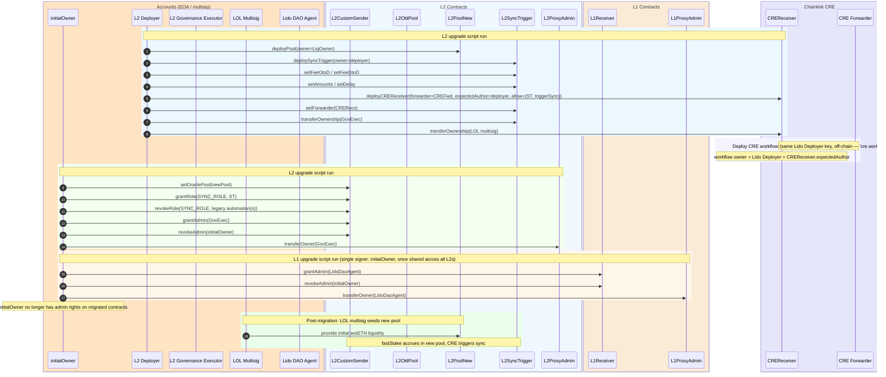

# Goal

Migrate Direct Staking ownership, admin roles, and liquidity management to Lido governance across four L2 networks (Optimism, Arbitrum, Base, Linea), deploying new pool and sync infrastructure and replacing Chainlink Automation with CRE workflows.

**Networks:** Optimism, Arbitrum, Base, Linea — all sharing a single L1 Receiver on Ethereum (`0x6F357d53d6bE3238180316BA5F8f11467e164588`).

**Contracts mutated** (per network):
- **L1** (shared): `LidoCustomReceiver` — admin → Lido DAO Agent; `ProxyAdmin` — owner → Lido DAO Agent
- **L2**: `CustomSenderReferral` — admin → L2 Governance Executor, oracle pool swapped, legacy automation(s) revoked from `SYNC_ROLE`; `ProxyAdmin` — owner → L2 Governance Executor; old `OraclePool` — orphaned (LOL multisig retains `sweep()` to drain residual balance post-migration)

**Contracts deployed** (per network): new `OraclePool`, `SyncTrigger`, `CREReceiver`

# Migration stages and actors

Stages are batched by actor to minimise handoffs. Each actor completes all their work before the next actor starts. See [`docs/OPS-PLAN.md`](docs/OPS-PLAN.md) for the compact one-page runbook.

| Stage                     | Actor             | Networks                                   | Script / action                                           | What it does                                                                                                                 |
| ------------------------- | ----------------- | ------------------------------------------ | --------------------------------------------------------- | ---------------------------------------------------------------------------------------------------------------------------- |
| 1. Deploy + CRE workflow  | **Lido Deployer** | Optimism, Arbitrum, Base, Linea            | `runDeploy()` → `update-cre-config` → `cre workflow deploy` | Deploy new OraclePool, SyncTrigger, CREReceiver; rewrite per-network CRE config; deploy TypeScript workflow on CRE DON     |
| 2. Migrate admin          | **Initial Owner** | Optimism, Arbitrum, Base, Linea + Ethereum | `runMigrate()` + `L1UpgradeScript.run()`                  | L2: swap oracle pool, grant/revoke SYNC_ROLE, migrate admin to final owners. L1 (once): migrate admin to Lido DAO Agent      |
| 3. Validate               | **Any operator**  | all                                        | `just test-<network>-upgrade-state-verify` + manual       | state-mate ≥ 45 on-chain checks per network + CRE-firing sanity; cancel legacy CLA upkeeps                                   |

Ordering rationale: deploying the CRE workflow before Stage 2 minimises the "no automated sync" window — once Stage 2 revokes `SYNC_ROLE` from the legacy automation, the CRE path is already live and takes over immediately.

## On-chain actions (ordered sequence)

**Stage 1 — Deploy (per L2 network)**
```
Lido Deployer  deploy PausableImmutableOraclePool(customSender, tokenIn, tokenOut, priceOracle, fee, liquidityOwner)
Lido Deployer  deploy SyncTrigger(customSender, destChainSelector, deployer)
Lido Deployer  SyncTrigger.setFeeOtoD(encodedFee)
Lido Deployer  SyncTrigger.setFeeDtoO(encodedFee)
Lido Deployer  SyncTrigger.setAmounts(minSyncAmount, maxSyncAmount)
Lido Deployer  SyncTrigger.setDelay(minSyncDelay)
Lido Deployer  deploy CREReceiver(creForwarder, expectedAuthor=deployer, syncTrigger, triggerSync.selector)
Lido Deployer  SyncTrigger.setForwarder(creReceiver)
Lido Deployer  SyncTrigger.transferOwnership(governanceExecutor)
Lido Deployer  CREReceiver.transferOwnership(liquidityOwner)
```

**CRE workflow deploy (off-chain, between Stage 1 and Stage 2, same Lido Deployer key)**
```
Lido Deployer  just update-cre-config <network> <syncTrigger> <creReceiver>
Lido Deployer  cre workflow deploy . --config config.deploy.<network>.json --target=production-settings
```

**Stage 1 verification (read-only, between Stage 1 and Stage 2)**
```
anyone  just verify-stage1 <network> <rpc> <pool> <trigger> <receiver>
anyone  just verify-cre-workflow <workflowId>
```
`verify-stage1` reverts if any of 18 on-chain post-conditions fail (OraclePool immutables; SyncTrigger immutables + fees/amounts/delay/forwarder; CREReceiver forwarder/expectedAuthor/allow-list/owner; guardrails that Stage 2 has not yet run). `verify-cre-workflow` queries Chainlink `WorkflowRegistry` on Ethereum L1 and asserts the workflow is registered, owned by the Lido Deployer, and `status == ACTIVE`. Both are read-only; no private key required.

**Stage 2 — Migrate L2 (per network)**
```
Initial Owner  CustomSender.setOraclePool(newPool)
Initial Owner  CustomSender.grantRole(SYNC_ROLE, syncTrigger)
Initial Owner  CustomSender.revokeRole(SYNC_ROLE, oldChainlinkAutomation)
Initial Owner  CustomSender.revokeRole(SYNC_ROLE, oldGelatoAutomation)      # Linea only
Initial Owner  CustomSender.grantRole(DEFAULT_ADMIN_ROLE, governanceExecutor)
Initial Owner  CustomSender.revokeRole(DEFAULT_ADMIN_ROLE, initialOwner)
Initial Owner  ProxyAdmin.transferOwnership(governanceExecutor)
```

**Stage 2 — Migrate L1 (once, shared)**
```
Initial Owner  L1Receiver.grantRole(DEFAULT_ADMIN_ROLE, lidoDaoAgent)
Initial Owner  L1Receiver.revokeRole(DEFAULT_ADMIN_ROLE, initialOwner)
Initial Owner  L1ProxyAdmin.transferOwnership(lidoDaoAgent)
```

10 deploy transactions + 6 migrate transactions per L2 network (7 for Linea, which also revokes Gelato automation) + 3 on L1 = **68 total** across 4 networks.

**Post-migration:** LOL multisig transfers initial wstETH liquidity to each new pool (direct ERC-20 transfer, one tx per network). This enables `fastStake` to operate.

## Migration ordering and in-flight transactions

**L2 first, then L1.** L1 and L2 migrations are functionally independent — the sync flow (`CustomSender → CCIP → L1Receiver → bridge adapter`) works before and after either migration because the `CustomSender` proxy address never changes. However, migrating L2 first is safer:

- L2 migration is the complex part (deploy + migrate across 4 networks). Keeping L1 admin access available during rollout provides an emergency safety net — Initial Owner can still call `setSender`, `setAdapter` on L1Receiver if needed.
- After L1 migration, any L1 changes require a Lido DAO governance vote (days/weeks of delay).
- L1 migration is trivial (3 txs, once) and best done last as a clean "seal" after all L2 networks are validated.

**In-flight sync transactions.** The sync round-trip encodes the oracle pool address into the CCIP message at call time (`CustomSender.sync()` sets `recipient = oraclePool`). When L1Receiver processes the message and bridges wstETH back to L2, tokens are delivered to whichever pool was active when the sync was initiated — not the current pool. If `setOraclePool(newPool)` runs while a sync is in-flight, the bridge-back delivers tokens to the **old pool**. Funds are recoverable via the old pool's `sweep()`, but require manual intervention.

**Mitigation:** before running Stage 2 for each network, confirm no syncs are in-flight. Run `just preflight-check <network> <L2_RPC_URL>` — it verifies chain-id, CustomSender reachability, and reports the legacy sync age; warns if the last sync was <12 h ago (the `minSyncDelay` is 12 h, so a fresh sync may still be round-tripping through CCIP + L1 bridge). Wait for any pending CCIP messages and bridge-backs to settle before proceeding.

**Old SyncAutomation SYNC_ROLE.** The migration revokes `SYNC_ROLE` from the old SyncAutomation immediately after granting it to the new SyncTrigger. Without revocation, the old automation could call `sync()` with malicious fee parameters, causing L1 processing to revert and trapping tokens in the failed message queue until governance calls `recoverTokens`.

See [Run migration](#run-migration) below for full per-stage commands, env vars, and validation checklist.

## Network migration order

Migrate networks with the least capital in the current pool first — this minimises risk during the initial rollout and validates the process on low-stakes deployments before touching larger pools.

Current OraclePool balances (queried 2026-04-20, wstETH/stETH rate: ~1.2323):

| # | Network  | OraclePool                                   | WETH    | wstETH  | ETH-equiv |
|---|----------|----------------------------------------------|---------|---------|-----------|
| 1 | Linea    | `0x6F357d53d6bE3238180316BA5F8f11467e164588` |  0.000  | 19.760  | **~24.35** |
| 2 | Arbitrum | `0x9c27c304cFdf0D9177002ff186A4aE0A5489Aace` |  5.185  | 27.216  | **~38.72** |
| 3 | Base     | `0x6F357d53d6bE3238180316BA5F8f11467e164588` | 28.784  |  8.116  | **~38.79** |
| 4 | Optimism | `0x6F357d53d6bE3238180316BA5F8f11467e164588` |  4.708  | 27.668  | **~38.80** |

**Preferred order:** Linea → Arbitrum → Base → Optimism (Arbitrum/Base/Optimism are within ~0.1 ETH of each other; any order among them is acceptable). Re-check balances just before each migration via `cast call <oldPool> "balanceOf(address)(uint256)" <weth|wsteth>` — they drift with each legacy automation sync.

# Migration runbook - TL;DR

See [`docs/OPS-PLAN.md`](docs/OPS-PLAN.md) for a single-page reference. The detailed version is below; run `just test-acceptance` first to dry-run the entire sequence against forks + state-mate (all 4 networks must be green before touching production).

Per-network variables — set `L2_SCRIPT` / `L2_RPC_URL` / `L1_SCRIPT` for each network before running stages 1–2:

```sh
# Optimism
export L2_SCRIPT=script/optimism/OptimismL2Upgrade.s.sol:OptimismL2UpgradeScript
export L1_SCRIPT=script/optimism/OptimismL1Upgrade.s.sol:OptimismL1UpgradeScript
export L2_RPC_URL=$L2_OPTIMISM_RPC_URL
# Arbitrum
export L2_SCRIPT=script/arbitrum/ArbitrumL2Upgrade.s.sol:ArbitrumL2UpgradeScript
export L1_SCRIPT=script/arbitrum/ArbitrumL1Upgrade.s.sol:ArbitrumL1UpgradeScript
export L2_RPC_URL=$L2_ARBITRUM_RPC_URL
# Base
export L2_SCRIPT=script/base/BaseL2Upgrade.s.sol:BaseL2UpgradeScript
export L1_SCRIPT=script/base/BaseL1Upgrade.s.sol:BaseL1UpgradeScript
export L2_RPC_URL=$L2_BASE_RPC_URL
# Linea
export L2_SCRIPT=script/linea/LineaL2Upgrade.s.sol:LineaL2UpgradeScript
export L1_SCRIPT=script/linea/LineaL1Upgrade.s.sol:LineaL1UpgradeScript
export L2_RPC_URL=$L2_LINEA_RPC_URL
```

### Preflight (per network, read-only)

```sh
just preflight-check <network> $L2_RPC_URL
```

Verifies chain-id, CustomSender reachability, logs legacy sync age. If `<12 h` since the last legacy sync, wait for the in-flight CCIP round-trip to complete.

### Stage 1 — Lido Deployer: deploy + configure + deploy CRE workflow (per network)

1. **Deploy contracts**
   ```sh
   forge script $L2_SCRIPT --sig "runDeploy()" --rpc-url "$L2_RPC_URL" --broadcast
   # record output:
   export L2_ORACLE_POOL=<...> L2_SYNC_TRIGGER=<...> L2_CRE_RECEIVER=<...>
   ```
   Env: `L2_LIDO_DEPLOYER_PRIVATE_KEY`, `L2_GOVERNANCE_EXECUTOR`, `L2_CRE_FORWARDER`.

   Post-state: SyncTrigger fully configured (fees, amounts, delay, forwarder → CREReceiver), SyncTrigger owner → L2 Governance Executor, CREReceiver owner → LOL multisig, CREReceiver `expectedAuthor` pinned to Lido Deployer, allow-list seeded with `(SyncTrigger, triggerSync())`.

2. **Verify Stage 1** (read-only, no private key needed)
   ```sh
   just verify-stage1 <network> $L2_RPC_URL $L2_ORACLE_POOL $L2_SYNC_TRIGGER $L2_CRE_RECEIVER
   ```
   Env: `L2_GOVERNANCE_EXECUTOR`, `L2_CRE_FORWARDER`, and either `L2_LIDO_DEPLOYER_ADDRESS` or `L2_LIDO_DEPLOYER_PRIVATE_KEY`. Runs 18 post-state assertions against the live RPC and reverts with a descriptive key on any mismatch. Includes guardrails that Stage 2 has NOT yet run.

3. **Update CRE workflow config**
   ```sh
   just update-cre-config <network> $L2_SYNC_TRIGGER $L2_CRE_RECEIVER
   ```
   Rewrites `cre-workflows/sync-automation/config.deploy.<network>.json` with the deployed addresses (refuses zero/placeholder values).

4. **Deploy CRE workflow** (off-chain, same Lido Deployer key)
   ```sh
   cd cre-workflows/sync-automation
   cre workflow deploy . --config config.deploy.<network>.json --target=production-settings
   ```
   The workflow owner recorded on `WorkflowRegistry` (Ethereum mainnet) = Lido Deployer = `CREReceiver.expectedAuthor`, so runtime authorization passes. The workflow fires on schedule but reverts at `SyncTrigger.triggerSync()` until Stage 2 grants `SYNC_ROLE`. Capture the `workflowId` from the CLI output.

5. **Verify CRE workflow registration** (read-only, on Ethereum L1)
   ```sh
   just verify-cre-workflow $CRE_WORKFLOW_ID
   ```
   Queries Chainlink `WorkflowRegistry 2.0.0` at `0x4Ac54353FA4Fa961AfcC5ec4B118596d3305E7e5` and asserts the workflow is registered, owned by the Lido Deployer, and `status == ACTIVE`. Env: `L1_RPC_URL`, and either `L2_LIDO_DEPLOYER_ADDRESS` or `L2_LIDO_DEPLOYER_PRIVATE_KEY`.

### Stage 2 — Initial Owner: migrate L2 + L1

Run `runMigrate()` for each network:

```sh
forge script $L2_SCRIPT --sig "runMigrate()" --rpc-url "$L2_RPC_URL" --broadcast
```

Env: `INITIAL_OWNER_PRIVATE_KEY`, `L2_GOVERNANCE_EXECUTOR`, `L2_ORACLE_POOL`, `L2_SYNC_TRIGGER`.

Atomic post-state (all via 7 on-chain read-backs; broadcast reverts on any mismatch): `CustomSender.getOraclePool` → new pool; `SYNC_ROLE` held by new SyncTrigger (revoked from legacy automation(s)); `DEFAULT_ADMIN` held by L2 Governance Executor (revoked from Initial Owner); L2 ProxyAdmin owned by L2 Governance Executor.

Then migrate L1 (once — any network's L1 script, L1 receiver is shared):

```sh
forge script $L1_SCRIPT --rpc-url "$L1_RPC_URL" --broadcast
```

Env: `INITIAL_OWNER_PRIVATE_KEY`, `LIDO_DAO_AGENT`.

Post-state: L1 Receiver `DEFAULT_ADMIN` → Lido DAO Agent (revoked from Initial Owner); L1 ProxyAdmin owned by Lido DAO Agent.

### Stage 3 — Validate (per network)

State-mate runs ≥ 45 live-RPC checks per network, including: new OraclePool set, `SYNC_ROLE` held only by new SyncTrigger (revoked from legacy automations), `DEFAULT_ADMIN` held only by L2 Governance Executor, L2 ProxyAdmin owner, `CREReceiver.getExpectedAuthor` = Lido Deployer, allow-list `(syncTrigger, triggerSync()) = true`.

```sh
just test-optimism-upgrade-state-verify $L2_OPTIMISM_RPC_URL
just test-arbitrum-upgrade-state-verify $L2_ARBITRUM_RPC_URL
just test-base-upgrade-state-verify     $L2_BASE_RPC_URL
just test-linea-upgrade-state-verify    $L2_LINEA_RPC_URL
```

Optional fork-based integration tests against live state:

```sh
forge test --match-contract "OptimismPoolUpgradeTest|OptimismCREIntegrationTest" --rpc-url "$L2_OPTIMISM_RPC_URL" -vvv
forge test --match-contract "ArbitrumPoolUpgradeTest|ArbitrumCREIntegrationTest" --rpc-url "$L2_ARBITRUM_RPC_URL" -vvv
forge test --match-contract "BasePoolUpgradeTest|BaseCREIntegrationTest"         --rpc-url "$L2_BASE_RPC_URL" -vvv
forge test --match-contract "LineaPoolUpgradeTest|LineaCREIntegrationTest"       --rpc-url "$L2_LINEA_RPC_URL" -vvv
```

### Post-migration

LOL multisig transfers initial wstETH to each new pool address (direct ERC-20 transfer, one tx per network); cancel any legacy CLA upkeeps on the old automation addresses.

# Key production entities

All participants from the production sequence diagram, split by account vs contract.

## Accounts (EOA / multisig)

| Component (diagram)           | Network             | Address / source                                                        | Type                                 |
| ----------------------------- | ------------------- | ----------------------------------------------------------------------- | ------------------------------------ |
| L2 Deployer (`LidoDep`)       | All L2s             | Signer from `L2_LIDO_DEPLOYER_PRIVATE_KEY`                              | EOA signer                           |
| initialOwner (`initialOwner`) | Ethereum + all L2s  | `0xb5c336a5c60D3482b29d83C742C65AE8351b91a8`                            | EOA signer                           |
| L2 Liquidity Owner (`LiqOwner`) | All L2s           | LOL multisig (per network, see below)                                   | Multisig (liquidity)                 |
| Lido DAO Agent (`LidoDaoAgent`) | Ethereum          | `0x3e40D73EB977Dc6a537aF587D48316feE66E9C8c` (default `LIDO_DAO_AGENT`) | Account (EOA or multisig, ops-owned) |

### L2 Governance Executors (per network)

| Network  | Address                                      |
|----------|----------------------------------------------|
| Optimism | `0xEfa0dB536d2c8089685630fafe88CF7805966FC3` |
| Arbitrum | `0x1dcA41859Cd23b526CBe74dA8F48aC96e14B1A29` |
| Base     | `0x2897A1b134050c01503843db48e034d4C9e2b18c` |
| Linea    | `0x2897A1b134050c01503843db48e034d4C9e2b18c` |

### Liquidity Observation Lab (LOL) multisigs (per network)

Pool owner and post-migration liquidity provider. See [Lido deployed contracts](https://docs.lido.fi/deployed-contracts/#liquidity-observation-lab-multisigs).

| Network  | Address                                      |
|----------|----------------------------------------------|
| Optimism | `0x5A9d695c518e95CD6Ea101f2f25fC2AE18486A61` |
| Arbitrum | `0x5A9d695c518e95CD6Ea101f2f25fC2AE18486A61` |
| Base     | `0x5A9d695c518e95CD6Ea101f2f25fC2AE18486A61` |
| Linea    | `0xA8EF4Db842d95DE72433a8B5b8fF40cB9C74c1B6` |

## Contracts

### L1 (Ethereum) — shared across all networks

| Component               | Address                                      | Source contract |
|--------------------------|----------------------------------------------|-----------------|
| L1Receiver (`L1R`)       | `0x6F357d53d6bE3238180316BA5F8f11467e164588` | [`LidoCustomReceiver.sol`](https://github.com/Aphyla/chainlink-csr/blob/62108f7b6cc664e36dbc8100c4b48974d59f572e/contracts/receivers/LidoCustomReceiver.sol) |
| L1ProxyAdmin (`L1PA`)    | `0x88a45d2760b63c1500E3D2E3552b28e5Cdaa37BD` | [`ProxyAdmin.sol`](https://github.com/OpenZeppelin/openzeppelin-contracts/blob/dbb6104ce834628e473d2173bbc9d47f81a9eec3/contracts/proxy/transparent/ProxyAdmin.sol) |

### L1 Adapters (per network)

| Network  | L1 Adapter Address                           |
|----------|----------------------------------------------|
| Optimism | `0x328de900860816d29D1367F6903a24D8ed40C997` |
| Arbitrum | `0xBf96561e4519182CFA4cebBf95494D9CA5a316f9` |
| Base     | `0x9c27c304cFdf0D9177002ff186A4aE0A5489Aace` |
| Linea    | `0x122beD1eB48DC4679DDF2C8fc159e9c498344397` |

### L2 Contracts (per network)

| Component                | Optimism                                     | Arbitrum                                     | Base                                         | Linea                                        |
|--------------------------|----------------------------------------------|----------------------------------------------|----------------------------------------------|----------------------------------------------|
| L2CustomSender (`CS`)    | `0x328de900860816d29D1367F6903a24D8ed40C997` | `0x72229141D4B016682d3618ECe47c046f30Da4AD1` | `0x328de900860816d29D1367F6903a24D8ed40C997` | `0x328de900860816d29D1367F6903a24D8ed40C997` |
| L2ProxyAdmin (`L2PA`)    | `0x4c8c4A15c1e810e481c412A9B06Be5f79dC02192` | `0x5B42aEbFe95247f1d22e282831e2A513bF050217` | `0x4c8c4A15c1e810e481c412A9B06Be5f79dC02192` | `0x4c8c4A15c1e810e481c412A9B06Be5f79dC02192` |
| L2OldPool (`OldPool`)    | `0x6F357d53d6bE3238180316BA5F8f11467e164588` | `0x9c27c304cFdf0D9177002ff186A4aE0A5489Aace` | `0x6F357d53d6bE3238180316BA5F8f11467e164588` | `0x6F357d53d6bE3238180316BA5F8f11467e164588` |
| L2PriceOracle            | `0x301cBCDA894c932E9EDa3Cf8878f78304e69E367` | `0x328de900860816d29D1367F6903a24D8ed40C997` | `0x301cBCDA894c932E9EDa3Cf8878f78304e69E367` | `0x301cBCDA894c932E9EDa3Cf8878f78304e69E367` |
| L2PoolNew (`NewPool`)    | Deployed during migration                    | Deployed during migration                    | Deployed during migration                    | Deployed during migration                    |
| L2SyncTrigger (`ST`)     | Deployed during migration                    | Deployed during migration                    | Deployed during migration                    | Deployed during migration                    |
| CREReceiver (`CRERecv`)  | Deployed during CRE migration                | Deployed during CRE migration                | Deployed during CRE migration                | Deployed during CRE migration                |

All L2 contracts use [`CustomSenderReferral.sol`](https://github.com/Aphyla/chainlink-csr/blob/62108f7b6cc664e36dbc8100c4b48974d59f572e/contracts/senders/CustomSenderReferral.sol) and [`PausableImmutableOraclePool.sol`](https://github.com/Aphyla/chainlink-csr/blob/62108f7b6cc664e36dbc8100c4b48974d59f572e/contracts/utils/PausableImmutableOraclePool.sol) from the chainlink-csr library. `SyncTrigger.sol` is defined in this repo (`src/SyncTrigger.sol`).

## Current on-chain role model (pre-migration)

All networks share the same role layout. Migration has not executed yet.

| Contract | Role / slot | Current holder | After migration |
|----------|------------|----------------|-----------------|
| **L1 Receiver** | `DEFAULT_ADMIN_ROLE` | Initial Owner (`0xb5c336`) | Lido DAO Agent (`0x3e40D7`) |
| **L1 ProxyAdmin** | `owner` | Initial Owner | Lido DAO Agent |
| **L2 CustomSender** | `DEFAULT_ADMIN_ROLE` | Initial Owner | L2 Governance Executor |
| **L2 ProxyAdmin** | `owner` | Initial Owner | L2 Governance Executor |
| **L2 Old Pool** | `owner` (can `sweep`) | Old Liquidity Owner (`0x2897A1`) | unchanged (not migrated) |
| **L2 New Pool** | `owner` (can `sweep`) | — (not deployed) | LOL multisig |
| **L2 SyncTrigger** | `owner` | — (not deployed) | L2 Governance Executor |

# Migration Sequence (Production)



# Liquidity Provision (L2 New Pool)

This section defines who can provide liquidity and who can withdraw it after migration. The same rules apply on all L2 networks.

- The new pool (`L2PoolNew`) is deployed with `owner = L2_LIQUIDITY_OWNER` (default: network LOL multisig).
- `L2CustomSender` admin ownership remains on `L2_GOVERNANCE_EXECUTOR`.
- `fastStake` consumes pool `wstETH` liquidity and accumulates `WETH` in the pool.
- Any address can provide `wstETH` liquidity by transferring tokens to the pool address.
- Only the pool owner can withdraw pool balances (`WETH`/`wstETH`) via `sweep`.
- Practical implication: non-owner addresses can top up liquidity, but they cannot permissionlessly recover those funds from the pool.

# Sync fee parameters (FeeOtoD / FeeDtoO)

The sync operation moves accumulated WETH from an L2 OraclePool to Ethereum (via CCIP), stakes it through Lido, and bridges the resulting wstETH back to the L2 pool. Two encoded fee blobs govern the costs of each leg:

| Fee blob | Direction | What it pays for | Set by |
|----------|-----------|------------------|--------|
| **FeeOtoD** | L2 → Ethereum (CCIP) | CCIP message delivery + `ccipReceive` execution on Ethereum | `SyncTrigger.setFeeOtoD()` |
| **FeeDtoO** | Ethereum → L2 (native bridge) | L1 adapter bridge call that sends wstETH back to L2 | `SyncTrigger.setFeeDtoO()` |

## How fees flow through the system

```
SyncTrigger.triggerSync()
  │  reads _feeOtoD, _feeDtoO from storage
  │  calculates native ETH needed: sum of non-LINK fee amounts
  │
  ├─► CustomSender.sync{value: nativeETH}(destSelector, amount, feeOtoD, feeDtoO)
  │     │  decodes feeDtoO → pulls fee tokens (ETH or LINK) from caller
  │     │  decodes feeOtoD → extracts maxFee, payInLink, gasLimit
  │     │  packs feeDtoO into CCIP message data alongside recipient + amount
  │     │
  │     └─► CCIP Router.ccipSend()  ← pays feeOtoD here
  │           │  routes message to Ethereum
  │           │
  │           └─► LidoCustomReceiver.ccipReceive()  ← gasLimit governs this execution
  │                 │  unpacks feeDtoO from message data
  │                 │  stakes ETH in Lido → receives wstETH
  │                 │
  │                 └─► L1 Adapter.sendToken(wstETH, feeDtoO)  ← pays feeDtoO here
  │                       │  decodes feeDtoO per network format
  │                       └─► native bridge (Arbitrum Gateway / OP Bridge / Linea Bridge)
  │                             └─► wstETH arrives on L2 pool
```

## FeeOtoD encoding (CCIP, all networks)

Encoded with `FeeCodec.encodeCCIP(maxFee, payInLink, gasLimit)` — 21 bytes.

| Field | Type | Description |
|-------|------|-------------|
| `maxFee` | `uint128` | Slippage guard — reverts if actual CCIP fee exceeds this. Only the actual fee is charged; excess is not spent. |
| `payInLink` | `bool` | `true` = pay in LINK (~10% discount), `false` = pay in native ETH. |
| `gasLimit` | `uint32` | Gas budget for `ccipReceive()` on Ethereum. Must be >= 75,000 (enforced by `CustomSender`). Covers: unpack message → Lido stake → adapter bridge call. |

**Sizing `gasLimit`:** The receiver must unpack the message, stake ETH through Lido, approve wstETH, and delegate-call the bridge adapter. Current mainnet value is **800,000** for Optimism/Arbitrum/Base and **400,000** for Linea. If too low, the CCIP message enters a failed state and requires [manual re-execution](https://docs.chain.link/ccip/concepts/manual-execution) with a higher gas limit.

**Sizing `maxFee`:** Query `IRouterClient.getFee()` off-chain and add a 10–20% buffer for gas price fluctuation. Current mainnet value is **0.1 ETH** across all networks.

## FeeDtoO encoding (network-specific)

Each L2 network uses a different L1→L2 bridge with its own fee model. The L1 adapter decodes FeeDtoO and calls the native bridge accordingly.

### Arbitrum — `FeeCodec.encodeArbitrumL1toL2(maxSubmissionCost, maxGas, gasPriceBid)` — 29 bytes

| Field | Type | Description |
|-------|------|-------------|
| `maxSubmissionCost` | `uint128` | Base cost for creating a retryable ticket on L2. If too low, the L1 transaction reverts. |
| `maxGas` | `uint32` | Gas limit for L2 auto-redemption of the retryable ticket. |
| `gasPriceBid` | `uint64` | L2 gas price bid. If below L2 base fee, auto-redemption fails (ticket can be manually redeemed within ~7 days). |

Total ETH required: `feeAmount = maxSubmissionCost + (gasPriceBid × maxGas)`. Excess is refunded on L2.

Current values: `maxSubmissionCost=0.001 ETH`, `maxGas=100,000`, `gasPriceBid=0.05 gwei`.

### Optimism / Base — `FeeCodec.encodeOptimismL1toL2(l2Gas)` / `encodeBaseL1toL2(l2Gas)` — 21 bytes

| Field | Type | Description |
|-------|------|-------------|
| `feeAmount` | `uint128` | Always **0**. The adapter reverts if non-zero. Bridge cost is paid implicitly via L1 gas burn. |
| `l2Gas` | `uint32` | Minimum gas guaranteed for L2 deposit execution. L2 gas is not refundable — if too low, the deposit fails with **no recovery mechanism**. |

Current value: `l2Gas=100,000`.

### Linea — `FeeCodec.encodeLineaL1toL2()` — 17 bytes

| Field | Type | Description |
|-------|------|-------------|
| `feeAmount` | `uint128` | Always **0**. Linea sponsors the postman fee for L1→L2 messages under 250,000 gas. |

No additional parameters. The adapter reverts if `feeAmount != 0` or `payInLink == true`.

## Current mainnet values

| Parameter | Optimism | Arbitrum | Base | Linea |
|-----------|----------|----------|------|-------|
| **FeeOtoD maxFee** | 0.1 ETH | 0.1 ETH | 0.1 ETH | 0.1 ETH |
| **FeeOtoD payInLink** | false | false | false | false |
| **FeeOtoD gasLimit** | 800,000 | 800,000 | 800,000 | 400,000 |
| **FeeDtoO format** | Optimism L1→L2 | Arbitrum L1→L2 | Base L1→L2 | Linea L1→L2 |
| **FeeDtoO feeAmount** | 0 | 0.006 ETH* | 0 | 0 |
| **FeeDtoO l2Gas / maxGas** | 100,000 | 100,000 | 100,000 | — |

\* Arbitrum `feeAmount = maxSubmissionCost + gasPriceBid × maxGas = 0.001 + 0.00000005 × 100,000 = 0.006 ETH`.

## Failure modes and recovery

| Leg | Failure | Cause | Recovery |
|-----|---------|-------|----------|
| CCIP (OtoD) | `CCIPSenderExceedsMaxFee` revert | `maxFee` too low vs actual CCIP fee | Increase `maxFee`, retry |
| CCIP (OtoD) | `ccipReceive` out of gas | `gasLimit` too low for stake + bridge | [Manual re-execution](https://docs.chain.link/ccip/concepts/manual-execution) with higher gas |
| Arbitrum (DtoO) | L1 tx reverts | `maxSubmissionCost` too low | Increase and retry |
| Arbitrum (DtoO) | Auto-redeem fails | `maxGas` or `gasPriceBid` too low | Manual redeem within ~7 days via [Arbitrum retryable dashboard](https://retryable-dashboard.arbitrum.io/) |
| Optimism/Base (DtoO) | L2 deposit execution fails | `l2Gas` too low | **No recovery** — funds can be lost. Size conservatively with 20%+ buffer. |
| Linea (DtoO) | Postman won't deliver | Message uses >250k gas without fee | Manual claim or provide fee |

## References

- [CCIP gasLimit optimization](https://docs.chain.link/ccip/tutorials/evm/ccipreceive-gaslimit)
- [CCIP billing](https://docs.chain.link/ccip/billing)
- [CCIP manual execution](https://docs.chain.link/ccip/concepts/manual-execution)
- [Arbitrum L1→L2 messaging](https://docs.arbitrum.io/how-arbitrum-works/arbos/l1-l2-messaging)
- [Optimism deposit flow](https://docs.optimism.io/stack/transactions/deposit-flow)
- [Linea message service](https://docs.linea.build/get-started/concepts/message-service)

# CRE Workflow (replaces Chainlink Automation)

Pool rebalancing is triggered by a CRE (Chainlink Runtime Environment) TypeScript workflow instead of Chainlink Automation (CLA). The workflow runs on Chainlink's Decentralized Oracle Network (DON) as compiled WASM.

## Architecture

```
CRE DON (TypeScript/WASM, off-chain)
  ├── CronCapability trigger (every 5 minutes)
  ├── EVMClient.callContract() → SyncTrigger.shouldSync()
  ├── If syncNeeded:
  │   ├── Encode triggerSync() calldata
  │   ├── Wrap in abi.encode(target, data) for CREReceiver
  │   ├── runtime.report() → sign with ECDSA/Keccak256
  │   └── EVMClient.writeReport() → CRE Forwarder
  │
CRE Forwarder (on-chain, verifies signatures)
  └── CREReceiver.onReport(metadata, report)
      └── SyncTrigger.triggerSync()
          └── CustomSender.sync() → CCIP → L1
```

## Files

| Path                                                         | Purpose                                                              |
| ------------------------------------------------------------ | -------------------------------------------------------------------- |
| `src/cre/CREReceiver.sol`                                    | On-chain receiver — decodes reports and calls target contracts       |
| `src/cre/interfaces/IReceiver.sol`                           | CRE receiver interface                                               |
| `cre-workflows/sync-automation/main.ts`                      | CRE workflow entry point                                             |
| `cre-workflows/sync-automation/encoding.ts`                  | Pure encoding/decoding helpers (testable outside WASM)               |
| `cre-workflows/sync-automation/abi.ts`                       | SyncTrigger ABI definitions                                          |
| `cre-workflows/sync-automation/config.deploy.<network>.json` | Per-network production config (Optimism, Arbitrum, Base, Linea)      |
| `cre-workflows/sync-automation/config.deploy.json`           | Base production config (Optimism defaults)                           |
| `cre-workflows/sync-automation/config.simulate.json`         | Local simulation config                                              |
| `cre-workflows/sync-automation/config.test.json`             | Testnet config (Optimism Sepolia)                                    |

## Setup

```sh
# Install CRE workflow dependencies (requires Bun on PATH)
just setup-cre

# Run TypeScript tests
just test-cre-workflow
```

## Deployment

CREReceiver is deployed per L2 network as part of Stage 1 `runDeploy` (which also configures `SyncTrigger.setForwarder(CREReceiver)` and pins `expectedAuthor` to the Lido Deployer). Workflow deployment happens immediately after `runDeploy`, before Stage 2:

1. Rewrite `config.deploy.<network>.json` with the deployed addresses — `just update-cre-config <network> $L2_SYNC_TRIGGER $L2_CRE_RECEIVER`.
2. Deploy the workflow: `cd cre-workflows/sync-automation && cre workflow deploy . --config config.deploy.<network>.json --target=production-settings`
3. Repeat for each network (Optimism, Arbitrum, Base, Linea).
4. Monitor at `cre.chain.link/workflows`.

See [`docs/LEVERS.md`](docs/LEVERS.md) for CREReceiver admin functions.

# Run migration

Stages are batched by actor. In the commands below, `$L2_SCRIPT` / `$L1_SCRIPT` / `$L2_RPC_URL` refer to the values from the [script reference](#per-network-script-reference) table. Before touching production, run `just test-acceptance` end-to-end against forks (4 × migration + state-mate + integration tests) and confirm all green.

## Per-network script reference

| Network  | L2 Script                                                  | L1 Script                                                  | L2 RPC env var          |
|----------|------------------------------------------------------------|------------------------------------------------------------|-------------------------|
| Optimism | `script/optimism/OptimismL2Upgrade.s.sol:OptimismL2UpgradeScript` | `script/optimism/OptimismL1Upgrade.s.sol:OptimismL1UpgradeScript` | `$L2_OPTIMISM_RPC_URL`  |
| Arbitrum | `script/arbitrum/ArbitrumL2Upgrade.s.sol:ArbitrumL2UpgradeScript` | `script/arbitrum/ArbitrumL1Upgrade.s.sol:ArbitrumL1UpgradeScript` | `$L2_ARBITRUM_RPC_URL`  |
| Base     | `script/base/BaseL2Upgrade.s.sol:BaseL2UpgradeScript`             | `script/base/BaseL1Upgrade.s.sol:BaseL1UpgradeScript`             | `$L2_BASE_RPC_URL`      |
| Linea    | `script/linea/LineaL2Upgrade.s.sol:LineaL2UpgradeScript`          | `script/linea/LineaL1Upgrade.s.sol:LineaL1UpgradeScript`          | `$L2_LINEA_RPC_URL`     |

## Preflight (per network, read-only)

```sh
just preflight-check <network> $L2_RPC_URL
```

Verifies chain-id, CustomSender reachability, reports legacy sync age; warns if another sync is likely still round-tripping through CCIP + L1 bridge.

## Stage 1 — Lido Deployer: deploy + CRE workflow (per network)

**1a. Deploy contracts** (`runDeploy()`):

```sh
forge script $L2_SCRIPT --sig "runDeploy()" --rpc-url "$L2_RPC_URL" --broadcast
```

Record the output addresses:
```sh
export L2_ORACLE_POOL=<pool_address_from_output>
export L2_SYNC_TRIGGER=<sync_trigger_address_from_output>
export L2_CRE_RECEIVER=<cre_receiver_address_from_output>
```

Post-state:
- SyncTrigger fully configured (fees, amounts, delay, forwarder → CREReceiver)
- SyncTrigger owner → L2 Governance Executor
- CREReceiver owner → LOL multisig
- CREReceiver `expectedAuthor` pinned to Lido Deployer (immutable)
- CREReceiver allow-list seeded: `(SyncTrigger, triggerSync()) = true`

Env: `L2_LIDO_DEPLOYER_PRIVATE_KEY`, `L2_GOVERNANCE_EXECUTOR`, `L2_CRE_FORWARDER`, `L2_LIQUIDITY_OWNER` (optional, defaults to LOL multisig).

**1b. Verify Stage 1** (read-only, no private key needed — callable by anyone):

```sh
just verify-stage1 <network> $L2_RPC_URL $L2_ORACLE_POOL $L2_SYNC_TRIGGER $L2_CRE_RECEIVER
```

Runs 18 on-chain post-state assertions via `runVerifyStage1()` and reverts with a descriptive key on mismatch:

- OraclePool immutables: `SENDER`, `TOKEN_IN`, `TOKEN_OUT`, `getOracle`, `getFee`, `owner`, `paused == false`.
- SyncTrigger immutables + config: `SENDER`, `DEST_CHAIN_SELECTOR`, `WNATIVE`, `getDelay`, `getAmounts`, `getFeeOtoD` (byte-match), `getFeeDtoO` (byte-match).
- CREReceiver: `getForwarder`, `getExpectedAuthor`, `isCallAllowed((SyncTrigger, triggerSync()))`, `owner`.
- Guardrails: `CustomSender.getOraclePool()` is NOT yet the new pool; `SYNC_ROLE` is NOT yet held by the new SyncTrigger.

Env: `L2_GOVERNANCE_EXECUTOR`, `L2_CRE_FORWARDER`, and either `L2_LIDO_DEPLOYER_ADDRESS` or `L2_LIDO_DEPLOYER_PRIVATE_KEY` (used only to derive the address — no broadcast).

**1c. Update CRE workflow config** with deployed addresses:

```sh
just update-cre-config <network> $L2_SYNC_TRIGGER $L2_CRE_RECEIVER
```

Refuses zero/placeholder values. Rewrites `cre-workflows/sync-automation/config.deploy.<network>.json`.

**1d. Deploy CRE workflow** (off-chain, same Lido Deployer key):

```sh
cd cre-workflows/sync-automation
cre workflow deploy . --config config.deploy.<network>.json --target=production-settings
```

Monitor at `cre.chain.link/workflows`. The workflow owner on `WorkflowRegistry` (Ethereum mainnet) = Lido Deployer = `CREReceiver.expectedAuthor`, so runtime authorization passes. The workflow fires on schedule but reverts inside `SyncTrigger.triggerSync()` until Stage 2 grants `SYNC_ROLE`. Capture the `workflowId` from the CLI output for the next step.

**1e. Verify CRE workflow registration** (read-only, on Ethereum L1):

```sh
just verify-cre-workflow $CRE_WORKFLOW_ID
```

Runs `forge script script/shared/VerifyCREWorkflow.s.sol:VerifyCREWorkflow` against `$L1_RPC_URL`. Queries `WorkflowRegistry 2.0.0` at `0x4Ac54353FA4Fa961AfcC5ec4B118596d3305E7e5` via `getWorkflowById(workflowId)` and asserts:

- workflow is registered (non-zero metadata)
- `owner == L2_LIDO_DEPLOYER_ADDRESS` (= `CREReceiver.expectedAuthor`)
- `status == ACTIVE` (enum value `0`)

Prints full metadata (name, tag, donFamily, configUrl, createdAt) for visual inspection. Env: `L1_RPC_URL`, and either `L2_LIDO_DEPLOYER_ADDRESS` or `L2_LIDO_DEPLOYER_PRIVATE_KEY`.

## Stage 2 — Initial Owner: migrate L2 + L1

Run `runMigrate()` for Optimism, Arbitrum, Base, Linea:

```sh
forge script $L2_SCRIPT --sig "runMigrate()" --rpc-url "$L2_RPC_URL" --broadcast
```

Atomic post-state (7 on-chain read-backs; broadcast reverts on any mismatch):
- CustomSender oracle pool → new pool
- CustomSender `SYNC_ROLE` → new SyncTrigger (old automation revoked — Linea also revokes Gelato)
- CustomSender `DEFAULT_ADMIN` → L2 Governance Executor (Initial Owner revoked)
- L2 ProxyAdmin owner → L2 Governance Executor
- Initial Owner no longer has admin rights on L2

Env: `INITIAL_OWNER_PRIVATE_KEY`, `L2_GOVERNANCE_EXECUTOR`, `L2_ORACLE_POOL`, `L2_SYNC_TRIGGER`.

Then migrate L1 (once — any network's L1 script will do, L1 receiver is shared):

```sh
forge script $L1_SCRIPT --rpc-url "$L1_RPC_URL" --broadcast
```

Post-state:
- L1 Receiver `DEFAULT_ADMIN_ROLE` → Lido DAO Agent (Initial Owner revoked)
- L1 ProxyAdmin owner → Lido DAO Agent

Env: `INITIAL_OWNER_PRIVATE_KEY`, `LIDO_DAO_AGENT`.

## Stage 3 — Validation

**Automated state-mate checks** (per network, preferred — ≥ 45 live-RPC assertions each):

```sh
just test-optimism-upgrade-state-verify $L2_OPTIMISM_RPC_URL
just test-arbitrum-upgrade-state-verify $L2_ARBITRUM_RPC_URL
just test-base-upgrade-state-verify     $L2_BASE_RPC_URL
just test-linea-upgrade-state-verify    $L2_LINEA_RPC_URL
```

The full post-migration expectations encoded in the state-mate YAMLs are summarized below for manual spot-checks via `cast call` / explorer:

**L2 checks** (per network, on the L2 block explorer or via `cast call`):

| Check | Contract | Call | Expected |
|-------|----------|------|----------|
| CustomSender admin | L2CustomSender | `hasRole(DEFAULT_ADMIN_ROLE, govExecutor)` | `true` |
| CustomSender old admin removed | L2CustomSender | `hasRole(DEFAULT_ADMIN_ROLE, initialOwner)` | `false` |
| SYNC_ROLE granted | L2CustomSender | `hasRole(SYNC_ROLE, syncTrigger)` | `true` |
| Old SYNC_ROLE revoked | L2CustomSender | `hasRole(SYNC_ROLE, oldChainlinkAutomation)` | `false` |
| Old Gelato SYNC_ROLE revoked (Linea only) | L2CustomSender | `hasRole(SYNC_ROLE, oldGelatoAutomation)` | `false` |
| ProxyAdmin owner | L2ProxyAdmin | `owner()` | L2 Governance Executor |
| OraclePool set | L2CustomSender | `getOraclePool()` | new pool address |
| SyncTrigger owner | SyncTrigger | `owner()` | L2 Governance Executor |
| SyncTrigger forwarder | SyncTrigger | `getForwarder()` | CREReceiver address |
| CREReceiver owner | CREReceiver | `owner()` | LOL multisig |
| CREReceiver `expectedAuthor` | CREReceiver | `getExpectedAuthor()` | Lido Deployer |
| CREReceiver allow-list | CREReceiver | `isCallAllowed(syncTrigger, 0x340b2b0b)` | `true` |
| SyncTrigger fees | SyncTrigger | `getFeeOtoD()` / `getFeeDtoO()` | matches `*MigrationConstants` |
| SyncTrigger amounts | SyncTrigger | `getAmounts()` | `(minAmount, maxAmount)` |
| SyncTrigger delay | SyncTrigger | `getDelay()` | configured delay |

**L1 checks** (once, on Etherscan or via `cast call`):

| Check | Contract | Call | Expected |
|-------|----------|------|----------|
| Receiver admin | L1Receiver | `hasRole(DEFAULT_ADMIN_ROLE, lidoDaoAgent)` | `true` |
| Receiver old admin removed | L1Receiver | `hasRole(DEFAULT_ADMIN_ROLE, initialOwner)` | `false` |
| ProxyAdmin owner | L1ProxyAdmin | `owner()` | Lido DAO Agent |

**CRE checks** (per network):
- CRE workflow is active at `cre.chain.link/workflows`
- `SyncTrigger.shouldSync()` returns `true` when pool balance >= minAmount and delay has elapsed
- A test `triggerSync` via CREReceiver succeeds end-to-end

**Cleanup:**
- Cancel any legacy Chainlink Automation (CLA) upkeeps that were previously active on each network

# Multi-network support

All four L2 networks (Optimism, Arbitrum, Base, Linea) use the same shared migration actions and reusable fork-test suite. Each network provides:

- A constants library (`*MigrationConstants.sol`) with network-specific addresses and fee parameters
- A defaults contract (`*L2Defaults`) with the config builder and bridge fee encoding
- A slim upgrade script (`*L2UpgradeScript`) inheriting from `L2UpgradeScriptBase`
- A fork-test base and test harness

All constants are aligned with the canonical Lido deployment data vendored in `lib/chainlink-csr`.

## Network differences

The migration logic, SyncTrigger contract, state-mate verification schema, and CRE workflow schedule are identical across all networks. The differences below are the only things that change per network.

### Bridge fee model (FeeDtoO) — primary architectural differentiator

Each L2 uses a different native bridge for the L1→L2 return leg, so the FeeDtoO encoding format and parameters differ:

| Network | Encoder | Parameters | Encoding size |
|---------|---------|------------|---------------|
| Optimism | `FeeCodec.encodeOptimismL1toL2(l2Gas)` | `l2Gas=100,000` | 21 bytes |
| Arbitrum | `FeeCodec.encodeArbitrumL1toL2(maxSubmissionCost, maxGas, gasPriceBid)` | `0.001 ETH, 100k, 0.05 gwei` | 29 bytes |
| Base | `FeeCodec.encodeBaseL1toL2(l2Gas)` | `l2Gas=100,000` | 21 bytes |
| Linea | `FeeCodec.encodeLineaL1toL2()` | *(none)* | 17 bytes |

Fee encoding is baked into the L2 config at script construction time. SyncTrigger treats fee blobs as opaque bytes — it passes them to `CustomSender.sync()` without decoding.

### CCIP destination gas limit (FeeOtoD)

| Parameter | Optimism | Arbitrum | Base | Linea |
|-----------|----------|----------|------|-------|
| `destinationGasLimit` | 800,000 | 800,000 | 800,000 | **400,000** |

All other FeeOtoD parameters (maxFee = 0.1 ETH, payInLink = false) and sync parameters (minAmount = 5 ETH, maxAmount = 100 ETH, delay = 12 h) are identical across networks.

### Governance executors

| Network | Address |
|---------|---------|
| Optimism | `0xEfa0dB536d2c8089685630fafe88CF7805966FC3` |
| Arbitrum | `0x1dcA41859Cd23b526CBe74dA8F48aC96e14B1A29` |
| Base | `0x2897A1b134050c01503843db48e034d4C9e2b18c` |
| Linea | `0x2897A1b134050c01503843db48e034d4C9e2b18c` |

Base and Linea share the same governance executor address.

### Liquidity owner (LOL multisig)

| Network | Address |
|---------|---------|
| Optimism, Arbitrum, Base | `0x5A9d695c518e95CD6Ea101f2f25fC2AE18486A61` |
| Linea | `0xA8EF4Db842d95DE72433a8B5b8fF40cB9C74c1B6` |

Linea uses a different LOL multisig than the other three networks. Post-migration liquidity seeding must use the correct multisig per network.

### Contract address sharing

Many pre-existing contracts were deployed at the same address across OP-Stack chains (Optimism, Base, Linea) but at different addresses on Arbitrum:

| Component | Optimism | Base | Linea | Arbitrum |
|-----------|----------|------|-------|----------|
| CustomSender | `0x328de9…` | same | same | **different** |
| CustomSender impl | `0x65498…` | same | **different** | **different** |
| ProxyAdmin | `0x4c8c4A…` | same | same | **different** |
| Price Oracle | `0x301cBC…` | same | same | **different** |
| Old OraclePool | `0x6F357d…` | same | same | **different** |

Token addresses (WETH, wstETH, LINK) and CCIP infrastructure (router, chain selector) are unique per network. Optimism and Base share the OP-Stack standard WETH (`0x4200…0006`); Arbitrum and Linea each have their own.

### Linea-specific considerations

Linea is the most architecturally distinct network:

- **No bridge fee parameters** — `encodeLineaL1toL2()` takes zero arguments; the Linea message service reverts if `feeAmount != 0` or `payInLink == true`
- **Lower CCIP gas limit** — 400k vs 800k on other networks
- **Unique LOL multisig** — different address from Optimism/Arbitrum/Base
- **Non-standard WETH** — `0xe5D7C2a44FfDDf6b295A15c148167daaAf5Cf34f` (not the OP-Stack `0x4200…0006`)
- **Unique CustomSender implementation** — different impl address from Optimism/Base (though same proxy address)

# Sepolia testnet deployment

The corresponding helper recipes are:

- `just sepolia-deploy-csr`
- `just sepolia-upgrade-l2`
- `just sepolia-upgrade-l1`
- `just rpc-start-l1-sepolia`
- `just rpc-start-l2-optimism-sepolia`

# Tests

## Pool upgrade tests (fork-based)

- Shared harness:
  - `test/helpers/UpgradeTestBase.sol`
  - `test/helpers/PoolUpgradeTests.sol`
- Network-specific suites (17 tests each):
  - `test/OptimismPoolUpgrade.t.sol`
  - `test/ArbitrumPoolUpgrade.t.sol`
  - `test/BasePoolUpgrade.t.sol`
  - `test/LineaPoolUpgrade.t.sol`
- Network-specific bases:
  - `test/helpers/OptimismUpgradeTestBase.sol`
  - `test/helpers/ArbitrumUpgradeTestBase.sol`
  - `test/helpers/BaseUpgradeTestBase.sol`
  - `test/helpers/LineaUpgradeTestBase.sol`
- Coverage includes: L1/L2 role and ownership migration, fast/slow stake behavior after pool swap, old pool isolation, liquidity provision/sweep, and sync path across CCIP routing.

```sh
# All networks (requires L1_RPC_URL + respective L2 RPC)
forge test

# Individual networks
just test-optimism-upgrade
just test-arbitrum-upgrade
```

Notes:
- Each fork suite requires a working `L1_RPC_URL` and the corresponding `L2_*_RPC_URL`.
- `just test-arbitrum-upgrade` prefers `LOCAL_L2_ARBITRUM_RPC_URL` when present and otherwise falls back to `L2_ARBITRUM_RPC_URL`.

## CRE tests

- `test/CREReceiverTest.t.sol` — 25 unit tests for the CREReceiver contract (no fork required)
- `test/CREIntegrationTest.t.sol` — 8 fork-based integration tests per network (Optimism, Arbitrum, Base, Linea = 32 total), covering the full CRE Forwarder → CREReceiver → SyncTrigger → sync path
- `test/helpers/CREIntegrationTests.sol` — shared CRE test logic (same pattern as `PoolUpgradeTests.sol`)
- `cre-workflows/sync-automation/main.test.ts` — 11 TypeScript tests for workflow encoding/decoding logic

```sh
# Unit tests only (no RPC required)
just test-cre-receiver

# Integration tests (requires L1_RPC_URL + L2_OPTIMISM_RPC_URL)
just test-cre-integration

# All Solidity CRE tests
just test-cre

# TypeScript workflow tests
just test-cre-workflow

# Everything (Solidity + TypeScript)
just test-cre-all
```

Note: the workflow tests shell out to `bun test`, so Bun must be installed and available on `PATH`.

## Optimism state-mate command split

The upgrade-state flow is split into dedicated commands:
- `just test-optimism-upgrade-state-migrate [rpc_url]`
- `just test-optimism-upgrade-state-update-config [rpc_url]`
- `just test-optimism-upgrade-state-verify [rpc_url]`

And one glue command that runs all phases on a dedicated nested fork:
- `just test-optimism-upgrade-state`

Purpose of each phase:
- `migrate`: executes `OptimismL2UpgradeScript` against the target RPC and persists migration outputs.
- `update-config`: regenerates `script/optimism/state-mate/optimism.yaml` from template.
- `verify`: runs `state-mate` checks against an arbitrary RPC.

Required env:
- `L2_LIDO_DEPLOYER_PRIVATE_KEY`
- `L2_GOVERNANCE_EXECUTOR`

RPC env:
- For `test-optimism-upgrade-state`: one upstream source: `L2_STATE_MATE_UPSTREAM_RPC_URL` or `LOCAL_L2_OPTIMISM_RPC_URL` or `L2_OPTIMISM_RPC_URL`.
- For split commands: pass `[rpc_url]`, or set `L2_STATE_MATE_RPC_URL` (fallback: migration output file, then `LOCAL_L2_OPTIMISM_RPC_URL`, `L2_OPTIMISM_RPC_URL`).

Optional env:
- `L2_LIQUIDITY_OWNER` (defaults to `L2_GOVERNANCE_EXECUTOR`)
- `INITIAL_OWNER_PRIVATE_KEY` (if omitted, migration uses unlocked/impersonated `INITIAL_OWNER` on anvil-compatible RPCs)
- `INITIAL_OWNER` (defaults to `OptimismMigrationConstants.INITIAL_OWNER`)
- `L2_STATE_MATE_FORK_PORT` (default: `8651`)
- `L2_STATE_MATE_OUTPUT_FILE` (default: `/tmp/optimism-l2-state-mate.env`)
- `L2_STATE_MATE_SYNC_TRIGGER` (needed for `update-config` if not available in output file)

Run all phases on dedicated fork:

```sh
just test-optimism-upgrade-state
```

Operational notes:
- The glue command prefers `L2_STATE_MATE_UPSTREAM_RPC_URL`, then `LOCAL_L2_OPTIMISM_RPC_URL`, then `L2_OPTIMISM_RPC_URL`.
- If `LOCAL_L2_OPTIMISM_RPC_URL` is set but no local fork is listening there, the nested Anvil fork will fail to start; either run `just rpc-start-l2-optimism` first or override `L2_STATE_MATE_UPSTREAM_RPC_URL`.
- `test-optimism-upgrade-state-update-config` rewrites the tracked file `script/optimism/state-mate/optimism.yaml`, so expect a worktree diff after running it.

# Documentation

Additional docs live under [`docs/`](docs/) — see the [documentation index](docs/README.md). Quick entry points:

- [`docs/OPS-PLAN.md`](docs/OPS-PLAN.md) — one-page migration operations plan (actors, per-network sequence, commands)
- [`docs/LEVERS.md`](docs/LEVERS.md) — who can call what, post-migration
- [`docs/FLOW.md`](docs/FLOW.md) — fast-stake and sync flow diagrams
- [`docs/optimism-pool-upgrade.md`](docs/optimism-pool-upgrade.md) — Optimism-specific upgrade notes
- [`docs/TESTING.md`](docs/TESTING.md) — fork-test setup
