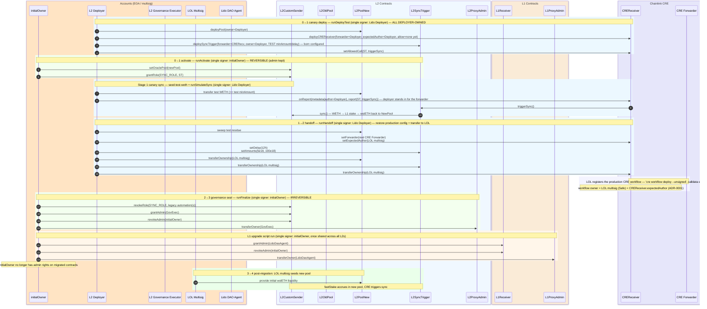

# RUNBOOK — L2 Direct Staking Migration

Operator checklist for migrating Direct Staking (ownership, admin roles, sync infra) to Lido
governance across **Optimism, Arbitrum, Base, Linea** + a shared **Ethereum L1** receiver.
Architecture lives in [`DOC.md`](DOC.md); fee math in [`docs/fees.md`](docs/fees.md), CRE ops in [`docs/cre.md`](docs/cre.md), monitoring in [`docs/monitoring.md`](docs/monitoring.md) — see the [doc map](README.md#documentation).

> **Recipe ≠ run ≠ state.** This file is the **recipe** (a method description). Broadcasting a step
> is the **run** (the on-chain transactions). The owner/role layout in [`DOC.md` §3](DOC.md) is the
> **resulting state**. A green check is the **evidence** that a run matched the recipe — **documented ≠ done.**
> Each step names the **system that signs it**; the recipe does not act, the keyholder does.

**How to read each step.** Load-bearing lines are tagged:

- **Def** — a definition/invariant (decided by reading, not running).
- **Gate `Gn`** — an *admissibility predicate*: proceed past it **only when its Evidence holds**. Steps cite gates by ID.
- **Duty** — an obligation on a **named role** (who *SHALL* act). Never "the system/script" — a keyholder.
- **Evidence** — the **carrier + observation** that decides a gate (an exit code, a printed count, a revert, an on-chain read-back). A claim with no carrier is an opinion.

**Def — verify vs validate** (two different evidence kinds, do not conflate):
*verify* = read back values just written / immutables, decided **in-description** (`verify-test`, `verify-stage2`; the in-tx read-backs). *validate* = observe the deployed contracts **live over RPC** from outside (`state-mate` → ≥45 checks; fork tests). Both are required; they fail differently.

---

## Setup (once)

- **Toolchain:** `forge`/`cast`/`anvil` (Foundry), `node`+`corepack`(yarn), `bun`, `jq`, **`yq`**.
  > ⚠️ `yq` is required by `verify-constants-sync` and `balances-*` — install it (`brew install yq`) or those recipes fail.
- **Deps:** `(cd lib/state-mate && corepack yarn install --immutable)` (state-mate) · `just setup-cre` (CRE bun deps). `forge build` pulls Solidity submodules. **Re-run the state-mate `yarn install` after any `lib/state-mate` submodule bump** — the verify recipes only auto-install when `node_modules` is absent, so a stale tree won't refresh on its own.
- **Review deploy params:** `config/state/l2-<network>.inputs.yaml` is the single place to review every deploy parameter before Stage 1 — knobs in `config:` (gas, sync amounts/delay, encoded fee blobs), third-party facts in `externals:` (tokens, CCIP router/selector, governance actors). `just verify-constants-sync` proves it (and the generated `.deployed.yaml`) match the Solidity constants the deploy reads.
- **Per-network env** — one `.env.<network>` per L2 (`L2_NETWORK` is the discriminator):

  ```env
  L1_RPC_URL=https://...                 # Ethereum mainnet (same in all 4 files)
  L2_RPC_URL=https://...                 # this L2's RPC
  L2_NETWORK=linea                       # optimism|arbitrum|base|linea
  L2_LIDO_DEPLOYER_PRIVATE_KEY=0x...     # Stage 1 signer
  INITIAL_OWNER_PRIVATE_KEY=0x...        # Stage 2 signer (cold key)
  # Pinned per network in <Lane>MigrationConstants.sol and read directly by the forge scripts — NOT env
  # vars (verified by `just verify-constants-sync`): the L2 governance executor, the predecessor OraclePool
  # (rollback target), the CRE forwarder, and the Lido DAO Agent. See the table below for their values.
  # canary test overrides — optional: default to the syncMinAmount / syncDelay anchors in the shared
  #   overlay config/state/l2.inputs.test-stage.yaml (an explicit value here wins); production restored at `handoff`:
  L2_SYNC_MIN_AMOUNT_TEST=50000000000000000   # 0.05 WETH so a small seed triggers a sync (prod 5e18)
  L2_SYNC_DELAY_TEST=60                        # seconds between syncs during the test (prod 12h)
  L2_TEST_WETH_SEED=100000000000000000         # 0.1 WETH seeded by seed-test-weth (> the test min)
  # appended after deploy-test:  L2_ORACLE_POOL / L2_SYNC_TRIGGER / L2_CRE_RECEIVER / L2_TEST_DEPLOYER
  # appended after deploy-cre-workflow:  CRE_WORKFLOW_ID
  #   (regenerate config/state/l2-<network>.deployed.yaml from the final addresses before state-mate)
  ```

| Network  | L2 Governance Executor | LOL multisig (pool/CREReceiver/SyncTrigger owner) |
|----------|------------------------|----------------------------------------|
| Optimism | `0xEfa0dB536d2c8089685630fafe88CF7805966FC3` | `0x5A9d695c518e95CD6Ea101f2f25fC2AE18486A61` |
| Arbitrum | `0x1dcA41859Cd23b526CBe74dA8F48aC96e14B1A29` | `0x5A9d695c518e95CD6Ea101f2f25fC2AE18486A61` |
| Base     | `0x0E37599436974a25dDeEdF795C848d30Af46eaCF` | `0x5A9d695c518e95CD6Ea101f2f25fC2AE18486A61` |
| Linea    | `0x74Be82F00CC867614803ffd7f36A2a4aF0405670` | `0xA8ef4Db842D95DE72433a8b5b8FF40CB7C74C1b6` |

Shared L1: Receiver `0x6F357d53d6bE3238180316BA5F8f11467e164588` · ProxyAdmin
`0x88a45d2760b63c1500E3D2E3552b28e5Cdaa37BD` · DAO Agent `0x3e40D7…9C8c` · Initial Owner `0xb5c336…91a8`.

---

## Gates (proceed past `Gn` only when its Evidence holds)

| ID | Admissibility predicate | Evidence that decides it (carrier + observation) | Blocks until it holds |
|----|-------------------------|--------------------------------------------------|------------------------|
| **G1** | Pre-live checks pass for this lane | `test-acceptance` / `forge test` exit 0 · `verify-constants-sync` prints `OK` · `preflight-check{,-l1}` print `OK` | any production tx (Stage 1) |
| **G2** | Canary Stage 1 *verified* + a simulated sync observed on this network | `verify-test` → `Script ran successfully` (the three contracts are **deployer-owned**, `CustomSender` repointed to the new pool, new `SyncTrigger` holds `SYNC_ROLE`, Initial Owner still admin, trigger balance ≥ `L2_SYNC_TRIGGER_INITIAL_FLOAT` — [docs/fees.md §Funding the float](docs/fees.md#feeotodmaxfee-free-per-sync-but-it-is-the-per-sync-blast-radius-bound)) · `simulate-sync` produced a `CREReceiver.CallExecuted` + `CustomSender.Sync` and pulled the seeded pool WETH | `handoff` on this network |
| **G2-handoff** | Post-handoff state *verified* (pre-seal): infra is **LOL-owned + production-configured**, CRE workflow live | `verify-stage2` → `Script ran successfully` (pool/`SyncTrigger`/`CREReceiver` owner = LOL; `CREReceiver` forwarder = **real CRE Forwarder** + author = **LOL**; `SyncTrigger` delay = 12h, minAmount = 5e18; **Initial Owner still admin** — seal not run) · `verify-cre-workflow` → `ACTIVE`, owner = LOL Safe | `finalize` on this network |
| **G2-author** | The DON-embedded report author matches the pinned `expectedAuthor` (Safe) — **the canary does NOT exercise this** (it simulates the forwarder with the *deployer* as author), so the real DON path is first proven **in production** | one observed `CREReceiver.CallExecuted` on this lane from the live DON path (the first production CRE sync). **If reports are rejected `InvalidAuthor`, the DON is embedding a different address** (e.g. the `--unsigned` artifact uploader, not the Safe) → re-pin via `LOL setExpectedAuthor(<address the DON actually embeds>)` | trusting this lane's automated sync path (resolve before relying on automated syncs) |
| **G3** | **All 4** L2s *finalized* (sealed) *and* validated | 4× `finalize` broadcast with no revert · 4× state-mate exit 0 | `migrate-l1` (the L1 seal) |
| **G4** | This network *validated* (this is the **Def of "done/green"**) | `test-<net>-upgrade-state-verify` exit 0, tail `✔ Total: ≥45 checks passed` | LOL liquidity seed **and** legacy-upkeep cancel for this network |

---

## 1 · Pre-live checks (off production) → clears **G1**

Run top-to-bottom; **Evidence** of each is its exit/print. Operator (any) SHALL re-run for the lane being migrated.

```sh
# a. Build + tests   (Evidence: each exits 0)
forge build
forge test --match-contract 'CREReceiverTest|SyncTriggerTest|L2PinnedConstantsGuard'   # contract unit tests (verify; no RPC)
just test-cre-workflow          # CRE TypeScript workflow (bun)
just test-acceptance            # FORKS REHEARSAL (validate): deploy+migrate ×4 + L1 + state-mate + forge tests

# b. Constants drift — Solidity is the single source of truth   (Evidence: prints "OK", exit 0)
just verify-constants-sync      # needs yq

# c. Preflight against the PRODUCTION RPCs (read-only, per network)   (Evidence: prints "OK")
just -E .env.<network> preflight-check       # chain-id, sender bytecode, legacy-sync age, old-pool balances, Sync events (~12h)
just -E .env.<network> preflight-check-l1     # L1 mainnet + receiver adapter/sender wiring for this lane

# c (cont.) CRE forwarder integrity — pinned forwarder is the build CREReceiver speaks (Evidence: every lane "➜ PASS", exit 0)
#    Two Keystone forwarders exist with INCOMPATIBLE ABIs: the legacy onReport(bytes32,address,bytes)
#    (no ERC-165 gate) vs the ERC-165-gating onReport(bytes,bytes) "Router" build that CREReceiver
#    implements. The pinned forwarder MUST be the Router build, or reports are never delivered and sync
#    silently never fires.
#    ⚠ Do NOT discriminate on typeAndVersion: the live forwarders report the STALE label
#    "KeystoneForwarder 1.0.0" while actually BEING the Router build — that string is EXPECTED and
#    correct, NOT the legacy contract (verified on-chain, all 4 lanes, 2026-06-19). verify-cre-forwarder
#    checks the real discriminators (EXTCODEHASH pin + Router ABI fingerprint: isForwarder + 3-arg
#    getTransmitter present, legacy 2-arg getTransmitter absent) for every lane in one read-only pass.
#    Addresses come from the l2CreForwarder anchor in config/state/l2-<net>.inputs.yaml (pinned per lane
#    in <Lane>MigrationConstants.CRE_FORWARDER), not env-supplied.
just verify-cre-forwarder        # needs RPC_<NET> (or legacy L2_<NET>_RPC_URL) reachable for each lane
```

**d. Dress rehearsal** — the *actual* operator recipes on an anvil fork of one L2 + L1 (validates recipe wiring end-to-end; Linea shown, substitute per net):

```sh
anvil --silent --auto-impersonate -p 8650 -f "$L1_RPC_URL"       >/tmp/dr-l1.log 2>&1 &
anvil --silent --auto-impersonate -p 8651 -f "$L2_LINEA_RPC_URL" >/tmp/dr-l2.log 2>&1 &
until cast chain-id --rpc-url http://127.0.0.1:8650 >/dev/null 2>&1 && cast chain-id --rpc-url http://127.0.0.1:8651 >/dev/null 2>&1; do sleep 1; done
DEPLOYER=0xf39Fd6e51aad88F6F4ce6aB8827279cffFb92266; IO=0xb5c336a5c60D3482b29d83C742C65AE8351b91a8; DAO=0x3e40D73EB977Dc6a537aF587D48316feE66E9C8c
for u in http://127.0.0.1:8650 http://127.0.0.1:8651; do for a in $DEPLOYER $IO $DAO; do cast rpc --rpc-url $u anvil_setBalance $a 0x3635C9ADC5DEA00000 >/dev/null; done; done

export L2_NETWORK=linea                                  # gov executor / old pool / CRE forwarder are pinned in code
export L2_RPC_URL=http://127.0.0.1:8651
export L2_LIDO_DEPLOYER_PRIVATE_KEY=0xac0974bec39a17e36ba4a6b4d238ff944bacb478cbed5efcae784d7bf4f2ff80   # anvil acct #0 == $DEPLOYER
SCRIPT=script/linea/LineaL2Upgrade.s.sol:LineaL2UpgradeScript
just deploy-test                                              # → paste the 4 printed exports (incl. L2_TEST_DEPLOYER) into the shell
just verify-test                                              # Evidence: "Script ran successfully" = canary Stage-1 read-backs pass
# Initial-Owner steps impersonate $IO on anvil via the *Unlocked variants (no IO key needed):
forge script $SCRIPT --sig 'runActivateUnlocked()' --rpc-url $L2_RPC_URL --broadcast --non-interactive --unlocked --sender $IO
just seed-test-weth                                           # deposit + transfer test WETH into the pool
cast rpc --rpc-url $L2_RPC_URL evm_increaseTime 120 >/dev/null && cast rpc --rpc-url $L2_RPC_URL evm_mine >/dev/null   # pass the test delay
just simulate-sync                                            # onReport → triggerSync → sync (deployer simulates the CRE forwarder)
just handoff                                                  # restore production config + transfer the 3 contracts to LOL
forge script $SCRIPT --sig 'runFinalizeUnlocked()' --rpc-url $L2_RPC_URL --broadcast --non-interactive --unlocked --sender $IO
# validate: write the fork's addresses to a temp .deployed.yaml + run the shared config/state/l2.yaml --only l2 with --inputs config/state/l2-<net>.inputs.yaml --deployed <temp> (see docs/development.md §dress rehearsal)
pkill -f 'anvil .*-p 865[01]'                                  # cleanup
```

> Does **not** cover: the **real** CRE forwarder/DON (`simulate-sync` stands in for it with the deployer as forwarder+author), the CCIP round-trip to L1 (covered by `test-acceptance` fork tests), LOL seed, Aragon vote.

---

## 2 · Live migration run

### Sequence overview (all stages)

The full migration as ordered transactions per signer — companion to the Stage 1 / Stage 2 / L1 / seed steps detailed below.



**Def — network order.** Migrate by ascending capital in the old pool (the comparator is **ETH-equivalent of old-pool WETH+wstETH**): **Linea → Arbitrum → Base → Optimism.** The middle three are within ~0.1 ETH (**incomparable** for risk purposes — any order among them is admissible). Re-read the comparator right before each:
`cast call <oldPool> "balanceOf(address)(uint256)" <weth|wsteth> --rpc-url $L2_RPC_URL`.

**Def — in-flight cutover (replaces "safe"/"correct-by-design").** `sync()` encodes the **recipient pool address into the CCIP message at call time**, immutable for the rest of the round-trip. ⇒ a round-trip started *before* Stage 2 that lands *after* it delivers wstETH to the **old** pool. **Recovery duty:** the **Initial Liquidity Owner** (old-pool owner) `sweep()`s it. The **new** pool is unaffected (seeded separately, §3). So no new-pool value is at risk and no message strands — that is the full content of "safe here."

> **Full per-actor state machine:** [docs/mainnet-simulated-cre-test.md](docs/mainnet-simulated-cre-test.md). The recipes below run it `0→1→2→3→4` with a `1→0` rollback; each is a single broadcast by one actor (do not co-locate keys).

### 0→1 deploy + activate — Duty: **Lido Deployer**, then **Initial Owner**, per network

```sh
just -E .env.<network> deploy-test          # Deployer: deploy pool+trigger+receiver OWNED BY THE DEPLOYER, with the
#   deployer as the CREReceiver forwarder AND author, TEST minAmount/delay, + fund the trigger float. PRINTS
#   export L2_ORACLE_POOL/SYNC_TRIGGER/CRE_RECEIVER/TEST_DEPLOYER → append all four to .env.<network>.
#   The float (L2_SYNC_TRIGGER_INITIAL_FLOAT = 0.5 ETH) is sent from the Deployer wallet — it must hold
#   ≥ 0.5 ETH + deploy gas + a little test WETH/ETH per lane. Reverts (L2UpgradeFloatBelowFloor) if the
#   constant doesn't cover one worst-case sync. See docs/fees.md §Funding the float.
just -E .env.<network> activate             # Initial Owner: setOraclePool(new) + grantRole(SYNC_ROLE, trigger).
#   REVERSIBLE — admin + the legacy automation's SYNC_ROLE are left intact (so `rollback` is clean).
just -E .env.<network> verify-test          # verify (in-description): infra deployer-owned, pool repointed,
#   SYNC_ROLE granted, Initial Owner still admin, float funded. Run before simulate-sync (asserts full float).
```

### Stage 1 — canary sync test — Duty: **Lido Deployer**, per network

```sh
just -E .env.<network> seed-test-weth       # deposit ETH→WETH + transfer ≥ test minAmount into the pool
# … wait L2_SYNC_DELAY_TEST (default 60s) …
just -E .env.<network> simulate-sync        # call CREReceiver.onReport directly (deployer = forwarder + author):
#   onReport → triggerSync → CustomSender.sync; fee fronted from the trigger float (no value on the call).
```

> **Rollback (1→0).** If the test is unsatisfactory: `just -E .env.<network> rollback` (Initial Owner) repoints `CustomSender` at the pinned predecessor OraclePool and revokes the new trigger's `SYNC_ROLE`. The legacy automation was never touched, so the predecessor system is fully restored. Reversibility is **control-plane only** — wstETH already synced to L1 + in-flight CCIP messages cannot be undone (the wstETH is `sweep`-recoverable from the test pool). Offered **only from Stage 1**; after handoff the contracts are LOL's.

### 1→2 handoff — Duty: **Lido Deployer** (restore + transfer), then **LOL** (CRE workflow), per network

```sh
just -E .env.<network> handoff              # Deployer: sweep test residue; restore production config (setForwarder(real
#   CRE), setExpectedAuthor(LOL), setDelay(12h), setAmounts(5e18,100e18)); top up the float; transferOwnership
#   (pool, trigger, receiver → LOL). In-broadcast assertion against PRODUCTION values reverts if any restore was missed.
just -E .env.<network> update-cre-config    # writes deployed addrs into cre config json
just -E .env.<network> deploy-cre-workflow  # LOL: cre workflow deploy --unsigned; EXECUTE the WorkflowRegistry calldata FROM THE LOL SAFE (CRE_WORKFLOW_OWNER, defaults to L2_LIQUIDITY_OWNER), then append CRE_WORKFLOW_ID= to .env
just -E .env.<network> verify-cre-workflow  # WorkflowRegistry: owner = LOL multisig (Safe = L2_LIQUIDITY_OWNER), status ACTIVE
just -E .env.<network> verify-stage2        # verify: infra LOL-owned + production-configured, Initial Owner still admin (seal not run)
```
> **Owner = LOL multisig, not the deployer.** `deploy-cre-workflow` runs `--unsigned`: it prints raw `WorkflowRegistry` calldata instead of broadcasting. Before printing, it reads `CREReceiver.getExpectedAuthor()` on-chain and **aborts if it ≠ `CRE_WORKFLOW_OWNER`** — so the workflow can't be registered under an owner the author gate would reject. Execute the calldata **from the LOL Safe**, so the Safe becomes the on-chain workflow owner and matches the `CREReceiver.expectedAuthor` pin (which `handoff` re-pins to the Safe — `deploy-test` pins it to the deployer for the simulated test). The Lido Deployer EOA only broadcasts the deploy/test/handoff txs above; it is **not** the workflow owner. See [ADR-0001](docs/adr/0001-cre-workflow-owner-multisig.md) / [DOC.md §3.2](DOC.md#32-owners--actors-and-what-they-hold).
> **The canary does not exercise the real DON author gate.** `simulate-sync` calls `onReport` with the **deployer** as forwarder + author — it never touches the real Keystone forwarder or the DON. A green `verify-cre-workflow` after handoff confirms only the *registry owner*. Whether the DON stamps the Safe into `metadata.workflowOwner` (so `expectedAuthor` matches) is first proven by the **first production** `CREReceiver.CallExecuted`. If reports come back `InvalidAuthor`, the DON is embedding a different address (likely the `--unsigned` artifact uploader); the fix is `LOL setExpectedAuthor(<that address>)`. This is gate **G2-author**.
> **Guard.** The governance executor and predecessor OraclePool are sourced ONLY from the pinned per-network constants (`LIDO_L2_GOVERNANCE_EXECUTOR` / `L2_OLD_ORACLE_POOL`, cross-checked to `*.inputs.yaml` by `just verify-constants-sync`) — never from env — so a wrong executor can't be baked into the admin/`ProxyAdmin` handover (`finalize`; the canary infra is deployer-owned, then handed to the LOL multisig, never the executor). A network that has not pinned the executor reverts (`L2UpgradeGovernanceExecutorNotPinned`). See [`DOC.md` §6.3](DOC.md#63-how-the-final-state-is-verified).

**Evidence for G2-handoff:** `verify-stage2` → `Script ran successfully`; `verify-cre-workflow` → `ACTIVE`. The CRE workflow is registered at handoff so the production sync path is live before the seal; until the pool is seeded (§3) no real sync can fire (the deployer swept the test WETH).

### 2→3 governance seal — Duty: **Initial Owner** SHALL, per network (then L1 once)

```sh
just -E .env.<network> finalize             # revoke legacy SYNC_ROLE; DEFAULT_ADMIN→GovExec; L2 ProxyAdmin→GovExec. IRREVERSIBLE.
```
Requires **G2-handoff** for this network. **Evidence (in-tx, verify):** `finalize` first re-asserts the LOL-owned, production-configured infra as an **interlock** (it reverts unless `handoff` completed), then reads back every post-condition; any mismatch **reverts** — there is no partial seal.

```sh
just -E .env.<any-network> migrate-l1       # ONCE: L1 Receiver admin + L1 ProxyAdmin → Lido DAO Agent
```
Requires **G3**. ⚠️ **The L1 seal is the action that ends external control of the shared receiver — run it LAST and keep the "all L2s sealed → L1 sealed" window short.** Until it lands, the external Initial Owner retains upgrade power over the receiver that serves every chain (see `DOC.md` §6.4). The Initial Owner's external-admin window now also spans the canary test (Stages 1–2) per lane — bound it.

**Def — transaction count:** the canary adds per-lane test/handoff txs over the old two-shot flow: ~5 deploy + 1 activate + 1 simulated-sync (+ a WETH seed) in Stage 1, ~6 in `handoff`, then 4 in `finalize` (5 for Linea), plus 3 on L1. The exact count is not load-bearing — the **gates**, not a tx tally, decide admissibility.

---

## 3 · Post-migration checks

### Validate (any operator) → clears **G4** per network

`validate` = observe the live contracts over RPC. **Evidence:** each exits 0; state-mate tails `✔ Total: ≥45 checks passed`.

> **ℹ Production is the default — no edits needed for this G4 run.** `config/state/l2.yaml` ships the
> production profile, so the recipes below verify the post-handoff state directly. (For the *pre-handoff*
> canary state instead, run the `test-<net>-upgrade-state-verify-canary` variants, which add
> `--overrides config/state/l2.inputs.test-stage.yaml`; full table in
> [docs/mainnet-simulated-cre-test.md](docs/mainnet-simulated-cre-test.md).) The table below is the
> production expectation; the deployer ≠ LOL, so a stale canary overlay fails loudly — it cannot false-pass.

```sh
just -E .env.optimism test-optimism-upgrade-state-verify
just -E .env.arbitrum test-arbitrum-upgrade-state-verify
just -E .env.base     test-base-upgrade-state-verify
just -E .env.linea    test-linea-upgrade-state-verify
just -E .env.<any>    verify-l1-state-mate                 # shared L1 (once)
just -E .env.<network> verify-cre-workflow                 # per network: ACTIVE + owner = LOL Safe (L2_LIQUIDITY_OWNER)
```

End-state invariants state-mate asserts (the **Def of "validated/green"** for a network). state-mate checks the **complete** role-member set, not mere presence:

| Contract (×4 = per network) | Getter | Expected |
|---|---|---|
| L1 Receiver | `hasRole(DEFAULT_ADMIN_ROLE, daoAgent)` / count | `true` / `1` |
| L1 ProxyAdmin | `owner()` | Lido DAO Agent |
| L2 CustomSender ×4 | `hasRole(DEFAULT_ADMIN_ROLE, govExec)` / count | `true` / `1` |
| L2 CustomSender ×4 | `hasRole(SYNC_ROLE, newSyncTrigger)` / count | `true` / `1` |
| L2 CustomSender ×4 | `getOraclePool()` | new OraclePool |
| L2 ProxyAdmin ×4 | `owner()` | L2 Gov Executor |
| SyncTrigger ×4 | `owner()` | LOL multisig |
| SyncTrigger ×4 | `getForwarder()` | CREReceiver |
| CREReceiver ×4 | `owner()` / `getForwarder()` / `getExpectedAuthor()` | LOL / CRE Forwarder / **LOL** (owner == expectedAuthor == workflow owner; ADR-0001) |
| CREReceiver ×4 | `isCallAllowed(SyncTrigger, 0x340b2b0b)` | `true` |
| OraclePool (new) ×4 | `owner()` | LOL multisig |

> **Two assurance layers — don't over-trust a green `verify-constants-sync`.** It proves the state-mate
> `.inputs`/`.deployed` anchors equal the Solidity `*MigrationConstants.sol` constants — but both are
> hand-authored by the same team, so it catches *transcription drift*, **not** *shared contamination*
> (both wrong from one bad source — the original gov-executor bug). The only **independent** oracle is
> the live state-mate run above (config vs chain). `just verify-externals-coverage` enforces that every
> L2 external/deployed anchor is pinned by at least the constants layer, or is allowlisted with a reason
> — so none silently rests on same-provenance equality.
>
> **Deployer-renounce check (caveat).** The wiring's `hasRole(DEFAULT_ADMIN_ROLE, l2LidoDeployer)==false`
> uses the **dev-fork** deployer (Anvil acct #0) in the committed mainnet inputs, so on mainnet it passes
> **vacuously** (that address never held a role here) — it does not prove the real deployer renounced.
> Note the L2 CustomSender uses *non-enumerable* AccessControl (`ozNonEnumerableAcl`), so for it
> state-mate checks only the listed (role,address) pairs — the "complete role-member set" guarantee
> above holds for the enumerable contracts (e.g. L1 Receiver count), not for it. To make this check real
> on mainnet, wire the actual per-chain deployer and add an `l2LidoDeployer` row to `verify-constants-sync`.
> The **canary profile's** deployer-as-owner / `getForwarder` / `getExpectedAuthor` is verified via the
> shared overlay `config/state/l2.inputs.test-stage.yaml` (its two deployer addresses), not this anchor —
> `l2LidoDeployer` is referenced live only in this `hasRole==false` check. Setting it to the real deployer
> for a Stage-1 state-mate run likewise makes the check non-vacuous there (the deployer holds no `CustomSender` admin).

### Finalize (each requires **G4** for that network)

- **Duty — LOL multisig** SHALL transfer initial wstETH to each **new** pool (1 ERC-20 transfer/net). Until seeded, `fastStake` reverts for lack of output liquidity. **Do not seed a network before its G4.**
- **Optional (recommended) — operator** MAY prove the path with dust before committing the full seed above: `SMOKE_CONFIRM=yes just -E .env.<network> smoke-stake` seeds a little wstETH into the new pool, `fastStake`s a dust amount from a funded `L2_SMOKE_PRIVATE_KEY`, and verifies the staker's wstETH balance delta equals the emitted `FastStake.amountOut` (pool balances reconcile). A bare `just -E .env.<network> smoke-stake` is a read-only dry run of the same preconditions (moves nothing). It hard-aborts unless `CustomSender.getOraclePool()` is already the new pool, so it is meaningless before Stage 2 — run it post-**G4**. The dust seed simply becomes part of the pool reserve the full LOL seed tops up.
- **Duty — Lido Deployer / ops** SHALL cancel the old Chainlink Automation upkeeps (and Linea's Gelato bot) **only after G4** confirms the new SyncTrigger is the sole `SYNC_ROLE` holder. Residuals to recover alongside: the cancelled upkeeps' LINK balance (withdrawable ~50 blocks after cancel) and the legacy `SyncAutomation` contracts' leftover ETH fee float (same treasury pattern as the new trigger — owner-only `sweep()`, `lib/chainlink-csr/contracts/automations/SyncAutomation.sol:237`; recovery falls to whoever owns each legacy automation).

### Watch (first weeks) — full table in [`docs/monitoring.md`](docs/monitoring.md)

- **CRITICAL:** the G4 invariant table above (any drift = key compromise / unintended governance); L1 Receiver balance ~0 (`MessageFailed` → page); CCIP manual-exec queue empty; Arbitrum retryable auto-redeems (≤7-day window or funds lost).
- **HIGH:** `SyncTrigger.getLastExecution()` advancing < 24 h while pool WETH ≥ min; `Sync`(L2) ↔ `MessageSucceeded`(L1) 1:1; CRE workflow `ACTIVE` + owner = LOL Safe; **≥1 `CREReceiver.CallExecuted` observed** (the only proof the DON-embedded author matches the pin — a green registry-owner check does NOT prove it); **CRE credit funded under the LOL Safe's CRE account** (dashboard-only, no on-chain signal — a liveness stall with healthy fees + funded float ⇒ suspect credit starvation; see [docs/monitoring.md §4](docs/monitoring.md#4-cre-workflow-health--funding--high)).
- **MEDIUM:** actual CCIP fee / `maxFee` < 80% (on **OP/Linea** this also tracks **sync size** — 5 bps, uncapped; the 100 WETH cap holds it to ~40%, [fee amount-sensitivity](docs/otod-fee-amount-sensitivity.md)); `ccipReceive` gas / `gasLimit` < 80%; SyncTrigger ETH balance ≥ 2× `getMaxFees()` (depletes ~0.005 ETH/sync, monotonic; < 1× = lane stalls).

### Recover (CRE workflow-owner incident)

The CRE workflow owner is the **LOL multisig (Safe)** — the same Safe that owns each `CREReceiver` and is its
`expectedAuthor` ([ADR-0001](docs/adr/0001-cre-workflow-owner-multisig.md)). **Everyday case — a Safe
*signer* is lost or compromised (below threshold):** rotate it inside the Safe (`swapOwner` / `removeOwner` /
`addOwner`). The Safe address is unchanged, so there is **no CRE redeploy and no `setExpectedAuthor` re-pin**,
and the running workflow is untouched (*lost* = low urgency, *compromised signer* = evict promptly).
**Escalation — the whole Safe is compromised (≥ threshold):** this is the protocol-wide worst case that also
loses every other LOL lever. **Duty: contain from the independent domain first — GovExec
`CustomSender.revokeRole(SYNC_ROLE, syncTrigger)`** (no LOL quorum needed), then run the one-time "redeploy +
re-pin" under a **new** LOL Safe (`setExpectedAuthor(newSafe)` ×4 + redeploy `--unsigned`). Neither case risks
protocol funds (the call-lock + on-chain gates bound misuse to rate-limited, admissible syncs). Full
procedure + consequence tables + the rejected EOA alternative:
[docs/cre.md §Workflow-owner key — lost vs compromised](docs/cre.md#workflow-owner-key--lost-vs-compromised-consequences--recovery)
and [ADR-0001](docs/adr/0001-cre-workflow-owner-multisig.md).

---

## 4 · Decommission / sunset (end-of-life)

Mirror image of §Finalize: that step recovers the **old** system's residuals on the way *up* (legacy `SyncAutomation` float + cancelled-upkeep LINK); this section recovers the **new** system's treasuries on the way *down*. Same tags — **Def** / **Gate `Sn`** (sunset-local, kept distinct from migration `G1–G4`) / **Duty** (a named keyholder SHALL act) / **Evidence**. Owners are the per-chain GovExec / LOL multisig in the [Setup network table](#setup-once); they are not re-keyed here.

> **Def — a drain emits `Swept`; the balance is ground truth.** `SyncTrigger.sweep` (`src/SyncTrigger.sol:288`) emits `Swept(token, recipient, amount)` (`src/SyncTrigger.sol:299`), like every config setter, so a drain *is* observable in the log. Still treat the **balance delta** (`cast balance <trigger>` → 0) plus the recipient's credit as the authoritative **Evidence** — the event corroborates, the balance confirms.

**Step 1 — stop the engine. Duty — LOL multisig** SHALL deactivate triggering: `setForwarder(0x…dead)` — LOL owns `SyncTrigger` (the `delay` lever is a rate-limiter only, not a kill switch). (Independent backstop: GovExec can revoke the trigger's `SYNC_ROLE` on `CustomSender`, no LOL quorum needed.) **Gate S1** = triggering off. **Evidence:** read back `getForwarder()` = the dead address; `getLastExecution()` stops advancing on later CRE ticks.

**Step 2 — stop the automation. Duty — LOL multisig** SHALL pause or delete the CRE workflow and stop funding its CRE credit. **Evidence:** `verify-cre-workflow` no longer reports `ACTIVE`. Levers: [docs/cre.md §CRE platform levers (workflow lifecycle)](docs/cre.md#cre-platform-levers-workflow-lifecycle).

**Step 3 — let in-flight settle → Gate S2.** **Gate S2** = no pending CCIP round-trip for the lane: the last `Sync`(L2) has its matching `MessageSucceeded`(L1) and the wstETH return has landed (same in-flight cutover as §2 **Def** / [`DOC.md` §5.1](DOC.md#51-in-flight-round-trips-are-correct-by-design)). **Evidence:** CCIP manual-exec queue empty + L1 Receiver balance ~0.

> **Def — the float drain itself has no in-flight dependency.** Each round-trip's return-leg (`feeDtoO`) fee is fronted at `sync()` time, baked into the value the trigger forwards (`src/SyncTrigger.sol:247`), so a drained float can **never** strand a return. Settle first only so the pool-liquidity recovery (Step 5) is clean and monitoring stays quiet — not because an earlier sweep would be unsafe.

**Step 4 — drain the trigger. Duty — LOL multisig** SHALL `sweep` to a Lido-controlled recipient — a **LOL Safe transaction**: `sweep(address(0), <recipient>, <balance>)` for native, `sweep(<token>, <recipient>, <amount>)` for any stray ERC-20 (e.g. WETH). Recipient is a call parameter — choose it in the Safe transaction, do not assume a default. **Evidence:** `cast balance <trigger>` == 0 (and any swept ERC-20 balances == 0).

**Step 5 — drain the rest, reconcile.**
- **Duty — LOL multisig** SHALL `CREReceiver.withdrawETH(<to>, <balance>)` (`src/cre/CREReceiver.sol:202`) **if non-zero** — normally ~0 (the forwarder call carries no value), but the bare `receive()` makes a stray balance possible.
- **Duty — LOL multisig** SHALL recover the **new** `OraclePool`'s residual liquidity (LOL owns it) — WETH/wstETH user funds, outside the strict "fee-float" scope but part of "the money left".
- **Cross-ref:** legacy residuals (old `SyncAutomation` float + cancelled-upkeep LINK) are recovered in §Finalize, not here.

> **Watch — order invariant: drain BEFORE any ownership renounce/handoff.** `SyncTrigger` does not override `renounceOwnership()` (inherited OZ `Ownable`), so renouncing — or transferring ownership to a party that won't act — **permanently bricks `sweep` and strands the float**. Sweep is the last lever; relinquish it last.

| Treasury | Where | Recover (file:line) | Signer | Note |
|---|---|---|---|---|
| SyncTrigger native float | per L2 | `sweep(address(0),…)` `src/SyncTrigger.sol:288` | LOL multisig | emits `Swept`; corroborate by balance delta; tested `test/SyncTriggerTest.t.sol:338` |
| SyncTrigger stray ERC-20 | per L2 | `sweep(token,…)` `src/SyncTrigger.sol:288` | LOL multisig | emits `Swept`; tested `test/SyncTriggerTest.t.sol:345` |
| CREReceiver ETH (~0) | per L2 | `withdrawETH` `src/cre/CREReceiver.sol:202` | LOL multisig | forwarder call carries no value |
| CRE credit | LOL CRE account | dashboard (off-chain) | LOL multisig | no on-chain signal — [docs/cre.md §Funding and billing](docs/cre.md#funding-and-billing) |
| New OraclePool liquidity | per L2 | OraclePool owner path | LOL multisig | user funds, not fee float |
| Legacy float / upkeep LINK | old contracts | `SyncAutomation.sol:237` / upkeep cancel | legacy owners | see §Finalize |
