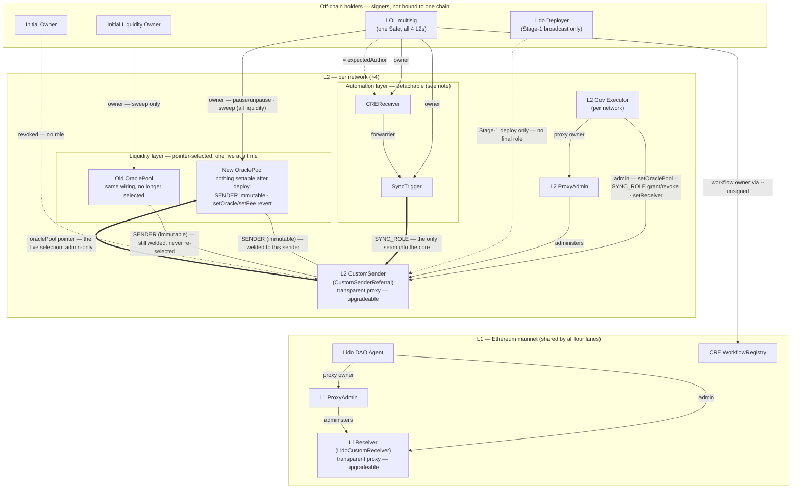

> **View — the retired ownership arrangement (former `DOC.md` §4.2.A).**
> Stakeholder: anyone reading the current architecture who needs to know *what was rejected and
> why*, plus anyone reading the chain today, which still runs this arrangement. Concern: *which
> option lost, on what basis, what of it still holds, and what authority it no longer carries.*
> The current target arrangement is [`DOC.md` §4.2](../../DOC.md#42-diagram-b--ownership--access-control);
> the transition is [`docs/automation-owner-redeploy.md`](../automation-owner-redeploy.md).
>
> **Status: retired as a target, still live on-chain.** Retired 2026-07-29. Not deleted, not
> historical fiction: every `owner()` slot drawn below reads exactly this way on all four lanes as
> of the block pins in the transition plan §1.

# Retired option — the LOL multisig owns the automation layer

This was `DOC.md` §4.2.A, the arrangement the migration scripts and state-mate configs implement.
It lost to a dedicated **Automation Owner** EOA (`DOC.md` §4.2) in the decision recorded below.

## 0. Retirement note

Published per `A.16.2` (`CC-A.16.2-1`, `-2`, `-3`, `-4`), which requires that a retired branch name
its trigger, its retained witnesses, the authority it gives up, and its successor — retirement is
withdrawal of authority, not erasure (`A.16.2:16.2`).

| Field | Value |
|---|---|
| **Move kind** | `retire` (`A.16.2:4.1`) — not `reopen`, not `sketchBackoff`. The option is not being relaxed to a lower-closure form; its authority as *the* target arrangement ends outright. |
| **Source form** | `DOC.md` §4.2.A — one of two co-published ownership arrangements, holding target authority because it was what the scripts implement. |
| **Trigger** | The `probe again` in `DOC.md` §4.2.B was closed as **`choose now` = the Automation Owner** by the chooser (transition plan §0). Two facts moved the comparison, neither of them a probe result: (1) the 2026-07-28 block-pinned reads showed **nothing is running** — no CRE workflow has ever been registered, both floats are 0, the live pool is empty — so switching costs re-doing config, not downtime; (2) `finalize` has not run anywhere, so `SYNC_ROLE` can still be re-pointed by a single external-party broadcast per lane, and becomes a **DAO vote per lane** the moment it does. The window, not the evidence, closed. |
| **Target form** | `DOC.md` §4.2 — the same diagram with three `owner()` assignments and the CRE workflow owner moved off the LOL Safe onto a dedicated EOA. Powers, contracts and call paths are byte-identical. |
| **Retained witnesses** (`CC-A.16.2-3`) | Kept in `DOC.md` §4.2 because they were never A-specific: the edge and group reading conventions, the `AUTO`-group detachability note, the `POOLS`-group binding table and its two consequences, and the whole orphaned-old-pool account. Kept here because they *are* A-specific: the diagram below, and §2's case for A — the axis on which A still wins. |
| **Withdrawn authority** (`CC-A.16.2-2`) | This arrangement no longer authorizes: the "three new contracts all go to the LOL multisig" end state, `cre workflow deploy --unsigned` as the registration path ([ADR-0001](../adr/0001-cre-workflow-owner-multisig.md), now pending supersession by ADR-0002 — plan S1.12), or the single `*l2LiquidityOwner` state-mate anchor standing for four role assignments. |
| **What it still is** (`A.16.2:16.3`, partial retreat) | **The live chain state.** Every `owner()` below is what all four lanes read today. `DOC.md` describes a *target*; this file describes the *object* until the transition's S6 lands (`A.7`). Do not read the retirement as "this was never true". |
| **Successor** | Yes — `DOC.md` §4.2, reached by the route in [`docs/automation-owner-redeploy.md`](../automation-owner-redeploy.md) (redeploy the pair under the new owner; the alternative transfer route stays open until its S3 runs). |
| **Required downstream repairs** (`A.16.2:20.1`) | `DOC.md` §2.2, §2.4, §2.6.B, §2.7, §3.2, §3.4, §4.1, §4.2, §6.3 and the `README.md` doc table — done. Still stale and owned by the transition plan's S1: `script/**`, `config/state/l2.yaml` (the anchor split), `RUNBOOK.md`, `docs/cre.md`, `docs/monitoring.md`, `docs/canary-deploy.md`, `docs/audit-scope.md`, ADR-0001. Propagation is deliberately narrow (`A.16.2:20.2`): only what depended on *who holds the automation `owner()`* moves. Nothing that depends on the pool owner, the gov executor, or any call path is touched. |

## 1. The retired arrangement

Edge and group conventions, the `AUTO` detachability note and the `POOLS` binding table read
identically here and in `DOC.md` §4.2 — they are properties of the contracts, not of who holds a
key. The **only** difference between this diagram and the successor's is which holder the three
`LOL -->` automation edges and the `LOL -.->|= expectedAuthor|` pin start from.

## 2. The case for the retired option — the axis on which it still wins

Recorded so the retirement is a decision and not a rewrite of the losing side (`A.16.2:19` Q3,
`C.11:4.2.1a` — a partial order stays visible rather than being totalized into a fake winner).

- **Single-key compromise exposure.** The successor puts three `owner()` slots, the pinned
  `expectedAuthor` and the CRE workflow behind **one key with no quorum**. A Safe requires a
  threshold of signers for the same powers. On this axis alone the retired option strictly
  dominates, and no probe changed that — the choice accepted the exposure, bounded by the
  ~0.5 ETH float ceiling (`DOC.md` §4.2.1 (d)), rather than refuting it.
- **No new custody surface.** Nothing to create, link, fund, rotate or monitor: the LOL Safe already
  exists, is already the pool owner, and is already the party the liquidity runbook addresses.
- **No `setExpectedAuthor` cliff.** With the workflow registered under a Safe, a lost or compromised
  *signer* is repaired by rotating that signer inside the Safe — the workflow-owner address never
  moves, so there is no redeploy and no re-pin on four lanes. That is ADR-0001's whole argument, and
  the successor gives it up: `WorkflowRegistry 2.0.0` exposes no per-workflow ownership transfer, so
  a lost EOA means a new workflow plus four `setExpectedAuthor` calls.
- **Zero transition cost.** It is what the scripts, the state-mate configs, the tests and the
  deployed contracts already do. Every line of the transition plan is a cost this option does not pay.

What defeated it was not a counter-argument on these points. It was that one holder filling *four*
role assignments makes a Safe compromise take the pool **and** the automation layer together, plus
incident-response latency, CRE registration ergonomics, and the fact that the switch is nearly free
right now and expensive after `finalize`.

## 3. The superseded decision record

The `C.11` record published in `DOC.md` §4.2.B before adoption, kept because a `probe again` that
was closed *without* its probes being run is a fact about the decision, not a draft to overwrite.

| Field | Value as published then |
|---|---|
| **DecisionSubject** | Lido DAO contributors owning this migration (organization-level). |
| **OptionSet** | {this arrangement, the Automation Owner arrangement} — closed set. |
| **Comparison basis** | incident-response latency · single-key compromise exposure · what any one compromised holder reaches · CRE registration ergonomics · routine-tuning friction. |
| **ChoiceResult** | **`probe again`** — "the two options do not order under that basis without further facts… naming one now would be a preference presented as an analysis." |

The four probes named as able to change the result, and where each stands now — **none was run**
(`C.11:4.2.2`: they remained feasible; the closure came from the cost of *delay*, not from probe
exhaustion). They survive as residual-risk items Q1–Q4 in the transition plan §8:

1. **Key custody terms** — HSM / cloud KMS / plain hot key, rotation, detectability. Unanswered; the
   plan's stated default is a Lido-operated hot key on a single signer. This is the largest term on
   the axis the retired option won.
2. **Measured LOL quorum latency** — never measured. The successor's latency case still rests on
   "minutes to hours" as an assumption.
3. **Is `revokeRole(SYNC_ROLE)` rehearsed?** Unanswered, and it got *more* load-bearing: under the
   successor it is the only switch a compromised automation key cannot re-open.
4. **Has `--unsigned` actually caused friction?** Answered in the negative by the block-pinned
   reads — it was never exercised, because no workflow was ever registered. This advantage of the
   successor is therefore **theoretical**, and the record says so.

## 4. The variant that was never evaluated

`DOC.md` §4.2.B carried a middle option for the case where the probes left the two tied: keep
`SyncTrigger` with the LOL Safe and move only `CREReceiver` plus the workflow to the Automation
Owner — buying the CRE ergonomics and the fast CRE-side disarm while leaving the fee float and the
sync gates behind a quorum.

It never entered the `OptionSet` and was never compared, so it is retired here **unevaluated**, not
rejected. If the custody probe (Q1) later comes back badly, this is the variant to reopen — and
reopening it is a `C.11` case with a *new* option set, not a re-reading of the record above.
