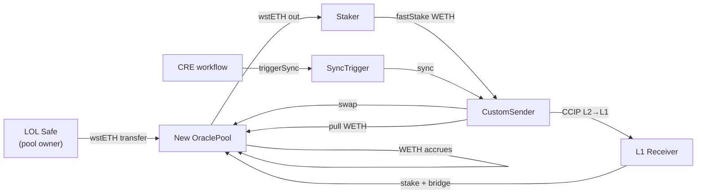

# RUNBOOK — Liquidity Provider (New OraclePool)

> **View — liquidity provider operations.** Stakeholder: the **LOL multisig** (Liquidity
> Observation Lab), acting as **pool owner** on each L2's new `PausableImmutableOraclePool`.
> Concern: how to **seed, monitor, top up, and recover** wstETH liquidity for `fastStake`
> users — distinct from the migration *recipe* in [`RUNBOOK.md`](../RUNBOOK.md) and the
> *resulting state* in [`DOC.md`](../DOC.md). Doc map: [`README.md` §Documentation](../README.md#documentation).

---

## Quick answers — what LOL funds, does, and checks

> Addresses below were read from `config/state/*.yaml` at the time of writing. The pool
> and SyncTrigger were deployed to the **same address on all four L2s** (deterministic
> deploy). Before signing, always re-resolve from config per [§1.4](#14-per-network-addresses)
> — config is the carrier of record; this table is a convenience copy.
>
> *FPF note (E.17): this section is a **projection** of §§2–6 for fast lookup — it adds
> no norms of its own; on any conflict, the governing section wins.*

### Q1 — What addresses need to be topped up?

| What runs low                     | Address                                                                                                                  | Asset                                | Who may top up                   |
| --------------------------------- | ------------------------------------------------------------------------------------------------------------------------ | ------------------------------------ | -------------------------------- |
| New `OraclePool` — swap liquidity | `0xac143bF41BBA4a8014b4Ef5a5F46b39a36AE40A8` (same on OP/Arb/Base/Linea)                                                 | **wstETH** (that L2's token, see Q2) | anyone; in practice **LOL Safe** |
| `SyncTrigger` — sync fee float    | `0x1594705D5f9BbDb36453ACF15C94d041c0E02c62` (same on OP/Arb/Base/Linea)                                                 | **native ETH**                       | anyone (permissionless)          |
| CRE workflow credit               | no on-chain address — [cre.chain.link](https://cre.chain.link/workflows) dashboard, under the **LOL Safe's CRE account** | CRE billing credit                   | LOL (off-chain)                  |

### Q2 — How much liquidity is to be added?

**There is no protocol-mandated seed amount** — nothing on-chain enforces a minimum
(**L-6**), and no figure is pinned in this repo. Size it from expected `fastStake`
demand per the guidance in [§4 Step 4](#step-4--seed-wsteth-liquidity): the pool must
cover peak consumption during one sync round-trip (up to **100 WETH** converts per sync;
wstETH returns after ~20 min CCIP + the per-chain bridge leg). Recommended approach:
start conservative, watch 1–2 sync cycles, top up (§5.3).

Delivery = plain ERC-20 transfer from the LOL Safe to the pool address above, in that
L2's wstETH:

| Network  | wstETH token (transfer **from** LOL Safe **to** the pool) |
| -------- | --------------------------------------------------------- |
| Optimism | `0x1F32b1c2345538c0c6f582fCB022739c4A194Ebb`              |
| Arbitrum | `0x5979D7b546E38E414F7E9822514be443A4800529`              |
| Base     | `0xc1CBa3fCea344f92D9239c08C0568f6F2F0ee452`              |
| Linea    | `0xB5beDd42000b71FddE22D3eE8a79Bd49A568fC8F`              |

The sender is the same on every network: LOL Safe
`0xFc832dA3D688352C0aB1A32136c7fABbB16d66E6` (§1.4).

Gate first: **LP-G0 + LP-G1** must hold for that lane before seeding (§3, §4). How to run
them (full recipe with evidence criteria: [§4 Step 1](#step-1--confirm-wiring-operator-read-only)):

```sh
# Replace <network> with optimism | arbitrum | base | linea

# LP-G0 — migration validation (state-mate, ≥45 live-RPC checks)
just -E .env.<network> test-<network>-upgrade-state-verify
# PASS: exit 0, tail shows `✔ Total: … checks passed`

# LP-G1 — pool wiring read-backs
POOL=$(yq '.deployed.l2[] | select(anchor == "l2OraclePool")' config/state/l2-<network>.deployed.yaml)
CS=$(yq '.externals[] | select(anchor == "l2CustomSender")' config/state/l2-<network>.inputs.yaml)
cast call $CS "getOraclePool()(address)" --rpc-url $L2_RPC_URL   # == $POOL
cast call $POOL "owner()(address)" --rpc-url $L2_RPC_URL         # == LOL Safe (§1.4)
cast call $POOL "SENDER()(address)" --rpc-url $L2_RPC_URL        # == $CS
cast call $POOL "paused()(bool)" --rpc-url $L2_RPC_URL           # == false
```

(`$L2_RPC_URL` comes from `.env.<network>` — `source .env.<network>` or export it first.)

### Q3 — How much ether for fees, and to what addresses?

Send **native ETH** to the `SyncTrigger` at `0x1594705D5f9BbDb36453ACF15C94d041c0E02c62`
on **each** of the four L2s (verify per lane via `l2SyncTrigger` in config):

- **Hard floor:** balance ≥ `getMaxFees()` — below it, sync stalls (`canSync()` = false).
- **Target:** ≈ **0.5 ETH per lane** ≈ 30-day runway (measured ≈0.005–0.007 ETH/sync at
  ≤2 syncs/day — [`docs/fees.md`](fees.md)).
- **Top-up trigger:** monitoring alerts at balance < 2× `getMaxFees()` (§5.2).
- Each lane already received a **0.5 ETH initial float** from the Deployer at
  migration; LOL only replenishes.
- Funding is **permissionless** — any funded account may send; no Safe quorum needed.

Separately (not ether, no address): keep **CRE credit** funded on the CRE dashboard
under the LOL Safe's account — it has **no on-chain signal**; starvation shows up only
as a sync-liveness stall with healthy float (§5.4).

### Everything else LOL must do or check

**Do (Safe transactions):**

1. Seed wstETH per lane after its **LP-G0/LP-G1** — §4 Step 4.
2. Top up wstETH / sweep excess SyncTrigger ETH as monitoring dictates — §5.3.
3. `unpause()` the pool after an intentional pause clears — §5.2/§5.3.
4. Incident levers when needed: `pause()`, `SyncTrigger.setForwarder(dead)`,
   `CREReceiver.setExpectedAuthor` — §5.4/§5.5.
5. At sunset: stop trigger → stop CRE → wait settlement → pause → `sweep` pool, then
   SyncTrigger float and `CREReceiver.withdrawETH` — **before** any ownership
   renounce/transfer (**L-9**/**D-1**) — §6.

**Check (read-only; may be delegated to an operator, but LOL owns the outcome):**

- **Before first seed:** LP-G1 wiring reads (`getOraclePool()`, `owner()`, `SENDER()`,
  `paused()`) and state-mate green — §4 Step 1.
- **Before trusting automation:** LP-G2 float ≥ `getMaxFees()`; LP-G3 CRE workflow
  ACTIVE + owner = LOL Safe + ≥1 observed `CREReceiver.CallExecuted` — §4 Steps 2/5.
- **Ongoing:** the §5.2 signal table — pool wstETH/WETH balances, sync liveness,
  `Paused` events, access-control invariants, CRE credit.

---

## 0 · FPF framing (how to read this document)

This runbook applies the First Principles Framework (FPF) pattern
language to keep role, method, and work distinct. Governing patterns cited below:

| Pattern | What it governs here |
| --- | --- |
| **A.1 / A.1.1** | The **bounded context** is one L2 lane's new OraclePool holon — not the whole Direct Staking system, not retail DeFi "LP tokens". |
| **A.2** | **Pool owner** is a `U.Role` value; the **LOL multisig** is the role holder. The role does not imply capability to `sync()`, upgrade proxies, or change oracle/fee. |
| **A.15** | This file is a **method description** (recipe). A Safe transaction is **work** (a dated occurrence). On-chain state after a tx is **evidence**, not the recipe itself. |
| **A.6.B** | Operational claims are tagged **L** (laws & definitions), **A** (admissibility gates), **D** (deontics — duties *and* permissions; a SHALL is a duty, a MAY is a permission), **E** (work-effects & evidence). Do not treat a duty as evidence, or a gate as a definition. |
| **B.3 / A.10** | Every gate names its **evidence carrier** (RPC read, event, exit code). Claims without a carrier are opinions. |
| **C.30** | §1 is the architecture face for the LP bounded context; canonical system architecture remains in [`DOC.md`](../DOC.md). |

> **Recipe ≠ run ≠ state.** This file is the *recipe* for LP operations. Broadcasting a Safe
> transaction is the *run*. [`DOC.md` §3–§5](../DOC.md) describes the *resulting state*
> (ownership, value flow, fee rationale). A green check is *evidence* that a run matched the
> recipe — **documented ≠ done.**

**Precision restoration (A.6.P).** In this system, "liquidity provider" does **not** mean:

- a permissionless AMM LP who mints/burns share tokens;
- the Initial Liquidity Owner of the **old** (pre-migration) pool;
- the SyncTrigger fee treasury (native ETH float is a separate holon);
- anyone who can `fastStake` (stakers consume liquidity; they do not provide it).

It means: the **pool owner** who holds wstETH in the new OraclePool so `CustomSender.fastStake`
can swap WETH → wstETH at the oracle rate.

---

## 1 · Bounded context — what the LP role governs

### 1.1 The holon

Each L2 deploys one **new** `PausableImmutableOraclePool` (four lanes total: Optimism,
Arbitrum, Base, Linea). The pool is a **liquidity vault**, not an AMM:

| Token | Direction | Meaning for LP |
| --- | --- | --- |
| **wstETH** (`TOKEN_OUT`) | LP **deposits**; stakers **consume** | Primary capital at risk; must stay above operational minimum |
| **WETH** (`TOKEN_IN`) | Stakers **deposit** via `fastStake`; sync **pulls** | Transient working capital; should drain on each sync |

**L-1.** The pool swap fee is **0** (immutable). The LP earns **no** swap-fee revenue.
**L-2.** `setOracle()` and `setFee()` **permanently revert** on `PausableImmutableOraclePool`.
**L-3.** Only `SENDER` (= `CustomSender`) may call `swap()` and `pull()`. The LP cannot
trigger swaps or syncs directly.

### 1.2 Value loop (why liquidity exists)



Canonical diagram and component provenance: [`DOC.md` §4](../DOC.md#4-diagrams).

### 1.3 Role boundary — what pool owner can and cannot do

| Action | Pool owner (LOL Safe) | Not pool owner |
| --- | --- | --- |
| Seed wstETH (`transfer`) | ✅ anyone, including LP | — |
| Withdraw wstETH/WETH (`sweep`) | ✅ owner only | ❌ |
| Pause / unpause pool | ✅ owner only | ❌ |
| Trigger sync | ❌ | `SyncTrigger` via CRE |
| Change oracle / swap fee | ❌ (immutable) | ❌ |
| Repoint pool on `CustomSender` | ❌ | L2 Gov Executor (admin) |
| Fund SyncTrigger ETH float | ✅ permissionless (anyone) | — |
| Tune sync gates / CCIP fees | ❌ on pool | LOL Safe as **SyncTrigger owner** (separate role) |

Full role matrix: [`DOC.md` §3.1](../DOC.md#31-roles).

### 1.4 Per-network addresses

Resolve live addresses from config — do not hard-code from memory:

| Resource | Path |
| --- | --- |
| New pool, SyncTrigger, CREReceiver | `config/state/l2-<network>.deployed.yaml` → `l2OraclePool`, etc. |
| LOL Safe, tokens, oracle | `config/state/l2-<network>.inputs.yaml` |
| Pinned constants | `script/<network>/<Network>MigrationConstants.sol` |

| Network      | LOL multisig (pool owner)                    |
| ------------ | -------------------------------------------- |
| All networks | `0xFc832dA3D688352C0aB1A32136c7fABbB16d66E6` |

**Old vs new pool.** Always confirm `CustomSender.getOraclePool()` points at the **new**
pool before seeding or monitoring. The Initial Liquidity Owner (`0x2897A1…b18c`; full
address = `owner()` on the old pool — it appears only truncated in repo docs) owns only
the **old** pool — a separate recovery track ([`DOC.md` §5.1](../DOC.md#51-in-flight-round-trips-are-correct-by-design)).

---

## 2 · Laws & definitions (L)

**L-4.** **Deposit** = ERC-20 `wstETH.transfer(poolAddress, amount)`. No on-chain
`deposit()` function exists.

**L-5.** **Withdraw** = owner-only `OraclePool.sweep(token, recipient, amount)`.

**L-6.** **Operational minimum wstETH** is not enforced on-chain. Below the level needed
for expected `fastStake` volume, users hit `OraclePoolInsufficientTokenOut` reverts.
(Sizing itself is operator guidance, not law — see §4 Step 4 and §5.)

**L-7.** **Sync cadence:** min **5 WETH**, max **100 WETH** per sync, **12 h** delay
between syncs ([`DOC.md` §5.2](../DOC.md#52-fee-parameters-per-chain--and-why-they-are-set-this-way)).

**L-8.** **Sync operational cost** is paid from the **SyncTrigger native float** (not from
pool balances). The magnitude — ≈ **0.005–0.007 ETH** per sync — is a **measured
observation (E)**, not a law; it drifts with gas prices. See [`docs/fees.md`](fees.md).

**L-9.** `sweep` is **owner-only**, and renouncing or transferring pool ownership is
**irreversible**: liquidity still in the pool when ownership is lost is permanently
unrecoverable ([`RUNBOOK.md` §4](../RUNBOOK.md#4--decommission--sunset-end-of-life)).
The resulting ordering duty ("sweep before renounce") is **D-1** (§6).

---

## 3 · Admissibility gates (A)

Proceed past each gate **only when its Evidence holds**. Gate IDs are local to this runbook.

| ID        | Admissibility predicate                     | Evidence (carrier + observation)                                                                                                                                   | Blocks until it holds                        |
| --------- | ------------------------------------------- | ------------------------------------------------------------------------------------------------------------------------------------------------------------------ | -------------------------------------------- |
| **LP-G0** | Migration validation complete for this lane | `just -E .env.<network> test-<network>-upgrade-state-verify` exit 0; tail `✔ Total: ≥45 checks passed`                                                             | initial wstETH seed                          |
| **LP-G1** | Pool wiring correct                         | `getOraclePool()` == new pool · `OraclePool.owner()` == LOL Safe · `OraclePool.SENDER()` == CustomSender · `OraclePool.paused()` == false                          | seed or relying on `fastStake`               |
| **LP-G2** | SyncTrigger float funded                    | `cast balance <SyncTrigger>` ≥ `cast call <SyncTrigger> "getMaxFees()(uint256)"`                                                                                   | expecting automated rebalancing              |
| **LP-G3** | CRE workflow live + author gate proven      | `verify-cre-workflow` → ACTIVE, owner = LOL Safe · ≥1 observed `CREReceiver.CallExecuted` on this lane                                                             | trusting automated sync                      |
| **LP-G4** | Smoke path verified (recommended)           | `SMOKE_CONFIRM=yes just -E .env.<network> smoke-stake` exit 0 · staker wstETH delta == emitted `FastStake.amountOut`                                               | full-scale seed (recommended, not mandatory) |
| **LP-S1** | Triggering stopped (sunset)                 | `SyncTrigger.getForwarder()` == dead address · `getLastExecution()` not advancing                                                                                  | pool liquidity recovery                      |
| **LP-S2** | No in-flight CCIP round-trip                | [CCIP Explorer](https://ccip.chain.link) shows no pending / manual-exec messages for the lane · L1 Receiver balance ~0 · last `Sync` matched by `MessageSucceeded` | final pool `sweep`                           |

Migration gates **G1–G4** in [`RUNBOOK.md`](../RUNBOOK.md) are prerequisites for **LP-G0**.

---

## 4 · Onboarding — seed a new pool

**Prerequisites:** migration **G4** cleared for the target network (**LP-G0**).

### Step 1 — Confirm wiring (operator, read-only)

**Duty — any operator** SHALL verify **LP-G1** before the LOL Safe signs anything.

```sh
# Replace <network> with optimism | arbitrum | base | linea
just -E .env.<network> test-<network>-upgrade-state-verify

# Spot-check balances (CustomSender + OraclePool).
# Reads $L2_<NETWORK>_RPC_URL from the shell env — NOT from .env.<network>.
just balances-<network>
```

On-chain read-backs:

```sh
# Entries are YAML-anchored scalars — select on yq's anchor operator, not a field
POOL=$(yq '.deployed.l2[] | select(anchor == "l2OraclePool")' config/state/l2-<network>.deployed.yaml)
CS=$(yq '.externals[] | select(anchor == "l2CustomSender")' config/state/l2-<network>.inputs.yaml)
LOL=<LOL Safe address from §1.4>

cast call $CS "getOraclePool()(address)" --rpc-url $L2_RPC_URL    # == $POOL
cast call $POOL "owner()(address)" --rpc-url $L2_RPC_URL         # == $LOL
cast call $POOL "SENDER()(address)" --rpc-url $L2_RPC_URL        # == $CS
cast call $POOL "paused()(bool)" --rpc-url $L2_RPC_URL           # == false
```

**Evidence for LP-G1:** all read-backs match; state-mate exit 0.

### Step 2 — Fund SyncTrigger float (if needed)

**Permission — anyone** MAY send native ETH to the SyncTrigger address (a permission,
not a duty — A.6.B D-quadrant, permission branch). Permissionless and separate from
wstETH liquidity.

```sh
TRIGGER=$(yq '.deployed.l2[] | select(anchor == "l2SyncTrigger")' config/state/l2-<network>.deployed.yaml)
cast balance $TRIGGER --rpc-url $L2_RPC_URL
cast call $TRIGGER "getMaxFees()(uint256)" --rpc-url $L2_RPC_URL
```

**Target:** balance ≥ `getMaxFees()` (hard floor) · recommended ≥ **0.5 ETH** (~30-day
runway at ≤2 syncs/day). Details: [`docs/fees.md` §Funding the float](fees.md#feeotodmaxfee-free-per-sync-but-it-is-the-per-sync-blast-radius-bound).

**Evidence for LP-G2:** `cast balance` ≥ `getMaxFees()`.

### Step 3 — Optional smoke test (recommended)

**Permission — operator** MAY prove the path with dust before committing full seed (**LP-G4**).

```sh
# Dry run (read-only preconditions)
SMOKE_SEED_WSTETH=2000000000000000 just -E .env.<network> smoke-stake

# Execute: seeds dust wstETH + fastStake from L2_SMOKE_PRIVATE_KEY
SMOKE_SEED_WSTETH=2000000000000000 SMOKE_CONFIRM=yes just -E .env.<network> smoke-stake
```

`SMOKE_SEED_WSTETH>0` is needed here because this step runs *before* the full seed
(Step 4) — the pool has no reserve yet, so the signer self-seeds the dust it will
swap against. The dust wstETH remains in the pool and counts toward the full seed.
After the pool is funded, the default (`SMOKE_SEED_WSTETH=0`) stakes against the
existing reserve and the signer needs no wstETH at all.

### Step 4 — Seed wstETH liquidity

**Duty — LOL multisig** SHALL transfer wstETH to the new pool (**requires LP-G0 + LP-G1**).

Safe transaction (one per network):

```
To:   wstETH token (from config/state/l2-<network>.inputs.yaml → l2Wsteth)
Fn:   transfer(address to, uint256 amount)
Args: to   = <new OraclePool address>
      amount = <seed amount in wei>
```

**Sizing guidance (informative — not on-chain law):**

| Factor | Consideration |
| --- | --- |
| Expected `fastStake` daily volume | Pool must cover peak concurrent withdrawals |
| Sync cadence | Up to **100 WETH** converted per sync; wstETH returns after CCIP + bridge SLA (~20 min + bridge) |
| Alert threshold | Set monitoring alert well above revert risk ([`docs/monitoring.md` §3](monitoring.md#3-sync-liveness--high)) |
| Conservative start | Seed → observe 1–2 sync cycles → top up if wstETH depletes faster than sync replenishes |

Until seeded, `fastStake` reverts with insufficient `TOKEN_OUT` ([`DOC.md` §5.3](../DOC.md#53-liquidity)).

**Evidence:** pool wstETH `balanceOf` **increases by the seed amount** (compare pre/post
reads — an absolute ≥ check is confounded by smoke-test dust);
optionally a successful `fastStake` event after seed.

### Step 5 — Confirm automated rebalancing

**Duty — operator** SHALL confirm **LP-G3** before treating the lane as self-sustaining.

```sh
just -E .env.<network> verify-cre-workflow     # registry owner = LOL Safe, ACTIVE
just postflight-monitor                        # all lanes spot-check
```

Watch for the first production `CREReceiver.CallExecuted` — the only proof the DON author
gate matches the pinned `expectedAuthor` ([`RUNBOOK.md` G2-author](../RUNBOOK.md), [`docs/monitoring.md` §4](monitoring.md#4-cre-workflow-health--funding--high)).

Fund CRE credit on the [CRE dashboard](https://cre.chain.link/workflows) under the **LOL
Safe's account** (off-chain; no on-chain signal).

---

## 5 · Ongoing operations

### 5.1 Daily / automated monitoring

**Duty — on-call / operator** SHALL watch the signals in [`docs/monitoring.md`](monitoring.md).
Runnable spot-check:

```sh
just balances-<network>       # needs $L2_<NETWORK>_RPC_URL in shell env
just postflight-monitor
just -E .env.<network> verify-cre-workflow
```

### 5.2 Key LP signals

| Signal | Healthy | LP action if unhealthy |
| --- | --- | --- |
| Pool **wstETH** balance | Stable or cyclically replenished after sync | **Top up wstETH** (§5.3) |
| Pool **WETH** balance | Drains after sync; alert if growing >24 h | Diagnose sync stall (§5.4) — not an LP pool sweep issue |
| `shouldSyncAmount() > 0 && !canSync()` | Should be transient | Fund SyncTrigger float, unpause pool, or escalate revoked `SYNC_ROLE` |
| `SyncTrigger` ETH / `getMaxFees()` | ≥ 2× (≥ 1× hard floor) | Send ETH to SyncTrigger |
| OraclePool `Paused` event | None | Investigate; **Permission — LOL Safe** MAY `unpause()` when safe |
| Access-control invariants ([`monitoring.md` §1](monitoring.md#1-access-control-invariants--critical)) | All match expected | **Page immediately** — not a routine LP top-up |

Off-chain helpers (TypeScript):

```typescript
// Vendored, private package — its package.json name is `@chainlink-csr/offchain`;
// the `@chainlink/csr-offchain` specifier below mirrors the upstream README and is
// not installable from a registry. Run from within lib/chainlink-csr/offchain.
import { getPoolBalances, getTradingRate, LIDO_PROTOCOL } from '@chainlink/csr-offchain';
await getPoolBalances({ chainKey: 'OPTIMISM_MAINNET', protocol: LIDO_PROTOCOL });
await getTradingRate({ chainKey: 'OPTIMISM_MAINNET', protocol: LIDO_PROTOCOL });
```

See [`lib/chainlink-csr/offchain/src/useCases/pool/README.md`](../lib/chainlink-csr/offchain/src/useCases/pool/README.md).

### 5.3 Top-up procedures

| Need | Who | Action |
| --- | --- | --- |
| More wstETH liquidity | LOL Safe | `wstETH.transfer(pool, amount)` |
| SyncTrigger float low | Anyone | Send ETH to SyncTrigger address |
| Excess SyncTrigger ETH | LOL Safe (as SyncTrigger owner) | `SyncTrigger.sweep(address(0), recipient, balance)` |
| Pool paused intentionally | LOL Safe | `OraclePool.unpause()` when ready |

### 5.4 Sync stall triage (LP perspective)

Fund safety does not degrade if sync stalls, but **wstETH depletes** and **WETH accrues**.
The LP's capital is not lost — it transforms (wstETH → pending WETH → wstETH after sync).

| Root cause | Symptom | First responder | Fix |
| --- | --- | --- | --- |
| Float < `getMaxFees()` | `canSync()` false | Anyone | Top up SyncTrigger ETH |
| Pool paused | `paused()` true | LOL Safe | `unpause()` when incident cleared |
| `SYNC_ROLE` revoked | `canSync()` false | L2 Gov Executor | Re-grant role (governance) |
| CRE credit exhausted | `getLastExecution` stale, float OK | LOL Safe | Fund CRE dashboard |
| Invalid author | No `CallExecuted`, reports rejected | LOL Safe | `setExpectedAuthor` — see [`docs/cre.md`](cre.md) |
| CCIP lane cursed / de-listed | Revert spam on `triggerSync` | On-call + Chainlink | Wait for lane restore |

Independent backstop (no LOL quorum): L2 Gov Executor may
`CustomSender.revokeRole(SYNC_ROLE, syncTrigger)` ([`DOC.md` §3.4](../DOC.md#34-what-the-project-still-controls-if-chainlink-misbehaves)).

### 5.5 Kill switches the LP controls

| Lever | Contract | Effect |
| --- | --- | --- |
| `OraclePool.pause()` | Pool | Blocks `fastStake` (swap/pull) |
| `OraclePool.unpause()` | Pool | Resumes `fastStake` |
| `SyncTrigger.setForwarder(0x…dead)` | SyncTrigger (LOL as owner) | Stops automated sync |
| CRE workflow pause / delete | Off-chain registry | Stops CRE reports |

**Note (L):** `pause()` gates `swap` and `pull` only — `sweep` is **not** pause-gated, so
the owner can always recover funds from a paused pool.

Full kill-switch table: [`DOC.md` §3.4](../DOC.md#34-what-the-project-still-controls-if-chainlink-misbehaves).

---

## 6 · Exit — decommission and liquidity recovery

Mirror of [`RUNBOOK.md` §4](../RUNBOOK.md#4--decommission--sunset-end-of-life), scoped to
**pool-owner duties**. Sunset gates **LP-S1**, **LP-S2** apply.

### Sequence

1. **Stop engine.** **Duty — LOL Safe** SHALL `SyncTrigger.setForwarder(dead)` → **LP-S1**.
2. **Stop CRE.** **Duty — LOL Safe** SHALL pause/delete workflow; stop CRE credit funding.
3. **Wait for settlement.** Until **LP-S2** — in-flight CCIP round-trips complete.
4. **Pause pool (recommended).** **Duty — LOL Safe** SHALL `OraclePool.pause()` to block new
   `fastStake` while draining.
5. **Drain pool liquidity.** **Duty — LOL Safe** SHALL:
   - `OraclePool.sweep(wstETH, recipient, balance)`
   - `OraclePool.sweep(WETH, recipient, balance)` if non-zero
6. **Drain ancillary treasuries** (same LOL Safe, different roles):
   - `SyncTrigger.sweep(address(0), recipient, balance)` — native float
   - `CREReceiver.withdrawETH(to, amount)` if non-zero

**D-1.** **Duty — LOL Safe** SHALL NOT renounce or transfer pool ownership until **Step 5**
completes (**L-9**).

**Evidence for pool drain:** `balanceOf(pool)` == 0 for wstETH and WETH; `Swept` events
corroborate (balance is ground truth).

---

## 7 · Risks & economics (LP decision surface)

Comparison is **set-valued** (A.19.CPM; published without a hidden scalar winner, G.5) —
no single score. Weigh each factor for your mandate.

| Risk | Mechanism | Severity | Mitigation |
| --- | --- | --- | --- |
| **wstETH depletion** | `fastStake` consumes pool output | HIGH (UX / ops) | Monitor balance; top up; ensure sync liveness |
| **Sync stall** | WETH accumulates, wstETH not replenished | MEDIUM | Float + CRE health ([§5.4](#54-sync-stall-triage-lp-perspective)) |
| **Oracle staleness** | Stale feed → swap reverts | MEDIUM | Chainlink heartbeat monitoring ([`monitoring.md`](monitoring.md)) |
| **Immutable oracle** | Cannot rotate feed post-deploy | LOW (design) | Pre-deploy review; pause if feed compromised |
| **Pause by owner** | LOL Safe can halt pool | LOW (intentional) | Operational procedure |
| **In-flight CCIP** | Return wstETH lands in pool encoded at `sync()` time | LOW | Wait **LP-S2** before sweep |
| **Arbitrum retryable window** | ≤7 days to redeem or funds lost | CRITICAL (edge) | [`monitoring.md` §2](monitoring.md#2-trapped--unexpected-funds--critical) |
| **No swap-fee revenue** | Fee = 0 immutable | INFO | Economics = wstETH exposure + ops cost, not fee income |
| **Sync ops cost** | ~0.005–0.007 ETH/sync from SyncTrigger float | INFO | [`docs/fees.md`](fees.md) — not deducted from LP wstETH |

**Rewards.** There is no LP reward token. The economic loop: LP holds wstETH → users
`fastStake` → WETH accrues → sync converts WETH to wstETH on L1 → wstETH returns to pool.
LP exposure remains **wstETH-denominated** (subject to stETH/wstETH exchange-rate and ETH
price paths).

---

## 8 · Quick reference

### Contracts & functions

| Contract | LP-relevant functions | Caller |
| --- | --- | --- |
| `PausableImmutableOraclePool` | `sweep`, `pause`, `unpause` | owner (LOL Safe) |
| wstETH (ERC-20) | `transfer(pool, amount)` | anyone |
| `SyncTrigger` | `sweep` (native float recovery) | LOL Safe as SyncTrigger owner |

Source: [`lib/chainlink-csr/contracts/utils/PausableImmutableOraclePool.sol`](../lib/chainlink-csr/contracts/utils/PausableImmutableOraclePool.sol),
[`IOraclePool`](../lib/chainlink-csr/contracts/interfaces/IOraclePool.sol).

### Commands

| Command | Purpose |
| --- | --- |
| `just balances-<network>` (needs `$L2_<NETWORK>_RPC_URL` in shell env) | WETH/wstETH on CustomSender + OraclePool |
| `just balances` | All 4 L2s + L1 |
| `just postflight-monitor` | Live health spot-check (all lanes) |
| `just -E .env.<network> test-<network>-upgrade-state-verify` | Full state-mate validation |
| `SMOKE_CONFIRM=yes just -E .env.<network> smoke-stake` | Dust fastStake proof (add `SMOKE_SEED_WSTETH=2e15` wei if the pool is unfunded) |
| `just -E .env.<network> verify-cre-workflow` | CRE registry owner + ACTIVE |

Per-network env: `.env.optimism`, `.env.arbitrum`, `.env.base`, `.env.linea` — see
[`RUNBOOK.md` §Setup](../RUNBOOK.md#setup-once).

### Related documents

| Doc | When to use |
| --- | --- |
| [`RUNBOOK.md`](../RUNBOOK.md) | Migration recipe (prerequisite for first seed) |
| [`DOC.md`](../DOC.md) | Architecture, roles, resulting state |
| [`docs/fees.md`](fees.md) | SyncTrigger float economics |
| [`docs/monitoring.md`](monitoring.md) | Alert thresholds and severity |
| [`docs/cre.md`](cre.md) | CRE workflow lifecycle and recovery |
| [`docs/adr/0001-cre-workflow-owner-multisig.md`](adr/0001-cre-workflow-owner-multisig.md) | Why LOL Safe owns CRE workflow |

---

## Conformance checklist (FPF)

Applied patterns and normative checks:

- **A.1 / A.1.1 (CC-A.1-*):** Bounded context = new OraclePool per L2 lane; not collapsed with SyncTrigger, CRE, or old pool holons.
- **A.2 (CC-A.2-*):** Pool owner role distinguished from staker, sync caller, admin, and Initial Liquidity Owner holders.
- **A.15 (CC-A.15-*):** Recipe (this file) ≠ Safe broadcast (work) ≠ post-tx chain state (evidence).
- **A.6.B (CC-A.6.B-*):** Claims tagged L/A/D/E; duties (SHALL) kept distinct from permissions (MAY) within D; gates cite evidence carriers; no mixed normative sentences without decomposition.
- **A.10 / B.3:** Evidence rows name observable carriers (RPC, exit code, events, CCIP Explorer); no evidence-free compliance claims.
- **A.19.CPM / G.5:** Risk comparison is set-valued; no hidden scalar "overall risk score."
