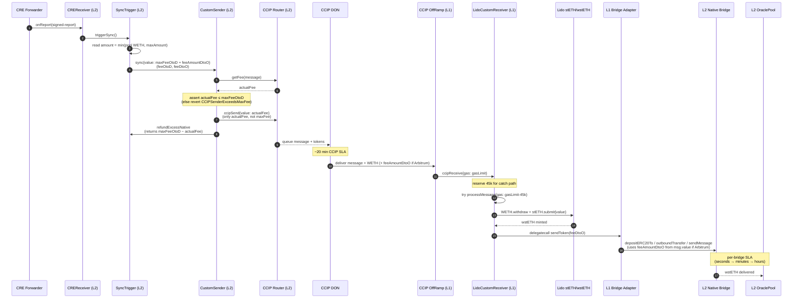

# Sync fees: `_feeOtoD` and `_feeDtoO` explained

This document explains why the L2 `SyncTrigger` carries two fee blobs (`_feeOtoD` and `_feeDtoO`), what they pay for, where the money goes, what gets refunded vs. lost, and what happens if their values are wrong. It also catalogs the entities and contracts that participate in the sync flow so the fee semantics can be read against the architecture.

Companion docs:
- [`LEVERS.md`](./LEVERS.md) — who can call `setFeeOtoD` / `setFeeDtoO`
- [`alerts-spec.md`](./alerts-spec.md) — how fee/gas exhaustion is monitored
- [`FLOW.md`](./FLOW.md) — high-level fast-stake and sync flow
- Per-network state-mate yamls in `script/<net>/state-mate/<net>.yaml` — pin the encoded fee bytes byte-for-byte (with derivation comments)

## TL;DR

- The sync is a round-trip across two chains. Each leg costs gas; each leg has a separate fee blob.
- **`_feeOtoD`** pays for the **L2→L1 leg** via Chainlink CCIP. Encoded bytes carry `(maxFee, payInLink, gasLimit)`. The `gasLimit` is for **L1 mainnet** execution of the L1 receiver.
- **`_feeDtoO`** pays for the **L1→L2 leg** via the L2's **native bridge** (Optimism / Base / Arbitrum / Linea — different mechanics each). The encoded bytes are the L1→L2 bridge parameters.
- CCIP charges *for the gasLimit commitment*, not actual usage — bumping `gasLimit` raises the per-sync fee. CCIP `maxFee` excess is refunded; `gasLimit` excess is not.
- Wrong values fail in characteristic ways: too-low `gasLimit` strands funds at the L1 receiver until manual retry; too-low `maxFee` reverts the L2 send harmlessly. Too-high values mostly cost money.
- Glamsterdam (EIP-7904 / EIP-8038) reprices L1 opcodes; the only directly affected parameter is `_feeOtoD.gasLimit` because it's the only one budgeting L1 gas.

---

## 1. Why two fees exist at all

The sync is fundamentally a **cross-chain round trip**:

1. WETH accumulates in an L2 OraclePool from user `fastStake`s.
2. When the pool exceeds `minSyncAmount`, the operator (CRE workflow) triggers a sync.
3. **Leg A — L2 → L1:** WETH leaves the L2 pool, crosses to L1 via CCIP, gets unwrapped to ETH, gets staked into Lido (`stETH.submit`), and the resulting wstETH lands at the L1 receiver.
4. **Leg B — L1 → L2:** wstETH is sent back through the L2's native bridge to refill the L2 OraclePool. Users can then `fastStake` against it again.

Each leg involves:
- A source-chain transaction (fast and cheap-ish — paid in normal gas)
- Cross-chain message + token relay (paid via the bridge's fee model)
- A destination-chain execution (gas, paid through whatever model the bridge uses)

The two fees `_feeOtoD` and `_feeDtoO` are the project's encoded answer to "how do we pay for each leg's bridge + destination execution". They're separate because **the two legs use different bridges** (CCIP vs. native L1→L2), with different fee shapes. They have to be encoded ahead of time on the L2 (where the sync starts) because the L2 is what authorizes payment for both legs simultaneously.

> **Naming convention.** "OtoD" = Origin-to-Destination (L2→L1 — the forward direction of the sync). "DtoO" = Destination-to-Origin (L1→L2 — the return). Both perspectives are anchored at the L2 (the "origin").

---

## 2. System overview

```
                                Sync round-trip
                                ════════════════

  ┌─────────────────── L2 (Optimism / Arbitrum / Base / Linea) ────────────┐
  │                                                                         │
  │  CRE Forwarder ──► CREReceiver ──► SyncTrigger ──► CustomSender         │
  │                                       │              │                  │
  │                                       │ pulls WETH   │ ccipSend         │
  │                                       ▼              │ (uses _feeOtoD)  │
  │                                 OraclePool           ▼                  │
  │                                                  CCIP Router            │
  │                                                                         │
  └────────────────────────────────────────────────│────────────────────────┘
                                                   │
                                            CCIP message + WETH
                                                   │
  ┌────────────────────────────│────────── L1 (Ethereum mainnet) ──────────┐
  │                            ▼                                            │
  │                     CCIP OffRamp ──► LidoCustomReceiver                 │
  │                                          │                              │
  │                                          ├──► WETH.withdraw (→ ETH)     │
  │                                          ├──► stETH.submit (→ wstETH)   │
  │                                          └──► (delegatecall) Adapter    │
  │                                                       │                 │
  │                                          (uses _feeDtoO from msg.data)  │
  │                                                       ▼                 │
  │                                                Native L1→L2 Bridge      │
  │                                                       │                 │
  └───────────────────────────────────────────────────────│─────────────────┘
                                                          │
                                                wstETH delivered to L2
                                                          │
  ┌───────────────────────────────────────────────────────│ L2 ────────────┐
  │                                                       ▼                │
  │                                               OraclePool (refilled)    │
  │                                                                         │
  └─────────────────────────────────────────────────────────────────────────┘
```

`_feeOtoD` is consumed at the **CCIP Router on L2** (and pays for L1 execution at the OffRamp). `_feeDtoO` rides as data inside the CCIP message and is consumed by the **bridge adapter on L1** (paying for the L1→L2 native bridge call).

---

## 3. Entities

Roles that exist outside the contracts and authorize / observe the flow:

| Entity | What it is | Stake in fees |
|---|---|---|
| **Lido DAO Agent** | L1 governance executor | `DEFAULT_ADMIN_ROLE` on `LidoCustomReceiver`; can `recoverTokens` from failed messages. Pays L1 gas for the rare admin recovery. |
| **L2 Governance Executor** | per-L2 governance bridge endpoint (e.g. `OptimismBridgeExecutor`, `ArbitrumBridgeExecutor`) | Owner of `SyncTrigger` and `CustomSender` admin role. **Holds the `setFeeOtoD` / `setFeeDtoO` levers.** Every fee change is a governance action through this entity. |
| **LOL multisig** | "Liquidity Observation Lab" — Lido sub-DAO | Owner of `OraclePool` and `CREReceiver`. Funds the L2 pool with wstETH; observes user-facing liquidity health. |
| **Lido Deployer (CRE workflow owner)** | the off-chain identity that registered the sync workflow | Pinned in `CREReceiver.expectedAuthor`; controls workflow deploy / pause / activate at the CRE Platform. Pays L1 gas for `WorkflowRegistry` operations only. |
| **CRE Forwarder** | Chainlink Runtime Environment forwarder contract on each L2 | The only address authorized to call `CREReceiver.onReport`. Initiates each sync tick on L2 by relaying the DON's signed report. |
| **CRE DON** | Chainlink Decentralized Oracle Network running the sync workflow WASM | Cron-triggers every 5 min, decides whether `SyncTrigger.shouldSync()` is true, and (if so) signs a report that the Forwarder relays. Off-chain entity; not a fee participant. |
| **CCIP DON / OffRamp executor** | Chainlink network running CCIP | Receives the L2-paid CCIP fee. Commits L1 gas to execute `ccipReceive`. The "executor" recipient of unused-gas margin. |
| **L2 Sequencer / Inbox / Postman** | per-L2 native bridge operator | Optimism/Base sequencers fund L2 deposit gas; Arbitrum Inbox manages retryable accounting; Linea postman relays L1→L2 messages. **They are who actually executes the L1→L2 leg.** |

---

## 4. Contracts and their roles

### L2 contracts (per network — Optimism, Arbitrum, Base, Linea)

| Contract | Path | Purpose | Fee-relevant methods |
|---|---|---|---|
| `SyncTrigger` | `src/SyncTrigger.sol` | Decides when to sync; encodes both fee blobs; calls `CustomSender.sync` | `triggerSync()`, `setFeeOtoD(bytes)`, `setFeeDtoO(bytes)`, `getFeeOtoD()`, `getFeeDtoO()`, `getMaxFees()` |
| `CustomSender` | `lib/chainlink-csr/contracts/senders/CustomSender.sol` | The L2 entry point for both `slowStake` (user) and `sync` (operator). Wraps CCIP send + handles refunds. | `sync(destChainSelector, amount, feeOtoD, feeDtoO)`, `slowStake(...)`, `MIN_PROCESS_MESSAGE_GAS` (constant 75_000) |
| `PausableImmutableOraclePool` | `lib/chainlink-csr/contracts/utils/...` | Holds WETH / wstETH inventory; sender pulls from here for sync | `pull(token, amount)` (only by Sender), `swap` (fastStake) |
| `CREReceiver` | `src/cre/CREReceiver.sol` | Bridges the off-chain CRE workflow to the on-chain `SyncTrigger`. Validates the DON's signed report. | `onReport(metadata, report)` (CRE Forwarder only) |
| `CCIP Router` (L2) | external (Chainlink) | Quotes and accepts the CCIP fee | `getFee(destChainSelector, message)`, `ccipSend{value: fee}(...)` |

### L1 contracts (mainnet, shared across all four L2 lanes)

| Contract | Path | Purpose | Fee-relevant methods |
|---|---|---|---|
| `LidoCustomReceiver` | `lib/chainlink-csr/contracts/receivers/LidoCustomReceiver.sol` | The CCIP message recipient. Unwraps WETH → ETH, stakes into Lido, delegates the L1→L2 send to the per-network adapter. | `ccipReceive(message)` (CCIP OffRamp only), `retryFailedMessage(message)` (anyone), `recoverTokens(message, to)` (DAO only) |
| Per-network Bridge Adapter | `lib/chainlink-csr/contracts/adapters/<Net>...AdapterL1toL2.sol` | Encapsulates the L1→L2 bridge call. **Called via `delegatecall` from `LidoCustomReceiver`** — runs in receiver storage context. | `_sendToken(srcChain, to, amount, feeData)` |
| Native L1 Bridge Endpoint | external (per-L2) | The L2's own bridge contract on L1 (Optimism `L1ERC20TokenBridge`, Arbitrum `L1GatewayRouter`, Base `L1StandardBridge`, Linea `L1MessageService`) | `depositERC20To` / `outboundTransfer` / `sendMessage` / etc. |
| `CCIP OffRamp` (L1) | external (Chainlink) | Delivers the CCIP message to the receiver under the encoded `gasLimit` budget | `executeSingleMessage(...)` internally; user-visible API is the `ccipReceive` callback on the receiver |
| Lido `stETH` / `wstETH` | external | The actual staking destination | `submit{value: amount}` (mints stETH on ETH deposit); `wstETH.receive()` wraps stETH into wstETH |

### Bridge adapter inventory

The four lanes use different adapters because each L2's L1→L2 bridge has its own ABI and fee model:

| Network | Adapter contract | L1 bridge it calls | Fee model |
|---|---|---|---|
| Optimism | `OptimismLegacyAdapterL1toL2` | `IOptimismL1ERC20TokenBridge.depositERC20To` | feeAmount = 0 (sequencer-paid); `l2Gas` is a budget cap |
| Base | `BaseAdapterL1toL2` | `IL1StandardBridge.bridgeERC20To` | feeAmount = 0 (sequencer-paid); `l2Gas` is a budget cap |
| Arbitrum | `ArbitrumLegacyAdapterL1toL2` | `IArbitrumL1GatewayRouter.outboundTransfer` | feeAmount = `maxSubmissionCost + gasPriceBid * maxGas` (paid as msg.value); excess refunded on L2 |
| Linea | `LineaAdapterL1toL2` | `IL1MessageService.sendMessage` | No L1 fee; postman covers L2 execution |

Each adapter's `_sendToken` decodes its own `_feeDtoO` shape via the matching `FeeCodec.decode<Net>L1toL2Memory` function.

---

## 5. The two legs and the two fees

| Leg | Direction | Bridge | Fee blob | Encoded by |
|---|---|---|---|---|
| Leg A | L2 → L1 | Chainlink CCIP | `_feeOtoD` | `FeeCodec.encodeCCIP(maxFee, payInLink, gasLimit)` |
| Leg B | L1 → L2 | per-L2 native | `_feeDtoO` | `FeeCodec.encode<Net>L1toL2(...)` |

Both blobs are stored on `SyncTrigger` and re-injected into every `triggerSync` invocation. Both can be re-encoded by `setFeeOtoD` / `setFeeDtoO` (GovExec-only).

---

## 6. Anatomy of `_feeOtoD`

CCIP fee for the L2→L1 message. **21 bytes**.

```
┌──── _feeOtoD (21 bytes) ──────────────────────────────────────────────┐
│                                                                       │
│   bytes [ 0:16] uint128 maxFee     → safety cap on actual CCIP fee    │
│   byte    [16]  bool   payInLink   → pay in LINK (true) or ETH (false)│
│   bytes [17:21] uint32 gasLimit    → L1 gas budget for ccipReceive    │
│                                                                       │
└───────────────────────────────────────────────────────────────────────┘
```

Production values across all four L2 lanes (`script/<net>/<Net>MigrationConstants.sol`):

| Field | Optimism | Arbitrum | Base | Linea |
|---|---:|---:|---:|---:|
| `maxFee` | 0.125 ETH | 0.125 ETH | 0.125 ETH | 0.125 ETH |
| `payInLink` | false | false | false | false |
| `gasLimit` | 1,000,000 | 1,000,000 | 1,000,000 | **500,000** |

Each value reflects a +25% bump from the prior baseline (`maxFee = 0.1 ETH`; `gasLimit = 800k` for OP/Arb/Base, `400k` for Linea) applied as Glamsterdam pre-hardening — see §12 below and the README's "Glamsterdam fee headroom bump" section.

(Linea's baseline is lower because the L1 path doesn't include `depositERC20To` overhead — the `LineaAdapter._sendToken` is leaner.)

### What `gasLimit` actually buys

It buys an L1 gas budget commitment from the CCIP OffRamp. Inside that budget on L1:

```
ccipReceive(message)                                              ← entry from OffRamp
├── _checkSender(...)                                             ← cold SLOAD (sender mapping)
├── reserve MIN_FAILED_MESSAGE_GAS = 45_000 for the catch path
└── try processMessage{gas: gasLimit - 45_000}(message)
    │
    ├── decode packed (recipient, amount, feeData)
    ├── decode token amounts
    ├── _unwrap → WETH.withdraw                                    ← cold SLOAD/SSTORE on WETH
    ├── _stakeToken → wstETH.receive() → stETH.submit              ← MANY cold SLOADs (Lido state)
    │   - read wstETH balance before/after
    │   - submit() updates total shares, recipient shares, buffered ether
    ├── _sendToken (delegatecall to bridge adapter)
    │   ├── decode fee data (per-L2 shape)
    │   ├── forceApprove L1 token to bridge
    │   └── call into L1 bridge endpoint                           ← cold ACCOUNT_ACCESS + cold SLOADs
    └── emit success
```

This is **state-access heavy** — the workload that's most affected by EIP-8038 (cold SLOAD / cold ACCOUNT_ACCESS repricing) and to a lesser extent EIP-7904 (KECCAK256 +50%).

### What `maxFee` does

It bounds the actual CCIP fee. The actual fee is computed by the Router at send time:

```
fee ≈ baseFee + premium + gasLimit × destChainGasPrice (CCIP oracle) × tokenConversion
```

At send time on L2:
- if `Router.getFee(...) ≤ maxFee` → send proceeds; only `fee` is consumed
- if `Router.getFee(...) > maxFee` → revert `CCIPSenderExceedsMaxFee` (`CCIPSenderUpgradeable.sol:82`)

`maxFee` is a **safety cap**, not a budget commitment. Excess (`maxFee - actualFee`) is refunded to the SyncTrigger by `TokenHelper.refundExcessNative`. See §8.

---

## 7. Anatomy of `_feeDtoO` (per-network)

The L1→L2 leg's fee shape depends on the target L2's bridge.

### Optimism / Base — `encodeOptimismL1toL2(uint32 l2Gas)` / `encodeBaseL1toL2(uint32 l2Gas)` — 21 bytes

```
┌──── _feeDtoO (Optimism / Base, 21 bytes) ─────────────────────────────┐
│                                                                       │
│   bytes [ 0:17] uint136 0          → feeAmount = 0, payInLink = false │
│   bytes [17:21] uint32  l2Gas      → L2 gas budget for the deposit    │
│                                                                       │
└───────────────────────────────────────────────────────────────────────┘
```

Production: `l2Gas = 100,000`.

The L1 caller (the `LidoCustomReceiver` via the adapter) pays **zero** for the L2 leg. The Optimism / Base sequencer pays L2 gas out of its sequencer fee revenue. `l2Gas` is just a cap on how much L2 gas the message will receive — too low and the L2 deposit reverts on the L2 side; too high doesn't cost the caller anything.

The adapter explicitly enforces `feeAmount = 0` and `payInLink = false`, otherwise it reverts.

### Arbitrum — `encodeArbitrumL1toL2(uint128 maxSubmissionCost, uint32 maxGas, uint64 gasPriceBid)` — 29 bytes

```
┌──── _feeDtoO (Arbitrum, 29 bytes) ────────────────────────────────────┐
│                                                                       │
│   bytes [ 0:16] uint128 feeAmount     → total ETH paid into L1 Inbox: │
│                                          maxSubmissionCost +          │
│                                          gasPriceBid * maxGas         │
│   byte    [16]  bool    payInLink     → must be false                 │
│   bytes [17:21] uint32  maxGas        → L2 retryable gas budget       │
│   bytes [21:29] uint64  gasPriceBid   → L2 gas price bid              │
│                                                                       │
└───────────────────────────────────────────────────────────────────────┘
```

Production:
- `maxSubmissionCost = 0.001 ETH`
- `maxGas = 100,000`
- `gasPriceBid = 50,000,000` wei (0.05 gwei)
- ⇒ `feeAmount = 0.001 ETH + 0.05 gwei × 100k = 1,005,000,000,000,000 wei` (~0.001 ETH total)

Arbitrum's retryable model is **special**:
- The L1 caller pays `feeAmount` directly (`msg.value` to the Inbox via `outboundTransfer`).
- The Inbox creates an L2 retryable ticket.
- The retryable auto-redeems on L2 with up to `maxGas × gasPriceBid` of L2 gas.
- **Excess `maxSubmissionCost` and unused `maxGas × gasPriceBid` are refunded** to L2 addresses (`excessFeeRefundAddress` / `callValueRefundAddress`) encoded in the retryable.

So Arbitrum bloat is mostly self-correcting — over-provision and you get the surplus back on L2.

### Linea — `encodeLineaL1toL2()` — 17 bytes

```
┌──── _feeDtoO (Linea, 17 bytes) ──────────────────────────────────────┐
│                                                                       │
│   bytes [0:17] uint136 0    → no fee, no l2Gas, no payInLink         │
│                                                                       │
└───────────────────────────────────────────────────────────────────────┘
```

Linea Message Service uses a **postman model** — anyone (typically Linea's own relayer) can pay to relay the message on L2. The L1 caller pays nothing extra; there are no L2 gas parameters to set.

### How _feeDtoO travels to L1

The bytes are not paid directly on L2 — they're embedded in the CCIP message data:

```solidity
// CustomSender._ccipBuildAndSend:
bytes memory packedData = FeeCodec.encodePackedData(recipient, amount, feeDtoO);
messageId = _ccipSend(destChainSelector, tokenAmounts, ..., packedData);
```

For Arbitrum specifically, the actual **Arbitrum `feeAmount` is bundled as a TOKEN in the CCIP message** — the L1 receiver receives both the WETH and a separate native-ETH amount equal to `feeAmountDtoO`, which the bridge adapter then forwards as msg.value to the Inbox. For Optimism / Base / Linea, `feeAmountDtoO = 0` so only the WETH travels.

---

## 8. End-to-end fee flow



Three independent fee flows happen in this picture:

1. **L2 ETH at `triggerSync`-time:** `maxFeeOtoD + feeAmountDtoO` (native) is sent from SyncTrigger to CustomSender. CustomSender forwards `actualFee` to Router and refunds the excess back to SyncTrigger.
2. **CCIP fee:** consumed inside `Router.ccipSend` on L2; the OffRamp on L1 is reimbursed by the DON. **`gasLimit × destChainGasPrice` is committed at send time and not refunded** even if L1 execution uses less.
3. **L1→L2 bridge fee:** for Arbitrum, the `feeAmountDtoO` ETH that rode along inside the CCIP message is paid as msg.value into the Inbox; excess gets refunded *to the L2 recipient*. For Optimism/Base/Linea, no L1 fee at all.

---

## 9. Refund mechanics — what's lost vs. refunded

This is the most counter-intuitive part. Read carefully because the answer is **different per parameter**.

### `_feeOtoD.maxFee` — REFUNDED in full (the cap is a cap)

```solidity
// CCIPSenderUpgradeable._ccipSendTo (excerpt, line 81-94)
uint256 fee = IRouterClient(CCIP_ROUTER).getFee(destChainSelector, message);
if (fee > maxFee) revert CCIPSenderExceedsMaxFee(fee, maxFee);
...
return IRouterClient(CCIP_ROUTER).ccipSend{value: fee}(...);  // forwards fee, not maxFee
```

```solidity
// CustomSender.sync (line 208)
TokenHelper.refundExcessNative(msg.sender);   // sweeps remaining balance to SyncTrigger
```

Bumping `maxFee` from 0.1 → 0.125 ETH **costs nothing per sync** when actual fees are below the cap. ETH is locked transiently inside one tx, then refunded.

### `_feeOtoD.gasLimit` — NOT REFUNDED (the executor takes the margin)

The actual CCIP fee returned by `Router.getFee(...)` scales linearly with `gasLimit`. The OffRamp commits L1 gas equal to `gasLimit`. If the receiver uses less, the unused portion **is the executor's profit margin** — there is no on-chain mechanism for an L1→L2 callback to refund unused gas.

Why this design:
- Cross-chain refunds need a return message. CCIP intentionally avoids that complexity.
- The executor takes **destination gas-price spike risk** in exchange for charging for the full commitment. The user gets a flat-price quote at send time.
- Refundable gas would let attackers over-commit and reclaim — wasting executor capacity.

So bumping `gasLimit` from 800k → 1M is a **real per-sync cost** equal to `(extra gas) × (CCIP destination gas oracle price + premium)`. Order-of-magnitude $5-10 per sync at typical L1 conditions.

### `_feeDtoO.feeAmount` (Arbitrum only)

Refundable on L2 via Arbitrum's retryable refund mechanism. `excessFeeRefundAddress` and `callValueRefundAddress` are encoded by Arbitrum's Inbox at retryable creation; in this codebase they default to the L2 recipient (the OraclePool address).

### `_feeDtoO` for Optimism / Base / Linea

No fee paid by the L1 caller — nothing to refund. `l2Gas` is a budget cap; setting it high doesn't cost anything but also doesn't get "refunded" anywhere.

### Summary table

| Parameter | Bump = real cost? | Why |
|---|---|---|
| `_feeOtoD.maxFee` | No | Refunded by `refundExcessNative` |
| `_feeOtoD.gasLimit` | **Yes** | CCIP charges for the L1 gas commitment regardless of actual usage |
| `_feeOtoD.payInLink` | (changes payment rail) | Cosmetic for cost analysis; LINK side has its own fee schedule |
| `_feeDtoO` Optimism / Base `l2Gas` | No | Sequencer pays L2 gas; param is only a budget cap |
| `_feeDtoO` Arbitrum `feeAmount` | Mostly no | Arbitrum refunds excess submission cost + unused L2 gas to L2 |
| `_feeDtoO` Linea | No | Postman model; caller pays nothing |

---

## 10. Failure modes — what happens with wrong values

### `_feeOtoD.maxFee` too low

- **Where it fires:** L2 send, inside `_ccipSendTo` (`CCIPSenderUpgradeable.sol:82`)
- **Symptom:** revert `CCIPSenderExceedsMaxFee(actualFee, maxFee)`
- **When:** L1 gas spike pushes `Router.getFee(...)` above `maxFee`
- **Funds:** **none move** — pool WETH stays in pool, no CCIP fee paid
- **Recovery:** wait for L1 gas to drop, OR `setFeeOtoD` with higher `maxFee` (GovExec)
- **Severity:** LOW. Self-healing within the same 12 h cycle most of the time.

### `_feeOtoD.gasLimit` too low

- **Where it fires:** L1, inside `LidoCustomReceiver.processMessage`
- **Symptom:** OOG → defensive catch in `CCIPDefensiveReceiverUpgradeable.ccipReceive` → `failedHashes[messageId]` stored, `MessageFailed(messageId, message)` emitted
- **When:** post-Glamsterdam, if `gasLimit` doesn't accommodate new opcode pricing
- **Funds:**
  - WETH (and Arbitrum's `feeAmountDtoO` if applicable) sit at `LidoCustomReceiver` on L1
  - **Not staked, not bridged back to L2.** OraclePool wstETH balance does not refill.
- **CCIP fee is sunk** — the OffRamp delivered the message under the agreed budget; not its problem the receiver couldn't fit
- **Recovery:**
  - `LidoCustomReceiver.retryFailedMessage(message)` — permissionless, anyone with enough fresh L1 gas
  - `recoverTokens(message, to)` — DAO-only, routes funds out instead of retrying
- **Severity:** HIGH. Funds stuck pending manual intervention; sync liveness broken; user-visible wstETH liquidity erodes; **every subsequent sync also fails the same way until governance bumps `gasLimit`**.

### `_feeOtoD.gasLimit` too high

- **Symptom:** none
- **Cost:** per-sync overpay of `(extra gas) × (CCIP gas oracle price + premium)`. For 25% bloat: ~$5-10 per sync × 8 syncs/day across 4 chains ≈ $50-100/day
- **Severity:** none (just operating cost)

### `_feeDtoO` per-network

| Param | Network | Too low | Too high |
|---|---|---|---|
| `l2Gas` | Optimism / Base | L2 deposit fails on the L2 side; replay required (rare; legacy bridges have their own retry queue) | No effect |
| `feeAmount` | Arbitrum | L1 Inbox call reverts inside the adapter, OR retryable can't be created → tokens stuck at receiver until manual recovery | Excess refunded to L2 |
| `maxGas` / `gasPriceBid` | Arbitrum | Retryable autoredeem fails on L2; **manual redeem available within 7 days at retryable-dashboard.arbitrum.io, then funds lost** (per `alerts-spec.md:62`) | Excess refunded to L2 |
| (none) | Linea | n/a | n/a |

### Failure-mode ASCII summary

```
                                ┌── too low ──┐                        ┌── too high ──┐
                                │             │                        │              │
   _feeOtoD.maxFee     ─────────► L2 send revert (no funds move,        │ no effect    │
                                │  self-healing)                        │              │
                                │                                       │              │
   _feeOtoD.gasLimit   ─────────► L1 OOG, funds stuck at receiver,       │ per-sync $$  │
                                │  manual retry needed, every sync       │              │
                                │  fails until bumped                    │              │
                                │                                       │              │
   _feeDtoO.feeAmount  ─────────► Arbitrum: stuck retryable, 7-day       │ refunded on  │
                                │  recovery window or lost               │  L2 (Arb)    │
                                │                                       │              │
   _feeDtoO.l2Gas      ─────────► OP/Base: L2 deposit fails, replay      │ no effect    │
                                │  needed                                │              │
                                └─────────────┘                        └──────────────┘
```

The asymmetry — too-low is much worse than too-high — is the single most important takeaway for sizing decisions.

---

## 11. L1→L2 vs L2→L1 — why the paths differ

| Aspect | L2 → L1 (`_feeOtoD`, CCIP) | L1 → L2 (`_feeDtoO`, native bridge) |
|---|---|---|
| Provider | Chainlink CCIP DON | Per-L2 sequencer / inbox / postman |
| Trust model | CCIP committee multisig | Each L2's own bridge security |
| Fee paid by | L2 caller at send time (forwarded by SyncTrigger) | Optimism/Base: nobody (sequencer); Arbitrum: L1 receiver via msg.value; Linea: postman |
| Fee shape | `(maxFee, payInLink, gasLimit)` — explicit budget | Per-bridge: zero, retryable, postman |
| Refund of excess | Send-side `maxFee` excess refunded; gas commitment NOT refunded | OP/Base: n/a; Arbitrum: excess refunded on L2; Linea: n/a |
| Failure mode | Defensive catch at L1 receiver | OP/Base: L2 deposit revert; Arbitrum: stuck retryable (7-day window); Linea: re-claim |
| Manual recovery | `retryFailedMessage` (anyone) | Per-bridge dashboard (Arbitrum) or replay queue (OP/Base) |
| Time to deliver | ~20 min (CCIP SLA) | OP/Base: ~1-3 min; Arbitrum: ~1-15 min; Linea: ~5-30 min |
| Affected by L1 EIPs (7904/8038)? | **Yes** — gasLimit budgets L1 work | No — l2Gas budgets L2 work |

### Why not use CCIP both ways?

CCIP supports both directions, but using native bridges for L1→L2 is cheaper, simpler, and faster:
- Optimism/Base sequencers subsidize L2 deposit gas — free for the project
- Arbitrum retryables refund excess — efficient
- Linea postman model — free
- Native L1→L2 bridges run on the L2's own trust — no extra committee dependency
- Fast: minutes vs. CCIP's ~20 min SLA

CCIP earns its keep on **L2→L1** because:
- L2→L1 is the harder direction (OP-stack native withdrawals take ~7 days)
- It needs a programmable receiver that runs `processMessage` and orchestrates the staking + bridge-back flow
- It carries arbitrary message data (the encoded `_feeDtoO`)

---

## 12. Operational implications

### Today (pre-Glamsterdam activation, post-bump)

- All four lanes carry +25% `gasLimit` and `maxFee` headroom over the prior baseline (applied in May 2026 — see "Glamsterdam — bump applied" below).
- Two relevant alert rows in [`alerts-spec.md`](./alerts-spec.md):
  - §5: `actual CCIP fee / SyncTrigger.getFeeOtoD().maxFee < 80%` — leading indicator on `maxFee` cap
  - §5: `ccipReceive gas used / FeeOtoD.gasLimit < 80%` — leading indicator on `gasLimit` exhaustion
  - §5: `Arbitrum auto-redeem success rate = 100%` — `_feeDtoO` health for Arbitrum specifically

### Glamsterdam (EIP-7904 + EIP-8038) — bump applied

The repriced opcodes are L1-only. The only directly affected parameter is `_feeOtoD.gasLimit` — it's the only field that budgets L1 gas.

- **EIP-8038** raises cold SLOAD / cold ACCOUNT_ACCESS / SSTORE base. Heavy in `processMessage` (Lido `submit` + bridge adapter).
- **EIP-7904** raises KECCAK256 (+50%) and several precompiles. Mild for this path (no pairings, no KZG).
- Likely worst-case impact on this path: **+15-25% gas consumption**.

**Status: bump applied** (May 2026, ahead of Glamsterdam activation). The values now in `script/<net>/<Net>MigrationConstants.sol` and the state-mate yamls reflect:

- `_feeOtoD.gasLimit`: 800k → 1M (OP/Arb/Base), 400k → 500k (Linea) — **+25%**
- `_feeOtoD.maxFee`: 0.1 → 0.125 ETH everywhere — **+25%** (preserves the gas-price-spike headroom; bump itself has zero per-sync cost since `maxFee − actualFee` is refunded)
- `_feeDtoO`: unchanged — those gas budgets target L2 execution and aren't affected by L1 EIPs

For SyncTriggers deployed before this bump, governance must call `setFeeOtoD` with the new encoded bytes (see [`LEVERS.md`](./LEVERS.md)). The asymmetry from §10 makes the trade favorable: the small per-sync cost (~$5-10/sync × 8 syncs/day across 4 chains ≈ $50-100/day) buys insurance against a post-hard-fork cliff where every sync OOGs in `processMessage` and funds get stuck at the L1 receiver until manual `retryFailedMessage`.

### Levers (per [`LEVERS.md`](./LEVERS.md))

| Action | Caller | Cost |
|---|---|---|
| Re-encode `_feeOtoD` after constants change | L2 GovExec via `setFeeOtoD(bytes)` | One governance tx per L2 |
| Re-encode `_feeDtoO` after bridge param change | L2 GovExec via `setFeeDtoO(bytes)` | One governance tx per L2 |
| Update state-mate yaml | engineering / ops | yaml edit + commit; pinned hex must be regenerated alongside the on-chain change |

### State-mate pinning

The four state-mate yamls now pin the encoded fee bytes:

```yaml
# script/optimism/state-mate/optimism.yaml (excerpt — current bumped values)
getFeeOtoD: "0x000000000000000001bc16d674ec800000000f4240"   # maxFee=0.125e18, payInLink=false, gasLimit=1_000_000
getFeeDtoO: "0x0000000000000000000000000000000000000186a0"   # uint136(0) || l2Gas=100_000
```

with byte-layout comments documenting the source constants. **If `setFeeOtoD` / `setFeeDtoO` runs in production, the yamls must be updated in lockstep** — otherwise the next state-mate verification round fails.

This is in addition to (not instead of) the Solidity-side check in `L2UpgradeActions.verifyStage1` which keccak-equality-checks the encoded bytes against the migration constants.

### Failed-message subscription (recommended addition to alerts-spec)

The current `alerts-spec.md` does not list `LidoCustomReceiver.MessageFailed` as a subscribed event. Given the failure mode in §10, recommend adding:

```
| Contract | Event |
|---|---|
| LidoCustomReceiver | MessageFailed → page on-call |
```

Also recommend tightening the `CustomSender.Sync ↔ ccipReceive` 1:1 invariant to `CustomSender.Sync ↔ LidoCustomReceiver.MessageSucceeded` so a defensive-catch failure breaks the invariant cleanly (currently `ccipReceive` runs successfully even on inner-call failure — the L1 catch path emits `MessageFailed` instead of `MessageSucceeded`, so anchoring on `MessageSucceeded` surfaces the failure cleanly).

---

## 13. Reference — file pointers

| Topic | File |
|---|---|
| `SyncTrigger` (storage of fee blobs, `triggerSync` flow) | `src/SyncTrigger.sol` |
| `FeeCodec` (encoding / decoding all fee blobs) | `lib/chainlink-csr/contracts/libraries/FeeCodec.sol` |
| `CustomSender.sync` (consumes `_feeOtoD`, refunds excess) | `lib/chainlink-csr/contracts/senders/CustomSender.sol` |
| `CCIPSenderUpgradeable._ccipSendTo` (cap check + ccipSend) | `lib/chainlink-csr/contracts/ccip/CCIPSenderUpgradeable.sol` |
| `LidoCustomReceiver` (L1 entry) | `lib/chainlink-csr/contracts/receivers/LidoCustomReceiver.sol` |
| `CCIPDefensiveReceiverUpgradeable` (catch + retry path) | `lib/chainlink-csr/contracts/ccip/CCIPDefensiveReceiverUpgradeable.sol` |
| Bridge adapters (consume `_feeDtoO`) | `lib/chainlink-csr/contracts/adapters/<Net>...AdapterL1toL2.sol` |
| `TokenHelper.refundExcessNative` (the refund swept after sync) | `lib/chainlink-csr/contracts/libraries/TokenHelper.sol` |
| Per-network constants (`L2_SYNC_DESTINATION_*` / `L2_SYNC_ORIGIN_*`) | `script/<net>/<Net>MigrationConstants.sol` |
| State-mate pinned encodings | `script/<net>/state-mate/<net>.yaml` |
| Solidity-side equality check on encoded blobs | `script/shared/L2UpgradeActions.s.sol` (`verifyStage1`) |
| Levers | [`LEVERS.md`](./LEVERS.md) §"L2 → Sync Automation → SyncTrigger" |
| Alerts | [`alerts-spec.md`](./alerts-spec.md) §5 |
